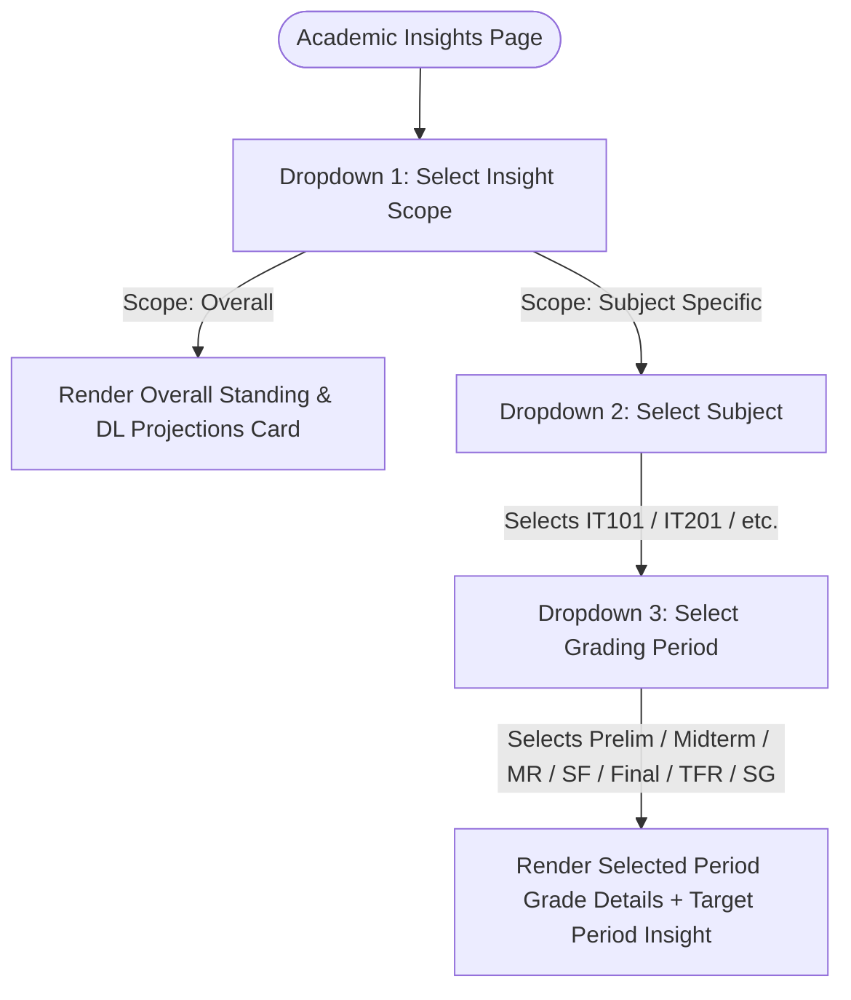

# Developer Handoff: Academic & Faculty Performance Insights Redesign Specification

This document provides a comprehensive technical specification to implement both the **Student Academic Insights** and the **Faculty Performance Insights** modules within the SAGE system.

---
---

# PART 1: STUDENT ACADEMIC INSIGHTS

This module replaces **"Counselor Advice"** and **"Academic Guidance"** with a premium **"Academic Insights"** dashboard inside the Student Portal.

## 1.1 Interaction Flow (Dropdown Navigation System)

The interface uses a multi-level filter system to keep the screen clean and allow students to drill down into specific grade milestones.



---

## 1.2 Layman's Visual Walkthrough

Here is how the layout shifts dynamically based on user interaction:

### Scenario A: Viewing Overall Insights
When the student selects "Overall Academic Performance", they see the high-level averages and award predictions.

```text
[ Select Scope: [ Overall Academic Performance v ] ]

+---------------------------------------------------------------------------------+
|  ✨ EXCELLENT STANDING  |  Overall GWA: 1.45                                    |
|  🏆 Dean's Lister Projections: 94% probability of 1st Class Honors              |
|                                                                                 |
|  📚 CURRENT RUNNING GWA PER SUBJECT:                                            |
|  * IT101: Introduction to Computing ....... [ 1.80 GWA ] (Posted to Final)      |
|  * IT201: Data Structures & Algorithms .... [ 1.50 GWA ] (Only Prelim is In)    |
|  * MATH104: Discrete Mathematics .......... [ 1.75 GWA ] (Ongoing)              |
|                                                                                 |
|  💬 Overall Insight: "All subjects are passing safely. Keep it up!"             |
+---------------------------------------------------------------------------------+
```

### Scenario B: Viewing Subject & Period Insights
When the student switches to a subject and drills down to a specific period (e.g. *Midterm Rating*), the page shows the exact grades and a highly customized insight for that milestone.

```text
[ Select Scope: [ Individual Subjects v ] ]
   L__ [ Select Subject: [ IT101: Intro to Computing v ] ]
          L__ [ Select Period: [ Midterm Rating (MR) v ] ]

+---------------------------------------------------------------------------------+
|  IT101: Introduction to Computing (Instructor: Prof. Amanda Rivera)             |
|                                                                                 |
|  Selected Period: MIDTERM RATING (MR)                                           |
|  +---------------------------+---------------------------+-------------------+  |
|  |  Rating: 89% (Posted)     |  Equivalent GWA: 1.85     |  Credits: 3 Units |  |
|  +---------------------------+---------------------------+-------------------+  |
|                                                                                 |
|  💡 Period Summary & Insight:                                                   |
|  "Your Midterm Rating of 1.85 combines your strong Prelim (1.75) and Midterm    |
|   (2.00) efforts. This keeps you safely on track for your Dean's Lister goal!    |
|   Aim for a 1.50 in the upcoming Semi-Final exams to elevate your trajectory."  |
+---------------------------------------------------------------------------------+
```

---

## 1.3 Sidebar Navigation Integration (Student)

### File: `src/components/layout/Sidebar.jsx`

1. **Import `BrainCircuit`** (or a similar Lucide-react icon) at the top of the file:
   ```javascript
   import { ..., BrainCircuit } from 'lucide-react';
   ```
2. **Update the `links.student` array** (around line 41) to include the new link:
   ```diff
      student: [
        { to: '/student/dashboard', icon: LayoutDashboard, label: 'Dashboard' },
        { to: '/student/mygradeslist', icon: FileText, label: 'My Grades' },
+       { to: '/student/academic-insights', icon: BrainCircuit, label: 'Academic Insights' },
        { to: '/student/evallist', icon: BookOpen, label: 'Evaluations' },
      ]
   ```

---

## 1.4 Database Schema & SQL Migration (Student)

To transition from the old `ai_student_recommendations` table to `student_academic_insights`, developers must run the following SQL script in Supabase:

### SQL Migration Script:
```sql
-- 1. Drop the old table and enums if they exist
DROP TABLE IF EXISTS ai_student_recommendations CASCADE;
DROP TYPE IF EXISTS ai_student_verdict CASCADE;

-- 2. Create the clean, AI-free custom ENUM
CREATE TYPE academic_verdict AS ENUM ('continue', 'at_risk', 'recommend_shift');

-- 3. Create the new student_academic_insights table
CREATE TABLE student_academic_insights (
    insight_id UUID PRIMARY KEY DEFAULT gen_random_uuid(),
    student_id UUID REFERENCES users(user_id) ON DELETE CASCADE,
    generated_at TIMESTAMP DEFAULT CURRENT_TIMESTAMP,
    summary TEXT NOT NULL,
    verdict academic_verdict NOT NULL,
    basis_snapshot JSONB NOT NULL
);
```

---

## 1.5 Mock Data Structure (JSON)

```json
{
  "student": {
    "name": "Sarah Jenkins",
    "gwa": 1.45,
    "standing": "Excellent",
    "dlEligibility": {
      "awardCategory": "1st Class Dean's Lister",
      "probabilityPct": 94,
      "message": "Your current average of 1.45 qualifies you for 1st Class Dean's Lister honors! Keep your final semestral grades below 1.50 to secure the award."
    }
  },
  "subjects": [
    {
      "code": "IT101",
      "name": "Introduction to Computing",
      "credits": 3.0,
      "instructor": "Prof. Amanda Rivera",
      "periods": {
        "prelim": {
          "rating": 91,
          "gwa": "1.75",
          "status": "Posted",
          "insight": "Strong start with a 1.75 in the Prelims! Your laboratory outputs were close to perfect."
        },
        "midterm": {
          "rating": 87,
          "gwa": "2.00",
          "status": "Posted",
          "insight": "A minor midterm quiz dip slowed your pace slightly, but you remain highly competitive."
        },
        "midtermRating": {
          "rating": 89,
          "gwa": "1.85",
          "status": "Posted",
          "insight": "Your official Midterm Rating stands at a solid 1.85. Safe and robust standing."
        },
        "semiFinal": {
          "rating": 91,
          "gwa": "1.75",
          "status": "Posted",
          "insight": "Excellent recovery in the Semi-Final proofs! You brought your average back up."
        },
        "final": {
          "rating": 91,
          "gwa": "1.75",
          "status": "Draft",
          "insight": "Final grading components are drafted at 1.75. Awaiting registrar release."
        },
        "tentativeFinalRating": {
          "rating": 91,
          "gwa": "1.75",
          "status": "Draft",
          "insight": "Tentative final rating projects at a 1.75, keeping your GWA targets well in hand."
        },
        "semestralGrade": {
          "rating": 90,
          "gwa": "1.80",
          "status": "Draft",
          "insight": "Your predicted semestral grade of 1.80 guarantees a secure pass and keeps you on the honor roll."
        }
      }
    }
  ]
}
```

---
---

# PART 2: FACULTY PERFORMANCE INSIGHTS

This module replaces **"Faculty Predictions"** with a premium, tabbed **"Performance Insights"** section inside **both the Dean Portal and the Faculty Portal**.

## 2.1 UI Tab Integration Model (Option B)

Instead of creating a new sidebar page, this function is built as an **integrated tab** directly under:
*   **Dean Portal**: `src/pages/dean/EvalResultsOverview.jsx` (Reviewing all instructors).
*   **Faculty Portal**: `src/pages/faculty/EvalResultsMy.jsx` (Self-reflection view).

---

## 2.2 Qualitative Perceptions & Quantitative Ratings Summarization

This system is engineered to solve a massive academic bottleneck: instead of forcing the Dean or the Instructor to manually parse hundreds of written and numerical submissions, SAGE **automatically aggregates and summarizes student evaluations**.

This summary combines:
1. **Summarized Quantitative Ratings**: Aggregates the raw numbers submitted by students across key parameters (Subject Knowledge, Communication, Methodology, etc.) to give a clean average rating per section.
2. **Qualitative Perceptions**: Groups written text comments from students into specific topics (Workload, Lecture Delivery).
3. **Open-Ended Suggestions**: Synthesizes open-ended student comments into constructive, actionable teaching modifications.

---

## 2.3 Visual Layman Mockups

### Screen A: Faculty Portal - Overall View (Default)
When a faculty member opens their evaluation results, they see their status, benchmark rating, and a clear highlight pointing out **exactly which overall criteria they excel in** and **which criteria they need to improve**.

```text
  [ 📊 Detail Ratings Breakdown ]    [ ✨ Professional Growth Insights ] <-- ACTIVE TAB

  +---------------------------------------------------------------------------------+
  |  MY PERFORMANCE STANDING                                                        |
  |                                                                                 |
  |  Overall Evaluation Rating: 3.20 / 4.00                                         |
  |  🔴 STATUS: NEEDS IMPROVEMENT                                                   |
  |                                                                                 |
  |  -----------------------------------------------------------------------------  |
  |                                                                                 |
  |  🏆 OVERALL CRITERIA PERFORMANCE SPOTLIGHT:                                     |
  |                                                                                 |
  |  🔥 PEAK PERFORMANCE CRITERIA (Your Highest Score)                              |
  |  * Subject Knowledge ................... [ 3.95 / 4.00 ] (Excellent!)           |
  |                                                                                 |
  |  🌱 DEVELOPMENT AREA / FOCUS CRITERIA (Your Lowest Score)                       |
  |  * Classroom Turnaround & Grading ...... [ 3.20 / 4.00 ] (Needs Improvement)    |
  |                                                                                 |
  |  -----------------------------------------------------------------------------  |
  |                                                                                 |
  |  💬 OVERALL PERFORMANCE INSIGHT:                                                |
  |  "Your classroom communication and subject knowledge scores remain highly       |
  |   satisfactory. However, student feedback indicates significant delays in       |
  |   encoding activity and quiz scores. Bringing your grading turnaround times     |
  |   within the 7-day threshold next term will resolve this warning flag."         |
  +---------------------------------------------------------------------------------+
```

### Screen B: Faculty Portal - Section-Specific View
The faculty member can select an individual section (e.g. *BSIT-3A*) to see custom, class-specific feedback. This displays both the **summarized quantitative ratings** and the **student perceptions digest**!

```text
  Select Review Scope: [ Section-Specific Insights v ]
     L__ Select Section: [ BSIT-3A: Data Structures & Algorithms v ]

  +---------------------------------------------------------------------------------+
  |  Section Class Record: BSIT-3A (Subject: IT201 - 3.0 Units)                     |
  |  Section Evaluation Rating: 3.85 / 4.00                                         |
  |                                                                                 |
  |  📊 SUMMARIZED STUDENT RATINGS (BSIT-3A):                                       |
  |  * Subject Knowledge: ........ [ 3.95 / 4.00 ] (Excellent)                      |
  |  * Teaching Methodology: ..... [ 3.80 / 4.00 ] (Excellent)                      |
  |  * Communication Skills: ..... [ 3.90 / 4.00 ] (Excellent)                      |
  |  * Classroom Turnaround: ..... [ 3.20 / 4.00 ] (Satisfactory)                   |
  |                                                                                 |
  |  💡 SECTION SPECIFIC INSIGHT (BSIT-3A):                                         |
  |  "Students in BSIT-3A highly appreciate your practical programming challenges   |
  |   and active assistance in the lab. Methodology and clarity scores are near     |
  |   perfect. Keep up this teaching structure!"                                    |
  |                                                                                 |
  |  🙋 STUDENT PERCEPTIONS & OPEN-ENDED COMMENTS DIGEST (BSIT-3A):                 |
  |  * Workload (94% Positive): "Students perceive lab assignments as highly       |
  |    practical, challenging but highly rewarding."                               |
  |  * Lecture Delivery (88% Positive): "The use of real-time coding examples      |
  |    on the whiteboard greatly helps visual learners."                            |
  |  * Top Constructive Suggestion: "A significant cluster of students requested    |
  |    uploading lab slides 24 hours prior to the actual lab session."             |
  +---------------------------------------------------------------------------------+
```

---

## 2.4 Database Schema & SQL Migration (Faculty)

To transition from the old `ai_faculty_predictions` table to `faculty_performance_insights`, developers must run the following SQL script in Supabase:

### SQL Migration Script:
```sql
-- 1. Drop the old table and enums if they exist
DROP TABLE IF EXISTS ai_faculty_predictions CASCADE;
DROP TYPE IF EXISTS ai_faculty_verdict CASCADE;

-- 2. Create the clean, AI-free custom ENUM
CREATE TYPE performance_verdict AS ENUM ('satisfactory', 'needs_improvement', 'excellent');

-- 3. Create the new faculty_performance_insights table
CREATE TABLE faculty_performance_insights (
    prediction_id UUID PRIMARY KEY DEFAULT gen_random_uuid(),
    faculty_id UUID REFERENCES users(user_id) ON DELETE CASCADE,
    school_year VARCHAR(15) NOT NULL,
    generated_at TIMESTAMP DEFAULT CURRENT_TIMESTAMP,
    summary TEXT NOT NULL,
    verdict performance_verdict NOT NULL,
    strong_points TEXT,
    weak_points TEXT,
    basis_snapshot JSONB NOT NULL
);
```

---

## 2.5 Mock Data Structure (JSON)

Aggregates overall high/low criteria metrics directly inside `basis_snapshot` JSONB for direct rendering:

```json
{
  "facultyId": "faculty-uuid-12345",
  "name": "Prof. Amanda Rivera",
  "overallVerdict": "needs_improvement",
  "overallRating": 3.20,
  "overallSummary": "Your classroom communication and subject knowledge scores remain highly satisfactory. However, student feedback indicates significant delays in encoding activity and quiz scores. Bringing your grading turnaround times within the 7-day threshold next term will resolve this warning flag.",
  "overallSpotlight": {
    "highestCriteria": "Subject Knowledge",
    "highestScore": 3.95,
    "lowestCriteria": "Classroom Turnaround & Grading",
    "lowestScore": 3.20
  },
  "sections": [
    {
      "sectionCode": "BSIT-3A",
      "subjectName": "Data Structures & Algorithms",
      "sectionRating": 3.85,
      "ratingsSummary": {
        "subjectKnowledge": 3.95,
        "methodology": 3.80,
        "communication": 3.90,
        "turnaround": 3.20
      },
      "insight": "Students in BSIT-3A highly appreciate your practical programming challenges and active assistance in the lab. Methodology and clarity scores are near perfect. Keep up this teaching structure!",
      "perceptions": {
        "workload": "Students perceive lab assignments as highly practical, challenging but highly rewarding.",
        "delivery": "The use of real-time coding examples on the whiteboard greatly helps visual learners.",
        "topSuggestion": "A significant cluster of students requested uploading lab slides 24 hours prior to the actual lab session."
      }
    }
  ]
}
```

---
---

# PART 3: DEAN PORTAL INTEGRATION

This module specifies the integration of the **Performance Insights** dashboard on the Dean Portal's individual instructor view (`src/pages/dean/EvalResultsFaculty.jsx`), removing legacy "AI" terminology and introducing structured performance highlights.

## 3.1 Overview of Redesigned UI
The legacy "AI Performance Fitness Verdict" banner is replaced with a premium, tabbed/spotlighted card for **Faculty Growth & Performance Insights** mapped directly to the database.

```text
  +---------------------------------------------------------------------------------+
  |  💡 ACADEMIC PERFORMANCE & GROWTH INSIGHTS                                     |
  |                                                                                 |
  |  "Prof. Rivera continues to demonstrate exemplary instructional delivery.       |
  |   Student feedback indicates excellent communication scores, but suggests       |
  |   revisiting lecture delivery timelines to ensure class slide decks are         |
  |   published 24 hours prior to laboratory sessions."                             |
  |                                                                                 |
  |  -----------------------------------------------------------------------------  |
  |                                                                                 |
  |  🏆 PEAK PERFORMANCE CRITERIA:               🌱 DEVELOPMENT AREA:               |
  |  * Content Knowledge (3.82)                  * Diversity of Learners (3.65)     |
  +---------------------------------------------------------------------------------+
```

---

## 3.2 Key Handoff Instructions for Dean Portal (`src/pages/dean/EvalResultsFaculty.jsx`)

1. **Remove Sparkles & Legacy AI Indicators**: Replace all instances of `Sparkles` icon and labels like `"AI Performance Fitness Verdict"`, `"Fitness Index"`, and `"AI evaluation engine"`.
2. **Introduce Growth Spotlight Component**:
   - Embed an aggregate trajectory spotlight section that parses `faculty_performance_insights` for the selected `facultyId`.
   - Incorporate the forest/sage green themes (`bg-sage-50/40`, `border-sage-200`) and soft amber highlights (`bg-amber-50/15`, `border-amber-250`) to match SAGE brand design tokens exactly.
3. **Database Snapshots**: Pull data directly from the new `faculty_performance_insights` table, matching the keys:
   - `overallRating`, `standing`, `trajectory` (replacing legacy `aiVerdict.summary`), `peakCriteria` and `devCriteria` metrics.

---

## 3.3 Actionable Administrative Recommendations & Dean's Watchlist Guidelines
To ensure evaluation data translates into active growth steps, the insights banner dynamically appends an **Administrative Recommended Action Card** under the criteria spotlights:

### A. For instructors requiring close monitoring (Severity: 'warning')
- **Banner theme**: Warm amber backdrop (`bg-amber-50/15 border-amber-250`)
- **Action plan cards**:
  - *Classroom Observation*: Schedule a structured classroom observation during the next grading period to assess student-centered engagement strategies.
  - *Peer Mentoring*: Pair the instructor with an exemplary peer to collaborate on lesson formatting and grading turnaround times.
  - *Pedagogical Review*: Schedule a supportive 1-on-1 pedagogical review focusing on the identified focus area (e.g. *Diversity of Learners*).

### B. For instructors with outstanding marks (Severity: 'success')
- **Banner theme**: Custom forest/sage green (`bg-sage-50/40 border-sage-200`)
- **Leadership recommendations**:
  - *Exemplary Performance*: Recommend for the annual Teaching Excellence and Departmental Merit awards.
  - *Knowledge Sharing*: Invite the instructor to lead a short workshop on lesson structures during the next faculty colloquium.

---
---

# PART 4: INTERACTIVE UI LOCATIONS & TRANSITION SPECIFICATIONS

This section serves as a direct architectural reference for developers, detailing exactly where each module is located, how it is embedded, and what transition styles must be applied.

---

## 4.1 STUDENT PORTAL: Dropdown-Scoped Drilldown Layout
- **Location**: `src/pages/student/AcademicInsights.jsx`
- **Sidebar Access**: Navigates to `/student/academic-insights`
- **Layout Placement**:
  - **Filter Controls**: Positioned at the very top of the content container (under the page header). Uses a flex row with custom `<select>` inputs.
  - **Main Display Card**: Positioned centrally.
- **State Transition & Interaction**:
  - Selection of scope is tracked via a single React state hook: `const [scope, setScope] = useState('overall');`
  - Switching to `"overall"` renders the Dean's Lister projection card with a smooth React fade-in transition (`transition-opacity duration-300 ease-in`).
  - Switching to `"subject"` dynamically mounts two subsidiary dropdowns (Subject selection and Grading period selection) with immediate content switching. No layout shifting is allowed; default empty periods render a structured `"No evaluation data encoded for this period"` message.

---

## 4.2 FACULTY PORTAL: Slide-Out Growth Insights Panel (Drawer)
- **Location**: `src/pages/faculty/EvalResultsMy.jsx`
- **Sidebar Access**: Navigates to `/faculty/evalresults`
- **Layout Placement (Trigger Card)**:
  - Embed the **"Professional Growth Insights" trigger card** directly above the right column container ("Student Feedback") and side-by-side with the "Criteria Breakdown" card.
  - This ensures that the insights card is highly prominent, serving as a primary call-to-action for self-reflection.
- **Drawer Placement & Transition Specifications**:
  - **Backdrop Overlay**: Render a fixed overlay `fixed inset-0 bg-slate-900/40 backdrop-blur-sm z-40` that smoothly fades in (`animate-in fade-in duration-300`) and closes the drawer on click.
  - **Slide-Out Panel Drawer**: Render a fixed panel `fixed top-0 right-0 h-full w-full max-w-md bg-white border-l border-slate-200 shadow-2xl z-50 flex flex-col`.
  - **Dynamic Slide-In Transition**: Control the panel placement dynamically using Tailwind CSS transform states based on `isDrawerOpen` state:
    ```javascript
    className={`... transition-transform duration-300 ease-out ${isDrawerOpen ? 'translate-x-0' : 'translate-x-full'}`}
    ```
  - **Filter-Aware Updates**: Drawer data is derived from `activeStats.insights`. As the instructor switches the section filter on the main page, the drawer's state updates instantly, displaying the specific class record, performance standing, specific trajectory, and perceptions digest.

---

## 4.3 DEAN PORTAL: Top-Level Spotlight & Action Plan Banner
- **Location**: `src/pages/dean/EvalResultsFaculty.jsx`
- **Portal Access**: Dean Portal -> Faculty Evaluations -> Inspect Ratings Dashboard (`/dean/evalresultsfaculty?id={facultyId}`)
- **Layout Placement**:
  - **Spotlight Banner**: Embedded directly below the primary Faculty Profile Header Card and immediately above the split grid (Criteria Breakdown Ratings on the left and Anonymized Feedback on the right).
  - Placing it here ensures the Dean immediately sees the administrative verdict, peak performance spots, and the recommended action plan upon opening the instructor's dashboard.
- **Visual & Interaction Specifications**:
  - **Adaptive Styling**: If the database flag reflects `severity === 'warning'`, the card uses a warm amber warning theme (`bg-amber-50/15 border border-amber-250`) and mounts the Dean's Action Plan list.
  - If `severity === 'success'`, the card uses a soft green sage theme (`bg-sage-50/40 border border-sage-200`) and mounts the Supportive Leadership suggestions list.
  - Uses static height-matching and layout nesting to ensure the spotlights align beautifully side-by-side on desktop devices (`grid-cols-2`).

---
---

# PART 5: STEP-BY-STEP DEVELOPER HANDOFF INSTRUCTION CHECKLISTS

This section provides direct, step-by-step handoff lists for developers to implement and verify the features for each user role without any ambiguity.

---

## 5.1 STUDENT PORTAL IMPLEMENTATION CHECKLIST (Academic Insights)
*Goal: Remove all "Counselor Advice/Academic Guidance" files and integrate a premium "Academic Insights" dashboard.*

- [ ] **Step 1: Route Setup**
  - Open `src/App.jsx` and import the new page component:
    ```javascript
    import StudentAcademicInsights from './pages/student/AcademicInsights';
    ```
  - Bind it to the router route `/student/academic-insights`.
- [ ] **Step 2: Sidebar Update**
  - Open `src/components/layout/Sidebar.jsx` and import `BrainCircuit` from `lucide-react`.
  - Add the new navigation object `{ to: '/student/academic-insights', icon: BrainCircuit, label: 'Academic Insights' }` under `student` links.
- [ ] **Step 3: Build View Component**
  - Create `src/pages/student/AcademicInsights.jsx`.
  - Declare state hooks:
    ```javascript
    const [scope, setScope] = useState('overall'); // 'overall' or 'subject'
    const [selectedSubject, setSelectedSubject] = useState(mockData.subjects[0]?.code);
    const [selectedPeriod, setSelectedPeriod] = useState('semestralGrade');
    ```
  - Fetch data from `student_academic_insights` table snapshot based on the authenticated student ID.
- [ ] **Step 4: GWA Math Verification**
  - Implement a helper to exclude pending (unposted) grades:
    ```javascript
    // Exclude grades marked as Draft/Pending from cumulative GWA
    const postedGrades = subjects.filter(sub => sub.periods[selectedPeriod].status === 'Posted');
    const runningGwa = postedGrades.reduce((sum, sub) => sum + parseFloat(sub.periods[selectedPeriod].gwa), 0) / postedGrades.length;
    ```
- [ ] **Step 5: Visual Polish**
  - Render Dean's Lister predictions using SAGE custom forest/sage greens (`bg-sage-50/40`, `border-sage-200`) and soft amber highlights (`bg-amber-50/15`, `border-amber-250`). Avoid basic raw red/green styling.

---

## 5.2 FACULTY PORTAL IMPLEMENTATION CHECKLIST (Professional Growth Insights)
*Goal: Integrate qualitative perceptions digests and spotlight metrics inside the evaluation dashboards via a slide-out drawer.*

- [ ] **Step 1: Open Target File**
  - Open `src/pages/faculty/EvalResultsMy.jsx`.
- [ ] **Step 2: Integrate Trigger Spotlight Card**
  - Embed the card styled with `bg-sage-50/40 border-sage-200/80` directly above the right column container (`"Student Feedback"` comments).
  - Setup trigger function: `onClick={() => setIsDrawerOpen(true)}`.
- [ ] **Step 3: Setup Drawer Component & Backdrop**
  - Add drawer container at the bottom of the component's JSX:
    ```jsx
    {isDrawerOpen && <div className="fixed inset-0 z-40 bg-slate-900/40 backdrop-blur-sm" onClick={() => setIsDrawerOpen(false)} />}
    <div className={`fixed top-0 right-0 h-full w-full max-w-md bg-white border-l shadow-2xl transition-transform duration-300 z-50 flex flex-col ${isDrawerOpen ? 'translate-x-0' : 'translate-x-full'}`}>
      {/* Drawer header, content, and footer */}
    </div>
    ```
- [ ] **Step 4: Dynamic State Hookup**
  - Add `insights` details under each filter key inside `evaluationStats`.
  - Connect active drawer metrics to reference `activeStats.insights` so details (overall standings, Peak Performance benchmarks, trajectories, and workload satisfaction percentages) reload instantly upon changing the header filter.

---

## 5.3 DEAN PORTAL IMPLEMENTATION CHECKLIST (Growth Spotlight & Action Plans)
*Goal: Retract legacy "AI Verdict" and deliver clear, actionable administrative action recommendations for student observation & watchlists.*

- [ ] **Step 1: Open Target File**
  - Open `src/pages/dean/EvalResultsFaculty.jsx`.
- [ ] **Step 2: Retire Legacy AI Components**
  - Search and delete all occurrences of `Sparkles` icon and labels like `aiVerdict.summary`, `aiVerdict.status`, `Fitness Index: {aiVerdict.score}%`.
- [ ] **Step 3: Build Spotlight Banner Component**
  - Embed the banner card directly below the primary Profile Header card.
  - Implement dual-spotlight slots (Peak Performance vs Development Focus) side-by-side using CSS grid (`grid grid-cols-1 md:grid-cols-2 gap-4`).
- [ ] **Step 4: Dynamic Administrative Actions**
  - Implement conditional card rendering underneath the spotlights:
    - *If severity matches warning*: Render an amber card (`bg-amber-50/30 border border-amber-200/50`) featuring direct Watchlist recommendations (Observation scheduling, exemplary peer coordination, and supportive mentoring).
    - *If severity matches success*: Render a sage green card (`bg-sage-50/20 border border-sage-200/40`) featuring leadership recommendations (Annual merit recommendations and faculty workshops invitation).
- [ ] **Step 5: Database Hooks Verification**
  - Wire component triggers to pull data snapshot parameters from the `faculty_performance_insights` table.


