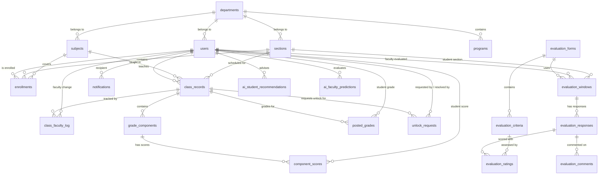

# SAGE Database Schema & ERD Documentation

This document describes the complete relational database schema for SAGE (Smart Academic Grading and Evaluation System). The database is designed for **Supabase PostgreSQL** and consists of **26 tables** organized into six functional groups: User/Organizational Data, Class/Enrollment Management, Term State/History, Grading/Attendance, Evaluations, AI Insights, and System Notifications.

---

## 1. Entity Relationship Diagram (ERD)



---

## 2. Table Definitions & Schemas

### 2.1 User & Organizational Data

#### Table: `departments`
Stores organizational colleges or academic departments.
| Column | Type | Constraints | Notes |
|---|---|---|---|
| `department_id` | UUID | PRIMARY KEY, DEFAULT gen_random_uuid() | Unique ID of the department |
| `name` | VARCHAR(150) | NOT NULL, UNIQUE | e.g. "College of Computer Studies" |
| `created_at` | TIMESTAMP | DEFAULT CURRENT_TIMESTAMP | Date created |

#### Table: `programs`
Stores academic degree programs under each college/department.
| Column | Type | Constraints | Notes |
|---|---|---|---|
| `program_id` | UUID | PRIMARY KEY, DEFAULT gen_random_uuid() | Unique ID of the program |
| `name` | VARCHAR(255) | NOT NULL, UNIQUE | Program name (e.g. "Bachelor of Science in Information Technology") |
| `department_id` | UUID | REFERENCES `departments` ON DELETE CASCADE | Affiliated college/department |
| `created_at` | TIMESTAMP | DEFAULT CURRENT_TIMESTAMP | Date created |

#### Table: `users`
Stores user profile information for all system roles.
| Column | Type | Constraints | Notes |
|---|---|---|---|
| `user_id` | UUID | PRIMARY KEY, DEFAULT gen_random_uuid() | Unique ID of the user |
| `last_name` | VARCHAR(100) | NOT NULL | Surname |
| `first_name` | VARCHAR(100) | NOT NULL | Given name |
| `middle_name` | VARCHAR(100) | NULL | Middle name (optional) |
| `email` | VARCHAR(150) | NOT NULL, UNIQUE | Login credential email |
| `password_hash` | VARCHAR(255) | NOT NULL | Encrypted credential |
| `role` | VARCHAR(20) | NOT NULL | Check constraint: admin, dean, faculty, student |
| `year_level` | VARCHAR(20) | NULL | e.g. "1st Year", "2nd Year" (Students only) |
| `department_id` | UUID | REFERENCES `departments` | Affiliated college/division |
| `must_change_password` | BOOLEAN | DEFAULT TRUE | Force change password on first login flag |
| `created_at` | TIMESTAMP | DEFAULT CURRENT_TIMESTAMP | Account creation timestamp |

---

### 2.2 Class & Enrollment Management

#### Table: `subjects`
Stores academic subject catalogs.
| Column | Type | Constraints | Notes |
|---|---|---|---|
| `subject_id` | UUID | PRIMARY KEY, DEFAULT gen_random_uuid() | Unique ID of the subject |
| `code` | VARCHAR(20) | NOT NULL, UNIQUE | Course Code (e.g. `IT101`, `CS302`) |
| `name` | VARCHAR(150) | NOT NULL | Subject Title |
| `units` | INT | NOT NULL, CHECK(units > 0) | Academic unit load (e.g. 3) |
| `department_id` | UUID | REFERENCES `departments` | Academic department offering course |

#### Table: `sections`
Stores sections offered per term.
| Column | Type | Constraints | Notes |
|---|---|---|---|
| `section_id` | UUID | PRIMARY KEY, DEFAULT gen_random_uuid() | Unique ID of the section |
| `name` | VARCHAR(50) | NOT NULL | Section Name (e.g. `BSIT-3A`, `BSIT-2B`) |
| `school_year` | VARCHAR(15) | NOT NULL | School Year (e.g. `AY 2025-2026`) |
| `semester` | VARCHAR(15) | NOT NULL | Check constraint: 1st, 2nd, Summer |
| `department_id` | UUID | REFERENCES `departments` | Program affiliation |
| `term_id` | UUID | REFERENCES `academic_terms` | Associated academic term |

#### Table: `enrollments`
Bridges students to class sections and subjects (CSV batch imported).
| Column | Type | Constraints | Notes |
|---|---|---|---|
| `enrollment_id` | UUID | PRIMARY KEY, DEFAULT gen_random_uuid() | Unique ID of enrollment record |
| `student_id` | UUID | REFERENCES `users` | Student user |
| `section_id` | UUID | REFERENCES `sections` | Assigned Section |
| `subject_id` | UUID | REFERENCES `subjects` | Enrolled Subject |
| `enrolled_at` | TIMESTAMP | DEFAULT CURRENT_TIMESTAMP | Enrolled date |
| `imported_by` | UUID | REFERENCES `users` | Admin performing import |

#### Table: `class_records`
Stores classrooms linking subjects, sections, and faculty.
| Column | Type | Constraints | Notes |
|---|---|---|---|
| `class_record_id` | UUID | PRIMARY KEY, DEFAULT gen_random_uuid() | Unique ID of the class record |
| `faculty_id` | UUID | REFERENCES `users` | Assigned instructor (updatable by Admin) |
| `subject_id` | UUID | REFERENCES `subjects` | Assigned course |
| `section_id` | UUID | REFERENCES `sections` | Assigned student section |
| `school_year` | VARCHAR(15) | NOT NULL | e.g. `AY 2025-2026` |
| `semester` | VARCHAR(15) | NOT NULL | Check constraint: 1st, 2nd, Summer |
| `status` | VARCHAR(15) | DEFAULT 'active' | Check: active, archived |
| `created_at` | TIMESTAMP | DEFAULT CURRENT_TIMESTAMP | Creation date |
| `term_id` | UUID | REFERENCES `academic_terms` | Associated academic term |

#### Table: `class_faculty_log`
Tracks changes of faculty assignment in a class record for audit history.
| Column | Type | Constraints | Notes |
|---|---|---|---|
| `log_id` | UUID | PRIMARY KEY, DEFAULT gen_random_uuid() | Unique ID of assignment log |
| `class_record_id` | UUID | REFERENCES `class_records` | Associated class |
| `faculty_id` | UUID | REFERENCES `users` | Assigned faculty |
| `assigned_at` | TIMESTAMP | DEFAULT CURRENT_TIMESTAMP | Date assigned |
| `replaced_at` | TIMESTAMP | NULL | Date unassigned |
| `replaced_by` | UUID | REFERENCES `users` | Admin authorizing re-assignment |

#### Table: `academic_terms`
Stores registered academic terms and their active/evaluation states.
| Column | Type | Constraints | Notes |
|---|---|---|---|
| `term_id` | UUID | PRIMARY KEY, DEFAULT gen_random_uuid() | Unique ID of the term |
| `school_year` | VARCHAR(15) | NOT NULL | e.g. '2025-2026' |
| `semester` | semester_period | NOT NULL | '1st', '2nd', 'Summer' |
| `is_active` | BOOLEAN | DEFAULT FALSE, UNIQUE INDEX | Active term pointer (singleton constraint) |
| `is_evaluation_open` | BOOLEAN | DEFAULT FALSE | Evaluation window controller |
| `created_at` | TIMESTAMP | DEFAULT CURRENT_TIMESTAMP | Timestamp of creation |

#### Table: `student_term_details`
Archives student year level and section history prior to semester rollovers.
| Column | Type | Constraints | Notes |
|---|---|---|---|
| `mapping_id` | UUID | PRIMARY KEY, DEFAULT gen_random_uuid() | Unique ID of detail record |
| `student_id` | UUID | REFERENCES `users` | Associated student |
| `term_id` | UUID | REFERENCES `academic_terms` | Associated academic term |
| `year_level` | VARCHAR(20) | NOT NULL | e.g. '3rd Year' during this term |
| `section_id` | UUID | REFERENCES `sections` ON DELETE SET NULL | Section mapping in this term |
| `created_at` | TIMESTAMP | DEFAULT CURRENT_TIMESTAMP | Log timestamp |

---

### 2.3 Grading Module

#### Table: `grade_components`
Defines weight criteria for terms (Prelim, Midterm, Semi-Final, Final).
| Column | Type | Constraints | Notes |
|---|---|---|---|
| `component_id` | UUID | PRIMARY KEY, DEFAULT gen_random_uuid() | Unique ID of components |
| `class_record_id` | UUID | REFERENCES `class_records` | Associated class |
| `grade_period` | VARCHAR(15) | NOT NULL | Check: prelim, midterm, semi_final, final |
| `type` | VARCHAR(20) | NOT NULL | Check: activity, quiz, exam, project |
| `name` | VARCHAR(100) | NOT NULL | Component Name (e.g. `Quiz 1`, `Lab Exam`) |
| `weight` | DECIMAL(5,2) | NOT NULL | Percentage weight (e.g. 20.00) |
| `max_score` | DECIMAL(6,2) | NOT NULL | Maximum possible points (e.g. 50.00) |
| `created_at` | TIMESTAMP | DEFAULT CURRENT_TIMESTAMP | Date components created |

#### Table: `class_grading_columns`
Stores maximum scores for each activity/quiz and exam column per class term (dynamic spreadsheet column max scores).
| Column | Type | Constraints | Notes |
|---|---|---|---|
| `id` | UUID | PRIMARY KEY, DEFAULT gen_random_uuid() | Unique ID of configuration |
| `class_record_id` | UUID | REFERENCES `class_records` | Associated class record |
| `term` | VARCHAR(20) | NOT NULL | e.g. `'Prelim'`, `'Midterm'`, `'Semi-Final'`, `'Final'` |
| `act1_max` | INT | DEFAULT 20, CHECK(act1_max > 0) | Quiz 1 Max Points |
| `act2_max` | INT | DEFAULT 20, CHECK(act2_max > 0) | Quiz 2 Max Points |
| `act3_max` | INT | DEFAULT 20, CHECK(act3_max > 0) | Quiz 3 Max Points |
| `act4_max` | INT | DEFAULT 20, CHECK(act4_max > 0) | Quiz 4 Max Points |
| `act5_max` | INT | DEFAULT 20, CHECK(act5_max > 0) | Quiz 5 Max Points |
| `act6_max` | INT | DEFAULT 10, CHECK(act6_max > 0) | Quiz 6 Max Points |
| `exam_max` | INT | DEFAULT 40, CHECK(exam_max > 0) | Term Exam Max Points |
| UNIQUE(class_record_id, term) | | | Prevent duplicate setups for same term |

#### Table: `component_scores`
Stores raw points earned by students in individual components.
| Column | Type | Constraints | Notes |
|---|---|---|---|
| `score_id` | UUID | PRIMARY KEY, DEFAULT gen_random_uuid() | Unique ID of score record |
| `component_id` | UUID | REFERENCES `grade_components` | Component |
| `student_id` | UUID | REFERENCES `users` | Student receiving score |
| `score` | DECIMAL(6,2) | NOT NULL | Raw points earned |
| `encoded_at` | TIMESTAMP | DEFAULT CURRENT_TIMESTAMP | Time encoded |
| `encoded_by` | UUID | REFERENCES `users` | Instructor encoding score |

#### Table: `posted_grades`
Stores finalized term grades with override records and faculty remark audit trail.
| Column | Type | Constraints | Notes |
|---|---|---|---|
| `posted_grade_id` | UUID | PRIMARY KEY, DEFAULT gen_random_uuid() | Unique ID of posted grade |
| `class_record_id` | UUID | REFERENCES `class_records` | Class record |
| `student_id` | UUID | REFERENCES `users` | Student |
| `grade_period` | VARCHAR(15) | NOT NULL | Check: prelim, midterm, semi_final, final |
| `computed_grade` | DECIMAL(5,2) | NOT NULL | Raw system-computed numeric rating (always preserved) |
| `effective_grade` | DECIMAL(5,2) | NULL | Grade displayed/recorded after remark override (NULL = use computed_grade). Capped at 3.00 for grace Passed; equals computed_grade for INC/FDA/Dropped |
| `remarks` | VARCHAR(15) | NOT NULL | Check: passed, failed, incomplete, fda, dropped |
| `remarks_note` | TEXT | NULL | Optional faculty note explaining a manual remark override (e.g. "Student missed finals due to hospitalization") |
| `remarks_set_by` | UUID | REFERENCES `users` | Faculty member who manually overrode the system remark |
| `remarks_set_at` | TIMESTAMP | NULL | Timestamp of when the remark was manually changed |
| `posted_by` | UUID | REFERENCES `users` | Instructor posting grade |
| `posted_at` | TIMESTAMP | DEFAULT CURRENT_TIMESTAMP | Posting date |
| `is_locked` | BOOLEAN | DEFAULT TRUE | Locked from faculty edits |
| `locked_milestones` | VARCHAR[] | DEFAULT '{}'::VARCHAR[] | Array of milestones currently locked for editing (e.g. `{'prelim', 'midterm'}`) |
| `override_by` | UUID | REFERENCES `users` | Admin authorizing override |
| `override_at` | TIMESTAMP | NULL | Date override applied |
| `is_late_submission` | BOOLEAN | DEFAULT FALSE | Flag indicating if grade was posted after semester rollover |

#### Table: `unlock_requests`
Stores faculty requests to unlock specific grading milestones for Dean review and override.
| Column | Type | Constraints | Notes |
|---|---|---|---|
| `request_id` | UUID | PRIMARY KEY, DEFAULT gen_random_uuid() | Unique ID of the unlock request |
| `class_record_id` | UUID | REFERENCES `class_records` ON DELETE CASCADE | Associated class record |
| `milestone` | VARCHAR(20) | NOT NULL | Milestone term (e.g. `'Prelim'`, `'Midterm'`, `'Semi-Final'`, `'Final'`) |
| `requested_by` | UUID | REFERENCES `users` | Faculty member requesting the unlock |
| `requested_at` | TIMESTAMP | DEFAULT CURRENT_TIMESTAMP | Timestamp when requested |
| `status` | VARCHAR(20) | DEFAULT 'pending' | Status check: `'pending'`, `'approved'`, `'rejected'` |
| `resolved_by` | UUID | REFERENCES `users` | Dean resolving request (approved/rejected) |
| `resolved_at` | TIMESTAMP | NULL | Timestamp of Dean resolution |

#### Table: `attendance_records`
Stores daily attendance logs for students in class records.
| Column | Type | Constraints | Notes |
|---|---|---|---|
| `attendance_id` | UUID | PRIMARY KEY, DEFAULT gen_random_uuid() | Unique ID of attendance record |
| `student_id` | UUID | REFERENCES `users` | Associated student |
| `class_record_id` | UUID | REFERENCES `class_records` | Associated class record |
| `date` | DATE | NOT NULL | Date of session |
| `status` | attendance_status | NOT NULL DEFAULT 'Present' | Check: 'Present', 'Absent', 'Late', 'Excused' |
| `remarks` | TEXT | NULL | Optional remarks note |
| `term_id` | UUID | REFERENCES `academic_terms` | Associated academic term |
| `created_at` | TIMESTAMP | DEFAULT CURRENT_TIMESTAMP | Record created timestamp |

---

### 2.4 Faculty Evaluation Module

#### Table: `evaluation_forms`
Stores master survey form details.
| Column | Type | Constraints | Notes |
|---|---|---|---|
| `form_id` | UUID | PRIMARY KEY, DEFAULT gen_random_uuid() | Unique ID of form |
| `title` | VARCHAR(150) | NOT NULL | Form Title |
| `created_by` | UUID | REFERENCES `users` | Admin creating form |
| `created_at` | TIMESTAMP | DEFAULT CURRENT_TIMESTAMP | Creation date |

#### Table: `evaluation_criteria`
Stores individual questions inside forms.
| Column | Type | Constraints | Notes |
|---|---|---|---|
| `criteria_id` | UUID | PRIMARY KEY, DEFAULT gen_random_uuid() | Unique ID of criteria |
| `form_id` | UUID | REFERENCES `evaluation_forms` | Form |
| `label` | VARCHAR(150) | NOT NULL | Category/Metric (e.g. "Instruction") |
| `description` | TEXT | NOT NULL | Criteria statement |
| `max_rating` | INT | DEFAULT 4 | Maximum scale value |
| `order_index` | INT | NOT NULL | Ordering display position |

#### Table: `evaluation_windows`
Opens and closes evaluation periods linking faculty to student sections.
| Column | Type | Constraints | Notes |
|---|---|---|---|
| `window_id` | UUID | PRIMARY KEY, DEFAULT gen_random_uuid() | Unique ID of window |
| `form_id` | UUID | REFERENCES `evaluation_forms` | Evaluation Form used |
| `faculty_id` | UUID | REFERENCES `users` | Instructor evaluated |
| `section_id` | UUID | REFERENCES `sections` | Student section submitting responses |
| `open_at` | TIMESTAMP | NOT NULL | Start date |
| `close_at` | TIMESTAMP | NOT NULL | Expiry date |
| `is_closed` | BOOLEAN | DEFAULT FALSE | Locked flag |
| `created_by` | UUID | REFERENCES `users` | Admin authorizer |

#### Table: `evaluation_responses`
Stores student survey submissions (anonymized).
| Column | Type | Constraints | Notes |
|---|---|---|---|
| `response_id` | UUID | PRIMARY KEY, DEFAULT gen_random_uuid() | Unique ID of response |
| `window_id` | UUID | REFERENCES `evaluation_windows` | Evaluation window |
| `anonymous_token` | VARCHAR(255) | NOT NULL | Hashed token to prevent student linkage |
| `submitted_at` | TIMESTAMP | DEFAULT CURRENT_TIMESTAMP | Date submitted |

#### Table: `evaluation_ratings`
Stores scores for criteria questions.
| Column | Type | Constraints | Notes |
|---|---|---|---|
| `rating_id` | UUID | PRIMARY KEY, DEFAULT gen_random_uuid() | Unique ID of rating |
| `response_id` | UUID | REFERENCES `evaluation_responses` | Associated response |
| `criteria_id` | UUID | REFERENCES `evaluation_criteria` | Evaluated criteria |
| `rating` | INT | NOT NULL, CHECK(rating >= 1) | Earned rating |

#### Table: `evaluation_comments`
Stores optional written feedback.
| Column | Type | Constraints | Notes |
|---|---|---|---|
| `comment_id` | UUID | PRIMARY KEY, DEFAULT gen_random_uuid() | Unique ID of comment |
| `response_id` | UUID | REFERENCES `evaluation_responses` | Associated response |
| `comment` | TEXT | NOT NULL | Written remarks |

---

### 2.5 AI Insights & System Services

#### Table: `ai_student_recommendations`
Stores AI-generated academic recommendations.
| Column | Type | Constraints | Notes |
|---|---|---|---|
| `recommendation_id` | UUID | PRIMARY KEY, DEFAULT gen_random_uuid() | Unique ID of recommendation |
| `student_id` | UUID | REFERENCES `users` | Student user |
| `generated_at` | TIMESTAMP | DEFAULT CURRENT_TIMESTAMP | Date evaluated |
| `summary` | TEXT | NOT NULL | Narrative counseling analysis |
| `recommendation` | VARCHAR(30) | NOT NULL | Check: continue, at_risk, recommend_shift |
| `basis_snapshot` | JSONB | NOT NULL | Grades data snapshot at compilation |

#### Table: `ai_faculty_predictions`
Stores AI-generated faculty fitness evaluations.
| Column | Type | Constraints | Notes |
|---|---|---|---|
| `prediction_id` | UUID | PRIMARY KEY, DEFAULT gen_random_uuid() | Unique ID of prediction |
| `faculty_id` | UUID | REFERENCES `users` | Instructor evaluated |
| `school_year` | VARCHAR(15) | NOT NULL | e.g. `AY 2025-2026` |
| `generated_at` | TIMESTAMP | DEFAULT CURRENT_TIMESTAMP | Date generated |
| `summary` | TEXT | NOT NULL | Faculty fitness analysis |
| `verdict` | VARCHAR(30) | NOT NULL | Check: recommended, needs_improvement, not_recommended |
| `strong_points` | TEXT | NULL | Highlighted positives |
| `weak_points` | TEXT | NULL | Areas of concern |
| `basis_snapshot` | JSONB | NOT NULL | Evaluation metrics snapshot |

#### Table: `notifications`
Stores system and grade alerts dispatched to users.
| Column | Type | Constraints | Notes |
|---|---|---|---|
| `notification_id` | UUID | PRIMARY KEY, DEFAULT gen_random_uuid() | Unique ID of notification |
| `recipient_id` | UUID | REFERENCES `users` | User recipient |
| `type` | VARCHAR(30) | NOT NULL | Check: grade_posted, eval_closed, eval_window_open, ai_recommendation |
| `message` | TEXT | NOT NULL | Display text |
| `is_read` | BOOLEAN | DEFAULT FALSE | Status flag |
| `created_at` | TIMESTAMP | DEFAULT CURRENT_TIMESTAMP | Dispatch timestamp |

#### Table: `activity_logs` (Audit Logs)
Stores logs of administrative and system changes.
| Column | Type | Constraints | Notes |
|---|---|---|---|
| `log_id` | UUID | PRIMARY KEY, DEFAULT gen_random_uuid() | Unique ID of audit log |
| `actor` | VARCHAR(100) | NOT NULL | Name/email of actor performing action |
| `action` | VARCHAR(50) | NOT NULL | Category (e.g. `OVERRIDE`, `DELETE`) |
| `message` | TEXT | NOT NULL | Description details |
| `timestamp` | TIMESTAMP | DEFAULT CURRENT_TIMESTAMP | Time of action |

---

## 3. SQL Data Definition Language (DDL) Scripts

You can use the following scripts to initialize the SAGE database inside your Supabase SQL editor:

```sql
-- Create custom constraint checks
CREATE TYPE user_role AS ENUM ('admin', 'dean', 'faculty', 'student');
CREATE TYPE semester_period AS ENUM ('1st', '2nd', 'Summer');
CREATE TYPE class_status AS ENUM ('active', 'archived');
CREATE TYPE term_period AS ENUM ('prelim', 'midterm', 'semi_final', 'final');
CREATE TYPE component_category AS ENUM ('activity', 'quiz', 'exam', 'project');
CREATE TYPE grade_remarks AS ENUM ('passed', 'failed', 'incomplete', 'fda', 'dropped');
CREATE TYPE ai_student_verdict AS ENUM ('continue', 'at_risk', 'recommend_shift');
CREATE TYPE ai_faculty_verdict AS ENUM ('recommended', 'needs_improvement', 'not_recommended');

-- Table: departments
CREATE TABLE departments (
    department_id UUID PRIMARY KEY DEFAULT gen_random_uuid(),
    name VARCHAR(150) NOT NULL UNIQUE,
    created_at TIMESTAMP DEFAULT CURRENT_TIMESTAMP
);

-- Table: programs
CREATE TABLE programs (
    program_id UUID PRIMARY KEY DEFAULT gen_random_uuid(),
    name VARCHAR(255) NOT NULL UNIQUE,
    department_id UUID REFERENCES departments(department_id) ON DELETE CASCADE,
    created_at TIMESTAMP WITH TIME ZONE DEFAULT CURRENT_TIMESTAMP
);

-- Table: users
CREATE TABLE users (
    user_id UUID PRIMARY KEY DEFAULT gen_random_uuid(),
    last_name VARCHAR(100) NOT NULL,
    first_name VARCHAR(100) NOT NULL,
    middle_name VARCHAR(100),
    email VARCHAR(150) NOT NULL UNIQUE,
    password_hash VARCHAR(255) NOT NULL,
    role user_role NOT NULL,
    year_level VARCHAR(20),
    department_id UUID REFERENCES departments(department_id),
    must_change_password BOOLEAN DEFAULT TRUE,
    created_at TIMESTAMP DEFAULT CURRENT_TIMESTAMP
);

-- Table: subjects
CREATE TABLE subjects (
    subject_id UUID PRIMARY KEY DEFAULT gen_random_uuid(),
    code VARCHAR(20) NOT NULL UNIQUE,
    name VARCHAR(150) NOT NULL,
    units INT NOT NULL CHECK(units > 0),
    department_id UUID REFERENCES departments(department_id)
);

-- Table: sections
CREATE TABLE sections (
    section_id UUID PRIMARY KEY DEFAULT gen_random_uuid(),
    name VARCHAR(50) NOT NULL,
    school_year VARCHAR(15) NOT NULL,
    semester semester_period NOT NULL,
    department_id UUID REFERENCES departments(department_id)
);

-- Table: enrollments
CREATE TABLE enrollments (
    enrollment_id UUID PRIMARY KEY DEFAULT gen_random_uuid(),
    student_id UUID REFERENCES users(user_id) ON DELETE CASCADE,
    section_id UUID REFERENCES sections(section_id) ON DELETE CASCADE,
    subject_id UUID REFERENCES subjects(subject_id) ON DELETE CASCADE,
    enrolled_at TIMESTAMP DEFAULT CURRENT_TIMESTAMP,
    imported_by UUID REFERENCES users(user_id)
);

-- Table: class_records
CREATE TABLE class_records (
    class_record_id UUID PRIMARY KEY DEFAULT gen_random_uuid(),
    faculty_id UUID REFERENCES users(user_id),
    subject_id UUID REFERENCES subjects(subject_id) ON DELETE CASCADE,
    section_id UUID REFERENCES sections(section_id) ON DELETE CASCADE,
    school_year VARCHAR(15) NOT NULL,
    semester semester_period NOT NULL,
    status class_status DEFAULT 'active',
    created_at TIMESTAMP DEFAULT CURRENT_TIMESTAMP
);

-- Table: class_faculty_log
CREATE TABLE class_faculty_log (
    log_id UUID PRIMARY KEY DEFAULT gen_random_uuid(),
    class_record_id UUID REFERENCES class_records(class_record_id) ON DELETE CASCADE,
    faculty_id UUID REFERENCES users(user_id),
    assigned_at TIMESTAMP DEFAULT CURRENT_TIMESTAMP,
    replaced_at TIMESTAMP,
    replaced_by UUID REFERENCES users(user_id)
);

-- Table: grade_components
CREATE TABLE grade_components (
    component_id UUID PRIMARY KEY DEFAULT gen_random_uuid(),
    class_record_id UUID REFERENCES class_records(class_record_id) ON DELETE CASCADE,
    grade_period term_period NOT NULL,
    type component_category NOT NULL,
    name VARCHAR(100) NOT NULL,
    weight DECIMAL(5,2) NOT NULL CHECK(weight >= 0.00 AND weight <= 100.00),
    max_score DECIMAL(6,2) NOT NULL CHECK(max_score > 0.00),
    created_at TIMESTAMP DEFAULT CURRENT_TIMESTAMP
);

-- Table: component_scores
CREATE TABLE component_scores (
    score_id UUID PRIMARY KEY DEFAULT gen_random_uuid(),
    component_id UUID REFERENCES grade_components(component_id) ON DELETE CASCADE,
    student_id UUID REFERENCES users(user_id) ON DELETE CASCADE,
    score DECIMAL(6,2) NOT NULL CHECK(score >= 0.00),
    encoded_at TIMESTAMP DEFAULT CURRENT_TIMESTAMP,
    encoded_by UUID REFERENCES users(user_id)
);

-- Table: posted_grades
CREATE TABLE posted_grades (
    posted_grade_id UUID PRIMARY KEY DEFAULT gen_random_uuid(),
    class_record_id UUID REFERENCES class_records(class_record_id) ON DELETE CASCADE,
    student_id UUID REFERENCES users(user_id) ON DELETE CASCADE,
    grade_period term_period NOT NULL,
    computed_grade DECIMAL(5,2) NOT NULL,
    effective_grade DECIMAL(5,2) DEFAULT NULL,
    remarks grade_remarks NOT NULL,
    remarks_note TEXT DEFAULT NULL,
    remarks_set_by UUID REFERENCES users(user_id),
    remarks_set_at TIMESTAMP DEFAULT NULL,
    posted_by UUID REFERENCES users(user_id),
    posted_at TIMESTAMP DEFAULT CURRENT_TIMESTAMP,
    is_locked BOOLEAN DEFAULT TRUE,
    locked_milestones VARCHAR[] DEFAULT '{}'::VARCHAR[],
    override_by UUID REFERENCES users(user_id),
    override_at TIMESTAMP
);

-- Table: unlock_requests
CREATE TABLE unlock_requests (
    request_id UUID PRIMARY KEY DEFAULT gen_random_uuid(),
    class_record_id UUID REFERENCES class_records(class_record_id) ON DELETE CASCADE,
    milestone VARCHAR(20) NOT NULL,
    requested_by UUID REFERENCES users(user_id),
    requested_at TIMESTAMP DEFAULT CURRENT_TIMESTAMP,
    status VARCHAR(20) DEFAULT 'pending' CHECK (status IN ('pending', 'approved', 'rejected')),
    resolved_by UUID REFERENCES users(user_id),
    resolved_at TIMESTAMP
);


-- Table: class_grading_columns
CREATE TABLE class_grading_columns (
    id UUID PRIMARY KEY DEFAULT gen_random_uuid(),
    class_record_id UUID NOT NULL REFERENCES class_records(class_record_id) ON DELETE CASCADE,
    term VARCHAR(20) NOT NULL,
    act1_max INT DEFAULT 20 CHECK (act1_max > 0),
    act2_max INT DEFAULT 20 CHECK (act2_max > 0),
    act3_max INT DEFAULT 20 CHECK (act3_max > 0),
    act4_max INT DEFAULT 20 CHECK (act4_max > 0),
    act5_max INT DEFAULT 20 CHECK (act5_max > 0),
    act6_max INT DEFAULT 10 CHECK (act6_max > 0),
    exam_max INT DEFAULT 40 CHECK (exam_max > 0),
    UNIQUE(class_record_id, term)
);

-- Table: evaluation_forms
CREATE TABLE evaluation_forms (
    form_id UUID PRIMARY KEY DEFAULT gen_random_uuid(),
    title VARCHAR(150) NOT NULL,
    created_by UUID REFERENCES users(user_id),
    created_at TIMESTAMP DEFAULT CURRENT_TIMESTAMP
);

-- Table: evaluation_criteria
CREATE TABLE evaluation_criteria (
    criteria_id UUID PRIMARY KEY DEFAULT gen_random_uuid(),
    form_id UUID REFERENCES evaluation_forms(form_id) ON DELETE CASCADE,
    label VARCHAR(150) NOT NULL,
    description TEXT NOT NULL,
    max_rating INT DEFAULT 4 CHECK(max_rating > 0),
    order_index INT NOT NULL
);

-- Table: evaluation_windows
CREATE TABLE evaluation_windows (
    window_id UUID PRIMARY KEY DEFAULT gen_random_uuid(),
    form_id UUID REFERENCES evaluation_forms(form_id) ON DELETE CASCADE,
    faculty_id UUID REFERENCES users(user_id) ON DELETE CASCADE,
    section_id UUID REFERENCES sections(section_id) ON DELETE CASCADE,
    open_at TIMESTAMP NOT NULL,
    close_at TIMESTAMP NOT NULL,
    is_closed BOOLEAN DEFAULT FALSE,
    created_by UUID REFERENCES users(user_id)
);

-- Table: evaluation_responses
CREATE TABLE evaluation_responses (
    response_id UUID PRIMARY KEY DEFAULT gen_random_uuid(),
    window_id UUID REFERENCES evaluation_windows(window_id) ON DELETE CASCADE,
    anonymous_token VARCHAR(255) NOT NULL UNIQUE,
    submitted_at TIMESTAMP DEFAULT CURRENT_TIMESTAMP
);

-- Table: evaluation_ratings
CREATE TABLE evaluation_ratings (
    rating_id UUID PRIMARY KEY DEFAULT gen_random_uuid(),
    response_id UUID REFERENCES evaluation_responses(response_id) ON DELETE CASCADE,
    criteria_id UUID REFERENCES evaluation_criteria(criteria_id) ON DELETE CASCADE,
    rating INT NOT NULL CHECK(rating >= 1)
);

-- Table: evaluation_comments
CREATE TABLE evaluation_comments (
    comment_id UUID PRIMARY KEY DEFAULT gen_random_uuid(),
    response_id UUID REFERENCES evaluation_responses(response_id) ON DELETE CASCADE,
    comment TEXT NOT NULL
);

-- Table: ai_student_recommendations
CREATE TABLE ai_student_recommendations (
    recommendation_id UUID PRIMARY KEY DEFAULT gen_random_uuid(),
    student_id UUID REFERENCES users(user_id) ON DELETE CASCADE,
    generated_at TIMESTAMP DEFAULT CURRENT_TIMESTAMP,
    summary TEXT NOT NULL,
    recommendation ai_student_verdict NOT NULL,
    basis_snapshot JSONB NOT NULL
);

-- Table: ai_faculty_predictions
CREATE TABLE ai_faculty_predictions (
    prediction_id UUID PRIMARY KEY DEFAULT gen_random_uuid(),
    faculty_id UUID REFERENCES users(user_id) ON DELETE CASCADE,
    school_year VARCHAR(15) NOT NULL,
    generated_at TIMESTAMP DEFAULT CURRENT_TIMESTAMP,
    summary TEXT NOT NULL,
    verdict ai_faculty_verdict NOT NULL,
    strong_points TEXT,
    weak_points TEXT,
    basis_snapshot JSONB NOT NULL
);

-- Table: notifications
CREATE TABLE notifications (
    notification_id UUID PRIMARY KEY DEFAULT gen_random_uuid(),
    recipient_id UUID REFERENCES users(user_id) ON DELETE CASCADE,
    type VARCHAR(30) NOT NULL,
    message TEXT NOT NULL,
    is_read BOOLEAN DEFAULT FALSE,
    created_at TIMESTAMP DEFAULT CURRENT_TIMESTAMP
);

-- Table: activity_logs
CREATE TABLE activity_logs (
    log_id UUID PRIMARY KEY DEFAULT gen_random_uuid(),
    actor VARCHAR(100) NOT NULL,
    action VARCHAR(50) NOT NULL,
    message TEXT NOT NULL,
    timestamp TIMESTAMP DEFAULT CURRENT_TIMESTAMP
);
```
