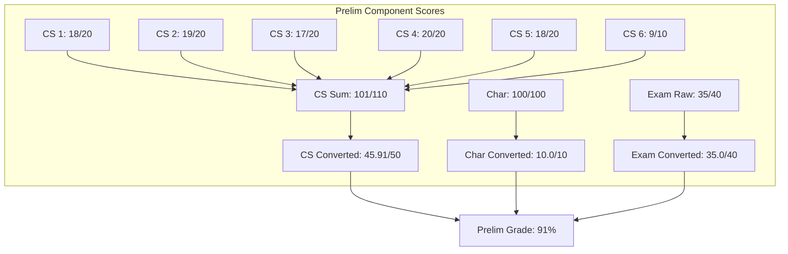
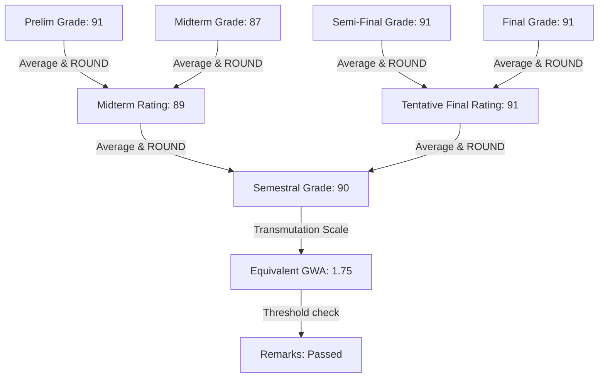

# SAGE Grading System Analysis Report
*Dr. Yanga's Colleges, Inc. (DYCI)*

This document provides a comprehensive mathematical and structural analysis of the official Excel-based grading system used by the institution, based on the cell values and formulas extracted from [SAGE_Grading_System_Mock.xlsx](file:///c:/Users/sadia/SAGE/SAGE_Grading_System_Mock.xlsx).

---

## 1. Sheet Structure Overview

The workbook contains three functional worksheets:

1. **`Subject Profile`**: Stores class metadata (course, section, schedule, instructor, units) and maintains the master student roster.
2. **`Record Sheet`**: The main calculation sheet where individual scores are input, aggregated, and mapped to term ratings, semestral grades, GWA equivalents, and remarks.
3. **`Report of Grades`**: The registrar's summary/output sheet, formatted for print, showing final ratings (Midterm Rating, Tentative Final Rating) and final transmuted grades for all students.

---

## 2. Term Grade Computation Rules

The academic semester is split into **four distinct grading terms**:
1. **Preliminary Grade (PG)**
2. **Midterm Grade (MG)**
3. **Semi-Final Grade (SFG)**
4. **Final Grade (FG)**

For each term, the grade is out of a maximum of **100 points** and is computed from three weighted components:

| Component | Max Contribution (Weight) | Calculation Method |
| :--- | :---: | :--- |
| **Class Standing** | **50%** (50 points) | Sum of scores across 6 activities/quizzes divided by the max total points, scaled to 50: `(Student_Sum / Max_Sum) * 50`. |
| **Character ("Char")** | **10%** (10 points) | Conduct/behavior/attendance score (out of 100) multiplied by 0.1: `Char_Score * 0.1`. |
| **Term Exam** | **40%** (40 points) | Raw term exam score divided by the max exam points (typically 40), scaled to 40: `(Exam_Raw / Max_Exam_Raw) * 40`. |

### Term Rating Formula
For any student $i$, the term grade is calculated by summing the three components and rounding to the nearest whole integer:
$$\text{Term Grade} = \text{ROUND}\left( \text{Class Standing}_{50} + \text{Character}_{10} + \text{Term Exam}_{40}, 0 \right)$$

---

## 3. Spreadsheet Formulas (Detailed Columns)

Using row 9 (Student: *Gabriel, John Christian C.*) as the reference, here is the exact column mapping and formulas in `Record Sheet`:



### Prelim Period Column Mapping (Columns D to O)
* **Class Standing Quizzes/Activities**: Columns `D` to `I` (Max points: `20, 20, 20, 20, 20, 10`, Total Max = `110`)
  * **Raw Sum (`J9`)**: `=IF($C9="","",SUM(D9:I9))` *(Student Score: 101)*
  * **Converted CS (`K9`)**: `=IF($C9="","",IF(J$8>0, (J9/J$8)*50, 0))` *(Student Score: 45.91)*
* **Character Rating (`L9`)**: Out of 100 *(Student Score: 100)*
* **Exam Raw Score (`M9`)**: Out of 40 *(Student Score: 35)*
* **Converted Exam (`N9`)**: `=IF($C9="","",IF(M$8>0, (M9/M$8)*40, 0))` *(Student Score: 35.0)*
* **Prelim Grade Rating (`O9`)**: `=IF($C9="","",ROUND(K9+(L9*0.1)+N9,0))` *(Student Score: 91)*

This exact schema is replicated for the subsequent periods:
* **Midterm**: Columns `P` to `AA` (Term Grade in `AA`)
* **Semi-Final**: Columns `AC` to `AN` (Term Grade in `AN`)
* **Final**: Columns `AO` to `AZ` (Term Grade in `AZ`)

---

## 4. Final Grade Aggregation (Grade Progression Chain)

The institution averages grades step-by-step to arrive at the final Semestral Grade. The rounding operations at each phase are crucial:



1. **Midterm Rating (MR)** (Column `AB`): 
   Calculated as the rounded average of Prelim Grade (`O9`) and Midterm Grade (`AA9`).
   $$\text{MR} = \text{ROUND}\left( \text{AVERAGE}(\text{Prelim Grade}, \text{Midterm Grade}), 0 \right)$$
   *Example: $\text{ROUND}(\text{AVERAGE}(91, 87), 0) = 89$*

2. **Tentative Final Rating (TFR)** (Column `BA`):
   Calculated as the rounded average of Semi-Final Grade (`AN9`) and Final Grade (`AZ9`).
   $$\text{TFR} = \text{ROUND}\left( \text{AVERAGE}(\text{Semi-Final Grade}, \text{Final Grade}), 0 \right)$$
   *Example: $\text{ROUND}(\text{AVERAGE}(91, 91), 0) = 91$*

3. **Semestral Grade (SG)** (Column `BB`):
   Calculated as the rounded average of Midterm Rating (`AB9`) and Tentative Final Rating (`BA9`).
   $$\text{SG} = \text{ROUND}\left( \text{AVERAGE}(\text{Midterm Rating}, \text{Tentative Final Rating}), 0 \right)$$
   *Example: $\text{ROUND}(\text{AVERAGE}(89, 91), 0) = 90$*

> [!WARNING]
> **Intermediate Rounding Errors**:
> The portal's calculation logic must compute intermediate averages and round them before performing the next step. Direct average without intermediate rounding will cause off-by-one errors for students on the borderlines (e.g., fractional results like `.5` rounding up).

---

## 5. Transmutation Scale (GWA Equivalents)

The final Semestral Grade (SG) is converted to a GWA Equivalent (on a `1.00` to `5.00` scale) in Column `BC` using the following mapping:

| Semestral Grade (SG) | GWA Equivalent | Passing Status |
| :---: | :---: | :---: |
| **98 – 100** | **1.00** | Passed |
| **95 – 97** | **1.25** | Passed |
| **92 – 94** | **1.50** | Passed |
| **89 – 91** | **1.75** | Passed |
| **86 – 88** | **2.00** | Passed |
| **83 – 85** | **2.25** | Passed |
| **80 – 82** | **2.50** | Passed |
| **77 – 79** | **2.75** | Passed |
| **75 – 76** | **3.00** | Passed |
| **Below 75** | **5.00** | Failed |

### Equivalent Grade Excel Formula
`BC9`:
```excel
=IF($C9="","",IF(BB9>=98, 1, IF(BB9>=95, 1.25, IF(BB9>=92, 1.5, IF(BB9>=89, 1.75, IF(BB9>=86, 2, IF(BB9>=83, 2.25, IF(BB9>=80, 2.5, IF(BB9>=77, 2.75, IF(BB9>=75, 3, 5))))))))))
```

### Remarks Excel Formula
`BD9`:
```excel
=IF($C9="","",IF(BC9<=3, "Passed", "Failed"))
```
A student passes if their GWA equivalent is less than or equal to `3.00`. An equivalent of `5.00` is a fail.

---

## 6. Implementation Plan for SAGE Portal

To ensure the grading portal aligns perfectly with the school's Excel spreadsheet computations, the frontend components (e.g., `GradeComputationPreview.jsx` and `ScoreInput.jsx`) should be updated:

1. **Update Weights**: Modify the component weights in the UI to match the official **50% Class Standing / 10% Character / 40% Term Exam** split.
2. **Replicate Grading Periods**: Support four distinct grading periods (**Prelim, Midterm, Semi-Final, Final**) and compute intermediate ratings (**Midterm Rating (MR)**, **Tentative Final Rating (TFR)**) rather than assuming a simple single-period average.
3. **Handle Calculations & Rounding Precisely**: Implement exact JavaScript equivalents of the Excel formulas:
   * **Class Standing**: `CS_Score = (sumOfQuizzes / sumOfQuizMaxes) * 50`
   * **Exam**: `Exam_Score = (examRaw / examMax) * 40`
   * **Term Grade**: `Term_Grade = Math.round(CS_Score + (charScore * 0.1) + Exam_Score)`
   * **MR**: `MR = Math.round((Prelim_Grade + Midterm_Grade) / 2)`
   * **TFR**: `TFR = Math.round((SemiFinal_Grade + Final_Grade) / 2)`
   * **SG**: `SG = Math.round((MR + TFR) / 2)`
4. **Implement GWA Transmutation Logic**: Map numeric `SG` to GWA values using the custom transmutation mapping table.
