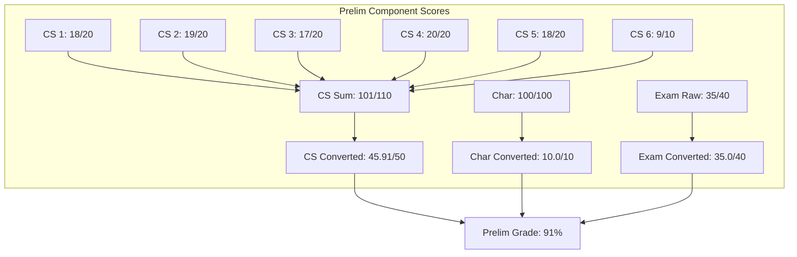
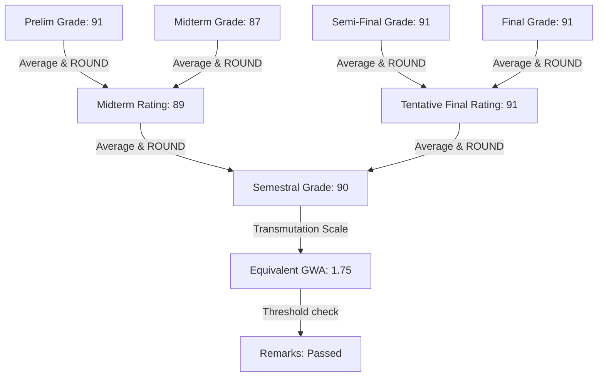
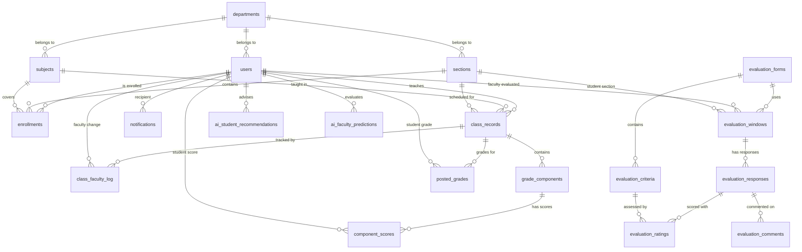

# SAGE: MASTER TECHNICAL DOCUMENTATION


---

# SAGE — Smart Academic Grading & Evaluation System

SAGE is a premium, high-fidelity academic portal system engineered for **Dr. Yanga's Colleges, Inc.** It serves as an integrated platform for grading oversight, student evaluations, GWA analysis, academic early risk warning alerts, and administration workflows.

---

## 🚀 Portals & Core Modules

The system is split into **4 main portals** plus public authentication screens, totaling over 35 distinct pages linked together via a unified state engine.

### 1. Shared / Public Screens (S01 – S03)
* **Login Page (S01)**: Split-screen authentication layout. Features server-side simulated role resolution and a **Quick Demo Accounts Selector** drawer.
* **Forgot Password (S02)**: Registered account verification and token dispatch logger.
* **Reset Password (S03)**: Password constraints validator that updates local credentials.
* **Force Change Password**: Intercepts first-time logins and requires them to update their password before proceeding.

### 2. Admin Portal (S04 – S14)
* **Dashboard (S04)**: Global metrics and live system-wide transaction activity ledger feed.
* **User Management (S05-S06)**: Complete user registry with role management, search filters, and account toggle controls.
* **Classrooms Directory (S07)**: Subject listings with faculty reassignment modals and grade-lock checks on archiving.
* **Class Creation & CSV Registry (S08)**: CSV parser panel allowing copy-pasting of registry files with interactive preview validation grids before saving.
* **Evaluation Form Builder (S09-S10)**: Criteria editor with drag/click reordering, max rating adjustments, and a side-by-side **Student View Live Preview** panel.
* **Evaluation Windows Scheduler (S11-S12)**: Timer-driven window planner targeting sections and faculty, tracking real-time response ratios.
* **Grade Override Module (S13)**: Lookup panel allowing administrators to override locked grade periods with mandatory reason auditing.
* **Audit Ledger (S14)**: audit history logging all reassignments, overrides, AI triggers, and account operations.

### 3. Dean Portal (S15 – S21)
* **Dashboard (S15)**: Strategic summary counters with active **AI Performance Prediction & Warning** alert notifications.
* **Grade Posting Status (S16)**: Matrix tracking posted vs pending grade submissions (Prelim/Midterm/Finals) for all faculty.
* **Grade Distribution (S17)**: Analytics dashboard with average GWA calculators and a custom **CSS Grade Bracket Distribution Chart**.
* **Faculty Evaluations Dashboard (S18-S19)**: Cumulative rating directories linking to detailed breakdowns (question rating bars, anonymized comment cards, and AI fitness performance verdicts).
* **At-Risk Students early Warning (S20)**: Academic risk warning list tracking low running GWAs, color-coded severity indicators, and AI advisories.
* **Summary Reports Exporter (S21)**: Printable preview sheet layout displaying print-formatted reports with printer stylesheet page breaks.

### 4. Faculty Portal (S22 – S28)
* **Overview & Class Records (S22)**: Section summaries.
* **Grade Components Weight Setup (S23)**: Weight setup inputs and weight sum validators.
* **Score Input Table (S24)**: Spreadsheet scorecard featuring computed running GWAs and period grades.
* **Grade Computation Preview (S25-S26)**: Computes final GWA metrics before sealing grades.
* **Evaluation Analytics & Notifications (S27-S28)**: Evaluation scores dashboard and notification system.

### 5. Student Portal (S29 – S35)
* **Dashboard & Subject List (S29-S31)**: Course registries, period scores, and warning flag indicators.
* **Evaluations (S32-S33)**: Active survey window list and anonymized rating forms.
* **AI Advisor (S34)**: Performance advisor diagnosing weakness metrics and rendering counselor recommendations.

---

## 📄 System Documentation & Architecture

* [Complete User Journey Flow](file:///c:/Users/sadia/SAGE/docs/design/USER_JOURNEY_FLOW.md) — Comprehensive view of role-based workflows, UI screen steps, and database mutations.
* [System Design Document](file:///c:/Users/sadia/SAGE/docs/design/capstone-system-design-v2.md) — High-level architecture, portals overview, and functional requirements.
* [Database Schema & ERD Documentation](file:///c:/Users/sadia/SAGE/SAGE_DATABASE_SCHEMA.md) — Relational schema definitions, columns list, and setup DDL scripts.

---

## 🛠️ Technology Stack

* **Core Framework**: React (Vite bundler)
* **Styling & Theme**: Tailwind CSS v4
  * Anchored on custom `@theme` brand colors: Sage Green (`#022C22` / `sage-900`) and Emerald accent scales.
  * Google Fonts: **Sora** (headers and titles), **DM Sans** (body text), **JetBrains Mono** (GWA stats, grades, and audit timestamps).
* **Icons Library**: Lucide Icons exclusively
* **SVG Vector Assets**: Custom spline-vectorized SAGE logo (`SageLogo.jsx`) Vectorized in binary mode.

---

## 💾 LocalStorage persistent Database Engine (`src/lib/mockDb.js`)

To keep the application prototype dynamic and fully integrated, we engineered a persistent local storage database helper.
* Actions executed in the Admin portal (e.g. creating users, reassigning faculty, overriding grades) update the central store in real time.
* Updates propagate dynamically to the Dean Portal dashboards, Faculty Grade Sheets, and Student Portals on page refresh.

---

## 🏁 Getting Started

To launch the project locally and begin evaluation:

1. **Install Dependencies**:
   ```bash
   npm install
   ```

2. **Run Development Server**:
   ```bash
   npm run dev
   ```

3. **Open browser**:
   Navigate to [http://localhost:5173/](http://localhost:5173/) to launch the Login screen. Use the **Quick Demo Accounts Selector** at the bottom of the card to log in as Admin, Dean, Faculty, or Student instantly.


---

# SAGE Agent Context & System Overview

This document provides a permanent technical context and reference for AI agents working on the **Smart Academic Grading and Evaluation System (SAGE)** repository.

---

## 1. Project Overview & Tech Stack
* **Institution:** Dr. Yanga's Colleges, Inc. (DYCI)
* **Purpose:** Automate class record management, grade computations, student performance tracking, faculty evaluations, and AI counseling recommendations.
* **Technology Stack:**
  * **Frontend:** React 19, Vite, Tailwind CSS, Lucide Icons, SheetJS (`xlsx`).
  * **Backend:** Supabase (PostgreSQL, Auth, Storage, Edge Functions).
  * **AI:** Claude API (Anthropic).

---

## 2. Directory Structure & Key Files
* **[`src/App.jsx`](file:///c:/Users/sadia/SAGE/src/App.jsx):** Main React router configuration mapping all 41 pages across role portals.
* **`src/pages/`:** Contains role-specific directories:
  * `admin/` — User accounts, class creation, evaluation builders/windows, grade overrides, and audit logs.
  * `dean/` — Department auditing dashboards, AI faculty predictions, at-risk rosters, and summary reports.
  * `faculty/` — Class record setup, score inputs, computation previews, posted grades, evaluation feedback, and notifications.
  * `student/` — Personal grades list/breakdowns, survey submissions, and AI academic recommendations.
* **[`src/lib/mockDb.js`](file:///c:/Users/sadia/SAGE/src/lib/mockDb.js):** LocalStorage-based persistent mock database. Serves as the source of truth before Supabase migration.
* **[`src/lib/excelExport.js`](file:///c:/Users/sadia/SAGE/src/lib/excelExport.js):** Shared module generating formatted grade spreadsheets with SheetJS.
* **[`src/lib/constants.js`](file:///c:/Users/sadia/SAGE/src/lib/constants.js):** DYCI college and program listing constants.
* **[`docs/design/capstone-system-design-v2.md`](file:///c:/Users/sadia/SAGE/docs/design/capstone-system-design-v2.md):** Main Capstone System Design documentation (S01–S41 screens).

---

## 3. Relational Database Design (19 Tables)
SAGE runs on a Supabase Postgres schema with RLS enabled:
* **User/Organization:** `departments`, `users`
* **Class & Enrollment:** `subjects`, `sections`, `enrollments`, `class_records`, `class_faculty_log`
* **Grading:** `grade_components`, `class_grading_columns`, `component_scores`, `posted_grades`
* **Evaluations:** `evaluation_forms`, `evaluation_criteria`, `evaluation_windows`, `evaluation_responses`, `evaluation_ratings`, `evaluation_comments`
* **AI & Messaging:** `ai_student_recommendations`, `ai_faculty_predictions`, `notifications`, `activity_logs`

### ⚠️ Supabase Security Update
* **Behavior:** New tables in the `public` schema are not exposed to the REST Data API automatically.
* **Requirement:** Migration scripts must explicitly issue Postgres grants to the `anon`, `authenticated`, and `service_role` roles:
  ```sql
  GRANT SELECT, INSERT, UPDATE, DELETE ON TABLE public.my_table TO authenticated, anon;
  ```

---

## 4. Key Domain Rules & Logics

### 4.1 Grade Computation
Term grades (Prelim, Midterm, Semi-Final, Final) are calculated out of **100 points** using a **50% / 10% / 40%** weight distribution:
1. **Class Standing (50%):** Sum of 6 activity/quiz columns divided by total max score (typically 110), scaled to 50: `(CS_Sum / CS_Max) * 50`.
2. **Character (10%):** Conduct score (out of 100) multiplied by 0.1: `Char_Score * 0.1`.
3. **Term Exam (40%):** Raw exam score divided by max score (typically 40), scaled to 40: `(Exam_Raw / Exam_Max) * 40`.

#### The Grading Progression Chain
Intermediate averages are computed and rounded at each step:
$$\text{Term Rating} = \text{ROUND}(\text{Class Standing}_{50} + \text{Char}_{10} + \text{Exam}_{40}, 0)$$
$$\text{Midterm Rating (MR)} = \text{ROUND}(\text{AVERAGE}(\text{Prelim Grade}, \text{Midterm Grade}), 0)$$
$$\text{Tentative Final Rating (TFR)} = \text{ROUND}(\text{AVERAGE}(\text{Semi-Final Grade}, \text{Final Grade}), 0)$$
$$\text{Semestral Grade (SG)} = \text{ROUND}(\text{AVERAGE}(\text{MR}, \text{TFR}), 0)$$

#### Transmutation Scale (GWA)
* **98 – 100:** `1.00` (Passed) | **95 – 97:** `1.25` (Passed) | **92 – 94:** `1.50` (Passed)
* **89 – 91:** `1.75` (Passed) | **86 – 88:** `2.00` (Passed) | **83 – 85:** `2.25` (Passed)
* **80 – 82:** `2.50` (Passed) | **77 – 79:** `2.75` (Passed) | **75 – 76:** `3.00` (Passed)
* **Below 75:** `5.00` (Failed)

---

### 4.2 Evaluation Windows
* Form scheduled per Section (College $\rightarrow$ Program $\rightarrow$ Section selector hierarchy).
* **Batch Scheduling (Create Mode):** Automatically schedules windows for **all active instructors** teaching in the selected section, updating duplicates if they exist to protect student response counts.
* **Edit Mode:** Targets and modifies the single targeted instructor's entry.

---

### 4.3 Excel Export Choices
Both `PostedGradesView` and `GradeComputationPreview` support grade exports using SheetJS:
* **Record Sheet:** Outputs the full grading sheet detailing raw scores and live Excel formulas so that averages, rating transmutations, and remarks recalculate automatically.
* **Report of Grades:** Registrar print layout sheet. Features the GWA transmutation table, registrar metadata, and a **symmetrical 30-row split student roster** (Left column for 1-30, Right column for 31-60) linked back to the `Record Sheet` tab via cell formulas.


---

# SAGE: Detailed Development Phases by Module

This document provides a highly granular breakdown of the development phases for the **Smart Academic Grading and Evaluation System (SAGE)**. It is organized by system module to track the historical decisions, current implementations, and future roadmap for every component of the application.

---

## 1. Core Infrastructure & Authentication (Global / S01-S03)

### Phase 1: Foundation (Older)
*   **Tech Stack Setup:** Initialized the project with React 19, Vite, and Tailwind CSS v4. Applied custom `@theme` brand colors (Sage Green, Emerald) and imported font families (Sora, DM Sans, JetBrains Mono).
*   **Mock Database Engine:** Engineered `src/lib/mockDb.js`, a persistent LocalStorage database to simulate a relational structure without a backend, allowing rapid UI prototyping.
*   **Authentication Prototype:** Built the split-screen Login Page (S01) with simulated server-side role resolution. Added a "Quick Demo Accounts Selector" drawer for instant testing across the four user roles.
*   **Vector Assets:** Integrated custom spline-vectorized binary SVGs for the SAGE logo and branding elements.

### Phase 2: Core Enhancements (Current)
*   **State Propagation:** Refined the `mockDb` to support dynamic, real-time state propagation across all portals upon page refresh (e.g., changes in Admin immediately reflect in Faculty/Dean dashboards).
*   **Computation Engine Architecture:** Established the core mathematical logic for the Early Warning System (EWS) and the base-50 running grade formula to be used globally across the app.

### Phase 3: Backend & Production (Upcoming)
*   **Supabase Migration:** Complete replacement of `mockDb.js` with a live Supabase PostgreSQL database utilizing the fully mapped 19-table schema.
*   **Security & RLS:** Implementation of strict Row Level Security (RLS) policies and explicit Postgres role grants (`anon`, `authenticated`, `service_role`).
*   **Production Authentication:** Transition to genuine JWT-based authentication via Supabase Auth. Removal of the "Quick Demo Accounts Selector" for production deployment.
*   **Force Change Password on First Login:** Integrated a security flow where new accounts or seeded accounts must update their password on their first login before they can access their role-specific dashboards.

---

## 2. Admin Portal (S04-S14)

### Phase 1: Foundation (Older)
*   **User & Class Setup:** Created the User Management registry and basic Classrooms Directory. 
*   **Evaluation Builder:** Developed the Evaluation Form Builder (S09-S10) with drag-and-drop criteria reordering, max rating adjustments, and a side-by-side Live Preview panel.
*   **Self-Enrollment Concept:** Initially planned "Class Join Codes" and "COR Validation" for student self-enrollment.

### Phase 2: Core Enhancements & Policy (Current)
*   **Enrollment Overhaul:** Cut the "Class Join Codes" and "COR Validation" features entirely to avoid conflicts with DYCI's official enrollment system. 
*   **CSV Registry Imports:** Implemented CSV parser panels (FR28) allowing admins to copy-paste/import official registry files with interactive preview grids before saving.
*   **Faculty Reassignment:** Cut the complex "Co-Teaching Support" model. Replaced it with a cleaner Faculty Reassignment feature (FR29) supported by a `class_faculty_log` for tracking reassignment history and auditing (FR30).
*   **Class Archiving:** Added the ability to archive classes at the end of the semester, permanently locking grades and preventing new enrollments (FR31).
*   **Evaluation Scheduler & Overrides:** Built the timer-driven Evaluation Windows Scheduler targeting sections/faculty, and the Grade Override Module requiring mandatory reason auditing.

### Phase 3: Backend & Production (Upcoming)
*   **Live Audit Ledger:** Wiring the Audit Ledger (S14) to real backend triggers to log all reassignments, overrides, AI triggers, and account operations securely.
*   **Automated Scheduling:** Linking the Evaluation Windows Scheduler directly to Supabase Edge Functions or Cron jobs to automatically open and close evaluation windows at precise timestamps.

---

## 3. Dean Portal (S15-S21)

### Phase 1: Foundation (Older)
*   **Dashboard Basics:** Implemented basic strategic summary counters and static matrix tables for grade distribution.
*   **Evaluation Summaries:** Created basic directories for cumulative faculty ratings and feedback.

### Phase 2: Core Enhancements & Policy (Current)
*   **Grade Tracking:** Deployed the Grade Posting Status matrix (S16) tracking posted vs. pending submissions (Prelim, Midterm, Finals) across all faculty.
*   **Advanced Analytics UI:** Built the Grade Distribution dashboard featuring a custom CSS Grade Bracket Distribution Chart and average GWA calculators.
*   **At-Risk Warning List (S20):** Activated the Early Warning System UI for Deans, tracking students with low running GWAs, color-coded by severity (Safe, At-Risk, Failing).
*   **Report Exporter:** Finished the Summary Reports Exporter with specialized printer stylesheets handling page breaks and print layouts.

### Phase 3: Backend & Production (Upcoming)
*   **Dean AI Predictions:** Integrating the Claude API to analyze faculty evaluation data and generate "AI Fitness Performance Verdicts."
*   **Institutional AI Alerts:** Enabling active "AI Performance Prediction & Warning" notifications on the Dean Dashboard based on cross-sectional data analysis.

---

## 4. Faculty Portal (S22-S28)

### Phase 1: Foundation (Older)
*   **Class Records:** Built the section summary overviews and basic spreadsheet scorecards.
*   **Weight Setup:** Created the Grade Components Weight Setup inputs with basic sum validators.

### Phase 2: Core Enhancements & Policy (Current)
*   **Strict Grading Formulas:** Hardcoded the official DYCI weighting policy: **50% Class Standing, 10% Character, 40% Term Exam**.
*   **Multi-Term Progression:** Implemented the 4-term calculation logic (Prelim, Midterm, Semi-Final, Final).
*   **Intermediate Rounding:** Applied exact mathematical rounding for intermediate ratings (Midterm Rating, Tentative Final Rating, Semestral Grade) to match DYCI's Excel logic perfectly.
*   **GWA Transmutation:** Built the automated transmutation logic mapping Semestral Grades to the 1.00 - 5.00 scale and Pass/Fail remarks.
*   **Live Early Warning System:** Added real-time visual standing indicators (Green/Yellow/Red dots) and precise percentage hover tooltips to the Score Input Table (S24).

### Phase 3: Backend & Production (Upcoming)
*   **SheetJS Excel Exports:** 
    *   **Record Sheet:** Finalizing the export so that outputted grading sheets contain live Excel formulas mimicking the official DYCI spreadsheet (recalculating automatically in Excel).
    *   **Report of Grades:** Building the registrar print layout featuring a symmetrical 30-row split roster linked via cell formulas.
*   **Real-time Notifications:** Wiring Supabase real-time subscriptions for instant alerts regarding new evaluation windows or administrative grade overrides.

---

## 5. Student Portal (S29-S35)

### Phase 1: Foundation (Older)
*   **Dashboard & Surveys:** Designed the basic course registry, period score displays, and the interface for taking active evaluation surveys.

### Phase 2: Core Enhancements & Policy (Current)
*   **EWS Visibility:** Applied warning flag indicators on the student's subject list to mirror the Early Warning System from the Faculty portal.
*   **Detailed Breakdowns:** Enhanced the grade viewing screens to show precise score breakdowns across the 50/10/40 components so students understand exactly how their grade was computed.

### Phase 3: Backend & Production (Upcoming)
*   **Student AI Advisor (S34):** Full integration of the Claude API to act as an automated performance counselor. The AI will ingest the student's component scores, diagnose specific weakness metrics (e.g., "High Exam, Low Class Standing"), and render personalized academic recommendations.
*   **Anonymized Submissions:** Ensuring via backend RLS that evaluation survey submissions are completely stripped of student identifiers before being aggregated for the Faculty and Dean dashboards.


---

================================================================
FEATURE COMPARISON REPORT
Proposed Features vs. Final Decisions
SAGE: Smart Academic Grading and Evaluation System
Dr. Yanga's Colleges, Inc. — BS Information Technology Capstone
================================================================


----------------------------------------------------------------
SUMMARY OF DECISIONS
----------------------------------------------------------------

  Feature                   Decision    Key Reason
  ─────────────────────────────────────────────────────────────
  Class Join Codes          CUT         DYCI has a separate enrollment system
  COR Validation            CUT         Dependent on join codes; handled externally
  Early Warning System      KEEP        Strongest feature; no new tables; feeds AI
  Co-Teaching Support       REPLACED    Simpler solution exists for the use case
  Class Archiving           KEEP        Low effort; necessary for semester cleanup


================================================================
FEATURE 1 — CLASS JOIN CODES
================================================================

FINAL DECISION: CUT

────────────────────────────────────────
A. PROPOSED BY GROUPMATES
────────────────────────────────────────

Description:
  Admin creates a classroom by linking subject, section, and
  faculty. System generates a unique 6-8 character alphanumeric
  join code. Students self-enroll by inputting the code into a
  Join Class modal.

Proposed Functional Requirements:
  FR27 - Admin creates classrooms by linking subject, section,
         and faculty.
  FR28 - System generates a unique join_code upon class creation.
  FR29 - Assigned faculty is notified when a class and code
         are generated.
  FR30 - Faculty can view the join_code on their dashboard to
         share with students.
  FR31 - Students can input the join_code to self-enroll.

Database Changes Proposed:
  class_records: Add join_code (VARCHAR, Unique)
  class_records: Add status (ENUM: active, archived)

Strengths:
  + Solves the irregular student problem cleanly
  + Reduces admin workload for manual enrollment encoding
  + Mirrors familiar tools like Google Classroom — zero
    learning curve for students
  + Simple to implement and highly demonstrable during defense

Weaknesses:
  - Students could join the wrong class if codes are shared
    unintentionally
  - No cross-check with official registrar records
  - Creates a parallel enrollment path that conflicts with
    DYCI's existing enrollment system
  - Panel may question why a grading system handles enrollment

────────────────────────────────────────
B. FINAL DECISION
────────────────────────────────────────

Reasoning:
  DYCI already has a separate enrollment system that handles
  all student enrollments — regular and irregular. SAGE should
  not duplicate this responsibility. Adding join codes creates a
  conflict over which system is the source of truth for
  enrollment data. The panel will immediately ask: "Why does a
  grading system have an enrollment feature when there is
  already an enrollment system?" There is no strong answer to
  that question.

Replacement:
  Admin imports enrolled students via CSV at the start of each
  semester — a clean handoff from the existing enrollment system
  into SAGE. No self-enrollment needed.

Impact on Documents:
  REMOVE: FR27-FR31 (old join code requirements)
  ADD:    FR27 (new) — Admin shall be able to create a classroom
          by linking a subject, section, and faculty member.
  ADD:    FR28 (new) — Admin shall be able to import enrolled
          students into a class via CSV.


================================================================
FEATURE 2 — COR VALIDATION
================================================================

FINAL DECISION: CUT

────────────────────────────────────────
A. PROPOSED BY GROUPMATES
────────────────────────────────────────

Description:
  Students upload their Certificate of Registration (COR) when
  joining a class via join code. The system stores the latest
  COR per student for reuse across semesters. Faculty and Admin
  can randomly audit uploaded CORs.

Proposed Functional Requirements:
  FR32 - Students shall upload or reuse their latest COR
         upon joining a class.
  FR33 - Faculty and Admin shall have the capability to
         randomly audit COR uploads.

Database Changes Proposed:
  users:       Add latest_cor_url (TEXT)
  enrollments: Add cor_url (TEXT)
  New Supabase Storage bucket: student_cors

Strengths:
  + Adds accountability to the self-enrollment flow
  + Reuse feature is thoughtful UX — no re-upload every semester
    if COR hasn't changed
  + Audit capability gives oversight without making it mandatory
    to check every single upload

Weaknesses:
  - COR contains sensitive personal data — RA 10173 compliance
    becomes more critical
  - File storage adds infrastructure complexity
  - No automatic rejection flow — relies entirely on manual
    auditing by faculty or admin
  - Directly dependent on the self-enrollment feature — if join
    codes are cut, COR validation has no trigger point

────────────────────────────────────────
B. FINAL DECISION
────────────────────────────────────────

Reasoning:
  COR validation is directly dependent on the self-enrollment
  flow. Since join codes were cut, there is no trigger point
  for COR upload in SAGE. Furthermore, the existing DYCI
  enrollment system already validates student registration
  before students appear in any class list. Adding COR handling
  to SAGE would be redundant and would introduce unnecessary
  file storage infrastructure and data privacy obligations.

Replacement:
  None needed. Enrollment validation is handled entirely
  outside SAGE by the existing enrollment system.

Impact on Documents:
  REMOVE: FR32-FR33 (old COR requirements)
  REMOVE: latest_cor_url field from users table
  REMOVE: cor_url field from enrollments table
  REMOVE: student_cors Supabase Storage bucket


================================================================
FEATURE 3 — EARLY WARNING SYSTEM
================================================================

FINAL DECISION: KEEP

────────────────────────────────────────
A. PROPOSED BY GROUPMATES
────────────────────────────────────────

Description:
  System computes a real-time running grade per student based
  on currently encoded score components using a base-50 formula.
  Students are flagged as Safe (green), At-Risk (yellow), or
  Failing Trajectory (red) on the faculty dashboard. A hover
  tooltip shows the exact running percentage per student.

Proposed Functional Requirements:
  FR09.b - System shall calculate a real-time running grade
           based on current encoded components.
  FR09.c - System shall visually flag students as Safe,
           At-Risk, or Failing Trajectory based on running
           grade thresholds.

Database Changes Proposed:
  None — computed from existing component_scores
  and grade_components data in real time.

Strengths:
  + Directly addresses panel concern about student performance
    monitoring
  + Highly demonstrable during defense — live score changes
    trigger indicator changes in real time
  + Computation logic is clearly defined (base-50 formula)
  + Ties directly into the AI recommendation module — at-risk
    flags feed the student recommendation engine
  + Transforms the Faculty dashboard from passive record-keeping
    to active student monitoring

Weaknesses:
  - Base-50 grading formula must be confirmed per DYCI
    department standards before implementation
  - Running grade is a projection, not a final grade — UI must
    make this distinction very clear to avoid confusion
  - May cause concern if students interpret a projected grade
    as their actual posted grade

────────────────────────────────────────
B. FINAL DECISION
────────────────────────────────────────

Reasoning:
  This is the strongest new feature in the batch. It adds
  genuine academic value, requires no new database tables,
  and directly strengthens the AI recommendation engine by
  providing real-time performance signals. The weakness around
  UI clarity is easily addressed by labeling the indicator
  as "Running Grade (Projected)" rather than "Grade". The
  base-50 formula concern is a pre-implementation task, not
  a reason to cut the feature.

Replacement:
  N/A — kept as proposed with minor UI label clarification.

Impact on Documents:
  ADD: FR32 — System shall compute a real-time running grade
       per student based on currently encoded score components.
  ADD: FR33 — System shall display a visual standing indicator
       per student: Safe (green), At-Risk (yellow), or
       Failing Trajectory (red).
  ADD: FR34 — System shall display a tooltip on At-Risk and
       Failing Trajectory indicators showing the exact
       running percentage.
  ADD: NFR09 — Running grade computation must update within
       2 seconds of a new score being saved.
  MODIFY: S24 (Score Input screen) — Add Running Grade column,
          standing indicator dot, and hover tooltip per row.
  MODIFY: S20 (Faculty Dashboard) — Add At-Risk student count
          card across all classes.


================================================================
FEATURE 4 — CO-TEACHING SUPPORT
================================================================

FINAL DECISION: REPLACED

────────────────────────────────────────
A. PROPOSED BY GROUPMATES
────────────────────────────────────────

Description:
  Replaces the direct faculty_id on class_records with a
  class_faculty junction table. Supports primary faculty and
  co-faculty assignments per class, enabling team teaching,
  substitute assignments, and multi-faculty class management.

Proposed Functional Requirements:
  No explicit FR assigned — proposed as a schema and
  architectural change.

Database Changes Proposed:
  REMOVE: faculty_id from class_records
  ADD:    class_faculty table
          (class_faculty_id, class_record_id, faculty_id,
           is_primary BOOLEAN, assigned_at TIMESTAMP)

Strengths:
  + More flexible architecture — one class can have multiple
    faculty assigned simultaneously
  + Supports real DYCI scenarios: substitute teachers,
    team teaching, department head monitoring
  + is_primary boolean cleanly distinguishes lead from
    support faculty
  + Better long-term database design than a single faculty_id

Weaknesses:
  - Adds JOIN complexity to almost every grade-related query
    in the system
  - Co-faculty permissions need full definition — can they
    post grades? input scores? view evaluations?
  - Significant scope increase — permission logic touches
    every module
  - Panel may question if DYCI actually practices co-teaching
    regularly enough to justify the added complexity

────────────────────────────────────────
B. FINAL DECISION
────────────────────────────────────────

Reasoning:
  The primary use case raised for co-teaching was a faculty
  going on leave mid-semester. That scenario does not require
  two faculty to be simultaneously assigned to a class. It only
  requires the ability to replace one faculty with another
  without disrupting the class record and its existing scores.
  The full co-teaching architecture solves a much larger problem
  than what SAGE v1 actually needs, and introduces permission
  complexity across every module.

Replacement:
  Replaceable Faculty with Audit Log. Admin can reassign a
  class to a new faculty member at any time. The class record
  and all previously encoded scores are fully preserved.
  A new class_faculty_log table tracks the full reassignment
  history for audit purposes.

  class_faculty_log table:
    log_id            UUID        PK
    class_record_id   UUID        FK → class_records
    faculty_id        UUID        FK → users
    assigned_at       TIMESTAMP
    replaced_at       TIMESTAMP   nullable (null = currently active)
    replaced_by       UUID        FK → users (admin)

Impact on Documents:
  REMOVE: class_faculty junction table
  KEEP:   faculty_id on class_records (now updatable by Admin)
  ADD:    class_faculty_log table (18 total tables)
  ADD:    FR29 — Admin shall be able to reassign a faculty
          member to an existing class.
  ADD:    FR30 — The system shall log all faculty reassignments
          with timestamp and actor.
  MODIFY: S04 (Admin Dashboard) — Add Recent Faculty
          Reassignments to activity log.
  ADD:    S12.b — Class Management List screen with reassign
          and archive actions.
  ADD:    S12.c — Class Management Create screen with CSV
          import for student enrollment.


================================================================
FEATURE 5 — CLASS ARCHIVING
================================================================

FINAL DECISION: KEEP

────────────────────────────────────────
A. PROPOSED BY GROUPMATES
────────────────────────────────────────

Description:
  Admin can archive a class at semester end. Archiving prevents
  new enrollments and locks the class from further grading
  edits beyond what is already locked at the posted grade level.

Proposed Functional Requirements:
  FR34 - Admin shall be able to archive a class, preventing
         new enrollments and locking it from further
         grading edits.

Database Changes Proposed:
  class_records: Add status (ENUM: active, archived)

Strengths:
  + Necessary for semester-end cleanup — without this, old
    classes clutter the system indefinitely
  + Low implementation effort — just an ENUM status field
    on class_records
  + Complements the existing is_locked mechanism on
    posted grades
  + Easy and quick to demonstrate during defense

Weaknesses:
  - Behavior for unposted grades at time of archiving needs
    to be explicitly defined
  - No defined notification to faculty before a class is
    archived by Admin

────────────────────────────────────────
B. FINAL DECISION
────────────────────────────────────────

Reasoning:
  Clean, low-effort feature that is necessary for long-term
  system usability. Every academic system needs a way to close
  out a semester's class records cleanly. The weakness around
  unposted grades is addressed by a simple rule: Admin cannot
  archive a class with unposted grades unless all missing
  grades are acknowledged. This is a single validation check,
  not a new feature.

Replacement:
  N/A — kept as proposed with one added rule: system shall
  warn Admin if unposted grades exist before confirming
  archiving.

Impact on Documents:
  ADD:    FR31 (renumbered) — Admin shall be able to archive
          a class, preventing new enrollments and locking it
          from further grading edits.
  ADD:    class_records.status (ENUM: active, archived)
  ADD:    S04 (Admin Dashboard) — Archived Classes count
          added to KPI row.


================================================================
NET CHANGES TO SAGE DOCUMENTS
================================================================

FUNCTIONAL REQUIREMENTS
────────────────────────
  FR27 (new)  ADD     Admin creates a classroom linking subject,
                      section, and faculty.
  FR28 (new)  ADD     Admin imports enrolled students via CSV.
  FR29 (new)  ADD     Admin reassigns faculty to an existing class.
  FR30 (new)  ADD     System logs all faculty reassignments with
                      timestamp and actor.
  FR31 (new)  ADD     Admin archives a class (renumbered from
                      original FR34).
  FR32 (new)  ADD     System computes real-time running grade
                      per student.
  FR33 (new)  ADD     System displays Safe/At-Risk/Failing
                      Trajectory indicator per student.
  FR34 (new)  ADD     System displays tooltip with exact running
                      percentage on at-risk indicators.
  FR27-33     REMOVE  All join code and COR validation
  (old)               requirements cut.

NON-FUNCTIONAL REQUIREMENTS
────────────────────────────
  NFR09       ADD     Running grade computation must update
                      within 2 seconds of a new score saved.

DATABASE / ERD
──────────────
  class_records.status     ADD       ENUM: active, archived
  class_faculty_log        ADD       New table — 18 tables total
  class_faculty            REMOVED   Junction table dropped
  users.latest_cor_url     NOT ADDED COR feature cut
  enrollments.cor_url      NOT ADDED COR feature cut
  student_cors bucket      NOT ADDED COR feature cut

SCREEN LIST
───────────
  S12.b   ADD      Class Management — List
  S12.c   ADD      Class Management — Create (with CSV import)
  S24     MODIFY   Add Running Grade column + standing indicators
  S04     MODIFY   Add Archived Classes KPI + reassignment log
  S20     MODIFY   Add At-Risk student count card
  Join    NOT      All join code and COR screens dropped
  Code    ADDED
  screens


================================================================
CONCLUSION
================================================================

Of the five features proposed, two were kept as-is, one was
replaced with a simpler alternative, and two were cut entirely.

The decisions follow three principles:

  1. Boundary clarity — SAGE does not duplicate responsibilities
     owned by DYCI's existing enrollment system.

  2. Scope discipline — features that add complexity without
     proportional academic value are deferred to future versions.

  3. Defense readiness — every remaining feature can be
     explained, justified, and demonstrated to a panel
     in under two minutes.

The Early Warning System is the standout addition from this
batch. It directly strengthens the core grading module, requires
no new database tables, and provides a highly visible and
demonstrable feature during the capstone defense. It should
be treated as a priority in the implementation sprint plan.

================================================================
End of Report — SAGE Capstone Project, DYCI AY 2025-2026
================================================================


---

# SAGE Grading System Analysis Report
*Dr. Yanga's Colleges, Inc. (DYCI)*

This document provides a comprehensive mathematical and structural analysis of the official Excel-based grading system used by the institution, based on the cell values and formulas extracted from [SAGE_Grading_System_Mock.xlsx](file:///c:/Users/sadia/SAGE/SAGE_Grading_System_Mock.xlsx).

---

## 1. Sheet Structure Overview

The workbook contains three functional worksheets:

1. **`Subject Profile`**: Stores class metadata (course, section, schedule, instructor, units) and maintains the master student roster.
2. **`Record Sheet`**: The main calculation sheet where individual scores are input, aggregated, and mapped to term ratings, semestral grades, GWA equivalents, and remarks.
3. **`Report of Grades`**: The registrar's summary/output sheet, formatted for print, showing final ratings (Midterm Rating, Tentative Final Rating) and final transmuted grades for all students.

---

## 2. Term Grade Computation Rules

The academic semester is split into **four distinct grading terms**:
1. **Preliminary Grade (PG)**
2. **Midterm Grade (MG)**
3. **Semi-Final Grade (SFG)**
4. **Final Grade (FG)**

For each term, the grade is out of a maximum of **100 points** and is computed from three weighted components:

| Component | Max Contribution (Weight) | Calculation Method |
| :--- | :---: | :--- |
| **Class Standing** | **50%** (50 points) | Sum of scores across 6 activities/quizzes divided by the max total points, scaled to 50: `(Student_Sum / Max_Sum) * 50`. |
| **Character ("Char")** | **10%** (10 points) | Conduct/behavior/attendance score (out of 100) multiplied by 0.1: `Char_Score * 0.1`. |
| **Term Exam** | **40%** (40 points) | Raw term exam score divided by the max exam points (typically 40), scaled to 40: `(Exam_Raw / Max_Exam_Raw) * 40`. |

### Term Rating Formula
For any student $i$, the term grade is calculated by summing the three components and rounding to the nearest whole integer:
$$\text{Term Grade} = \text{ROUND}\left( \text{Class Standing}_{50} + \text{Character}_{10} + \text{Term Exam}_{40}, 0 \right)$$

---

## 3. Spreadsheet Formulas (Detailed Columns)

Using row 9 (Student: *Gabriel, John Christian C.*) as the reference, here is the exact column mapping and formulas in `Record Sheet`:



### Prelim Period Column Mapping (Columns D to O)
* **Class Standing Quizzes/Activities**: Columns `D` to `I` (Max points: `20, 20, 20, 20, 20, 10`, Total Max = `110`)
  * **Raw Sum (`J9`)**: `=IF($C9="","",SUM(D9:I9))` *(Student Score: 101)*
  * **Converted CS (`K9`)**: `=IF($C9="","",IF(J$8>0, (J9/J$8)*50, 0))` *(Student Score: 45.91)*
* **Character Rating (`L9`)**: Out of 100 *(Student Score: 100)*
* **Exam Raw Score (`M9`)**: Out of 40 *(Student Score: 35)*
* **Converted Exam (`N9`)**: `=IF($C9="","",IF(M$8>0, (M9/M$8)*40, 0))` *(Student Score: 35.0)*
* **Prelim Grade Rating (`O9`)**: `=IF($C9="","",ROUND(K9+(L9*0.1)+N9,0))` *(Student Score: 91)*

This exact schema is replicated for the subsequent periods:
* **Midterm**: Columns `P` to `AA` (Term Grade in `AA`)
* **Semi-Final**: Columns `AC` to `AN` (Term Grade in `AN`)
* **Final**: Columns `AO` to `AZ` (Term Grade in `AZ`)

---

## 4. Final Grade Aggregation (Grade Progression Chain)

The institution averages grades step-by-step to arrive at the final Semestral Grade. The rounding operations at each phase are crucial:



1. **Midterm Rating (MR)** (Column `AB`): 
   Calculated as the rounded average of Prelim Grade (`O9`) and Midterm Grade (`AA9`).
   $$\text{MR} = \text{ROUND}\left( \text{AVERAGE}(\text{Prelim Grade}, \text{Midterm Grade}), 0 \right)$$
   *Example: $\text{ROUND}(\text{AVERAGE}(91, 87), 0) = 89$*

2. **Tentative Final Rating (TFR)** (Column `BA`):
   Calculated as the rounded average of Semi-Final Grade (`AN9`) and Final Grade (`AZ9`).
   $$\text{TFR} = \text{ROUND}\left( \text{AVERAGE}(\text{Semi-Final Grade}, \text{Final Grade}), 0 \right)$$
   *Example: $\text{ROUND}(\text{AVERAGE}(91, 91), 0) = 91$*

3. **Semestral Grade (SG)** (Column `BB`):
   Calculated as the rounded average of Midterm Rating (`AB9`) and Tentative Final Rating (`BA9`).
   $$\text{SG} = \text{ROUND}\left( \text{AVERAGE}(\text{Midterm Rating}, \text{Tentative Final Rating}), 0 \right)$$
   *Example: $\text{ROUND}(\text{AVERAGE}(89, 91), 0) = 90$*

> [!WARNING]
> **Intermediate Rounding Errors**:
> The portal's calculation logic must compute intermediate averages and round them before performing the next step. Direct average without intermediate rounding will cause off-by-one errors for students on the borderlines (e.g., fractional results like `.5` rounding up).

---

## 5. Transmutation Scale (GWA Equivalents)

The final Semestral Grade (SG) is converted to a GWA Equivalent (on a `1.00` to `5.00` scale) in Column `BC` using the following mapping:

| Semestral Grade (SG) | GWA Equivalent | Passing Status |
| :---: | :---: | :---: |
| **98 – 100** | **1.00** | Passed |
| **95 – 97** | **1.25** | Passed |
| **92 – 94** | **1.50** | Passed |
| **89 – 91** | **1.75** | Passed |
| **86 – 88** | **2.00** | Passed |
| **83 – 85** | **2.25** | Passed |
| **80 – 82** | **2.50** | Passed |
| **77 – 79** | **2.75** | Passed |
| **75 – 76** | **3.00** | Passed |
| **Below 75** | **5.00** | Failed |

### Equivalent Grade Excel Formula
`BC9`:
```excel
=IF($C9="","",IF(BB9>=98, 1, IF(BB9>=95, 1.25, IF(BB9>=92, 1.5, IF(BB9>=89, 1.75, IF(BB9>=86, 2, IF(BB9>=83, 2.25, IF(BB9>=80, 2.5, IF(BB9>=77, 2.75, IF(BB9>=75, 3, 5))))))))))
```

### Remarks Excel Formula
`BD9`:
```excel
=IF($C9="","",IF(BC9<=3, "Passed", "Failed"))
```
A student passes if their GWA equivalent is less than or equal to `3.00`. An equivalent of `5.00` is a fail.

---

## 6. Implementation Plan for SAGE Portal

To ensure the grading portal aligns perfectly with the school's Excel spreadsheet computations, the frontend components (e.g., `GradeComputationPreview.jsx` and `ScoreInput.jsx`) should be updated:

1. **Update Weights**: Modify the component weights in the UI to match the official **50% Class Standing / 10% Character / 40% Term Exam** split.
2. **Replicate Grading Periods**: Support four distinct grading periods (**Prelim, Midterm, Semi-Final, Final**) and compute intermediate ratings (**Midterm Rating (MR)**, **Tentative Final Rating (TFR)**) rather than assuming a simple single-period average.
3. **Handle Calculations & Rounding Precisely**: Implement exact JavaScript equivalents of the Excel formulas:
   * **Class Standing**: `CS_Score = (sumOfQuizzes / sumOfQuizMaxes) * 50`
   * **Exam**: `Exam_Score = (examRaw / examMax) * 40`
   * **Term Grade**: `Term_Grade = Math.round(CS_Score + (charScore * 0.1) + Exam_Score)`
   * **MR**: `MR = Math.round((Prelim_Grade + Midterm_Grade) / 2)`
   * **TFR**: `TFR = Math.round((SemiFinal_Grade + Final_Grade) / 2)`
   * **SG**: `SG = Math.round((MR + TFR) / 2)`
4. **Implement GWA Transmutation Logic**: Map numeric `SG` to GWA values using the custom transmutation mapping table.


---

# SAGE Database Schema & ERD Documentation

This document describes the complete relational database schema for SAGE (Smart Academic Grading and Evaluation System). The database is designed for **Supabase PostgreSQL** and consists of **19 tables** organized into six functional groups: User/Organizational Data, Class/Enrollment Management, Grading, Evaluations, AI Insights, and System Notifications.

---

## 1. Entity Relationship Diagram (ERD)



---

## 2. Table Definitions & Schemas

### 2.1 User & Organizational Data

#### Table: `departments`
Stores organizational colleges or academic departments.
| Column | Type | Constraints | Notes |
|---|---|---|---|
| `department_id` | UUID | PRIMARY KEY, DEFAULT gen_random_uuid() | Unique ID of the department |
| `name` | VARCHAR(150) | NOT NULL, UNIQUE | e.g. "College of Computer Studies" |
| `created_at` | TIMESTAMP | DEFAULT CURRENT_TIMESTAMP | Date created |

#### Table: `users`
Stores user profile information for all system roles.
| Column | Type | Constraints | Notes |
|---|---|---|---|
| `user_id` | UUID | PRIMARY KEY, DEFAULT gen_random_uuid() | Unique ID of the user |
| `last_name` | VARCHAR(100) | NOT NULL | Surname |
| `first_name` | VARCHAR(100) | NOT NULL | Given name |
| `middle_name` | VARCHAR(100) | NULL | Middle name (optional) |
| `email` | VARCHAR(150) | NOT NULL, UNIQUE | Login credential email |
| `password_hash` | VARCHAR(255) | NOT NULL | Encrypted credential |
| `role` | VARCHAR(20) | NOT NULL | Check constraint: admin, dean, faculty, student |
| `year_level` | VARCHAR(20) | NULL | e.g. "1st Year", "2nd Year" (Students only) |
| `department_id` | UUID | REFERENCES `departments` | Affiliated college/division |
| `created_at` | TIMESTAMP | DEFAULT CURRENT_TIMESTAMP | Account creation timestamp |

---

### 2.2 Class & Enrollment Management

#### Table: `subjects`
Stores academic subject catalogs.
| Column | Type | Constraints | Notes |
|---|---|---|---|
| `subject_id` | UUID | PRIMARY KEY, DEFAULT gen_random_uuid() | Unique ID of the subject |
| `code` | VARCHAR(20) | NOT NULL, UNIQUE | Course Code (e.g. `IT101`, `CS302`) |
| `name` | VARCHAR(150) | NOT NULL | Subject Title |
| `units` | INT | NOT NULL, CHECK(units > 0) | Academic unit load (e.g. 3) |
| `department_id` | UUID | REFERENCES `departments` | Academic department offering course |

#### Table: `sections`
Stores sections offered per term.
| Column | Type | Constraints | Notes |
|---|---|---|---|
| `section_id` | UUID | PRIMARY KEY, DEFAULT gen_random_uuid() | Unique ID of the section |
| `name` | VARCHAR(50) | NOT NULL | Section Name (e.g. `BSIT-3A`, `BSIT-2B`) |
| `school_year` | VARCHAR(15) | NOT NULL | School Year (e.g. `AY 2025-2026`) |
| `semester` | VARCHAR(15) | NOT NULL | Check constraint: 1st, 2nd, Summer |
| `department_id` | UUID | REFERENCES `departments` | Program affiliation |

#### Table: `enrollments`
Bridges students to class sections and subjects (CSV batch imported).
| Column | Type | Constraints | Notes |
|---|---|---|---|
| `enrollment_id` | UUID | PRIMARY KEY, DEFAULT gen_random_uuid() | Unique ID of enrollment record |
| `student_id` | UUID | REFERENCES `users` | Student user |
| `section_id` | UUID | REFERENCES `sections` | Assigned Section |
| `subject_id` | UUID | REFERENCES `subjects` | Enrolled Subject |
| `enrolled_at` | TIMESTAMP | DEFAULT CURRENT_TIMESTAMP | Enrolled date |
| `imported_by` | UUID | REFERENCES `users` | Admin performing import |

#### Table: `class_records`
Stores classrooms linking subjects, sections, and faculty.
| Column | Type | Constraints | Notes |
|---|---|---|---|
| `class_record_id` | UUID | PRIMARY KEY, DEFAULT gen_random_uuid() | Unique ID of the class record |
| `faculty_id` | UUID | REFERENCES `users` | Assigned instructor (updatable by Admin) |
| `subject_id` | UUID | REFERENCES `subjects` | Assigned course |
| `section_id` | UUID | REFERENCES `sections` | Assigned student section |
| `school_year` | VARCHAR(15) | NOT NULL | e.g. `AY 2025-2026` |
| `semester` | VARCHAR(15) | NOT NULL | Check constraint: 1st, 2nd, Summer |
| `status` | VARCHAR(15) | DEFAULT 'active' | Check: active, archived |
| `created_at` | TIMESTAMP | DEFAULT CURRENT_TIMESTAMP | Creation date |

#### Table: `class_faculty_log`
Tracks changes of faculty assignment in a class record for audit history.
| Column | Type | Constraints | Notes |
|---|---|---|---|
| `log_id` | UUID | PRIMARY KEY, DEFAULT gen_random_uuid() | Unique ID of assignment log |
| `class_record_id` | UUID | REFERENCES `class_records` | Associated class |
| `faculty_id` | UUID | REFERENCES `users` | Assigned faculty |
| `assigned_at` | TIMESTAMP | DEFAULT CURRENT_TIMESTAMP | Date assigned |
| `replaced_at` | TIMESTAMP | NULL | Date unassigned |
| `replaced_by` | UUID | REFERENCES `users` | Admin authorizing re-assignment |

---

### 2.3 Grading Module

#### Table: `grade_components`
Defines weight criteria for terms (Prelim, Midterm, Semi-Final, Final).
| Column | Type | Constraints | Notes |
|---|---|---|---|
| `component_id` | UUID | PRIMARY KEY, DEFAULT gen_random_uuid() | Unique ID of components |
| `class_record_id` | UUID | REFERENCES `class_records` | Associated class |
| `grade_period` | VARCHAR(15) | NOT NULL | Check: prelim, midterm, semi_final, final |
| `type` | VARCHAR(20) | NOT NULL | Check: activity, quiz, exam, project |
| `name` | VARCHAR(100) | NOT NULL | Component Name (e.g. `Quiz 1`, `Lab Exam`) |
| `weight` | DECIMAL(5,2) | NOT NULL | Percentage weight (e.g. 20.00) |
| `max_score` | DECIMAL(6,2) | NOT NULL | Maximum possible points (e.g. 50.00) |
| `created_at` | TIMESTAMP | DEFAULT CURRENT_TIMESTAMP | Date components created |

#### Table: `class_grading_columns`
Stores maximum scores for each activity/quiz and exam column per class term (dynamic spreadsheet column max scores).
| Column | Type | Constraints | Notes |
|---|---|---|---|
| `id` | UUID | PRIMARY KEY, DEFAULT gen_random_uuid() | Unique ID of configuration |
| `class_record_id` | UUID | REFERENCES `class_records` | Associated class record |
| `term` | VARCHAR(20) | NOT NULL | e.g. `'Prelim'`, `'Midterm'`, `'Semi-Final'`, `'Final'` |
| `act1_max` | INT | DEFAULT 20, CHECK(act1_max > 0) | Quiz 1 Max Points |
| `act2_max` | INT | DEFAULT 20, CHECK(act2_max > 0) | Quiz 2 Max Points |
| `act3_max` | INT | DEFAULT 20, CHECK(act3_max > 0) | Quiz 3 Max Points |
| `act4_max` | INT | DEFAULT 20, CHECK(act4_max > 0) | Quiz 4 Max Points |
| `act5_max` | INT | DEFAULT 20, CHECK(act5_max > 0) | Quiz 5 Max Points |
| `act6_max` | INT | DEFAULT 10, CHECK(act6_max > 0) | Quiz 6 Max Points |
| `exam_max` | INT | DEFAULT 40, CHECK(exam_max > 0) | Term Exam Max Points |
| UNIQUE(class_record_id, term) | | | Prevent duplicate setups for same term |

#### Table: `component_scores`
Stores raw points earned by students in individual components.
| Column | Type | Constraints | Notes |
|---|---|---|---|
| `score_id` | UUID | PRIMARY KEY, DEFAULT gen_random_uuid() | Unique ID of score record |
| `component_id` | UUID | REFERENCES `grade_components` | Component |
| `student_id` | UUID | REFERENCES `users` | Student receiving score |
| `score` | DECIMAL(6,2) | NOT NULL | Raw points earned |
| `encoded_at` | TIMESTAMP | DEFAULT CURRENT_TIMESTAMP | Time encoded |
| `encoded_by` | UUID | REFERENCES `users` | Instructor encoding score |

#### Table: `posted_grades`
Stores finalized term grades with override records.
| Column | Type | Constraints | Notes |
|---|---|---|---|
| `posted_grade_id` | UUID | PRIMARY KEY, DEFAULT gen_random_uuid() | Unique ID of posted grade |
| `class_record_id` | UUID | REFERENCES `class_records` | Class record |
| `student_id` | UUID | REFERENCES `users` | Student |
| `grade_period` | VARCHAR(15) | NOT NULL | Check: prelim, midterm, semi_final, final |
| `computed_grade` | DECIMAL(5,2) | NOT NULL | Computed numeric rating |
| `remarks` | VARCHAR(15) | NOT NULL | Check: passed, failed, incomplete |
| `posted_by` | UUID | REFERENCES `users` | Instructor posting grade |
| `posted_at` | TIMESTAMP | DEFAULT CURRENT_TIMESTAMP | Posting date |
| `is_locked` | BOOLEAN | DEFAULT TRUE | Locked from faculty edits |
| `override_by` | UUID | REFERENCES `users` | Admin authorizing override |
| `override_at` | TIMESTAMP | NULL | Date override applied |

---

### 2.4 Faculty Evaluation Module

#### Table: `evaluation_forms`
Stores master survey form details.
| Column | Type | Constraints | Notes |
|---|---|---|---|
| `form_id` | UUID | PRIMARY KEY, DEFAULT gen_random_uuid() | Unique ID of form |
| `title` | VARCHAR(150) | NOT NULL | Form Title |
| `created_by` | UUID | REFERENCES `users` | Admin creating form |
| `created_at` | TIMESTAMP | DEFAULT CURRENT_TIMESTAMP | Creation date |

#### Table: `evaluation_criteria`
Stores individual questions inside forms.
| Column | Type | Constraints | Notes |
|---|---|---|---|
| `criteria_id` | UUID | PRIMARY KEY, DEFAULT gen_random_uuid() | Unique ID of criteria |
| `form_id` | UUID | REFERENCES `evaluation_forms` | Form |
| `label` | VARCHAR(150) | NOT NULL | Category/Metric (e.g. "Instruction") |
| `description` | TEXT | NOT NULL | Criteria statement |
| `max_rating` | INT | DEFAULT 4 | Maximum scale value |
| `order_index` | INT | NOT NULL | Ordering display position |

#### Table: `evaluation_windows`
Opens and closes evaluation periods linking faculty to student sections.
| Column | Type | Constraints | Notes |
|---|---|---|---|
| `window_id` | UUID | PRIMARY KEY, DEFAULT gen_random_uuid() | Unique ID of window |
| `form_id` | UUID | REFERENCES `evaluation_forms` | Evaluation Form used |
| `faculty_id` | UUID | REFERENCES `users` | Instructor evaluated |
| `section_id` | UUID | REFERENCES `sections` | Student section submitting responses |
| `open_at` | TIMESTAMP | NOT NULL | Start date |
| `close_at` | TIMESTAMP | NOT NULL | Expiry date |
| `is_closed` | BOOLEAN | DEFAULT FALSE | Locked flag |
| `created_by` | UUID | REFERENCES `users` | Admin authorizer |

#### Table: `evaluation_responses`
Stores student survey submissions (anonymized).
| Column | Type | Constraints | Notes |
|---|---|---|---|
| `response_id` | UUID | PRIMARY KEY, DEFAULT gen_random_uuid() | Unique ID of response |
| `window_id` | UUID | REFERENCES `evaluation_windows` | Evaluation window |
| `anonymous_token` | VARCHAR(255) | NOT NULL | Hashed token to prevent student linkage |
| `submitted_at` | TIMESTAMP | DEFAULT CURRENT_TIMESTAMP | Date submitted |

#### Table: `evaluation_ratings`
Stores scores for criteria questions.
| Column | Type | Constraints | Notes |
|---|---|---|---|
| `rating_id` | UUID | PRIMARY KEY, DEFAULT gen_random_uuid() | Unique ID of rating |
| `response_id` | UUID | REFERENCES `evaluation_responses` | Associated response |
| `criteria_id` | UUID | REFERENCES `evaluation_criteria` | Evaluated criteria |
| `rating` | INT | NOT NULL, CHECK(rating >= 1) | Earned rating |

#### Table: `evaluation_comments`
Stores optional written feedback.
| Column | Type | Constraints | Notes |
|---|---|---|---|
| `comment_id` | UUID | PRIMARY KEY, DEFAULT gen_random_uuid() | Unique ID of comment |
| `response_id` | UUID | REFERENCES `evaluation_responses` | Associated response |
| `comment` | TEXT | NOT NULL | Written remarks |

---

### 2.5 AI Insights & System Services

#### Table: `ai_student_recommendations`
Stores AI-generated academic recommendations.
| Column | Type | Constraints | Notes |
|---|---|---|---|
| `recommendation_id` | UUID | PRIMARY KEY, DEFAULT gen_random_uuid() | Unique ID of recommendation |
| `student_id` | UUID | REFERENCES `users` | Student user |
| `generated_at` | TIMESTAMP | DEFAULT CURRENT_TIMESTAMP | Date evaluated |
| `summary` | TEXT | NOT NULL | Narrative counseling analysis |
| `recommendation` | VARCHAR(30) | NOT NULL | Check: continue, at_risk, recommend_shift |
| `basis_snapshot` | JSONB | NOT NULL | Grades data snapshot at compilation |

#### Table: `ai_faculty_predictions`
Stores AI-generated faculty fitness evaluations.
| Column | Type | Constraints | Notes |
|---|---|---|---|
| `prediction_id` | UUID | PRIMARY KEY, DEFAULT gen_random_uuid() | Unique ID of prediction |
| `faculty_id` | UUID | REFERENCES `users` | Instructor evaluated |
| `school_year` | VARCHAR(15) | NOT NULL | e.g. `AY 2025-2026` |
| `generated_at` | TIMESTAMP | DEFAULT CURRENT_TIMESTAMP | Date generated |
| `summary` | TEXT | NOT NULL | Faculty fitness analysis |
| `verdict` | VARCHAR(30) | NOT NULL | Check: recommended, needs_improvement, not_recommended |
| `strong_points` | TEXT | NULL | Highlighted positives |
| `weak_points` | TEXT | NULL | Areas of concern |
| `basis_snapshot` | JSONB | NOT NULL | Evaluation metrics snapshot |

#### Table: `notifications`
Stores system and grade alerts dispatched to users.
| Column | Type | Constraints | Notes |
|---|---|---|---|
| `notification_id` | UUID | PRIMARY KEY, DEFAULT gen_random_uuid() | Unique ID of notification |
| `recipient_id` | UUID | REFERENCES `users` | User recipient |
| `type` | VARCHAR(30) | NOT NULL | Check: grade_posted, eval_closed, eval_window_open, ai_recommendation |
| `message` | TEXT | NOT NULL | Display text |
| `is_read` | BOOLEAN | DEFAULT FALSE | Status flag |
| `created_at` | TIMESTAMP | DEFAULT CURRENT_TIMESTAMP | Dispatch timestamp |

#### Table: `activity_logs` (Audit Logs)
Stores logs of administrative and system changes.
| Column | Type | Constraints | Notes |
|---|---|---|---|
| `log_id` | UUID | PRIMARY KEY, DEFAULT gen_random_uuid() | Unique ID of audit log |
| `actor` | VARCHAR(100) | NOT NULL | Name/email of actor performing action |
| `action` | VARCHAR(50) | NOT NULL | Category (e.g. `OVERRIDE`, `DELETE`) |
| `message` | TEXT | NOT NULL | Description details |
| `timestamp` | TIMESTAMP | DEFAULT CURRENT_TIMESTAMP | Time of action |

---

## 3. SQL Data Definition Language (DDL) Scripts

You can use the following scripts to initialize the SAGE database inside your Supabase SQL editor:

```sql
-- Create custom constraint checks
CREATE TYPE user_role AS ENUM ('admin', 'dean', 'faculty', 'student');
CREATE TYPE semester_period AS ENUM ('1st', '2nd', 'Summer');
CREATE TYPE class_status AS ENUM ('active', 'archived');
CREATE TYPE term_period AS ENUM ('prelim', 'midterm', 'semi_final', 'final');
CREATE TYPE component_category AS ENUM ('activity', 'quiz', 'exam', 'project');
CREATE TYPE grade_remarks AS ENUM ('passed', 'failed', 'incomplete');
CREATE TYPE ai_student_verdict AS ENUM ('continue', 'at_risk', 'recommend_shift');
CREATE TYPE ai_faculty_verdict AS ENUM ('recommended', 'needs_improvement', 'not_recommended');

-- Table: departments
CREATE TABLE departments (
    department_id UUID PRIMARY KEY DEFAULT gen_random_uuid(),
    name VARCHAR(150) NOT NULL UNIQUE,
    created_at TIMESTAMP DEFAULT CURRENT_TIMESTAMP
);

-- Table: users
CREATE TABLE users (
    user_id UUID PRIMARY KEY DEFAULT gen_random_uuid(),
    last_name VARCHAR(100) NOT NULL,
    first_name VARCHAR(100) NOT NULL,
    middle_name VARCHAR(100),
    email VARCHAR(150) NOT NULL UNIQUE,
    password_hash VARCHAR(255) NOT NULL,
    role user_role NOT NULL,
    year_level VARCHAR(20),
    department_id UUID REFERENCES departments(department_id),
    created_at TIMESTAMP DEFAULT CURRENT_TIMESTAMP
);

-- Table: subjects
CREATE TABLE subjects (
    subject_id UUID PRIMARY KEY DEFAULT gen_random_uuid(),
    code VARCHAR(20) NOT NULL UNIQUE,
    name VARCHAR(150) NOT NULL,
    units INT NOT NULL CHECK(units > 0),
    department_id UUID REFERENCES departments(department_id)
);

-- Table: sections
CREATE TABLE sections (
    section_id UUID PRIMARY KEY DEFAULT gen_random_uuid(),
    name VARCHAR(50) NOT NULL,
    school_year VARCHAR(15) NOT NULL,
    semester semester_period NOT NULL,
    department_id UUID REFERENCES departments(department_id)
);

-- Table: enrollments
CREATE TABLE enrollments (
    enrollment_id UUID PRIMARY KEY DEFAULT gen_random_uuid(),
    student_id UUID REFERENCES users(user_id) ON DELETE CASCADE,
    section_id UUID REFERENCES sections(section_id) ON DELETE CASCADE,
    subject_id UUID REFERENCES subjects(subject_id) ON DELETE CASCADE,
    enrolled_at TIMESTAMP DEFAULT CURRENT_TIMESTAMP,
    imported_by UUID REFERENCES users(user_id)
);

-- Table: class_records
CREATE TABLE class_records (
    class_record_id UUID PRIMARY KEY DEFAULT gen_random_uuid(),
    faculty_id UUID REFERENCES users(user_id),
    subject_id UUID REFERENCES subjects(subject_id) ON DELETE CASCADE,
    section_id UUID REFERENCES sections(section_id) ON DELETE CASCADE,
    school_year VARCHAR(15) NOT NULL,
    semester semester_period NOT NULL,
    status class_status DEFAULT 'active',
    created_at TIMESTAMP DEFAULT CURRENT_TIMESTAMP
);

-- Table: class_faculty_log
CREATE TABLE class_faculty_log (
    log_id UUID PRIMARY KEY DEFAULT gen_random_uuid(),
    class_record_id UUID REFERENCES class_records(class_record_id) ON DELETE CASCADE,
    faculty_id UUID REFERENCES users(user_id),
    assigned_at TIMESTAMP DEFAULT CURRENT_TIMESTAMP,
    replaced_at TIMESTAMP,
    replaced_by UUID REFERENCES users(user_id)
);

-- Table: grade_components
CREATE TABLE grade_components (
    component_id UUID PRIMARY KEY DEFAULT gen_random_uuid(),
    class_record_id UUID REFERENCES class_records(class_record_id) ON DELETE CASCADE,
    grade_period term_period NOT NULL,
    type component_category NOT NULL,
    name VARCHAR(100) NOT NULL,
    weight DECIMAL(5,2) NOT NULL CHECK(weight >= 0.00 AND weight <= 100.00),
    max_score DECIMAL(6,2) NOT NULL CHECK(max_score > 0.00),
    created_at TIMESTAMP DEFAULT CURRENT_TIMESTAMP
);

-- Table: component_scores
CREATE TABLE component_scores (
    score_id UUID PRIMARY KEY DEFAULT gen_random_uuid(),
    component_id UUID REFERENCES grade_components(component_id) ON DELETE CASCADE,
    student_id UUID REFERENCES users(user_id) ON DELETE CASCADE,
    score DECIMAL(6,2) NOT NULL CHECK(score >= 0.00),
    encoded_at TIMESTAMP DEFAULT CURRENT_TIMESTAMP,
    encoded_by UUID REFERENCES users(user_id)
);

-- Table: posted_grades
CREATE TABLE posted_grades (
    posted_grade_id UUID PRIMARY KEY DEFAULT gen_random_uuid(),
    class_record_id UUID REFERENCES class_records(class_record_id) ON DELETE CASCADE,
    student_id UUID REFERENCES users(user_id) ON DELETE CASCADE,
    grade_period term_period NOT NULL,
    computed_grade DECIMAL(5,2) NOT NULL,
    remarks grade_remarks NOT NULL,
    posted_by UUID REFERENCES users(user_id),
    posted_at TIMESTAMP DEFAULT CURRENT_TIMESTAMP,
    is_locked BOOLEAN DEFAULT TRUE,
    override_by UUID REFERENCES users(user_id),
    override_at TIMESTAMP
);

-- Table: class_grading_columns
CREATE TABLE class_grading_columns (
    id UUID PRIMARY KEY DEFAULT gen_random_uuid(),
    class_record_id UUID NOT NULL REFERENCES class_records(class_record_id) ON DELETE CASCADE,
    term VARCHAR(20) NOT NULL,
    act1_max INT DEFAULT 20 CHECK (act1_max > 0),
    act2_max INT DEFAULT 20 CHECK (act2_max > 0),
    act3_max INT DEFAULT 20 CHECK (act3_max > 0),
    act4_max INT DEFAULT 20 CHECK (act4_max > 0),
    act5_max INT DEFAULT 20 CHECK (act5_max > 0),
    act6_max INT DEFAULT 10 CHECK (act6_max > 0),
    exam_max INT DEFAULT 40 CHECK (exam_max > 0),
    UNIQUE(class_record_id, term)
);

-- Table: evaluation_forms
CREATE TABLE evaluation_forms (
    form_id UUID PRIMARY KEY DEFAULT gen_random_uuid(),
    title VARCHAR(150) NOT NULL,
    created_by UUID REFERENCES users(user_id),
    created_at TIMESTAMP DEFAULT CURRENT_TIMESTAMP
);

-- Table: evaluation_criteria
CREATE TABLE evaluation_criteria (
    criteria_id UUID PRIMARY KEY DEFAULT gen_random_uuid(),
    form_id UUID REFERENCES evaluation_forms(form_id) ON DELETE CASCADE,
    label VARCHAR(150) NOT NULL,
    description TEXT NOT NULL,
    max_rating INT DEFAULT 4 CHECK(max_rating > 0),
    order_index INT NOT NULL
);

-- Table: evaluation_windows
CREATE TABLE evaluation_windows (
    window_id UUID PRIMARY KEY DEFAULT gen_random_uuid(),
    form_id UUID REFERENCES evaluation_forms(form_id) ON DELETE CASCADE,
    faculty_id UUID REFERENCES users(user_id) ON DELETE CASCADE,
    section_id UUID REFERENCES sections(section_id) ON DELETE CASCADE,
    open_at TIMESTAMP NOT NULL,
    close_at TIMESTAMP NOT NULL,
    is_closed BOOLEAN DEFAULT FALSE,
    created_by UUID REFERENCES users(user_id)
);

-- Table: evaluation_responses
CREATE TABLE evaluation_responses (
    response_id UUID PRIMARY KEY DEFAULT gen_random_uuid(),
    window_id UUID REFERENCES evaluation_windows(window_id) ON DELETE CASCADE,
    anonymous_token VARCHAR(255) NOT NULL UNIQUE,
    submitted_at TIMESTAMP DEFAULT CURRENT_TIMESTAMP
);

-- Table: evaluation_ratings
CREATE TABLE evaluation_ratings (
    rating_id UUID PRIMARY KEY DEFAULT gen_random_uuid(),
    response_id UUID REFERENCES evaluation_responses(response_id) ON DELETE CASCADE,
    criteria_id UUID REFERENCES evaluation_criteria(criteria_id) ON DELETE CASCADE,
    rating INT NOT NULL CHECK(rating >= 1)
);

-- Table: evaluation_comments
CREATE TABLE evaluation_comments (
    comment_id UUID PRIMARY KEY DEFAULT gen_random_uuid(),
    response_id UUID REFERENCES evaluation_responses(response_id) ON DELETE CASCADE,
    comment TEXT NOT NULL
);

-- Table: ai_student_recommendations
CREATE TABLE ai_student_recommendations (
    recommendation_id UUID PRIMARY KEY DEFAULT gen_random_uuid(),
    student_id UUID REFERENCES users(user_id) ON DELETE CASCADE,
    generated_at TIMESTAMP DEFAULT CURRENT_TIMESTAMP,
    summary TEXT NOT NULL,
    recommendation ai_student_verdict NOT NULL,
    basis_snapshot JSONB NOT NULL
);

-- Table: ai_faculty_predictions
CREATE TABLE ai_faculty_predictions (
    prediction_id UUID PRIMARY KEY DEFAULT gen_random_uuid(),
    faculty_id UUID REFERENCES users(user_id) ON DELETE CASCADE,
    school_year VARCHAR(15) NOT NULL,
    generated_at TIMESTAMP DEFAULT CURRENT_TIMESTAMP,
    summary TEXT NOT NULL,
    verdict ai_faculty_verdict NOT NULL,
    strong_points TEXT,
    weak_points TEXT,
    basis_snapshot JSONB NOT NULL
);

-- Table: notifications
CREATE TABLE notifications (
    notification_id UUID PRIMARY KEY DEFAULT gen_random_uuid(),
    recipient_id UUID REFERENCES users(user_id) ON DELETE CASCADE,
    type VARCHAR(30) NOT NULL,
    message TEXT NOT NULL,
    is_read BOOLEAN DEFAULT FALSE,
    created_at TIMESTAMP DEFAULT CURRENT_TIMESTAMP
);

-- Table: activity_logs
CREATE TABLE activity_logs (
    log_id UUID PRIMARY KEY DEFAULT gen_random_uuid(),
    actor VARCHAR(100) NOT NULL,
    action VARCHAR(50) NOT NULL,
    message TEXT NOT NULL,
    timestamp TIMESTAMP DEFAULT CURRENT_TIMESTAMP
);
```


