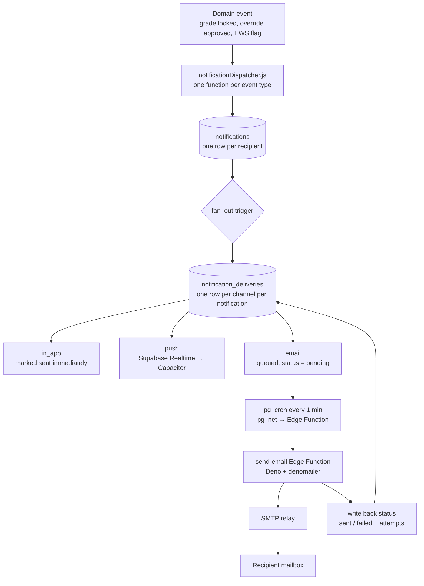

# ASPIRE — Notification Delivery Architecture (SMTP)

> **Status:** Proposed design. Supersedes the delivery-channel sections of `NOTIFICATION_SYSTEM_CATALOG.md`; the per-role notification *catalog* in that document still stands.
> **Scope:** How a notification is recorded, fanned out to channels, and delivered — including email over SMTP.
> **Date:** October 1, 2026

---

## 1. Why change the current approach

The current system works like this:

```
in-app action  →  INSERT into notifications  →  Supabase Realtime  →  Capacitor local notification
```

That is one path doing three jobs at once, and it has four problems that will not survive contact with real use:

| # | Problem | Consequence |
| :-- | :-- | :-- |
| 1 | **The row *is* the delivery.** There is no record of whether a channel actually delivered. | A failed send is invisible. Nobody can answer "did the parent get the email?" |
| 2 | **Local notifications only fire on a device that is awake, online, and running the app.** Supabase Realtime pushes to a connected client. | If the student's phone is asleep or the app is closed, the heads-up banner never appears. The row is in the inbox, but the alert was silently lost. |
| 3 | **No idempotency.** Nothing prevents the same event from inserting twice. | Unlock → relock a grade milestone re-notifies the whole roster. |
| 4 | **RLS is disabled on `notifications`.** The catalog records this as intentional ("for smooth client access"). | Any authenticated client can read every user's notifications, including messages naming students and their grade status. This is the most serious item on the list. |

Adding email on top of this shape would multiply the problems rather than fix them. The design below separates **the event**, **the notification record**, and **the delivery attempt** into three things, which is what makes email (and retries, and auditing, and "did it send?") possible at all.

---

## 2. Target architecture



Three rules hold this together:

1. **`notifications` is the source of truth for *what happened*.** It never records delivery state.
2. **`notification_deliveries` is the source of truth for *what was sent where*.** One row per channel, with its own status and retry count.
3. **Channels are independent.** Email failing does not affect the in-app inbox. Push failing does not affect email.

---

## 3. Schema changes

### 3.1 `notifications` — additions

The current columns are `notification_id`, `recipient_id`, `type`, `message`, `is_read`, `created_at`. Add:

```sql
ALTER TABLE notifications
  ADD COLUMN title        TEXT,
  ADD COLUMN link         TEXT,
  ADD COLUMN severity     TEXT NOT NULL DEFAULT 'info'
             CHECK (severity IN ('info', 'warning', 'critical')),
  ADD COLUMN payload      JSONB NOT NULL DEFAULT '{}'::jsonb,
  ADD COLUMN dedupe_key   TEXT,
  ADD COLUMN read_at      TIMESTAMPTZ;

-- One notification per logical event per recipient. Re-firing is a no-op.
CREATE UNIQUE INDEX notifications_dedupe
  ON notifications (dedupe_key)
  WHERE dedupe_key IS NOT NULL;

CREATE INDEX notifications_recipient_unread
  ON notifications (recipient_id, created_at DESC)
  WHERE is_read = false;
```

Why each one:

- **`title` and `link`** — the catalog already specifies a Banner Title and a Target Navigation for every notification type, but there is nowhere to store them. They are currently hardcoded in the UI by `type`, which means adding a type requires a UI change. Store them on the row.
- **`payload`** — structured data (`subject_code`, `term`, `student_id`, `remark`) so the UI and the email template can render their own wording. See §6 on why the pre-rendered `message` string is a liability on its own.
- **`dedupe_key`** — the fix for problem 3. Format: `<type>:<scope>:<recipient>`, e.g. `grade_posted:class_record_881:midterm:student_4412`. Insert with `ON CONFLICT (dedupe_key) DO NOTHING`.
- **`severity`** — drives whether a channel fires at all (see the routing matrix in §5).
- **`read_at`** — `is_read` alone cannot answer "how long before students saw this?", which is a reasonable thing to want in a defense demo.

### 3.2 Enable RLS

This is not optional and it is not coupled to the email work — do it first, independently.

```sql
ALTER TABLE notifications ENABLE ROW LEVEL SECURITY;

CREATE POLICY notifications_own_rows ON notifications
  FOR SELECT USING (recipient_id = auth.uid());

CREATE POLICY notifications_mark_read ON notifications
  FOR UPDATE USING (recipient_id = auth.uid())
  WITH CHECK (recipient_id = auth.uid());
```

Inserts come from `SECURITY DEFINER` functions or the service role, never from the client. If any client code currently inserts notifications directly, it moves into a dispatcher function as part of this change.

> **Note on Realtime:** with RLS on, Supabase Realtime only delivers rows the subscriber may read, which is the behaviour you want. Subscribe with a filter on `recipient_id=eq.<uid>` as well — the filter is for efficiency, the policy is for security. Do not rely on the filter alone.

### 3.3 `notification_deliveries` — new table

```sql
CREATE TYPE delivery_channel AS ENUM ('in_app', 'push', 'email', 'sms');
CREATE TYPE delivery_status  AS ENUM ('pending', 'sending', 'sent', 'failed', 'skipped');

CREATE TABLE notification_deliveries (
  delivery_id     UUID PRIMARY KEY DEFAULT gen_random_uuid(),
  notification_id UUID NOT NULL REFERENCES notifications(notification_id) ON DELETE CASCADE,
  channel         delivery_channel NOT NULL,
  status          delivery_status  NOT NULL DEFAULT 'pending',

  -- Resolved at queue time, not send time: if the address changes later,
  -- we still know where we actually sent it.
  destination     TEXT,
  template_key    TEXT,

  attempts        SMALLINT NOT NULL DEFAULT 0,
  last_error      TEXT,
  next_attempt_at TIMESTAMPTZ NOT NULL DEFAULT NOW(),
  sent_at         TIMESTAMPTZ,
  created_at      TIMESTAMPTZ NOT NULL DEFAULT NOW(),

  UNIQUE (notification_id, channel)
);

-- The worker's only query. Partial index keeps it cheap as the table grows.
CREATE INDEX deliveries_claimable
  ON notification_deliveries (next_attempt_at)
  WHERE status IN ('pending', 'failed');

ALTER TABLE notification_deliveries ENABLE ROW LEVEL SECURITY;
-- No client-facing policy. Service role only.
```

The `UNIQUE (notification_id, channel)` constraint is the second half of the idempotency story: even if fan-out runs twice, a recipient gets at most one email per notification.

### 3.4 `notification_preferences` — new table

Required before you send a single email. A system that can email people and cannot be told to stop is a system that will be told to stop by someone louder.

```sql
CREATE TABLE notification_preferences (
  profile_id   UUID NOT NULL REFERENCES profiles(id) ON DELETE CASCADE,
  type         TEXT NOT NULL,            -- notification type, or '*' for the default
  channel      delivery_channel NOT NULL,
  enabled      BOOLEAN NOT NULL DEFAULT true,
  PRIMARY KEY (profile_id, type, channel)
);
```

Resolution order: exact `(profile_id, type, channel)` → `(profile_id, '*', channel)` → the system default from the routing matrix in §5.

---

## 4. The SMTP path

### 4.1 Choosing a relay

Supabase's built-in SMTP setting only sends **auth** emails (confirmations, password resets). It cannot send application mail. You need your own relay.

| Option | Free tier | Verdict |
| :-- | :-- | :-- |
| **Brevo SMTP** | 300 emails/day, no card | **Recommended.** Real SMTP credentials, no domain required to start, survives past the defense. |
| Gmail SMTP + App Password | ~500/day, needs 2FA on the account | Works, and is the fastest to stand up. Risk: Google flags bulk patterns and may lock the account mid-demo. Acceptable as a fallback, not as the plan. |
| Resend / SendGrid SMTP | 100/day (Resend), 100/day (SendGrid) | Fine. Both prefer their HTTP API over SMTP, so you lose nothing by using SMTP but gain nothing either. |
| Institutional DYCI relay | — | **Ask.** If the school will give you a relay host and credentials, use it: mail from a `@dyci.edu.ph` address will not land in spam, which none of the above can promise. |
| **Mailpit / Mailtrap** (dev only) | — | Use for all local development so you never send real mail by accident. |

Whichever you pick, the code talks plain SMTP, so swapping relays is a config change.

### 4.2 Edge Function: `send-email`

Supabase Edge Functions run Deno. Use **`denomailer`** — it is the maintained Deno SMTP client. (Nodemailer is Node-oriented and not worth fighting here.)

`supabase/functions/send-email/index.ts`:

```ts
import { createClient } from "jsr:@supabase/supabase-js@2";
import { SMTPClient } from "https://deno.land/x/denomailer@1.6.0/mod.ts";
import { renderTemplate } from "./templates.ts";

const BATCH_SIZE  = 25;
const MAX_ATTEMPTS = 5;

const db = createClient(
  Deno.env.get("SUPABASE_URL")!,
  Deno.env.get("SUPABASE_SERVICE_ROLE_KEY")!,
);

Deno.serve(async (req) => {
  // Only pg_cron (via pg_net) and manual admin calls may invoke this.
  if (req.headers.get("x-worker-secret") !== Deno.env.get("WORKER_SECRET")) {
    return new Response("forbidden", { status: 403 });
  }

  // Claim a batch atomically so concurrent invocations never double-send.
  const { data: jobs, error } = await db.rpc("claim_email_deliveries", {
    batch_size: BATCH_SIZE,
  });
  if (error) return new Response(error.message, { status: 500 });
  if (!jobs?.length) return Response.json({ claimed: 0 });

  const smtp = new SMTPClient({
    connection: {
      hostname: Deno.env.get("SMTP_HOST")!,
      port: Number(Deno.env.get("SMTP_PORT") ?? 587),
      tls: false,          // STARTTLS on 587; set true only for implicit TLS on 465
      auth: {
        username: Deno.env.get("SMTP_USER")!,
        password: Deno.env.get("SMTP_PASS")!,
      },
    },
  });

  let sent = 0, failed = 0;

  for (const job of jobs) {
    try {
      const { subject, html, text } = renderTemplate(job.template_key, job.payload);

      await smtp.send({
        from: Deno.env.get("SMTP_FROM")!,   // "ASPIRE <noreply@dyci.edu.ph>"
        to: job.destination,
        subject,
        content: text,
        html,
      });

      await db.from("notification_deliveries")
        .update({ status: "sent", sent_at: new Date().toISOString(), last_error: null })
        .eq("delivery_id", job.delivery_id);
      sent++;

    } catch (e) {
      const attempts = job.attempts + 1;
      const giveUp   = attempts >= MAX_ATTEMPTS;
      // Exponential backoff: 1, 2, 4, 8, 16 minutes.
      const backoffMin = Math.pow(2, attempts - 1);

      await db.from("notification_deliveries").update({
        status: giveUp ? "failed" : "pending",
        attempts,
        last_error: String(e).slice(0, 500),
        next_attempt_at: new Date(Date.now() + backoffMin * 60_000).toISOString(),
      }).eq("delivery_id", job.delivery_id);
      failed++;
    }
  }

  await smtp.close();
  return Response.json({ claimed: jobs.length, sent, failed });
});
```

### 4.3 The claim function

Claiming must be atomic, or two overlapping cron runs send the same email twice. `FOR UPDATE SKIP LOCKED` is the standard way:

```sql
CREATE OR REPLACE FUNCTION claim_email_deliveries(batch_size INT DEFAULT 25)
RETURNS TABLE (
  delivery_id UUID, destination TEXT, template_key TEXT,
  payload JSONB, attempts SMALLINT
)
LANGUAGE sql SECURITY DEFINER AS $$
  WITH claimed AS (
    SELECT d.delivery_id
    FROM notification_deliveries d
    WHERE d.channel = 'email'
      AND d.status IN ('pending', 'failed')
      AND d.attempts < 5
      AND d.next_attempt_at <= NOW()
    ORDER BY d.next_attempt_at
    LIMIT batch_size
    FOR UPDATE SKIP LOCKED
  )
  UPDATE notification_deliveries d
     SET status = 'sending', attempts = d.attempts     -- attempts incremented by the worker
    FROM claimed c
   WHERE d.delivery_id = c.delivery_id
  RETURNING d.delivery_id, d.destination, d.template_key,
            (SELECT n.payload FROM notifications n
              WHERE n.notification_id = d.notification_id),
            d.attempts;
$$;
```

A delivery stuck in `sending` for more than 10 minutes means the worker died mid-batch. Add a sweeper:

```sql
SELECT cron.schedule('reap-stuck-emails', '*/10 * * * *', $$
  UPDATE notification_deliveries
     SET status = 'pending', next_attempt_at = NOW()
   WHERE status = 'sending'
     AND created_at < NOW() - INTERVAL '10 minutes';
$$);
```

### 4.4 Scheduling

Enable `pg_cron` and `pg_net`, then:

```sql
SELECT cron.schedule('drain-email-queue', '* * * * *', $$
  SELECT net.http_post(
    url     := 'https://<project-ref>.supabase.co/functions/v1/send-email',
    headers := jsonb_build_object(
                 'Content-Type',    'application/json',
                 'x-worker-secret', current_setting('app.worker_secret')
               ),
    body    := '{}'::jsonb
  );
$$);
```

**Why a cron drain and not a database webhook per insert.** A webhook fires once per row with no retry, no batching, and one SMTP connection per email. The cron drain batches 25 emails over one SMTP connection, retries with backoff, and leaves a queue you can inspect when something goes wrong. One minute of latency is irrelevant for grade notifications.

### 4.5 Secrets

```bash
supabase secrets set \
  SMTP_HOST=smtp-relay.brevo.com \
  SMTP_PORT=587 \
  SMTP_USER=... \
  SMTP_PASS=... \
  SMTP_FROM="ASPIRE Notifications <noreply@dyci.edu.ph>" \
  WORKER_SECRET=$(openssl rand -hex 32) \
  PORTAL_URL=https://aspire.dyci.edu.ph
```

None of these go in `.env` files committed to the repo, and none are prefixed `VITE_` — anything `VITE_` is compiled into the client bundle and readable by every user. An SMTP password in the frontend bundle is an open mail relay.

---

## 5. Routing: which channel fires for which notification

Fan-out is a trigger on `notifications` that writes delivery rows according to this matrix, filtered by the recipient's preferences.

| Type | In-app | Push | Email | Rationale |
| :-- | :--: | :--: | :--: | :-- |
| `grade_posted` | ✅ | ✅ | ✅ | The event Sir Michael asked to be surfaced. Email is what reaches a student who is not holding their phone. |
| `grade_changed` | ✅ | ✅ | ✅ | **Currently missing from the catalog.** See §7. |
| `ews_alert` | ✅ | ✅ | ❌ | Sensitive. Deliver inside the authenticated app, not to a mailbox. |
| `ai_recommendation` | ✅ | ❌ | ❌ | Not time-critical. |
| `eval_window_open` | ✅ | ✅ | ✅ | Deadline-driven; email raises completion rates. |
| `eval_deadline_reminder` | ✅ | ✅ | ✅ | Same. |
| `class_enrolled` | ✅ | ❌ | ❌ | Informational. |
| `override_approved` / `override_rejected` | ✅ | ✅ | ❌ | Faculty are in the app when this matters. |
| `grades_pending` (dean) | ✅ | ✅ | ✅ | Blocks a workflow; the dean may not be in the app. |
| `risk_threshold` | ✅ | ✅ | ❌ | Named-student content. Keep it in the app. |
| `compliance` (office) | ✅ | ❌ | ✅ | Operational, often actioned from a desk. |
| `security` (admin) | ✅ | ✅ | ✅ | Always email, regardless of preference. |

Two standing rules:

- **`severity = 'critical'` ignores preferences for the in-app channel.** A user may mute email; they may not mute the record.
- **Anything naming a student's risk status or failing status does not leave the authenticated app.** That rule is why `ews_alert` and `risk_threshold` have no email column checked.

---

## 6. Message content: what goes in the push, the email, and the row

This is the part most likely to be got wrong, and the mistake is invisible until someone is embarrassed by it.

A grade notification currently renders a full sentence into `message`, which is then shown as an Android heads-up banner **on the lock screen**. If that sentence says the student failed, it is readable by anyone holding the phone — a roommate, a sibling, whoever picks it up off a table.

**Three layers, three levels of detail:**

| Layer | Content | Example |
| :-- | :-- | :-- |
| **Push / lock screen** | Event only. Never the grade, the remark, or the risk status. | *"A new grade has been posted for IT401."* |
| **In-app inbox** | Full detail, behind authentication. | *"Your Midterm grade for Capstone Project 1 (IT401) has been posted. Remark: Passed."* |
| **Email** | Event + a link to the portal. No grade value in the body. | *"A new grade has been posted for Capstone Project 1 (IT401). Sign in to view it: <link>"* |

The reason email carries no grade value: mail sits in a mailbox indefinitely, is often synced to shared or family devices, and crosses servers you do not control. A link costs the recipient one click and removes the entire disclosure surface.

Implement this by rendering from `payload` per channel rather than storing one `message` string and reusing it everywhere:

```js
// src/lib/notificationTemplates.js
export const templates = {
  grade_posted: {
    push:  (p) => ({ title: 'New Grade Posted',
                     body: `A new grade has been posted for ${p.subject_code}.` }),
    inApp: (p) => ({ title: 'New Grade Posted',
                     body: `Your ${p.term} grade for ${p.subject_name} (${p.subject_code}) `
                         + `has been posted. Remark: ${p.remark}.` }),
    email: (p) => ({ subject: `[ASPIRE] New grade posted — ${p.subject_code}`,
                     body: `A new grade has been posted for ${p.subject_name} `
                         + `(${p.subject_code}), ${p.term} term.` }),
  },
};
```

Keep `message` populated with the in-app text for backward compatibility with the existing inbox pages, but treat `payload` as authoritative for anything new.

### On "you may need to shift courses"

Sir Michael's intent — that a failing student understands their standing — is served by the in-app message plus the existing advising flow. Do **not** generate an automated "you may need to shift to a different course" line. It is a judgment that belongs to a human adviser, it is wrong often enough to do damage, and an automated system delivering it to a student's phone is the worst possible venue for it. Surface the remark and a prompt to consult their adviser; let the adviser say the rest.

---

## 7. Fixing `grade_posted` (and adding `grade_changed`)

The current dispatcher pattern inserts one row per student in a loop. For a 45-student roster that is 45 round trips, fired from the client, with no transaction boundary and no dedupe.

```js
// src/lib/notificationDispatcher.js

/**
 * Called AFTER the grade-lock transaction commits.
 * Idempotent: safe to call again after an unlock → relock cycle.
 */
export async function notifyGradePosted({ classRecordId, term, students, subject }) {
  const rows = students.map((s) => ({
    recipient_id: s.student_id,
    type: 'grade_posted',
    severity: 'info',
    title: 'New Grade Posted',
    link: '/student/grades',
    message: `Your ${term} grade for ${subject.name} (${subject.code}) has been posted. `
           + `Remark: ${s.remark}.`,
    payload: {
      subject_code: subject.code,
      subject_name: subject.name,
      term,
      remark: s.remark,
      class_record_id: classRecordId,
    },
    dedupe_key: `grade_posted:${classRecordId}:${term}:${s.student_id}`,
  }));

  // One insert. Re-running is a no-op thanks to the unique dedupe index.
  const { error } = await supabase
    .from('notifications')
    .insert(rows, { onConflict: 'dedupe_key', ignoreDuplicates: true });

  if (error) throw error;
}
```

**`grade_changed` is a separate type and it is not optional.** The system has unlock and override flows, which means a posted grade can change after the student has already been told what it was. Without a change notification, the student holds a number that is quietly no longer true. Its dedupe key must include a revision counter so each correction notifies once:

```js
dedupe_key: `grade_changed:${classRecordId}:${term}:${studentId}:rev${revision}`
```

Add `grade_changed` to the catalog in `NOTIFICATION_SYSTEM_CATALOG.md` under the Student Portal table.

---

## 8. Guardian notifications

The guardian table proposed in the Reports analysis is a reasonable shape, but it is missing the fields that make sending to it lawful. ASPIRE's students are predominantly adults; sending their academic records to a third party is a disclosure under RA 10173 (Data Privacy Act) and needs a recorded basis, not just an email column.

```sql
CREATE TABLE guardians (
  guardian_id        UUID PRIMARY KEY DEFAULT gen_random_uuid(),
  student_id         UUID NOT NULL REFERENCES profiles(id) ON DELETE CASCADE,
  full_name          TEXT NOT NULL,
  relationship       TEXT,
  email              TEXT,
  phone              TEXT,
  is_primary         BOOLEAN NOT NULL DEFAULT false,

  -- Without these three, do not send.
  consent_granted_at TIMESTAMPTZ,
  consent_source     TEXT,          -- 'enrollment_form' | 'student_portal' | 'registrar'
  email_verified_at  TIMESTAMPTZ,

  created_at         TIMESTAMPTZ NOT NULL DEFAULT NOW()
);

CREATE UNIQUE INDEX guardians_one_primary
  ON guardians (student_id) WHERE is_primary;
```

Fan-out resolves guardian recipients only where `consent_granted_at IS NOT NULL AND email_verified_at IS NOT NULL`. Everything else is skipped with `status = 'skipped'` and a reason, so the gap is visible rather than silent.

**Guardians have no portal account**, so the "link to the portal" rule in §6 does not work for them as written. Two options:

1. **Signed, expiring view link** *(recommended)* — a tokenized URL to a read-only grade summary page, valid 7 days, single student, no login. Keeps grades out of the mailbox and out of permanent storage on a device you do not control.
2. **Summary in the email body** — simpler, but puts the student's grades in a third party's inbox permanently. Only acceptable with explicit, recorded consent naming this specific disclosure.

Option 1 is more work and is the right call. Scaffold the table now; ship guardian sending after the consent capture flow exists.

---

## 9. Build order

| Step | Task | Blocks | Effort |
| :-- | :-- | :-- | :-- |
| 1 | **Enable RLS on `notifications`** + move all client-side inserts into dispatcher functions | Everything | S |
| 2 | Add columns from §3.1 + the dedupe unique index | 3, 6 | S |
| 3 | Create `notification_deliveries` + `notification_preferences` + fan-out trigger | 5 | M |
| 4 | Stand up Mailpit locally; confirm `denomailer` connects | 5 | S |
| 5 | `send-email` Edge Function + `claim_email_deliveries` + pg_cron drain + reaper | 7 | M |
| 6 | Rewrite `notifyGradePosted` as bulk + dedupe; add `grade_changed` | — | S |
| 7 | Per-channel templates (§6); shorten push text to remove grade detail from lock screen | — | M |
| 8 | Preferences UI in Settings (per-type email toggles) + unsubscribe link in every email footer | — | M |
| 9 | Swap Mailpit → Brevo (or DYCI relay); send a live test to a real inbox | — | S |
| 10 | `guardians` table + consent capture; signed view links; guardian fan-out | — | L |

Steps 1 and 6 are worth doing on their own even if email is deferred — they fix a data exposure and a duplicate-notification bug respectively, and neither depends on SMTP.

---

## 10. Operational notes

- **A delivery dashboard beats a log file.** `/admin/notifications` should show counts by status for the last 24 hours and let an admin requeue a failed delivery (set `status = 'pending'`, `attempts = 0`). This is also the single best thing to have open during a defense when someone asks "how do you know it sent?"
- **Rate limits are real.** Brevo's free tier is 300/day. A term rollover reminder to 400 faculty exceeds it in one shot. The queue absorbs this naturally — cap the batch, let it drain over hours — but a broadcast to every student would not. Add a daily send counter before building any broadcast feature.
- **Deliverability.** Mail from a generic relay without SPF/DKIM on the sending domain lands in spam. If DYCI provides the relay this is handled; if not, you need DNS records on whatever domain `SMTP_FROM` uses. Test against Gmail, Outlook, and Yahoo before relying on it.
- **Every email needs an unsubscribe path.** A footer link that writes to `notification_preferences`. Transactional academic mail is defensible without it; sending without one anyway is cheap insurance.
- **Retention.** Delivery rows grow without bound. A monthly job deleting `sent` rows older than 90 days keeps the partial index small. Keep `failed` rows longer — they are the audit trail.

---

## 11. What this changes in existing docs

| Document | Change |
| :-- | :-- |
| `NOTIFICATION_SYSTEM_CATALOG.md` | §1 row for the `notifications` table: RLS is now **enabled**. §3 Native Popup Architecture is now one channel of three, not the whole delivery story. Add `grade_changed` to the Student Portal catalog. |
| `ASPIRE_DATABASE_SCHEMA.md` | Three new tables (`notification_deliveries`, `notification_preferences`, `guardians`), new columns on `notifications`. |
| `src/lib/notificationDispatcher.js` | Add `notifyGradePosted`, `notifyGradeChanged`. Existing dispatchers gain `dedupe_key`, `payload`, `title`, `link`. |
| `TASKS.md` | Steps 1–9 from §9. Step 10 is a separate epic. |
