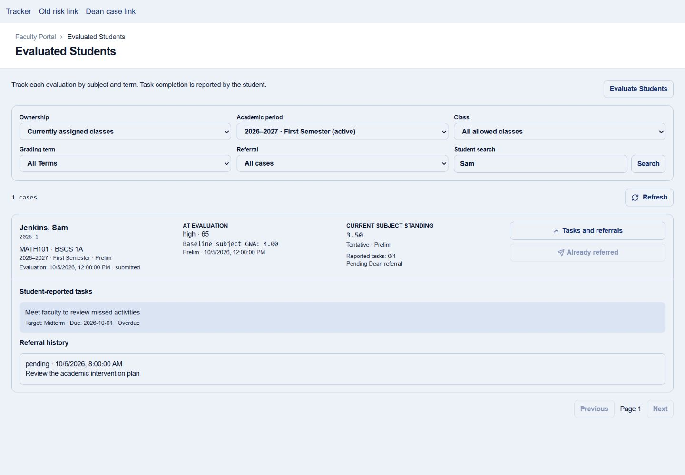
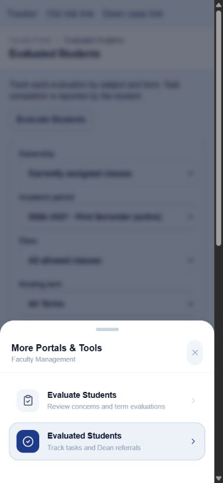

# Faculty Tracker and Ghost Student Implementation Report

Completed locally: October 6, 2026 (Asia/Manila)  
Branch: `aspire-system-updates`  
Starting revision: `67f4e0b06721164ff70f3ee912780701f24189fb`  
Status: Application implementation and isolated validation complete. User reports completing the deployment/setup instructions; remote deployment state and live workflow remain independently unverified. Changes are uncommitted.

## Delivered behavior

### Ghost student detection and score handling

- Removed the requirement for another positive activity score before missing-work zeros count.
- Explicit zeros now contribute to missing-work risk for both configured legacy activity slots and dynamic activities. Dynamic activity terms replace their legacy slots to avoid duplicate counting.
- Blank/null granular scores remain ungraded instead of being converted to zero. Disabled activities remain excluded.
- Explicit zero exams are included in the displayed exam average; blank exams and disabled exam configurations are excluded. Exams/character remain separate from activity missing-submission counts.
- The evaluation modal uses the roster's complete risk analysis, preserving its missing-work and class/semester context.
- Institutional grading weights and risk thresholds were not changed. The source plan's statement about failure below 3.00 was incorrect: on this GWA scale, failure is above 3.00.

### Faculty workflow

- Added Evaluated Students at `/faculty/evaluatedstudents`, with one case per evaluation/class/term rather than merged student histories.
- Added current-assignment and authored-history scopes, active academic-period default, class/term/referral filters, student search, stable server pagination (20 cases), and explicit loading/error/empty states.
- Tracker table reads omit private-note text and restricted referral/review text. Authorized referral details load separately when a case expands.
- Batched current standing reads by displayed class, with evaluated baseline and current subject standing presented separately. Missing values show Pending; standings identify Tentative/Posted and milestones.
- Tasks show student-reported completion, timestamps, due dates, and progress. Only pending tasks with valid past dates become Overdue, using Asia/Manila date boundaries. Empty or undated plans do not establish noncompliance.
- Referral forms require a reason, preserve it and the request identity across retries, disable duplicate submissions, and support keyboard dismissal/focus management.
- Evaluate Students now requires explicit grading-term selection and reads coverage by class/student/term. Needs evaluation surfaces unevaluated Moderate-or-worse concerns while preserving the full roster and low-risk evaluation access.
- Existing evaluations load guidance, tasks, and authorized notes before editing, instead of opening an empty replacement plan.
- The old faculty At-Risk route redirects to Needs evaluation with class/term query context retained. Sidebar and mobile More navigation expose both evaluation pages.

### Referral persistence, privacy, and Dean workflow

- Added `student_evaluation_referrals` and a private accepted-request ledger, with RLS, RPC-only writes, one pending event per evaluation, and unique actor/request identities.
- Added `refer_student_evaluation_to_dean(UUID, TEXT, UUID)`. It authenticates active assigned faculty, requires an active class and published evaluation, validates a 1–2000-character reason, and locks the case.
- Responsible Deans derive from the evaluation class section's department, including cross-department students. No active Dean causes an actionable failure with no new referral or notification.
- Referral and privacy-safe in-app notifications persist in one transaction. Notification dedupe keys are scoped to event/recipient. General faculty notification authorization stays restrictive.
- Every accepted retry is recorded, including requests that return an already-pending event. Retrying one of those identities after resolution does not reopen the case; a deliberate later referral requires a new identity.
- Legacy true flags become pending events with explicitly unknown metadata and no backfill notifications.
- Creation-time referrals use the same server function inside evaluation submission. Failed referral/notification persistence rolls back that submission.
- Ordinary evaluation saves preserve pending referrals, acknowledgment, and current student completion for retained task identities. Faculty cannot fabricate student completion or acknowledgment through submission.
- Dean review records restricted review/resolution notes and server actor/time, clears the pending event and flag atomically, and leaves student acknowledgment unchanged.
- Dean queues are scoped by evaluation class department rather than the student's home section. Notification links select the exact authorized pending case. Entry/focus/manual refresh and notification subscriptions refresh queue state.
- Removed faculty-self Dean referral notifications. Dean notices do not copy restricted review notes into student-readable messages.
- Added privacy-safe Dean referral email rendering and transactional queue entries, respecting Dean email preferences. Delivery is asynchronous through the existing worker; actual SMTP delivery was not exercised.

## Changed files

| File | Purpose |
| --- | --- |
| `src/lib/evaluationTracking.js` | Shared score, missing-work, task-date, term-coverage, and eligibility helpers |
| `src/lib/classRoomService.js` | Zero detection, blank preservation, standing labels, and surfaced read failures |
| `src/lib/evaluationService.js` | Scoped case/detail/referral reads and mutation calls |
| `src/pages/faculty/EvaluatedStudents.jsx` | Tracker, filters, task expansion, and referral form |
| `src/pages/faculty/StudentRisk.jsx` | Term-aware evaluation roster and triage |
| `src/pages/faculty/StudentRiskEvaluationModal.jsx` | Existing-plan loading, complete risk context, transactional referral inputs |
| `src/pages/dean/AtRiskStudents.jsx` | Department case queue, deep links, refresh, restricted review, independent resolution |
| `src/App.jsx` | Tracker route and compatible legacy redirect |
| `src/components/layout/Sidebar.jsx` | Faculty evaluation navigation |
| `src/components/layout/BottomNav.jsx` | Mobile evaluation access |
| `supabase/migrations/20261006120000_faculty_evaluation_referrals.sql` | Referral schema/RLS/RPCs and submission/review replacements |
| `supabase/functions/send-email/index.ts` | Privacy-safe Dean referral email template |
| `scripts/verifyEvaluationTracking.js` | Actual roster integration, helper, and email syntax/privacy checks |
| `scripts/verifyEvaluationReferrals.js` | Isolated PostgreSQL migration/access/lifecycle/rollback checks |

The pre-existing audit/report/plan changes in the working tree were preserved.

## Validation performed

| Check | Result and evidence |
| --- | --- |
| `npm run lint` (JSON formatter for compact review) | Passed: 0 errors, 71 existing warnings, matching the initial warning count. Final changed tracker/service/Dean files also passed a targeted ESLint check without warnings. |
| `npm run build` | Passed after using approved Windows process permissions. Existing large-bundle warning remains; final main bundle is about 4.58 MB before gzip. |
| `npm run verify:grading` | Passed: 5 grading presets, policy scale, attendance, honors, risk boundaries, milestones, and summer isolation. |
| `node scripts/verifyEvaluationTracking.js` | Passed: zeros/blanks, disabled/dynamic activities, actual roster integration, blank current standing, zero exam average, read failure propagation, risk contribution, Manila date boundaries, term coverage, eligibility, and referral email syntax/privacy. Node emits its experimental type-stripping API warning. |
| `node scripts/verifyEvaluationReferrals.js` | Passed: 42 validation groups against isolated PostgreSQL/PGlite with synthetic prerequisites and actual privacy/grant/referral migrations. Covered denied direct writes, faculty/student/Dean/admin boundaries, legacy backfill, department recipient routing, email opt-out, repeat requests, retries after resolution, re-referral, reassignment/inactive classes, task/status preservation, transactional creation, and notification failure rollback. |
| `git diff --check` | Passed; Git reported line-ending normalization notices only. |
| Browser workflow checks | Passed against actual React pages with synthetic services: keyboard case expansion; task labels; pagination from 20 to 5 cases; search; reason retained on failed referral and successful retry; pending-action disablement; mobile More links; old-route class/term redirect; differing Prelim/Midterm coverage; existing-plan hydration; Dean deep-link selection and resolution; restricted detail loading on expansion; Escape dismissal and focus return. |

Browser layout checks used desktop 1440×1000 and mobile 390×844 viewports. The isolated harness ran on port 5176 because an existing app already occupied 5175. The application's configured strict port remains 5175. Browser tabs and the temporary preview process were closed after verification.

The isolated database check uses an optional dependency installed under ignored `scratch/referral-validation`; application package files were not changed. To reproduce it, install `@electric-sql/pglite` in that prefix as documented at the top of the validation script. No test framework or typecheck was introduced; `npm test` and `tsc` were not run.

### Browser evidence (synthetic data)

## Deployment status and verification limits

The [implementation plan](../../archive/completed-plans/FACULTY_TRACKER_AND_GHOST_STUDENT_IMPLEMENTATION_PLAN.md) now separates completed local validation from remaining staging/live checks. The previous combined checklist bullets were left unchecked because each included unverified requirements; that presentation obscured the checks already performed. Local implementation completion does not mean rollout validation is complete.

- At the end of local implementation, the new migration had not been applied by the agent. The user subsequently reported completing the deployment/setup instructions. Exact applied migration history, production RLS/grants, and live PostgREST relationship queries remain independently unverified.
- At the end of local implementation, the updated `send-email` function had not been deployed by the agent. The user's subsequent completion report has not been independently confirmed against function deployment metadata. TypeScript syntax and privacy-safe rendering were checked locally; Deno runtime and real SMTP/provider delivery remain unverified.
- Follow-up read-only checks (`supabase migration list` and `supabase functions list --project-ref ettnwknyhdhehoclrwwh`) could not reach the Management API. Sandbox attempts encountered a refused proxy connection; approved external attempts failed DNS lookup for `api.supabase.com`. These failures do not establish a problem with the user's deployment, and no remote changes were attempted.
- `supabase status` could not inspect a local Supabase stack because the Docker Desktop Linux engine was unavailable. PGlite checks replace that local check, not a full Supabase deployment test.
- PGlite uses a single database connection. Repeated requests and constraints were exercised; genuine multi-session transaction interleavings still require a PostgreSQL/Supabase staging check.
- Browser service mocks validate interface behavior but do not prove live RLS, PostgREST search/join behavior, notification realtime publication, account-switch races, or slow-request interleavings. Those remain staging checks.
- No live academic records were changed, and no real referral emails or notifications were sent during validation.

## Rollout and remaining work

1. Review applied migration history and confirm the prerequisites, table relationships, and existing notification INSERT/delivery triggers in the target environment.
2. Deploy the updated email worker before enabling referral email queue entries, so it recognizes `dean_referral` instead of using the grade template.
3. Apply the reviewed referral migration through the normal database deployment process, then deploy the application changes together with compatible RPC contracts.
4. Run live/staging checks for role boundaries, concurrent requests, creation-time/no-Dean failures, retained task completion, legacy cases, Dean links/refresh, student privacy, and external retry/delivery.
5. Verify live pagination/search, archived/reassigned history reads, rapid filters/account changes, and mobile access on the normal app at port 5175.

Instructor verification, evidence uploads, reminders, and intervention-success analytics remain deferred as specified in the source plan.

## Rollback notes

### Follow-up: Dean notification navigation

Fixed the Dean notifications page dropping stored notification links. Referral cards now open the linked discussion-queue case, expose a keyboard-accessible Open evaluation button, and appear under Evaluations. A payload evaluation ID supplies the destination when the link is absent. Updated the cache version so old cached mappings cannot hide the destination. Read-marking failures do not block navigation. Targeted ESLint and the production build passed; live notification-to-case navigation remains to be verified with a real Dean account. No additional SQL migration or Edge Function deployment is required for this frontend fix.

### Follow-up: visible Dean actions

Replaced the administrative-action dropdown with four visible native radio choices. Each explains whether the referral remains pending; Resolve referral explicitly closes the pending referral and requires a resolution note. The submit button now reads Resolve referral or Save Dean directive to match the selected action. Existing RPC behavior is unchanged. Targeted ESLint and the production build passed; the updated layout has not yet been visually verified in the live portal.

### Follow-up: Evaluate Students redesign

Redesigned the faculty roster using Class Records, Enrollment Requests, and Consultation Requests as layout references: white bordered cards, compact section headers, class/term context, three summary counts, visible Full roster/Needs evaluation controls, student search, a denser table with identity initials and separate risk/standing metadata, and distinct primary/secondary evaluation actions. All new colors use sage tokens. Missing-term actions now have visibly disabled styling and explanatory text. Evaluation persistence and referral behavior are unchanged.

Targeted ESLint and production build passed (existing bundle-size warning). Browser checks used the actual component with synthetic data in the isolated preview on port 5176: no-term disabled actions, Midterm needs count, Prelim existing evaluation count/review actions, name search, desktop 1440×1000, and mobile 390×844. The existing live server on 5175 was left running. Evidence: `evidence/faculty-tracker/evaluate-roster-redesign-desktop.png` and `evidence/faculty-tracker/evaluate-roster-redesign-mobile.png`. No SQL migration or Edge Function deployment is required.

Preserve referral events, accepted request identities, and notification/delivery history. If rollout fails, disable the new referral actions and restore a compatible read-only workflow while investigating. Do not delete the audit tables or blindly restore old submission/review functions: those versions can clear pending referrals or fabricate acknowledgment. Coordinate application/RPC and email-worker compatibility when reverting.
