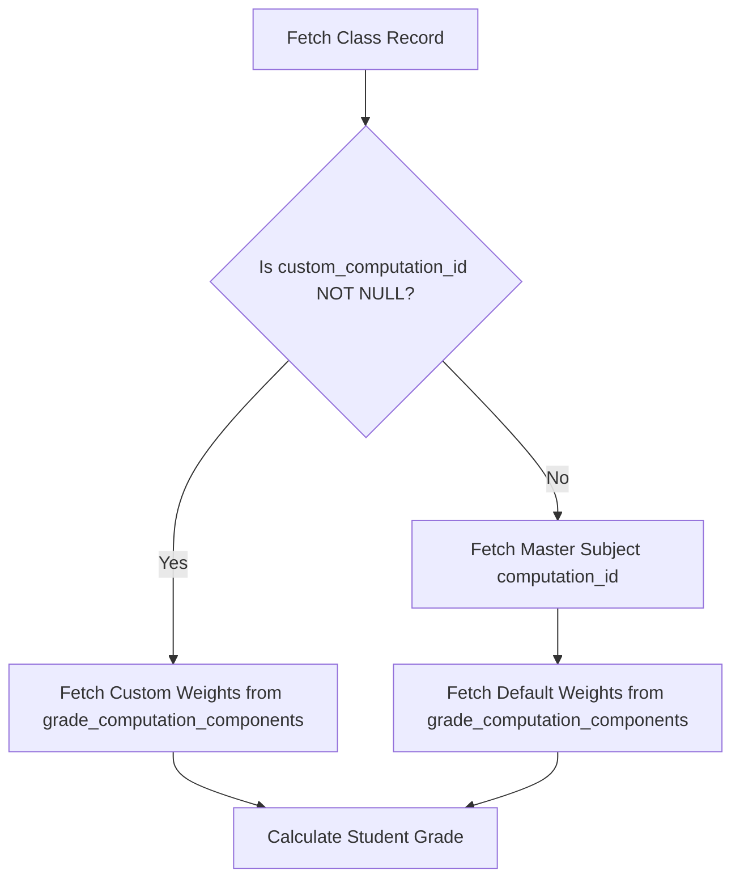

# Technical Specification: Faculty Grade Weight Customization

## 1. Overview & Objective

This specification details the architectural design and database modifications required to allow faculty members to customize the grade weights of their assigned classroom sections without affecting master subject templates or other faculty records.

### Key Principles
1. **Master Subject Safety**: Master subjects retain their default `computation_id` configured by Administrators/Deans.
2. **Classroom Instance Isolation**: Faculty customizations apply strictly to their assigned `class_records` instance.
3. **Fallback Resolution**: If no custom weights are set, the system seamlessly defaults to the master subject formula.
4. **Weight Locking & Governance**: Grade weights automatically lock once student assessment data is recorded, with an optional Dean override workflow.
5. **Revertibility**: Faculty can reset their custom weights back to department defaults at any time prior to locking.

---

## 2. Database Schema Migration

### 2.1 Alter `class_records` Table
Add nullable foreign key and state tracking columns to `public.class_records`:

```sql
-- Migration: Add custom computation override and lock status to class_records
BEGIN;

ALTER TABLE public.class_records
ADD COLUMN IF NOT EXISTS custom_computation_id UUID REFERENCES public.grade_computations(computation_id) ON DELETE SET NULL,
ADD COLUMN IF NOT EXISTS is_weight_locked BOOLEAN DEFAULT FALSE,
ADD COLUMN IF NOT EXISTS weights_locked_at TIMESTAMP WITH TIME ZONE;

-- Add index for fast resolution
CREATE INDEX IF NOT EXISTS idx_class_records_custom_comp 
ON public.class_records(custom_computation_id);

COMMIT;
```

---

## 3. Data Flow & Resolution Logic

### 3.1 Grade Computation Fallback Hierarchy
When rendering student gradebooks or calculating final grades, the application resolves effective grade weights using the following hierarchy:

$$\text{Effective Computation ID} = \text{class\_records.custom\_computation\_id} \mathbin{\mathtt{??}} \text{subjects.computation\_id}$$



---

## 4. Weight Customization Workflow

### 4.1 Faculty Modifies Weights
When a faculty member navigates to **Grade Components Setup** and updates the weights for an assigned class:

1. **New Formula Creation**: ASPIRE inserts a new row into `public.grade_computations`:
   ```sql
   INSERT INTO public.grade_computations (name, description)
   VALUES ('Custom Formula - [Subject Code] ([Section])', 'Faculty custom grade weight split')
   RETURNING computation_id;
   ```
2. **Component Population**: ASPIRE inserts the updated weight breakdown into `public.grade_computation_components`.
3. **Class Record Binding**: ASPIRE updates the target class record:
   ```sql
   UPDATE public.class_records
   SET custom_computation_id = :new_computation_id
   WHERE class_record_id = :target_class_record_id;
   ```

---

## 5. Weight Locking, Unlocking & Reverting

### 5.1 Automatic Lock Trigger
Weights are locked automatically when faculty creates an assessment or inputs scores.

* **Trigger Query (on first activity creation or score entry)**:
  ```sql
  UPDATE public.class_records
  SET is_weight_locked = TRUE,
      weights_locked_at = NOW()
  WHERE class_record_id = :class_record_id 
    AND is_weight_locked = FALSE;
  ```

### 5.2 UI Behavior when Locked
* Input fields on `GradeComponentsSetup.jsx` become read-only.
* A banner notifies the faculty: *"Grade weights are locked because student scores have already been recorded. Contact your Dean if a formula change is required."*

### 5.3 Dean Unlock Override Workflow
* In the Dean Portal (`GradePostingStatus.jsx` / `ClassroomDetails`), Deans can toggle **Unlock Weights**.
* **Database Action**:
  ```sql
  UPDATE public.class_records
  SET is_weight_locked = FALSE
  WHERE class_record_id = :class_record_id;
  ```

### 5.4 Reverting to Department Default Weights
If a faculty member wants to discard their custom weights and revert back to the master subject formula:
* Faculty clicks **"Reset to Department Defaults"** in `GradeComponentsSetup.jsx`.
* **Database Action**:
  ```sql
  UPDATE public.class_records
  SET custom_computation_id = NULL
  WHERE class_record_id = :class_record_id;
  ```
* **Result**: The `custom_computation_id` becomes `NULL`, snapping the classroom section back to using `subjects.computation_id`.

---

## 6. Impacted Application Components

| File / Component | Purpose / Change Required |
| :--- | :--- |
| `src/pages/faculty/GradeComponentsSetup.jsx` | Update UI to support saving custom formulas to `custom_computation_id`, respect `is_weight_locked`, and provide a *"Reset to Department Defaults"* button. |
| `src/pages/faculty/ScoreInput.jsx` | Update query to fetch `custom_computation_id ?? subjects.computation_id`. Trigger weight locking on score submission. |
| `src/pages/student/MyGradesDetail.jsx` | Update query to resolve effective computation ID so students see accurate section-specific weight breakdowns. |
| `src/pages/dean/GradePostingStatus.jsx` | Add "Unlock Weights" action for Deans to manage weight modification requests. |

---

## 7. Step-by-Step Implementation Roadmap

1. **Database Migration**: Run the SQL migration adding `custom_computation_id` and `is_weight_locked` to `class_records`.
2. **Service Layer Updates**: Update `classRoomService.js` / Supabase fetch helpers to include `custom_computation_id` in joins.
3. **Faculty Customization UI**: Connect `GradeComponentsSetup.jsx` to create/bind custom formulas and provide reset functionality.
4. **Lock Enforcement**: Implement lock check logic in score input and activity creation workflows.
5. **Dean Unlock Feature**: Add Dean override button to administrative class details.
