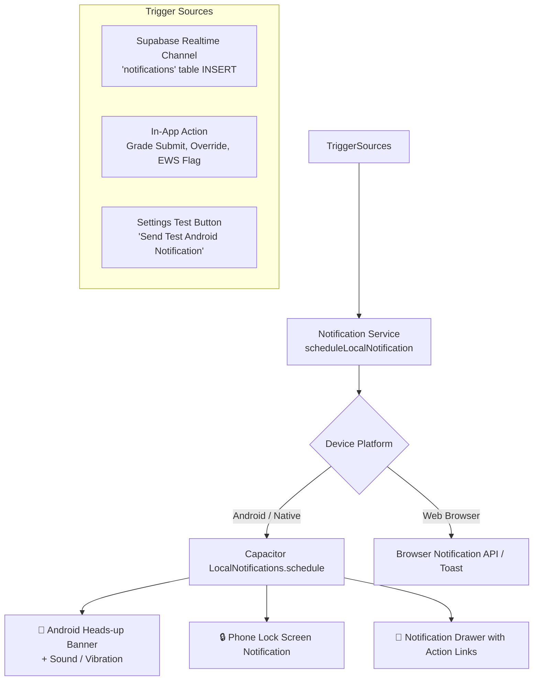

# SAGE — Comprehensive Notification System Catalog

This document details the current state of notifications in the SAGE codebase, the complete catalog of notifications for all 5 user roles, trigger mechanisms, and the native pop-up integration architecture.

---

## 1. Codebase Current State & Audit

| Component / Layer | Current Status | Details |
| :--- | :---: | :--- |
| **Database Table (`notifications`)** | ✅ **Active** | Table exists with columns: `notification_id`, `recipient_id`, `type`, `message`, `is_read`, `created_at`. RLS disabled for smooth client access. |
| **Seed Data** | ✅ **Active** | `supabase/migrations/20260607180000_seed_notifications.sql` contains pre-populated mock notifications for Admin, Dean, Faculty, and Students. |
| **Portal Pages** | ✅ **Active** | Dedicated notification views exist at:   • `/student/notifications`  • `/faculty/notifications`  • `/dean/notifications`  • `/office/notifications`  • `/admin/notifications` |
| **Navigation Bar (Topbar)** | ⚠️ **Static Badge** | Bell icon exists with static unread indicator dot; links directly to role notification inbox. |
| **Native Device Popups (Android)** | 🔄 **In Progress** | Push notifications package crashed without Firebase. Transitioning to **`@capacitor/local-notifications`** to provide offline native heads-up popups and lockscreen alerts. |

---

## 2. Notification Catalog by User Role

### 🎓 1. Student Portal (`student`)
Students receive alerts regarding academic milestones, grading releases, evaluations, and Early Warning System (EWS) interventions.

| Notification Type (`type`) | Banner Title | Sample Message | Trigger Event | Target Navigation |
| :--- | :--- | :--- | :--- | :--- |
| `grade_posted` | **New Grade Posted** | *"Your final grades for Capstone Project 1 (IT401) have been officially posted."* | Faculty posts or updates term/final grades in Grade Sheet | `/student/grades` |
| `class_enrolled` | **Class Registration Success** | *"You have been successfully registered into Introduction to Computing (ITC113 - BSIT-1A)."* | Subject assignment / student roster enrollment by Office/Admin | `/student/academic-insights` |
| `eval_window_open` | **Faculty Evaluation Open** | *"Faculty evaluation period is now open. Please complete surveys for your instructors."* | Office publishes active evaluation window | `/student/faculty-evaluation` |
| `eval_deadline_reminder`| **Evaluation Deadline Reminder** | *"Survey reminder: 3 days left to submit evaluations for your instructors."* | System automated schedule before evaluation window closes | `/student/faculty-evaluation` |
| `ews_alert` | **Early Warning System Alert** | *"Early Warning System: You have been flagged as at-risk due to low exam scores."* | AI/Diagnostic engine detects low class standing or exam risk | `/student/academic-insights` |
| `ai_recommendation` | **AI Counseling Ready** | *"AI Counseling: Your customized academic counseling verdict is ready for review."* | Student Advisor AI generates new intervention strategies | `/student/academic-insights` |

---

### 👨‍🏫 2. Faculty Portal (`faculty`)
Faculty members receive notifications regarding teaching loads, grade submission deadlines, approval statuses, and class-level at-risk alerts.

| Notification Type (`type`) | Banner Title | Sample Message | Trigger Event | Target Navigation |
| :--- | :--- | :--- | :--- | :--- |
| `class_assigned` | **New Class Assigned** | *"You have been assigned to instruct Capstone Project 1 (IT401 - BSIT-4A) for this term."* | Dean or Office creates subject teaching assignment | `/faculty/classes` |
| `term_rollover_reminder`| **Grade Submission Reminder** | *"Urgent: Please submit all outstanding student grade sheets before the term rollover deadline."* | Registrar sets term deadline / reminder broadcast | `/faculty/class-records` |
| `override_approved` | **Grade Override Approved** | *"Your grade override request for student Sophia Bernardo has been approved by the Dean's Office."* | Dean approves pending grade change request | `/faculty/class-records` |
| `override_rejected` | **Grade Override Rejected** | *"Your override request for student Ava Corpuz has been rejected by the Dean's Office."* | Dean rejects pending grade change request | `/faculty/class-records` |
| `eval_window_open` | **Evaluation Window Open** | *"Evaluation window open: Please encourage your students to complete the faculty evaluation survey."* | Office starts student evaluation window | `/faculty/evaluations` |
| `risk_threshold` | **At-Risk Student Flagged** | *"EWS alert: Student Carl Abalos in your section BSIT-1A has been flagged as at-risk."* | EWS diagnostic detects student falling below passing threshold | `/faculty/at-risk-monitoring` |

---

### 🏛️ 3. College Dean Portal (`dean`)
Deans receive high-level governance alerts, approval requests, evaluation summaries, and college-wide risk metrics.

| Notification Type (`type`) | Banner Title | Sample Message | Trigger Event | Target Navigation |
| :--- | :--- | :--- | :--- | :--- |
| `grades_pending` | **Grade Sheet Pending Approval** | *"Prof. Amanda Rivera submitted final grade sheets for IT401 (Capstone Project 1) for your approval."* | Faculty locks and submits completed grade sheet | `/dean/grade-approvals` |
| `override_request` | **Grade Override Pending** | *"Professor Danilo Santos requested grade record correction for student Sophia Bernardo."* | Faculty submits override request for unlocked/locked grade | `/dean/grade-overrides` |
| `eval_compiled` | **Evaluation Reports Compiled** | *"Student evaluation window closed. Consolidated faculty evaluation feedback is now compiled."* | Office closes evaluation window and compiles scores | `/dean/faculty-evaluations` |
| `risk_threshold` | **College Risk Threshold Alert** | *"At-risk warning: 12% of students in the College of Computer Studies are currently flagged on risk thresholds."* | Analytics engine calculates college-wide risk quota | `/dean/at-risk-dashboard` |

---

### 🏢 4. College Office / Registrar Portal (`office`)
Office staff receive operational alerts regarding compliance, roster uploads, evaluation cycles, and workload distributions.

| Notification Type (`type`) | Banner Title | Sample Message | Trigger Event | Target Navigation |
| :--- | :--- | :--- | :--- | :--- |
| `compliance` | **Grading Compliance Alert** | *"Non-compliant grade submission detected for 3 faculty members."* | Audit job checks for unsubmitted grades past term deadline | `/office/compliance` |
| `roster_import` | **Student Roster Processed** | *"Database auto-sync success: 12 class records successfully synchronized with registrar backend."* | Excel roster batch import completes | `/office/student-roster` |
| `eval_window` | **Evaluation Window Status** | *"Faculty evaluation window published for 1st Semester A.Y. 2025-2026."* | Staff modifies or schedules evaluation window | `/office/evaluation-management` |
| `assignment` | **Subject Assignment Update** | *"Faculty load assignments updated for College of Computer Studies."* | Section instructor mapping modified | `/office/subject-assignments` |

---

### 🛡️ 5. System Administrator Portal (`admin`)
Administrators receive system health, audit log triggers, database sync results, and user creation alerts.

| Notification Type (`type`) | Banner Title | Sample Message | Trigger Event | Target Navigation |
| :--- | :--- | :--- | :--- | :--- |
| `security` | **Audit Log Security Alert** | *"Critical administrative audit log: Manual database override detected on users table."* | Audit log records critical override / security action | `/admin/audit-logs` |
| `database_sync` | **Database Sync Successful** | *"Database auto-sync success: Registry synchronized."* | Background synchronization completes | `/admin/database-sync` |
| `user_signup` | **New User Registered** | *"New user registration: Faculty profile created for Prof. Maria Clara Ramos."* | Admin creates new faculty/student account | `/admin/users` |
| `system` | **System Maintenance Notice** | *"System notice: SAGE Platform Registry core updated to version 2.4.1."* | Platform version update or maintenance window | `/admin/settings` |

---

## 3. Native Android Popup Architecture

Using `@capacitor/local-notifications`, SAGE delivers native Android heads-up banners and lock-screen popups without external dependencies:

### Key Technical Capabilities:
1. **Zero External Server Dependency:** No Google Firebase project, billing, or `google-services.json` required.
2. **Real-Time Delivery:** Supabase Realtime listens for new database notifications and triggers the native Android notification immediately.
3. **Lock Screen Visibility:** Android displays notifications on the device lock screen according to user privacy settings.
4. **On-Demand Testing:** A dedicated test button in Settings allows quick verification on physical devices during capstone defense demonstrations.
