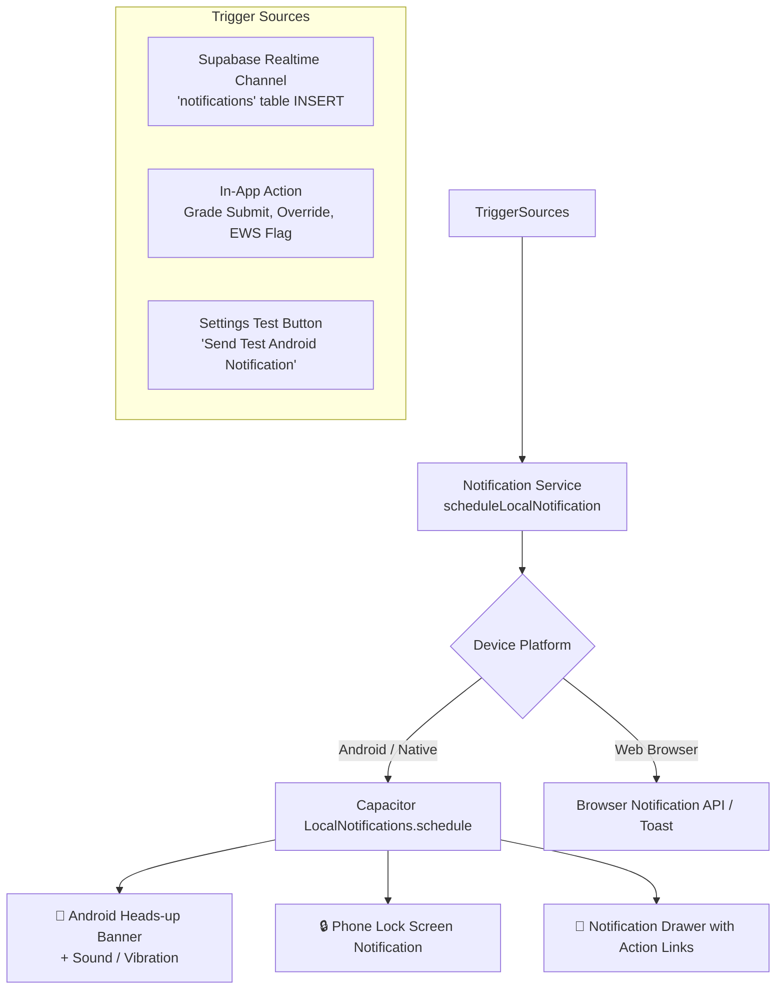

# ASPIRE — Comprehensive Notification System Catalog

This document details the current state of notifications in the ASPIRE codebase, the complete catalog of notifications for all 5 user roles, trigger mechanisms, and the native pop-up integration architecture.

---

## 1. Codebase Current State & Audit

| Component / Layer | Current Status | Details |
| :--- | :---: | :--- |
| **Database Table (`notifications`)** | ✅ **Active** | Table exists with columns: `notification_id`, `recipient_id`, `type`, `message`, `is_read`, `created_at`, `title`, `link`, `severity`, `payload`, `dedupe_key`, `read_at`, `dismissed_at`. Schema v2 adds unique idempotency index on `dedupe_key`. **RLS is enabled** (`supabase/migrations/20261001170000_secure_notification_access.sql`) — all client writes go through the `dispatch_notifications()` SECURITY DEFINER RPC; confirmed zero remaining raw `.insert()` calls into this table from client code. |
| **Seed Data** | ✅ **Active** | `supabase/migrations/20260607180000_seed_notifications.sql` contains pre-populated mock notifications for Admin, Dean, Faculty, and Students. |
| **Portal Pages** | ✅ **Active** | Dedicated notification views exist at:   • `/student/notifications`  • `/faculty/notifications`  • `/dean/notifications`  • `/office/notifications`  • `/admin/notifications` |
| **Navigation Bar (Topbar)** | ⚠️ **Static Badge** | Bell icon exists with static unread indicator dot; links directly to role notification inbox. |
| **Native Device Popups (Android)** | ✅ **Active** | `@capacitor/local-notifications` (`package.json`) is installed and wired in `src/lib/notificationService.js` / `AuthContext.jsx` — no longer "in progress." Fires from a 4-second poller and a Supabase Realtime subscription on `notifications` INSERT, both funneled through one `triggerInboundLocalNotification()` function. |

---

## 2. Notification Catalog by User Role

### 🎓 1. Student Portal (`student`)
Students receive alerts regarding academic milestones, grading releases, evaluations, and Early Warning System (EWS) interventions.

| Notification Type (`type`) | Banner Title | Sample Message | Trigger Event | Target Navigation |
| :--- | :--- | :--- | :--- | :--- |
| `grade_posted` | **New Grade Posted** | *"Your Final grade for Capstone Project 1 (IT401) has been posted. Remark: Passed. If you have questions about your academic standing, please consult your adviser."* | Faculty posts term/final grades in Grade Sheet (idempotent dedupe) | `/student/grades` |
| `grade_changed` | **Grade Updated** | *"Your Midterm grade for Capstone Project 1 (IT401) has been updated. Remark: Passed. If you have questions about your academic standing, please consult your adviser."* | Faculty unlocks, edits, and re-locks a posted grade milestone | `/student/grades` |
| `class_enrolled` | **Class Registration Success** | *"You have been successfully registered into Introduction to Computing (ITC113 - BSIT-1A)."* | Subject assignment / student roster enrollment by Office/Admin | `/student/academic-insights` |
| `eval_window_open` | **Faculty Evaluation Open** | *"Faculty evaluation period is now open. Please complete surveys for your instructors."* | Office publishes active evaluation window | `/student/faculty-evaluation` |
| `eval_deadline_reminder`| **Evaluation Deadline Reminder** | *"Survey reminder: 3 days left to submit evaluations for your instructors."* | System automated schedule before evaluation window closes | `/student/faculty-evaluation` |
| `eval_closed` | **Faculty Evaluation Closed** | *"The faculty evaluation survey period for [subject] (Prof. [name]) has officially closed. Thank you for your submission!"* | Faculty or Office closes an evaluation window | `/student/faculty-evaluation` |
| `ews_alert` | **Early Warning System Alert** | *"Academic Early Warning: You have received an early warning academic advisory with running GWA 2.85. Please consult your department chair or college advisor."* | Dean issues an EWS advisory from the At-Risk Students queue, or a dean directive is recorded against the student | `/student/academic-insights` |
| `ai_recommendation` | **AI Counseling Ready** | *"Your personalized academic AI trajectory guidance and counseling report is ready."* | Student Advisor AI generates new intervention strategies | `/student/academic-insights` |
| `academic_advising` | **Academic Advising Notice** | *"Official Academic Advising Notice: An academic intervention plan for [subject] was submitted by your professor. Review your Advising Inbox."* | Faculty submits a student risk evaluation with an advising plan | `/student/academic-insights` |

---

### 👨‍🏫 2. Faculty Portal (`faculty`)
Faculty members receive notifications regarding teaching loads, grade submission deadlines, approval statuses, and class-level at-risk alerts.

| Notification Type (`type`) | Banner Title | Sample Message | Trigger Event | Target Navigation |
| :--- | :--- | :--- | :--- | :--- |
| `class_assigned` | **New Class Assigned** | *"You have been assigned to instruct Capstone Project 1 (IT401 - BSIT-4A) for this term."* | Dean or Office creates subject teaching assignment | `/faculty/classes` |
| `term_rollover_reminder`| **Grade Submission Reminder** | *"Urgent: Please submit all outstanding student grade sheets before the term rollover deadline."* | Registrar sets term deadline / reminder broadcast | `/faculty/class-records` |
| `override_approved` | **Grade Override Approved** | *"Your grade override request for student Sophia Bernardo has been approved by the Dean's Office."* | Dean approves pending grade change request | `/faculty/class-records` |
| `override_rejected` | **Grade Override Rejected** | *"Your override request for student Ava Corpuz has been rejected by the Dean's Office."* | Dean rejects pending grade change request | `/faculty/class-records` |
| `eval_window_open` | **Evaluation Window Open** | *"Evaluation window open: Please encourage your students to complete the faculty evaluation survey."* | Office starts student evaluation window | `/faculty/evaluations` |
| `risk_threshold` | **At-Risk Threshold Alert** | *"At-Risk Student Flagged: Issued academic advisory for [student] ([section]) with running GWA [X]."* | Dean issues an advisory for a student in this faculty member's section from the At-Risk Students queue | `/faculty/at-risk-monitoring` |
| `consultation_request` | **New Consultation Request** | *"[Student] requested a consultation regarding [topic] in [course code]."* | Student submits a consultation request from Academic Insights | `/faculty/consultation-requests` |
| `dean_referral` | **Dean Referral Logged** | *"Faculty Referral Logged: Flagged case for student [name] submitted for Dean review."* | Confirmation to the faculty member themselves after they mark "Refer to Dean" when saving a student risk evaluation — this does NOT notify the dean; it is a receipt for the referring faculty member | `/faculty/at-risk-monitoring` |

---

### 🏛️ 3. College Dean Portal (`dean`)
Deans receive high-level governance alerts, approval requests, evaluation summaries, and college-wide risk metrics.

| Notification Type (`type`) | Banner Title | Sample Message | Trigger Event | Target Navigation |
| :--- | :--- | :--- | :--- | :--- |
| `grades_pending` | **Grade Sheet Pending Approval** | *"Prof. Amanda Rivera submitted final grade sheets for IT401 (Capstone Project 1) for your approval."* | Faculty locks and submits completed grade sheet | `/dean/grade-approvals` |
| `override_request` | **Grade Override Pending** | *"Professor Danilo Santos requested grade record correction for student Sophia Bernardo."* | Faculty submits override request for unlocked/locked grade | `/dean/grade-overrides` |
| `eval_compiled` | **Evaluation Reports Compiled** | *"Student evaluation window closed. Consolidated faculty evaluation feedback is now compiled."* | Office closes evaluation window and compiles scores | `/dean/faculty-evaluations` |
| `academic_notice` | **Academic Notice** | *"[Directive label] for [student] ([subject]). Directives: [notes]."* | Dean processes an item in the At-Risk discussion queue — a confirmation copy is sent to themselves alongside the faculty-facing `academic_notice` and the student-facing `ews_alert` dispatched in the same action | `/dean/at-risk-dashboard` |
| `risk_threshold` | ⚠️ **Not yet implemented** | — | The architecture doc describes a college-wide risk quota alert to the dean (e.g. "12% of students are flagged"); no dispatcher in the codebase currently sends `risk_threshold` to a dean — every current `risk_threshold` dispatch targets the faculty member whose section the flagged student is in (see Faculty Portal table above). Keeping this row to track the gap rather than deleting the planned feature. | `/dean/at-risk-dashboard` |

---

### 🏢 4. College Office / Registrar Portal (`office`)
Office staff receive operational alerts regarding compliance, roster uploads, evaluation cycles, and workload distributions.

| Notification Type (`type`) | Banner Title | Sample Message | Trigger Event | Target Navigation |
| :--- | :--- | :--- | :--- | :--- |
| `compliance` | **Grading Compliance Alert** | *"Non-compliant grade submission detected for 3 faculty members."* | Audit job checks for unsubmitted grades past term deadline | `/office/compliance` |
| `roster_import` | **Student Roster Processed** | *"Database auto-sync success: 12 class records successfully synchronized with registrar backend."* | Excel roster batch import completes | `/office/student-roster` |
| `eval_window` | **Evaluation Window Status** | *"Faculty evaluation window published for 1st Semester A.Y. 2025-2026."* | Staff modifies or schedules evaluation window | `/office/evaluation-management` |
| `assignment` | **Subject Assignment Update** | *"Faculty load assignments updated for College of Computer Studies."* | Section instructor mapping modified | `/office/subject-assignments` |

---

### 🛡️ 5. System Administrator Portal (`admin`)
Administrators receive system health, audit log triggers, database sync results, and user creation alerts.

| Notification Type (`type`) | Banner Title | Sample Message | Trigger Event | Target Navigation |
| :--- | :--- | :--- | :--- | :--- |
| `security` | **Audit Log Security Alert** | *"Critical administrative audit log: Manual database override detected on users table."* | Audit log records critical override / security action | `/admin/audit-logs` |
| `database_sync` | **Database Sync Successful** | *"Database auto-sync success: Registry synchronized."* | Background synchronization completes | `/admin/database-sync` |
| `user_signup` | **New User Registered** | *"New user registration: Faculty profile created for Prof. Maria Clara Ramos."* | Admin creates new faculty/student account | `/admin/users` |
| `system` | **System Maintenance Notice** | *"System notice: ASPIRE Platform Registry core updated to version 2.4.1."* | Platform version update or maintenance window | `/admin/settings` |

---

## 3. Native Android Popup Architecture

Using `@capacitor/local-notifications`, ASPIRE delivers native Android heads-up banners and lock-screen popups without external dependencies:

```mermaid
flowchart TD
    subgraph Trigger Sources
        A[Supabase Realtime Channel\n'notifications' table INSERT]
        B[In-App Action\nGrade Submit, Override, EWS Flag]
        C[Settings Test Button\n'Send Test Android Notification']
    end

    TriggerSources --> D[Notification Service\nscheduleLocalNotification]
    D --> E{Device Platform}
    E -->|Android / Native| F[Capacitor LocalNotifications.schedule]
    E -->|Web Browser| G[Browser Notification API / Toast]

    F --> H[📱 Android Heads-up Banner\n+ Sound / Vibration]
    F --> I[🔒 Phone Lock Screen Notification]
    F --> J[🔔 Notification Drawer with Action Links]
```

### Key Technical Capabilities:
1. **Zero External Server Dependency:** No Google Firebase project, billing, or `google-services.json` required.
2. **Real-Time Delivery:** Supabase Realtime listens for new database notifications and triggers the native Android notification immediately.
3. **Lock Screen Visibility & Privacy:** Android displays notifications on the device lock screen according to user privacy settings. `AuthContext.jsx`'s `triggerInboundLocalNotification()` is the single chokepoint every inbound notification passes through (both the 4-second poller and the Realtime subscription route through it), and it substitutes a generic "Open ASPIRE to view details" body for `ews_alert`, `risk_threshold`, `academic_advising`, `dean_referral`, `academic_notice`, `grade_posted`, and `grade_changed` — the seven types confirmed to embed a specific student's GWA, remark, flagged name, or intervention directive in their `message` field. `grade_posted`/`grade_changed` were added to this list once `message` was updated to carry the remark plus an adviser-consult line (item (i) of `IMPLEMENTATION_CORRECTIONS.md`) — `message` is the authenticated in-app inbox's full-detail text, which is why it can't be shown as-is on a lock screen. Every other type's `message` is shown on the banner as-is.
4. **On-Demand Testing:** A dedicated test button in Settings allows quick verification on physical devices during capstone defense demonstrations.

---

## 4. Multi-Channel Target Architecture

The native popup architecture documented above represents Channel 1 of the comprehensive target delivery pipeline specified in [`NOTIFICATION_DELIVERY_ARCHITECTURE.md`](update_plan/NOTIFICATION_DELIVERY_ARCHITECTURE.md). See `update_plan/IMPLEMENTATION.md`'s SECTION 10 for what was actually built for the Email row below vs. that architecture doc's original design draft — the two differ (Gmail SMTP instead of Brevo; different `notification_deliveries` column names than first proposed).

| Channel | Delivery Mechanism | Privacy Level | Status |
| :--- | :--- | :--- | :--- |
| **In-App Inbox** | Supabase Postgres + Realtime, `dispatch_notifications()` RPC | Full academic detail behind auth | ✅ Live |
| **Push / Local** | `@capacitor/local-notifications` | Event summary only for the 5 sensitive types (no grade/risk detail on lock screen); other types shown as-is | ✅ Live |
| **Email** | Edge Function (`supabase/functions/send-email`) + `denomailer` + `pg_cron`, Gmail SMTP (team decision — not Brevo; see `IMPLEMENTATION.md` 3.3–3.5) | `grade_posted`/`grade_changed` only for now — event notice + portal link, no grade value in the body | ⚠️ Code written 2026-10-02, **not yet deployed** — migration not applied, secrets not set, function not deployed. See `IMPLEMENTATION.md` SECTION 10's runbook. |
| **Guardian** | Consent-gated fan-out (RA 10173), tokenized 7-day read-only summary link | Tokenized 7-day read-only summary link | ❌ Not built — `guardians` table exists (schema + RLS only), but there is no consent UI, no fan-out logic, and no signed-link generation anywhere in the codebase (`IMPLEMENTATION.md` 3.7/3.8). |
