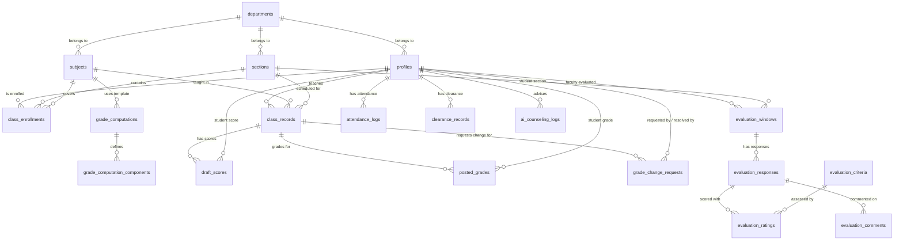

# SAGE Database Schema & ERD Documentation

This document describes the complete relational database schema for SAGE (Smart Academic Governance Engine). The database is designed for **Supabase PostgreSQL** and consists of **21 tables** organized into six functional groups: User/Organizational Data, Class/Enrollment Management, Grading, Evaluations, AI Insights, and System Notifications.

---

## 1. Entity Relationship Diagram (ERD)



---

## 2. Table Definitions & Schemas

### 2.1 User & Organizational Data
- `departments`: Academic colleges and departments.
- `profiles`: User profiles, roles, department assignments, and COR file URLs.

### 2.2 Class & Enrollment Management
- `subjects`: Master subject catalog (Code, Title, Units, weight templates).
- `sections`: Class sections, school year, and semester.
- `class_enrollments`: Student section enrollment records and approval status.
- `class_records`: Classroom instances linking subject, section, and faculty with Join Code configurations.
- `academic_terms`: Term configuration (School Year, Semester, Term Type).

### 2.3 Grading Module
- `grade_computations`: Centralized grade weight template definitions.
- `grade_computation_components`: Component setups per template (CS, Exams, etc.).
- `draft_scores`: Unposted activity and exam scores.
- `posted_grades`: Locked official term grades.
- `grade_change_requests`: Grade resubmission requests and attached proof URLs.

### 2.4 Faculty Evaluation Module
- `evaluation_criteria`: Evaluation questionnaire items and max ratings.
- `evaluation_windows`: Scheduled evaluation windows per section.
- `evaluation_responses`: Student survey submissions and `submitted_timely` flags.
- `evaluation_ratings`: Itemized criteria ratings per survey response.
- `evaluation_comments`: Qualitative student feedback comments.

### 2.5 AI Insights, Logs & Clearances
- `attendance_logs`: Daily student attendance records (Present, Late, Absent).
- `audit_logs`: System-wide security and administrative audit trail.
- `clearance_records`: Term clearance sign-off statuses.
- `ai_counseling_logs`: History of generated student AI study recommendations.

---

## 3. SQL Data Definition Language (DDL) Scripts

```sql
-- Create custom constraint checks
CREATE TYPE user_role AS ENUM ('admin', 'dean', 'faculty', 'student', 'office');
CREATE TYPE semester_period AS ENUM ('1st', '2nd', 'Summer');
CREATE TYPE class_status AS ENUM ('active', 'archived');
CREATE TYPE term_period AS ENUM ('prelim', 'midterm', 'semi_final', 'final');
CREATE TYPE grade_remarks AS ENUM ('passed', 'failed', 'incomplete', 'fda', 'dropped');
CREATE TYPE enrollment_status AS ENUM ('pending_verification', 'active', 'rejected');
CREATE TYPE attendance_status AS ENUM ('present', 'late', 'absent');

-- 1. departments
CREATE TABLE departments (
    department_id UUID PRIMARY KEY DEFAULT gen_random_uuid(),
    name VARCHAR(150) NOT NULL UNIQUE,
    created_at TIMESTAMP DEFAULT CURRENT_TIMESTAMP
);

-- 2. profiles (Replaces users)
CREATE TABLE profiles (
    user_id UUID PRIMARY KEY DEFAULT gen_random_uuid(),
    last_name VARCHAR(100) NOT NULL,
    first_name VARCHAR(100) NOT NULL,
    email VARCHAR(150) NOT NULL UNIQUE,
    role user_role NOT NULL,
    section_id UUID, -- For irregular students
    department_id UUID REFERENCES departments(department_id),
    latest_cor_url TEXT,
    cor_verified BOOLEAN DEFAULT FALSE,
    created_at TIMESTAMP DEFAULT CURRENT_TIMESTAMP
);

-- 3. grade_computations
CREATE TABLE grade_computations (
    computation_id UUID PRIMARY KEY DEFAULT gen_random_uuid(),
    name VARCHAR(150) NOT NULL,
    description TEXT
);

-- 4. grade_computation_components
CREATE TABLE grade_computation_components (
    component_id UUID PRIMARY KEY DEFAULT gen_random_uuid(),
    computation_id UUID REFERENCES grade_computations(computation_id) ON DELETE CASCADE,
    name VARCHAR(100) NOT NULL,
    weight DECIMAL(5,2) NOT NULL,
    max_score DECIMAL(6,2) NOT NULL
);

-- 5. subjects
CREATE TABLE subjects (
    subject_id UUID PRIMARY KEY DEFAULT gen_random_uuid(),
    code VARCHAR(20) NOT NULL UNIQUE,
    name VARCHAR(150) NOT NULL,
    units INT NOT NULL CHECK(units > 0),
    computation_id UUID REFERENCES grade_computations(computation_id),
    department_id UUID REFERENCES departments(department_id)
);

-- 6. sections
CREATE TABLE sections (
    section_id UUID PRIMARY KEY DEFAULT gen_random_uuid(),
    name VARCHAR(50) NOT NULL,
    school_year VARCHAR(15) NOT NULL,
    semester semester_period NOT NULL,
    department_id UUID REFERENCES departments(department_id)
);

-- 7. class_enrollments
CREATE TABLE class_enrollments (
    enrollment_id UUID PRIMARY KEY DEFAULT gen_random_uuid(),
    student_id UUID REFERENCES profiles(user_id) ON DELETE CASCADE,
    section_id UUID REFERENCES sections(section_id) ON DELETE CASCADE,
    subject_id UUID REFERENCES subjects(subject_id) ON DELETE CASCADE,
    status enrollment_status DEFAULT 'active',
    enrolled_at TIMESTAMP DEFAULT CURRENT_TIMESTAMP
);

-- 8. class_records
CREATE TABLE class_records (
    class_record_id UUID PRIMARY KEY DEFAULT gen_random_uuid(),
    faculty_id UUID REFERENCES profiles(user_id),
    subject_id UUID REFERENCES subjects(subject_id) ON DELETE CASCADE,
    section_id UUID REFERENCES sections(section_id) ON DELETE CASCADE,
    join_code VARCHAR(6),
    joins_expire_at TIMESTAMP,
    accept_joins BOOLEAN DEFAULT TRUE,
    midterm_posted BOOLEAN DEFAULT FALSE,
    finals_posted BOOLEAN DEFAULT FALSE,
    semestral_posted BOOLEAN DEFAULT FALSE,
    is_released_to_faculty BOOLEAN DEFAULT FALSE,
    status class_status DEFAULT 'active',
    created_at TIMESTAMP DEFAULT CURRENT_TIMESTAMP
);

-- 9. draft_scores
CREATE TABLE draft_scores (
    score_id UUID PRIMARY KEY DEFAULT gen_random_uuid(),
    class_record_id UUID REFERENCES class_records(class_record_id) ON DELETE CASCADE,
    student_id UUID REFERENCES profiles(user_id) ON DELETE CASCADE,
    term term_period NOT NULL,
    component VARCHAR(50) NOT NULL,
    score DECIMAL(6,2) NOT NULL,
    encoded_at TIMESTAMP DEFAULT CURRENT_TIMESTAMP
);

-- 10. posted_grades
CREATE TABLE posted_grades (
    posted_grade_id UUID PRIMARY KEY DEFAULT gen_random_uuid(),
    class_record_id UUID REFERENCES class_records(class_record_id) ON DELETE CASCADE,
    student_id UUID REFERENCES profiles(user_id) ON DELETE CASCADE,
    grade_period term_period NOT NULL,
    computed_grade DECIMAL(5,2) NOT NULL,
    effective_grade DECIMAL(5,2) DEFAULT NULL,
    remarks grade_remarks NOT NULL,
    posted_by UUID REFERENCES profiles(user_id),
    posted_at TIMESTAMP DEFAULT CURRENT_TIMESTAMP
);

-- 11. grade_change_requests
CREATE TABLE grade_change_requests (
    id UUID PRIMARY KEY DEFAULT gen_random_uuid(),
    class_record_id UUID REFERENCES class_records(class_record_id) ON DELETE CASCADE,
    student_id UUID REFERENCES profiles(user_id) ON DELETE CASCADE,
    faculty_id UUID REFERENCES profiles(user_id) ON DELETE CASCADE,
    reason TEXT NOT NULL,
    evidence_url TEXT,
    status VARCHAR(20) DEFAULT 'pending_dean',
    resolved_by UUID REFERENCES profiles(user_id),
    created_at TIMESTAMP DEFAULT CURRENT_TIMESTAMP
);

-- 12. evaluation_criteria
CREATE TABLE evaluation_criteria (
    criteria_id UUID PRIMARY KEY DEFAULT gen_random_uuid(),
    department_id UUID REFERENCES departments(department_id),
    label VARCHAR(150) NOT NULL,
    description TEXT NOT NULL,
    max_rating INT DEFAULT 4 CHECK(max_rating > 0)
);

-- 13. evaluation_windows
CREATE TABLE evaluation_windows (
    window_id UUID PRIMARY KEY DEFAULT gen_random_uuid(),
    faculty_id UUID REFERENCES profiles(user_id) ON DELETE CASCADE,
    section_id UUID REFERENCES sections(section_id) ON DELETE CASCADE,
    open_at TIMESTAMP NOT NULL,
    close_at TIMESTAMP NOT NULL
);

-- 14. evaluation_responses
CREATE TABLE evaluation_responses (
    response_id UUID PRIMARY KEY DEFAULT gen_random_uuid(),
    window_id UUID REFERENCES evaluation_windows(window_id) ON DELETE CASCADE,
    anonymous_token VARCHAR(255) NOT NULL UNIQUE,
    submitted_timely BOOLEAN DEFAULT TRUE,
    submitted_at TIMESTAMP DEFAULT CURRENT_TIMESTAMP
);

-- 15. evaluation_ratings
CREATE TABLE evaluation_ratings (
    rating_id UUID PRIMARY KEY DEFAULT gen_random_uuid(),
    response_id UUID REFERENCES evaluation_responses(response_id) ON DELETE CASCADE,
    criteria_id UUID REFERENCES evaluation_criteria(criteria_id) ON DELETE CASCADE,
    rating INT NOT NULL CHECK(rating >= 1)
);

-- 16. evaluation_comments
CREATE TABLE evaluation_comments (
    comment_id UUID PRIMARY KEY DEFAULT gen_random_uuid(),
    response_id UUID REFERENCES evaluation_responses(response_id) ON DELETE CASCADE,
    comment TEXT NOT NULL
);

-- 17. attendance_logs
CREATE TABLE attendance_logs (
    log_id UUID PRIMARY KEY DEFAULT gen_random_uuid(),
    class_record_id UUID REFERENCES class_records(class_record_id) ON DELETE CASCADE,
    student_id UUID REFERENCES profiles(user_id) ON DELETE CASCADE,
    date DATE NOT NULL,
    status attendance_status NOT NULL,
    logged_at TIMESTAMP DEFAULT CURRENT_TIMESTAMP
);

-- 18. audit_logs
CREATE TABLE audit_logs (
    log_id UUID PRIMARY KEY DEFAULT gen_random_uuid(),
    actor VARCHAR(100) NOT NULL,
    action VARCHAR(50) NOT NULL,
    message TEXT NOT NULL,
    timestamp TIMESTAMP DEFAULT CURRENT_TIMESTAMP
);

-- 19. academic_terms
CREATE TABLE academic_terms (
    term_id UUID PRIMARY KEY DEFAULT gen_random_uuid(),
    school_year VARCHAR(15) NOT NULL,
    semester semester_period NOT NULL,
    is_active BOOLEAN DEFAULT FALSE
);

-- 20. clearance_records
CREATE TABLE clearance_records (
    clearance_id UUID PRIMARY KEY DEFAULT gen_random_uuid(),
    student_id UUID REFERENCES profiles(user_id) ON DELETE CASCADE,
    term_id UUID REFERENCES academic_terms(term_id) ON DELETE CASCADE,
    status VARCHAR(50) DEFAULT 'UNSIGNED',
    cleared_at TIMESTAMP
);

-- 21. ai_counseling_logs
CREATE TABLE ai_counseling_logs (
    log_id UUID PRIMARY KEY DEFAULT gen_random_uuid(),
    student_id UUID REFERENCES profiles(user_id) ON DELETE CASCADE,
    recommendation TEXT NOT NULL,
    basis_snapshot JSONB NOT NULL,
    generated_at TIMESTAMP DEFAULT CURRENT_TIMESTAMP
);
```
