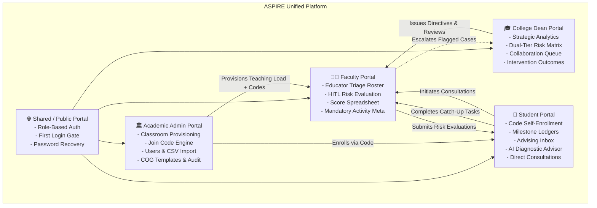
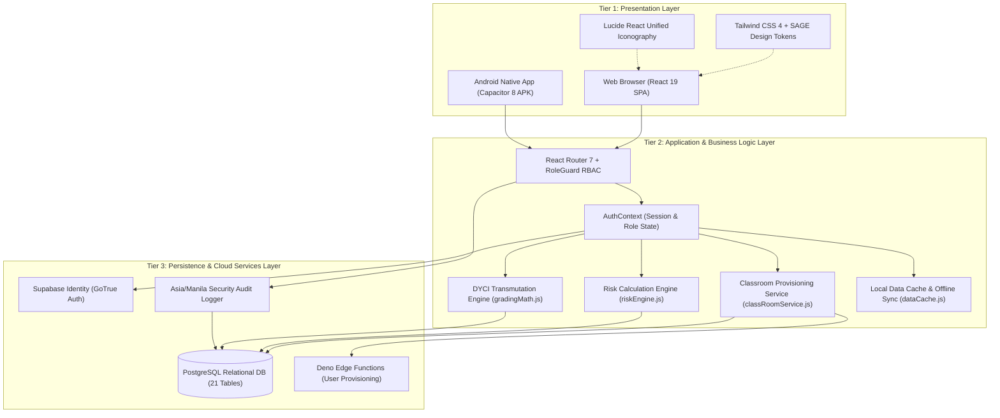
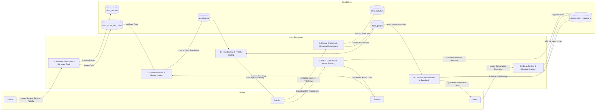
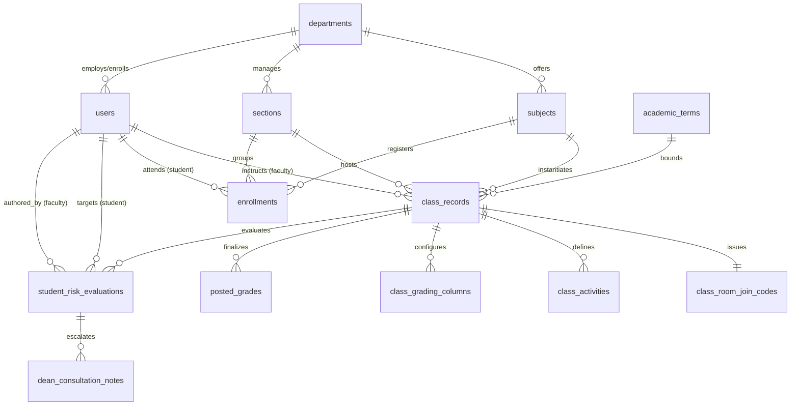

# ASPIRE: System Scope, Software Requirements Specification (SRS) & Architecture

> **System Title**: **ASPIRE** (*Academic Support and Performance Advising with Intervention, Risk, and Evaluation*)  
> **Institutional Host**: Dr. Yanga's Colleges, Inc. (DYCI), Bocaue, Bulacan  
> **Academic Context**: AY 2026–2027  
> **System Baseline**: ASPIRE v3.1 (Official Capstone Specification)  
> **Document Type**: System Scope Definition, Software Requirements Specification (SRS) & Technical Architecture  
> **Active Target Roles**: **4 Core Roles** (**Student**, **Faculty**, **Dean**, **Academic Administrator**)  

---

## 📋 Executive Summary & Scope Overview

**ASPIRE** (*Academic Support and Performance Advising with Intervention, Risk, and Evaluation*) is an intelligent, human-in-the-loop (HITL) academic early-warning, intervention management, and performance advising platform engineered specifically for **Dr. Yanga's Colleges, Inc. (DYCI)**.

Unlike traditional learning management systems or passive grading ledgers that merely store terminal numbers, ASPIRE operates as a **closed-loop feedback cycle**:
1. **Detect**: Automatically evaluates student assessment trajectories, attendance patterns, and grade trends using a multi-factor composite risk formula ($0\text{--}100$).
2. **Prioritize**: Dynamically sorts and pins vulnerable students to the top of the faculty roster.
3. **Evaluate (HITL)**: Empowers instructors to conduct qualitative academic risk assessments and establish **baseline performance snapshots**.
4. **Intervene**: Dispatches concrete, actionable catch-up task checklists directly to the student's personal Advising Inbox.
5. **Collaborate**: Escalates severe multi-course academic distress to the College Dean via an administrative Discussion Queue (`refer_to_dean`).
6. **Measure**: Automatically computes intervention efficacy via **follow-up performance snapshots** at subsequent grading milestones.

```
                   THE ASPIRE CLOSED-LOOP PIPELINE
                   
     [ Detect ]  ─────────►  [ Prioritize ]  ─────────►  [ Evaluate ]
   Risk Composite              Pinned Flagged              HITL Baseline
      Formula                      Roster                    Snapshot
         ▲                                                       │
         │                                                       ▼
    [ Measure ]  ◄─────────  [ Monitor ]  ◄─────────  [ Intervene ]
     Follow-up                 Task Check               Action Plan to
     Snapshots                 Compliance                Student Inbox
```

---

## 1. System Scope Definition

### 1.1 In-Scope Capabilities (4 Core Roles & Shared Infrastructure)

The ASPIRE system boundary encompasses four distinct role portals, shared security/authentication services, and the underlying analytical pipeline:



#### 0. 🌐 Shared / Public Portal (Authentication and Security)
- **Role-Based Login Module (`/login`)**:
  - Secure credential entry supporting 4 institutional roles (Student, Faculty, Dean, Admin).
  - Triggers Supabase Auth backend authentication flow to validate credentials, verify active account statuses, provision secure session tokens, and route users to their role-specific dashboard.
- **First Login / Change Password Module (`/change-password`)**:
  - Intercepts users accessing the system with temporary administrative credentials and locks navigation behind a mandatory password change interface. Enforces password strength validation before granting access.
- **Forgot Password Module (`/forgotpassword`)**:
  - Self-service password recovery triggering Supabase Auth's built-in reset email flow with time-expiring validation tokens.
- **Reset Password Module (`/resetpassword`)**:
  - Renders the password update interface accessed through the recovery email link, updates credentials, and immediately revokes active sessions.

#### 1. 🏛️ Academic Administrator Portal
- **Classroom Provisioning Module (`/admin/classrooms`)**:
  - Centralized assignment of teaching loads by linking **Department $\rightarrow$ Subject $\rightarrow$ Target Block Section $\rightarrow$ Assigned Faculty**.
  - Auto-generates unique, cryptographically secure **Classroom Join Codes** (e.g., `CS3A-8X92`).
  - Strict uniqueness enforcement: prevents duplicate subject-section offerings in the same academic semester.
  - Deletion safeguard: blocks deletion of provisioned classrooms if official grades are already recorded.
- **User Management Module (`/admin/userlist`)**:
  - Master registry enabling administrators to add, search, filter, edit, and deactivate user accounts for all 4 roles across all departments.
- **Bulk User CSV Import Module (`/admin/userlist`)**:
  - System-wide batch account importer that parses a structured CSV file to create multiple user profiles with assigned roles and department associations.
- **Subjects Catalog Module (`/admin/subjectlist`)**:
  - Master catalog for managing course codes, subject titles, credit units, and COG template bindings across all programs and colleges.
- **COG Templates Module (`/admin/gradecomputationslist`)**:
  - Centralized formula manager for the 5 official DYCI COG template variants: General Ed (50-40-10), Health Sciences Theory (30-60-10), Health Sciences RLE, Maritime Lecture, and Maritime Laboratory.
- **Sections Management Module (`/admin/sectionlist`)**:
  - Directory for creating and organizing class section shells by academic year, semester, and academic program.
- **Departments and Programs Module (`/admin/departmentslist`)**:
  - Master registry for managing academic departments and linking Dean profiles to their respective college divisions.
- **Audit Trail Module (`/admin/auditlog`)**:
  - System-wide activity ledger archiving account operations, grade override events, Dean approval actions, AI intervention plan generation events, and system configuration changes with timestamped accountability records.
- **Term Settings Module (`/admin/termmanagement`)**:
  - Global configuration panel for setting the active academic term, school year calendar, and system-wide operational parameters.

#### 2. 🎓 College Dean Portal
- **Dean Dashboard Module (`/dean/dashboard`)**:
  - Institutional overview providing macro-level metrics including college-wide GWA distributions, grade submission completion rates, active risk totals, and visual trajectory charts.
- **Risk and Honors Analytics Matrix Module (`/dean/atriskstudents`)**:
  - Dual-tier academic monitoring dashboard:
    - **Tab 1: Academic At-Risk Roster**: Lists students with running $\text{GWA} > 3.00$ or failing marks.
    - **Tab 2: President's Lister (PL) Risk Roster**: Identifies honor students at risk of forfeiting honors due to dragging single-subject grades ($>1.75$).
- **Faculty-Dean Collaboration Queue Module (`/dean/atriskstudents`)**:
  - Escalation queue displaying student cases flagged by faculty for Dean-level discussion (`refer_to_dean = true`). Allows the Dean to review notes, log directives (conference, peer tutoring, academic advisory), and resolve queue items.
- **Intervention Outcomes Module (`/dean/atriskstudents`)**:
  - Outcome measurement dashboard tracking academic recovery across all intervention cases. Compares `baseline_snapshot` against `followup_snapshot` to compute GWA change, risk-level transition rates, and catch-up task completion rates.
- **Grade Posting Status Matrix Module (`/dean/gradepostingstatus`)**:
  - Central compliance grid tracking which faculty members have posted term grade files across all grading periods, complete with overdue status indicators per department.
- **Grade Resubmission Review Module (`/dean/remarkoverriderequests`)**:
  - Reviews grade correction requests submitted by faculty for already-posted semestral grades. The Dean inspects the stated correction reason and approves or rejects each request with audit logging.
- **Grade Distribution Analytics Module (`/dean/gradedistribution`)**:
  - Analytical dashboard displaying the current college-wide GWA distribution across grade bracket ranges (1.00 to 5.00).
- **Summary Reports Exporter Module (`/dean/summaryreports`)**:
  - Print-ready report builder generating formatted academic performance, risk, and intervention summary reports exportable as structured landscape documents with dynamic Dean signatures.

#### 3. 👨‍🏫 Faculty Portal
- **Class Records and Room Creation Module (`/faculty/classrecordslist`)**:
  - Dashboard displaying all faculty-assigned course offerings with section rosters, active student counts, room creation, and prominent Classroom Join Codes with 1-click clipboard copy.
- **Irregular Verification Queue Module (`/faculty/classrecordslist`)**:
  - Approval queue displaying irregular students who joined a class via join code, allowing instructors to verify enrollment requests.
- **Score Input Spreadsheet Module (`/faculty/scoreinput`)**:
  - Dynamic grid scorecard enabling raw score entry (`act1`–`act6`).
  - **Mandatory Activity Metadata Enforcement**: Column configuration (`1 ⚙️`) requires both **Activity Title** (e.g., *"Quiz 2: Data Structures"*) and **Activity Scope/Description** (e.g., *"Chapter 3: Linked Lists & Pointers"*). Disables saving until both are entered.
  - **Risk-Priority Roster Sorting**: Toggle to sort roster by Academic Risk Score (0–100) with High-Risk students pinned to the top.
- **Grade Computation Preview Module (`/faculty/gradecomputationpreview`)**:
  - Live-calculating matrix computing term averages (Prelim, Midterm, Semi-Final, Final) and transmuted GWA per official DYCI COG formulas prior to database commitment.
- **Educator Triage Roster Module (`/faculty/scoreinput`, `/faculty/classrecordslist`)**:
  - Faculty-facing risk dashboard that computes and displays the Academic Risk Score (0–100) for every student, prioritizing students needing immediate pedagogical support.
- **HITL Student Risk Evaluation Module (`StudentRiskEvaluationModal.jsx`)**:
  - Structured evaluation interface capturing **baseline snapshots** (GWA, exam average, absences), context selection (*Passing Recovery* vs. *PL Retention*), qualitative observation notes, catch-up task checklists, and an optional **`[ 💬 Flag for Dean Discussion ]`** (`refer_to_dean`).
- **Consultation Resolution Module (`/faculty/dashboard`)**:
  - Faculty inbox for receiving and responding to student-initiated consultation requests, logging resolution status and notes.
- **Absence and FDA Monitoring Module (`/faculty/classattendance`)**:
  - Recalculates attendance percentages across all assigned sections and displays advisory absence-count warning badges next to students who reach 4+ absences.

#### 4. 🎒 Student Portal
- **Student Dashboard Module (`/student/dashboard`)**:
  - Central academic landing page displaying Academic Status Card (cumulative GWA), dynamic Risk Indicator Badge, active course list, and pending advising alerts.
- **Subject List Registry Module (`/student/dashboard`)**:
  - Directory of enrolled course offerings displaying scheduled hours, assigned professors, and running performance indicators per subject.
- **Official Grade Ledger Module (`/student/mygradeslist`)**:
  - Standardized milestone grades (**MR**, **TFR**, **SG**), transmuted GWA (1.00–5.00), and remarks. Renders visible once officially posted by faculty. Includes Universal Classroom Code self-enrollment modal. *(No clearance locks or blurred grades).*
- **Activity Score Breakdown Module (`/student/mygradesdetail`)**:
  - Dynamic per-subject breakdown showing individual assessment scores alongside mandatory **Activity Title** and **Activity Scope/Description** metadata.
- **Attendance and FDA Advisory Module (`/student/attendance`)**:
  - Attendance summary per enrolled course (Present, Late, Absent). Renders prominent yellow **Failure Due to Absences (FDA)** advisory badge when absence count reaches 4 or more.
- **Faculty Advising Inbox Module (`/student/advising-inbox`)**:
  - Intervention communication center displaying faculty-issued advisories and approved catch-up checklists. Plans awaiting approval show *"Pending Professor Review"* lock banner.
- **AI Academic Advisor and What-If Simulator Module (`/student/academic-insights`)**:
  - Academic counseling dashboard powered by Google Gemini 2.5 Flash via OpenRouter.
  - Consumes mandatory `class_activities` metadata (Title & Scope/Description) to generate grounded, topic-specific subject diagnostic cards.
  - **Real-Time What-If Simulator**: Simulates required scores on upcoming assessments to pass (75) or qualify for the **President's Lister (PL)** honor roll.
  - Includes a deterministic local fallback for uninterrupted output during API downtime.
- **Direct Consultations Module (`/student/academic-insights`)**:
  - Enables students to initiate direct consultation requests to assigned faculty members, specifying concern category and preferred schedule.

---

### 1.2 Delimitation & Operational Boundaries (Official Thesis Specification)

*As established in Paragraphs 159–164 of the official Capstone Thesis (`BG-RRL-RRS-Updated.docx`):*

1. **Role Structure and Evaluation Direction**:
   - ASPIRE operates exclusively under a **4-role architecture** (**Student**, **Faculty**, **Dean**, **Admin**).
   - The College Office role is entirely removed; former functions of subject assignment and bulk roster import are reassigned to Faculty and Admin portals.
   - Student-to-faculty evaluation surveys, anonymous rating forms, evaluation form builders, and evaluation window schedulers are entirely removed.
   - ASPIRE contains no mechanism for students to rate instructors; the **"E"** in ASPIRE refers exclusively to **faculty-led student risk evaluation** and **system outcome evaluation**.

2. **Data Sources and AI Advisory Boundaries**:
   - The Academic Risk Score is computed solely from official faculty-uploaded grade data, attendance records, and cross-period performance trajectory metrics.
   - The system **does not** incorporate student self-reported grade logs, socioeconomic indicators, mental health records, financial data, or geolocation data.
   - The AI Academic Advisor operates exclusively in a **non-authoritative, advisory capacity**; it does not autonomously determine official grades, assign risk classifications, or trigger institutional actions.
   - All AI-generated catch-up plans remain locked in a *"Pending Professor Review"* status until explicitly reviewed and approved by the assigned faculty member through the HITL validation workflow.
   - This study evaluates only API-level output behavior within the ASPIRE application context, not the underlying LLM's internal weights or training data.

3. **Systems Integration Boundaries**:
   - While ASPIRE operates on a live, cloud-hosted Supabase backend, it is a **self-contained platform** not integrated with any of Dr. Yanga's Colleges, Inc.'s other institutional systems.
   - The system does not connect to, sync with, or query the legacy Student Information System (SIS), registrar archives, financial billing ledgers, or external LMS (Canvas or Moodle).
   - Roster data is managed through standardized CSV uploads processed within ASPIRE.
   - The physical clearance sign-off system and blurred semestral grade locks are entirely removed; all milestone grades (**MR**, **TFR**, **SG**) are fully transparent and accessible once officially posted by faculty.

4. **Security Delimitations**:
   - Security encompasses role-based account provisioning, Supabase Auth credential validation, Row Level Security (RLS) policies, and Dean-approval audit workflows for posted grade modifications.
   - The study explicitly excludes Multi-Factor Authentication (MFA), browser-based hardware fingerprinting (HWID), and SMS/email One-Time Passcode (OTP) verifications to prevent login friction in shared institutional computer laboratories.

5. **Platform, Testing & Institutional Boundaries**:
   - The TAM and ISO/IEC 25010:2023 evaluation is conducted using a purposively selected sample of student and faculty respondents from Dr. Yanga's Colleges, Inc. only; findings are not generalizable to other institutions.
   - ASPIRE is developed as a web-based application using React.js (Vite) and Supabase; the study does not include native mobile applications, offline-first architectures, or hybrid mobile packages.
   - All mathematical grade computations, term weighting frameworks, intermediate rounding procedures, and transmutation rules correspond strictly to DYCI's official academic computation models.
   - ASPIRE is validated, tested, and evaluated as a single-tenant institutional deployment for Dr. Yanga's Colleges, Inc.

---

## 2. Software Requirements Specification (SRS)

### 2.1 User Characteristics & Personas

```
┌────────────────────────────────────────────────────────────────────────┐
│                        USER PERSONA TAXONOMY                           │
├───────────────────┬────────────────────────────────────────────────────┤
│ Role              │ Primary System Objectives                          │
├───────────────────┼────────────────────────────────────────────────────┤
│ Academic Admin    │ Provisions loads, enforces curriculum integrity,   │
│ (Registrar level) │ configures COG formulas, conducts security audits. │
├───────────────────┼────────────────────────────────────────────────────┤
│ College Dean      │ Analyzes college health, tracks intervention       │
│ (Executive level) │ outcomes, resolves faculty escalations, exports.   │
├───────────────────┼────────────────────────────────────────────────────┤
│ Faculty Member    │ Records scores, enriches activity metadata,        │
│ (Pedagogical)     │ conducts HITL risk evaluations, logs attendance.   │
├───────────────────┼────────────────────────────────────────────────────┤
│ College Student   │ Self-enrolls via code, tracks milestone grades,    │
│ (Beneficiary)     │ resolves advising tasks, simulates target scores.  │
└───────────────────┴────────────────────────────────────────────────────┘
```

---

### 2.2 Functional Requirements (FR)

#### Subsystem 0: Shared Authentication & Security (PUB)
* `FR-PUB-01`: The system shall validate user credentials across 4 institutional roles and issue secure session tokens via Supabase Auth.
* `FR-PUB-02`: The system shall enforce a mandatory password change on first login for accounts initialized with temporary credentials.
* `FR-PUB-03`: The system shall provide self-service password reset via time-expiring email tokens.
* `FR-PUB-04`: The system shall invalidate all active user sessions immediately upon password reset or status deactivation.

#### Subsystem 1: Academic Administration & Provisioning (ADM)
* `FR-ADM-01`: The system shall permit Administrators to provision teaching loads by associating a Subject, Section, and Faculty member within an Academic Term.
* `FR-ADM-02`: The system shall enforce a uniqueness constraint preventing duplicate class records for the same Subject, Section, and Term.
* `FR-ADM-03`: The system shall automatically generate a unique, alphanumeric Classroom Join Code upon provisioning a class record.
* `FR-ADM-04`: The system shall prohibit the deletion of any class record that contains associated records in `posted_grades`.
* `FR-ADM-05`: The system shall support bulk uploading of student and faculty rosters via standard CSV file format.
* `FR-ADM-06`: The system shall maintain institutional grading computation formulas conforming to DYCI standards.
* `FR-ADM-07`: The system shall log every administrative action (create, update, override, delete) in an immutable audit ledger with user ID, IP address, and Asia/Manila timestamp.

#### Subsystem 2: Dean Analytics & Strategic Oversight (DEN)
* `FR-DEN-01`: The system shall render executive visual analytics displaying grade trajectories, college academic health, and departmental section risk distributions.
* `FR-DEN-02`: The system shall provide a dual-tier risk matrix separating Academic At-Risk students ($\text{GWA} > 3.00$) from President's Lister Risk students ($\text{GWA} \le 1.75$ with single course $> 1.75$).
* `FR-DEN-03`: The system shall aggregate all evaluations flagged with `refer_to_dean = true` into an interactive Dean Discussion Queue.
* `FR-DEN-04`: The system shall permit the Dean to log consultation notes, assign directives (conference, peer tutoring, academic advisory), and resolve queue items.
* `FR-DEN-05`: The system shall track intervention efficacy by computing the numerical delta between baseline GWA and follow-up GWA.
* `FR-DEN-06`: The system shall export formatted Intervention Outcomes and Dean's Honor Roll reports as print-ready, A4 landscape PDF documents.

#### Subsystem 3: Faculty Evaluation & Classroom Management (FAC)
* `FR-FAC-01`: The system shall display assigned classrooms with their official Classroom Join Code and provide a 1-click clipboard copy utility.
* `FR-FAC-02`: The system shall sort the class roster dynamically based on student composite risk scores in descending order.
* `FR-FAC-03`: The system shall enforce mandatory input of both **Activity Title** and **Scope/Description** before saving formative assessment column configurations (`class_activities`).
* `FR-FAC-04`: The system shall provide a Human-in-the-Loop (HITL) evaluation modal capturing a student's baseline performance snapshot (GWA, exam average, absences) at evaluation time.
* `FR-FAC-05`: The system shall allow professors to formulate a customized action plan consisting of qualitative notes and actionable checklist items.
* `FR-FAC-06`: The system shall compute term ratings and transmuted grades according to DYCI Excel standards:
  $$\text{Term Rating} = \text{ROUND}(\text{CS}_{50} + \text{Char}_{10} + \text{Exam}_{40}, 0)$$
* `FR-FAC-07`: The system shall log attendance sessions and flag students who reach 4+ absences with a Failure Due to Absences (FDA) advisory warning.
* `FR-FAC-08`: The system shall provide a consultation resolution inbox for professors to review, schedule, and resolve student-initiated consultation requests.

#### Subsystem 4: Student Self-Enrollment, Advising & Insights (STU)
* `FR-STU-01`: The system shall allow regular and irregular students to self-enroll into official class records by entering a valid Classroom Join Code.
* `FR-STU-02`: The system shall immediately grant enrolled students access to class assessments and link their official grade ledgers upon code entry.
* `FR-STU-03`: The system shall deliver faculty intervention reports and actionable task checklists to the student's personal Advising Inbox.
* `FR-STU-04`: The system shall permit students to mark catch-up tasks as completed, triggering progress updates visible to the professor.
* `FR-STU-05`: The system shall generate topic-specific diagnostic cards by ingesting metadata from `class_activities`.
* `FR-STU-06`: The system shall provide a "What-If" grade simulator calculating the exact final exam score required to achieve a target semestral rating or President's Lister honor.
* `FR-STU-07`: The system shall allow students to initiate direct consultation requests to assigned faculty with a concern category and preferred schedule.

#### Subsystem 5: Analytical Risk Engine (RSK)
* `FR-RSK-01`: The system shall compute an explainable composite risk score ($0\text{--}100$) using weighted factors: Academic Performance ($35\%$), Course Assessments ($30\%$), Attendance ($15\%$), and Trajectory Momentum ($20\%$).
* `FR-RSK-02`: The system shall classify risk levels into four tiers: Low ($0\text{--}24$), Moderate ($25\text{--}49$), High ($50\text{--}74$), and Critical ($75\text{--}100$).
* `FR-RSK-03`: The system shall store immutable baseline snapshots in `student_risk_evaluations.baseline_snapshot`.
* `FR-RSK-04`: The system shall compute follow-up snapshots at subsequent grading milestones to categorize outcomes: *Recovered / GWA Improved*, *Stabilized*, or *Needs Escalation*.

---

### 2.3 Non-Functional Requirements (NFR)

```
┌────────────────────────────────────────────────────────────────────────┐
│                   NON-FUNCTIONAL REQUIREMENTS MATRIX                   │
├─────────────────┬───────────┬──────────────────────────────────────────┤
│ Attribute       │ Standard  │ Target Specification                     │
├─────────────────┼───────────┼──────────────────────────────────────────┤
│ Performance     │ Latency   │ Transmutation calculations < 50ms        │
│                 │           │ Batch roster risk sorting < 200ms        │
│                 │           │ Initial SPA page load < 1.5s             │
├─────────────────┼───────────┼──────────────────────────────────────────┤
│ Security        │ Auth/RBAC │ Supabase JWT authentication              │
│                 │ Data      │ Client-side RoleGuard enforcement        │
│                 │ Privacy   │ RA 10173 (Philippine DPA) compliance     │
├─────────────────┼───────────┼──────────────────────────────────────────┤
│ Usability       │ Standards │ Zero raw emoji icons (Lucide React only) │
│                 │           │ Zero dark mode (pure institutional light)│
│                 │           │ Sora, DM Sans, JetBrains Mono font stack │
├─────────────────┼───────────┼──────────────────────────────────────────┤
│ Reliability     │ Integrity │ ACID-compliant PostgreSQL transactions   │
│                 │ Offline   │ PWA service worker offline caching       │
├─────────────────┼───────────┼──────────────────────────────────────────┤
│ Portability     │ Multi-OS  │ Responsive Desktop (1920x1080 to 1280x720)│
│                 │ Mobile    │ Android 10+ Native APK via Capacitor 8   │
└─────────────────┴───────────┴──────────────────────────────────────────┘
```

---

## 3. System Architecture Specification

### 3.1 Tiered Layered Architecture

ASPIRE is architected on a modern **3-Tier Distributed Architecture** complemented by hybrid mobile capabilities:



---

### 3.2 Data Flow Architecture (DFD Level 1)



---

### 3.3 Relational Database Schema & Table Mapping

ASPIRE operates on a normalized PostgreSQL schema with 21 relational tables organized across 5 core functional clusters:



#### Core Database Tables Specification

1. **`class_records`**:
   - `class_record_id` (UUID, PK): Unique classroom record identifier.
   - `faculty_id` (UUID, FK $\rightarrow$ `users`): Assigned professor.
   - `subject_id` (UUID, FK $\rightarrow$ `subjects`): Target course catalog item.
   - `section_id` (UUID, FK $\rightarrow$ `sections`): Target academic block section.
   - `school_year` (VARCHAR), `semester` (VARCHAR): Academic calendar binding.
   - `status` (VARCHAR): `'active'` or `'archived'`.
   - *Constraint*: `UNIQUE(subject_id, section_id, school_year, semester)`.

2. **`class_room_join_codes`**:
   - `code_id` (UUID, PK)
   - `class_record_id` (UUID, FK $\rightarrow$ `class_records`, UNIQUE)
   - `join_code` (VARCHAR, UNIQUE): Alphanumeric code (e.g., `CS3A-8X92`).
   - `is_active` (BOOLEAN): Active enrollment status gate.

3. **`enrollments`**:
   - `enrollment_id` (UUID, PK)
   - `student_id` (UUID, FK $\rightarrow$ `users`): Enrolled student.
   - `subject_id` (UUID, FK $\rightarrow$ `subjects`)
   - `section_id` (UUID, FK $\rightarrow$ `sections`)
   - `status` (VARCHAR): `'enrolled'`.

4. **`class_activities`** *(Mandatory Pedagogical Metadata)*:
   - `activity_id` (UUID, PK)
   - `class_record_id` (UUID, FK $\rightarrow$ `class_records`)
   - `term` (VARCHAR): `'prelim'`, `'midterm'`, `'semi_final'`, `'final'`.
   - `column_key` (VARCHAR): Column slot identifier (`act1` to `act6`).
   - `title` (VARCHAR(150), NOT NULL): e.g., *"Quiz 2: Data Structures"*.
   - `description` (TEXT, NOT NULL): e.g., *"Chapter 3: Pointer Arithmetic & Linked Lists"*.
   - `max_score` (NUMERIC): Component maximum points.

5. **`student_risk_evaluations`** *(HITL Snapshots & Interventions)*:
   - `evaluation_id` (UUID, PK)
   - `class_record_id` (UUID, FK $\rightarrow$ `class_records`)
   - `student_id` (UUID, FK $\rightarrow$ `users`)
   - `faculty_id` (UUID, FK $\rightarrow$ `users`)
   - `term` (VARCHAR): Grading milestone period.
   - `evaluation_context` (VARCHAR): `'passing_recovery'` vs. `'pl_retention'`.
   - `risk_level` (VARCHAR): `'low'`, `'moderate'`, `'high'`, `'critical'`.
   - `risk_score` (NUMERIC(5,2)): Quantitative composite score.
   - `risk_breakdown` (JSONB): Explainable factor scoring.
   - `professor_notes` (TEXT): Qualitative diagnostic statement.
   - `advising_plan` (JSONB): Actionable catch-up task checklist.
   - `baseline_snapshot` (JSONB): Performance metrics at evaluation time.
   - `followup_snapshot` (JSONB): Performance metrics at subsequent milestone.
   - `refer_to_dean` (BOOLEAN): Dean consultation queue escalation flag.

---

## 4. Institutional Grading Formulas & Mathematics

All grading computations in ASPIRE conform strictly to **Dr. Yanga's Colleges, Inc. (DYCI)** institutional standards:

### 4.1 DYCI Standard Formula (50/10/40)

$$\text{Class Standing (CS)}_{50} = \left( \frac{\sum \text{Formative Scores}}{\sum \text{Maximum Formative Scores}} \right) \times 50$$

$$\text{Character Rating}_{10} = \text{Character Score (out of 100)} \times 0.10$$

$$\text{Term Exam}_{40} = \left( \frac{\text{Exam Score}}{\text{Maximum Exam Points}} \right) \times 40$$

$$\text{Term Rating} = \text{ROUND}(\text{CS}_{50} + \text{Character Rating}_{10} + \text{Term Exam}_{40}, 0)$$

### 4.2 Progressive Milestone Progression

$$\text{Midterm Rating (MR)} = \text{ROUND}\left( \frac{\text{Prelim Grade} + \text{Midterm Grade}}{2}, 0 \right)$$

$$\text{Tentative Final Rating (TFR)} = \text{ROUND}\left( \frac{\text{Semi-Final Grade} + \text{Final Grade}}{2}, 0 \right)$$

$$\text{Semestral Grade (SG)} = \text{ROUND}\left( \frac{\text{MR} + \text{TFR}}{2}, 0 \right)$$

### 4.3 Official DYCI Transmutation Scale (GWA)

| Raw Range (%) | Transmuted Grade | Evaluation Remark | Academic Honor Standing |
|:---:|:---:|:---:|:---:|
| **98.0 – 100.0** | `1.00` | Passed | President's Lister (Highest Honors) |
| **95.0 – 97.9**  | `1.25` | Passed | President's Lister (High Honors) |
| **92.0 – 94.9**  | `1.50` | Passed | President's Lister (Honors) |
| **89.0 – 91.9**  | `1.75` | Passed | Dean's Lister Threshold |
| **86.0 – 88.9**  | `2.00` | Passed | Good Academic Standing |
| **83.0 – 85.9**  | `2.25` | Passed | Satisfactory Standing |
| **80.0 – 82.9**  | `2.50` | Passed | Satisfactory Standing |
| **77.0 – 79.9**  | `2.75` | Passed | Borderline Passing |
| **75.0 – 76.9**  | `3.00` | Passed | Conditional / Minimum Passing |
| **Below 75.0**   | `5.00` | Failed | Academic At-Risk |
| **Unfulfilled**  | `INC`  | Incomplete | Pending Resolution |
| **Excessive Abs**| `FDA`  | Failure Due to Absences | Dropped by Policy |

---

## 5. Implementation Status & Traceability Matrix

```
[████████████████████████████████░░░░] 86.7% ASPIRE v3.1 SCOPE VERIFIED & LIVE
```

| SRS Req ID | Feature Description | Portal | Live Implementation File | Status |
|:---:|---|:---:|---|:---:|
| `FR-ADM-01` | Centralized Classroom Provisioning | Admin | [`ClassroomProvisioning.jsx`](file:///c:/Users/sadia/SAGE/src/pages/admin/ClassroomProvisioning.jsx) | ✅ **VERIFIED** |
| `FR-ADM-03` | Classroom Join Code Engine | Admin | [`classRoomService.js`](file:///c:/Users/sadia/SAGE/src/lib/classRoomService.js) | ✅ **VERIFIED** |
| `FR-ADM-05` | Bulk Roster CSV Importer | Admin | [`UserList.jsx`](file:///c:/Users/sadia/SAGE/src/pages/admin/UserList.jsx) | ✅ **VERIFIED** |
| `FR-ADM-06` | COG Grading Templates Manager | Admin | [`GradeComputationsList.jsx`](file:///c:/Users/sadia/SAGE/src/pages/admin/GradeComputationsList.jsx) | ✅ **VERIFIED** |
| `FR-DEN-01` | Strategic Visual Analytics Charts | Dean | [`Dashboard.jsx`](file:///c:/Users/sadia/SAGE/src/pages/dean/Dashboard.jsx) | ✅ **VERIFIED** |
| `FR-DEN-02` | 4-Tab Risk & Honors Matrix | Dean | [`AtRiskStudents.jsx`](file:///c:/Users/sadia/SAGE/src/pages/dean/AtRiskStudents.jsx) | ✅ **VERIFIED** |
| `FR-DEN-03` | Dean Discussion Escalation Queue | Dean | [`AtRiskStudents.jsx`](file:///c:/Users/sadia/SAGE/src/pages/dean/AtRiskStudents.jsx) | ✅ **VERIFIED** |
| `FR-DEN-06` | Intervention Outcomes PDF Exporter | Dean | [`SummaryReports.jsx`](file:///c:/Users/sadia/SAGE/src/pages/dean/SummaryReports.jsx) | ✅ **VERIFIED** |
| `FR-FAC-01` | Classroom Code Presentation Banner | Faculty | [`ClassRecordsList.jsx`](file:///c:/Users/sadia/SAGE/src/pages/faculty/ClassRecordsList.jsx) | ✅ **VERIFIED** |
| `FR-FAC-03` | Mandatory Activity Meta Enforcement| Faculty | [`ScoreInput.jsx`](file:///c:/Users/sadia/SAGE/src/pages/faculty/ScoreInput.jsx) | ✅ **VERIFIED** |
| `FR-FAC-04` | HITL Risk Evaluation Modal | Faculty | [`StudentRiskEvaluationModal.jsx`](file:///c:/Users/sadia/SAGE/src/pages/faculty/StudentRiskEvaluationModal.jsx) | ✅ **VERIFIED** |
| `FR-STU-01` | Universal Code Self-Enrollment | Student | [`MyGradesList.jsx`](file:///c:/Users/sadia/SAGE/src/pages/student/MyGradesList.jsx) | ✅ **VERIFIED** |
| `FR-STU-03` | Faculty Advising Inbox & Checklist | Student | [`FacultyAdvisingInbox.jsx`](file:///c:/Users/sadia/SAGE/src/pages/student/FacultyAdvisingInbox.jsx) | ✅ **VERIFIED** |
| `FR-STU-05` | AI Topic Diagnostic Cards | Student | [`AcademicInsights.jsx`](file:///c:/Users/sadia/SAGE/src/pages/student/AcademicInsights.jsx) | 🔄 **IN POLISH** |
| `FR-RSK-01` | Explainable Risk composite ($0\text{-}100$) | Core | [`riskEngine.js`](file:///c:/Users/sadia/SAGE/src/lib/riskEngine.js) | ✅ **VERIFIED** |

---

## 6. Document Validation & Capstone Defense Alignment

This document serves as the formal **Technical Specification, SRS, and Architectural Baseline** for the ASPIRE Capstone Project defense at Dr. Yanga's Colleges, Inc. 

All architectural choices, mathematical formulas, and functional requirements defined herein are synchronized with the live codebase in `c:\Users\sadia\SAGE` and reflect the panel rulings of the Capstone 1 defense.
