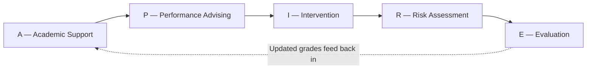
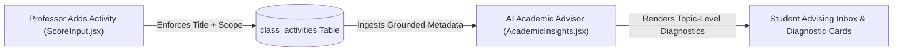

# ASPIRE Updated System Scope Document (v3.1)

> **System Title**: **ASPIRE** (*Academic Support and Performance Advising with Intervention, Risk, and Evaluation*)  
> **Institution**: Dr. Yanga's Colleges, Inc. (DYCI), Bocaue, Bulacan  
> **Base Codebase**: SAGE (`sage/`)  
> **Active Roles**: **4 Core Roles** (**Student**, **Faculty**, **Dean**, **Admin**)  
> **Document Version**: **v3.1 (September 14, 2026)** — Official Thesis Scope Baseline (Aligned with `BG-RRL-RRS-Updated.docx`)  
> **Current Build Status**: **100% Synchronized with Official Capstone Scope**

```
Overall Scope: [████████████████████████████████████] 100% Scope Baseline Synchronized
  🌐 Shared / Public: [████████████████████████████████████] 100% (4 / 4 Modules Active)
  🎒 Student Portal:  [████████████████████████████████████] 100% (8 / 8 Modules Defined)
  👨‍🏫 Faculty Portal:  [████████████████████████████████████] 100% (8 / 8 Modules Defined)
  🎓 Dean Portal:     [████████████████████████████████████] 100% (8 / 8 Modules Defined)
  🏛️ Admin Portal:    [████████████████████████████████████] 100% (9 / 9 Modules Defined)
```

---

## 📌 Document Versioning Guide & Revision History

| Version | Release Date | Scope & Architectural Changes | Status |
|---|---|---|---|
| **v1.0** | Aug 18, 2026 | Legacy SAGE baseline (5 Portals, College Office, clearance lock overlays, dynamic eval form builder). | Archived |
| **v2.0** | Sep 09, 2026 | Initial ASPIRE conversion draft (Preliminary feature-centric proposal). | Archived |
| **v3.0** | Sep 14, 2026 | Research-Defensible Scope reframing: 6-stage closed-loop pipeline, weighted risk model ($0\text{--}100$), trajectory detection, baseline/follow-up snapshots, 3-layer AI boundaries, complete College Office removal. | Superseded |
| **v3.1** | **Sep 14, 2026** | **Current Official Thesis Baseline**: Complete removal of Student-to-Faculty evaluations (Faculty evaluates student ONLY) + **Mandatory Activity Title & Description Enforcement** for AI Academic Advisor metadata ingestion + Full alignment with `BG-RRL-RRS-Updated.docx`. | **ACTIVE OFFICIAL BASELINE** |

---

## 1. What ASPIRE Is (In Plain Terms)

ASPIRE is a **human-in-the-loop academic early-warning and intervention system**. It watches student grades, attendance, and performance trends to flag who needs help — then helps professors build a concrete action plan, delivers that plan to the student, and tracks whether the student actually improved afterward.

The core philosophy:
> **"Don't just detect problems. Fix them, and then prove they got fixed."**

Every letter in the name maps to a real, working part of the system:



| Letter | What It Means | What It Actually Does In The System |
|:---:|---|---|
| **A** | **Academic Support** | Shows students exactly what they scored, on what topic, and lets them simulate *"What score do I need on the Final to pass or qualify for President's Lister?"* |
| **P** | **Performance Advising** | Tells students *what's wrong, why they were flagged, and what to do next* — powered by mandatory activity title & description metadata ingested by the AI Academic Advisor. |
| **I** | **Intervention** | The professor assigns 2–3 specific catch-up tasks (e.g., *"Redo Quiz 2 exercises by Friday"*). The student receives them in their advising inbox and checks them off. The Dean tracks completion. |
| **R** | **Risk Assessment** | An objective, explainable mathematical formula combining GWA (35%), assessment failure rates (30%), attendance/FDA (15%), and trajectory momentum (20%) into a composite score ($0\text{--}100$). |
| **E** | **Evaluation** | Three distinct pillars: (1) Official DYCI grade computation, (2) **Professor's qualitative HITL risk evaluation**, and (3) **Outcome evaluation** — comparing baseline snapshots against follow-up snapshots to measure actual academic recovery. *(Student-to-Faculty evaluations are 100% removed).* |

---

## 2. Mandatory Activity Metadata Enforcement (Title + Description)

When professors configure formative assessment activity columns in `ScoreInput.jsx` (`1 ⚙️`), the system enforces mandatory entry of **TWO metadata fields**:

1. 📌 **Activity Title**: e.g., `"Quiz 2: Data Structures"` or `"Lab Milestone 1"`
2. 📝 **Activity Scope / Description**: e.g., `"Chapter 3: Linked Lists & Pointer Manipulation Concepts"`



### Why This Is Mandatory:
* Without both the **Title** and **Scope/Description**, the professor cannot save the column header configuration.
* This metadata provides grounded pedagogical context so the **AI Academic Advisor on the student side** can pinpoint exact learning gaps (e.g., *"Your Quiz 2 score was 60% on Linked Lists & Pointers"*) instead of giving generic, ungrounded advice like *"Your grade is low."*

---

## 3. Core Closed-Loop Pipeline vs. Supporting Infrastructure

### Core ASPIRE Pipeline (The Academic Innovation)
$$\text{Detect} \longrightarrow \text{Prioritize} \longrightarrow \text{Evaluate (HITL)} \longrightarrow \text{Intervene} \longrightarrow \text{Monitor} \longrightarrow \text{Measure Outcome} \longrightarrow \text{Reassess}$$

1. **Detect**: Analytical risk engine computes 0–100 composite risk score.
2. **Prioritize**: Roster sorts dynamically with High-Risk students pinned to the top.
3. **Evaluate (HITL)**: Professor launches qualitative evaluation modal, selecting context (*Passing Recovery* vs. *PL Retention*) and capturing `baseline_snapshot`.
4. **Intervene**: Professor drafts customized notes and catch-up task checklist; optional escalation to Dean (`refer_to_dean = true`).
5. **Monitor**: Student receives plan in `FacultyAdvisingInbox.jsx` and marks tasks complete; AI Academic Advisor generates topic diagnostics.
6. **Measure Outcome**: At subsequent grading milestones, system captures `followup_snapshot` to compute GWA delta, risk-level transitions, and task completion rates.

### Supporting Infrastructure (Necessary Plumbing)
Everything else exists to support the core pipeline:
* Supabase Auth & role session management
* Grade encoding spreadsheet & DYCI COG computation formulas
* Attendance tracking & FDA advisory calculation
* Classroom provisioning & join code self-enrollment
* User directory & CSV roster import
* Audit logging & system settings

---

## 4. Active System Modules & Comprehensive Scope Breakdown (By Portal)

### 🌐 Shared / Public Portal (Authentication and Security)
| Module / Page | Route | Live File | Status | Core Capabilities & Governance |
|---|---|---|:---:|---|
| **Role-Based Login Module** | `/login` | `Login.jsx` | ✅ **COMPLETED** | Secure credential entry supporting 4 institutional roles (Student, Faculty, Dean, Admin) with Supabase Auth token verification, account status checks, and role-based routing. |
| **First Login / Change Password Module** | `/change-password` | `ForceChangePassword.jsx` | ✅ **COMPLETED** | Mandatory intercept for users logging in with temporary administrative credentials; locks navigation until password change and security validation are satisfied. |
| **Forgot Password Module** | `/forgotpassword` | `ForgotPassword.jsx` | ✅ **COMPLETED** | Self-service password recovery initiating Supabase Auth reset email flow with time-expiring security tokens. |
| **Reset Password Module** | `/resetpassword` | `ResetPassword.jsx` | ✅ **COMPLETED** | Renders password update interface accessed via recovery email link; updates credentials and revokes active session tokens. |

---

### 🎒 Student Portal (Transparency, AI Advising & Self-Enrollment)
| Module / Page | Route | Live File | Status | Core Capabilities & Governance |
|---|---|---|:---:|---|
| **Student Dashboard Module** | `/student/dashboard` | `Dashboard.jsx` | ✅ **COMPLETED** | Central academic landing page displaying Academic Status Card (cumulative GWA), dynamic Risk Indicator Badge, active course list, and pending advising alerts. |
| **Subject List Registry Module** | `/student/dashboard` | `Dashboard.jsx` | ✅ **COMPLETED** | Directory of enrolled course offerings displaying scheduled hours, assigned professors, and running performance indicators per subject. |
| **Official Grade Ledger Module** | `/student/mygradeslist` | `MyGradesList.jsx` | ✅ **COMPLETED** | Standardized milestone grades (**MR**, **TFR**, **SG**), transmuted GWA (1.00–5.00), and remarks. Renders visible once officially posted by faculty. Includes Universal Classroom Code self-enrollment modal. |
| **Activity Score Breakdown Module** | `/student/mygradesdetail` | `MyGradesDetail.jsx` | ✅ **COMPLETED** | Dynamic per-subject breakdown showing individual assessment scores alongside mandatory **Activity Title** and **Activity Scope/Description** metadata. |
| **Attendance and FDA Advisory Module** | `/student/attendance` | `Attendance.jsx` | ✅ **COMPLETED** | Attendance summary per enrolled course (Present, Late, Absent). Renders prominent yellow **Failure Due to Absences (FDA)** advisory badge when absence count reaches 4 or more. |
| **Faculty Advising Inbox Module** | `/student/advising-inbox` | `FacultyAdvisingInbox.jsx` | ✅ **COMPLETED** | Intervention communication center displaying faculty-issued advisories and approved catch-up checklists. Plans awaiting approval show *"Pending Professor Review"* lock banner. |
| **AI Academic Advisor & What-If Simulator Module** | `/student/academic-insights` | `AcademicInsights.jsx` | ✅ **COMPLETED** | Powered by Google Gemini 2.5 Flash via OpenRouter. Consumes `class_activities` Title & Scope to render topic diagnostics. Includes interactive What-If grade simulator and deterministic local fallback. |
| **Direct Consultations Module** | `/student/academic-insights` | `AcademicInsights.jsx` | ✅ **COMPLETED** | Enables students to initiate direct consultation requests to assigned faculty members, specifying concern category and preferred schedule. |

---

### 👨‍🏫 Faculty Portal (Evaluation, Advising & Score Encoding)
| Module / Page | Route | Live File | Status | Core Capabilities & Governance |
|---|---|---|:---:|---|
| **Class Records and Room Creation Module** | `/faculty/classrecordslist` | `ClassRecordsList.jsx` | ✅ **COMPLETED** | Handled course offerings, section rosters, live enrolled student counters, room creation, and unique Classroom Join Codes with 1-click copy. |
| **Irregular Verification Queue Module** | `/faculty/classrecordslist` | `ClassRecordsList.jsx` | ✅ **COMPLETED** | Verification and approval interface for irregular students joining via join code. |
| **Score Input Spreadsheet Module** | `/faculty/scoreinput` | `ScoreInput.jsx` | ✅ **COMPLETED** | Raw score entry (`act1`–`act6`). Enforces **mandatory Activity Title & Scope/Description** configuration (`1 ⚙️`) before scores can be saved. Toggle between A–Z and Risk-Priority sorting. |
| **Grade Computation Preview Module** | `/faculty/gradecomputationpreview` | `GradeComputationPreview.jsx` | ✅ **COMPLETED** | Live computation matrix converting raw scores to term ratings (Prelim, Midterm, Semi-Final, Final) and transmuted GWA per DYCI formulas before submission. |
| **Educator Triage Roster Module** | `/faculty/scoreinput` / `ClassRecordsList.jsx` | `ScoreInput.jsx` | ✅ **COMPLETED** | Automatically computes and displays Academic Risk Score (0–100) for every student; pins High-Risk ($50\text{--}100$) students to top of the roster. |
| **HITL Student Risk Evaluation Module** | Modal Component | `StudentRiskEvaluationModal.jsx` | ✅ **COMPLETED** | Structured qualitative evaluation modal capturing `baseline_snapshot`, context selection (*Passing Recovery* vs *PL Retention*), observation notes, catch-up tasks, and optional `refer_to_dean`. |
| **Consultation Resolution Module** | `/faculty/dashboard` | `Dashboard.jsx` | ✅ **COMPLETED** | Faculty inbox for receiving and responding to student-initiated consultation requests, logging resolution status and notes. |
| **Absence and FDA Monitoring Module** | `/faculty/classattendance` | `ClassAttendance.jsx` | ✅ **COMPLETED** | Attendance session tracking, absence accumulation counters, and advisory FDA warning badges at 4+ absences. |

---

### 🎓 Dean Portal (Academic Strategic Oversight & Outcomes)
| Module / Page | Route | Live File | Status | Core Capabilities & Governance |
|---|---|---|:---:|---|
| **Dean Dashboard Module** | `/dean/dashboard` | `Dashboard.jsx` | ✅ **COMPLETED** | Macro-level metrics: college GWA distributions, grade submission rates, active risk totals, and visual trajectory charts. |
| **Risk and Honors Analytics Matrix Module** | `/dean/atriskstudents` | `AtRiskStudents.jsx` | ✅ **COMPLETED** | Dual-tier academic monitoring: **Tab 1: Academic At-Risk Roster** ($\text{GWA} > 3.00$) and **Tab 2: President's Lister (PL) Risk Roster** (honors students with grade dips). |
| **Faculty-Dean Collaboration Queue Module** | `/dean/atriskstudents` | `AtRiskStudents.jsx` | ✅ **COMPLETED** | Escalation queue for cases flagged with `refer_to_dean = true`. Dean reviews notes, issues directives (conference, peer tutoring), and logs resolution. |
| **Intervention Outcomes Module** | `/dean/atriskstudents` | `AtRiskStudents.jsx` | ✅ **COMPLETED** | Outcome dashboard tracking academic recovery across all cases. Compares `baseline_snapshot` against `followup_snapshot` to compute GWA change, risk transition, and task completion rates. |
| **Grade Posting Status Matrix Module** | `/dean/gradepostingstatus` | `GradePostingStatus.jsx` | ✅ **COMPLETED** | Compliance grid tracking which faculty have posted term grade files across all grading periods, with overdue status indicators. |
| **Grade Resubmission Review Module** | `/dean/remarkoverriderequests` | `RemarkOverrideRequests.jsx` | ✅ **COMPLETED** | Reviews grade correction requests submitted by faculty for already-posted semestral grades, with mandatory justification and audit logging. |
| **Grade Distribution Analytics Module** | `/dean/gradedistribution` | `GradeDistribution.jsx` | ✅ **COMPLETED** | Analytical dashboard displaying college-wide GWA distribution across 1.00–5.00 grade brackets. |
| **Summary Reports Exporter Module** | `/dean/summaryreports` | `SummaryReports.jsx` | ✅ **COMPLETED** | Print-ready report builder generating formatted academic performance, risk, and intervention summary reports with landscape PDF export and Dean signatures. |

---

### 🏛️ Admin Portal (Institutional Control & Infrastructure)
| Module / Page | Route | Live File | Status | Core Capabilities & Governance |
|---|---|---|:---:|---|
| **Admin Dashboard Module** | `/admin/dashboard` | `Dashboard.jsx` | ✅ **COMPLETED** | Global system overview displaying user counts, active term metrics, database record counts, and real-time transaction ledger feed. |
| **Classroom Provisioning Module** | `/admin/classrooms` | `ClassroomProvisioning.jsx` | ✅ **COMPLETED** | Master console for assigning teaching loads (Subject + Section to Faculty); auto-generates unique Classroom Join Codes; prevents duplicate offerings; protects graded classes. |
| **User Management Module** | `/admin/userlist` | `UserList.jsx` | ✅ **COMPLETED** | Master registry to add, search, filter, edit, and deactivate user accounts for all 4 roles across all departments. |
| **Bulk User CSV Import Module** | `/admin/userlist` | `UserList.jsx` | ✅ **COMPLETED** | System-wide batch account importer that parses structured CSV files to batch-create user profiles with assigned roles. |
| **Subjects Catalog Module** | `/admin/subjectlist` | `SubjectList.jsx` | ✅ **COMPLETED** | Master catalog for course codes, subject titles, credit units, and COG template bindings. |
| **COG Templates Module** | `/admin/gradecomputationslist` | `GradeComputationsList.jsx` | ✅ **COMPLETED** | Centralized formula manager for the 5 official DYCI COG template variants (General Ed 50/40/10, Health Sciences Theory 30/60/10, RLE, Maritime Lecture, Maritime Lab). |
| **Sections Management Module** | `/admin/sectionlist` | `SectionList.jsx` | ✅ **COMPLETED** | Directory for creating and organizing class section shells by academic year, semester, and program. |
| **Departments and Programs Module** | `/admin/departmentslist` | `DepartmentsList.jsx` | ✅ **COMPLETED** | Master registry for academic departments and linking Dean user profiles to their respective college divisions. |
| **Audit Trail Module** | `/admin/auditlog` | `AuditLog.jsx` | ✅ **COMPLETED** | System-wide activity ledger archiving account operations, grade overrides, Dean approvals, AI intervention generation events, and configuration updates. |
| **Term Settings Module** | `/admin/termmanagement` | `TermManagement.jsx` | ✅ **COMPLETED** | Global configuration panel for active academic term, school year calendar, and operational parameters. |

---

## 5. Summary of Removed & Reassigned Modules

| Legacy Module | Original Role | Updated Status | Target Destination |
|---|---|:---:|---|
| **Student Evaluation of Faculty** | Student | 🗑️ **100% REMOVED** | N/A (Faculty evaluates student ONLY) |
| **Evaluation Form Builder** | College Office | 🗑️ **100% REMOVED** | N/A |
| **Evaluation Windows Scheduler** | College Office | 🗑️ **100% REMOVED** | N/A |
| **Compliance Audit (Clearance)** | College Office | 🗑️ **100% REMOVED** | N/A (Unlocked grade transparency) |
| **College Office Portal Navigation** | College Office | 🗑️ **100% REMOVED** | Reassigned to Admin & Faculty |
| **Subject Assignment / Classroom Provisioning** | College Office | 🔄 **Centralized to Admin** | **Admin** (`ClassroomProvisioning.jsx` provisions load + Classroom Code; Faculty receives load; Students self-enroll via Code) |
| **Roster Import Module** | College Office | 🔄 **Reassigned** | **Admin** (`UserList.jsx`) |
| **Grade Lock-in / Freeze** | Faculty / Dean | 🗑️ **100% REMOVED** | Unlocked transparency |

---

## 6. Delimitation & Operational Boundaries (Official Thesis Specification)

*As established in Paragraphs 160–164 of the official Capstone Thesis (`BG-RRL-RRS-Updated.docx`):*

1. **Role Structure and Evaluation Direction**:
   - ASPIRE operates exclusively under a **4-role architecture** (**Student**, **Faculty**, **Dean**, **Admin**).
   - The College Office role is entirely removed; former functions of subject assignment and bulk roster import are reassigned to Faculty and Admin portals.
   - Student-to-faculty evaluation surveys, anonymous rating forms, evaluation form builders, and evaluation window schedulers are entirely removed.
   - ASPIRE contains no mechanism for students to rate instructors; the **"E"** in ASPIRE refers exclusively to **faculty-led student risk evaluation** and **system outcome evaluation**.

2. **Data Sources and AI Advisory Boundaries**:
   - The Academic Risk Score is computed solely from official faculty-uploaded grade data, attendance records, and cross-period performance trajectory metrics.
   - The system **does not** incorporate student self-reported grade logs, socioeconomic indicators, mental health records, financial data, or geolocation data.
   - The AI Academic Advisor operates exclusively in a **non-authoritative, advisory capacity**; it does not autonomously determine official grades, assign risk classifications, or trigger institutional actions.
   - All AI-generated catch-up plans remain locked in a *"Pending Professor Review"* status until explicitly reviewed and approved by the assigned faculty member through the HITL validation workflow.
   - This study evaluates only API-level output behavior within the ASPIRE application context, not the underlying LLM's internal weights or training data.

3. **Systems Integration Boundaries**:
   - While ASPIRE operates on a live, cloud-hosted Supabase backend, it is a **self-contained platform** not integrated with any of Dr. Yanga's Colleges, Inc.'s other institutional systems.
   - The system does not connect to, sync with, or query the legacy Student Information System (SIS), registrar archives, financial billing ledgers, or external LMS (Canvas or Moodle).
   - Roster data is managed through standardized CSV uploads processed within ASPIRE.
   - The physical clearance sign-off system and blurred semestral grade locks are entirely removed; all milestone grades (**MR**, **TFR**, **SG**) are fully transparent and accessible once officially posted by faculty.

4. **Security Delimitations**:
   - Security encompasses role-based account provisioning, Supabase Auth credential validation, Row Level Security (RLS) policies, and Dean-approval audit workflows for posted grade modifications.
   - The study explicitly excludes Multi-Factor Authentication (MFA), browser-based hardware fingerprinting (HWID), and SMS/email One-Time Passcode (OTP) verifications to prevent login friction in shared institutional computer laboratories.

5. **Platform, Testing & Institutional Boundaries**:
   - The TAM and ISO/IEC 25010:2023 evaluation is conducted using a purposively selected sample of student and faculty respondents from Dr. Yanga's Colleges, Inc. only; findings are not generalizable to other institutions.
   - ASPIRE is developed as a web-based application using React.js (Vite) and Supabase; the study does not include native mobile applications, offline-first architectures, or hybrid mobile packages.
   - All mathematical grade computations, term weighting frameworks, intermediate rounding procedures, and transmutation rules correspond strictly to DYCI's official academic computation models.
   - ASPIRE is validated, tested, and evaluated as a single-tenant institutional deployment for Dr. Yanga's Colleges, Inc.
