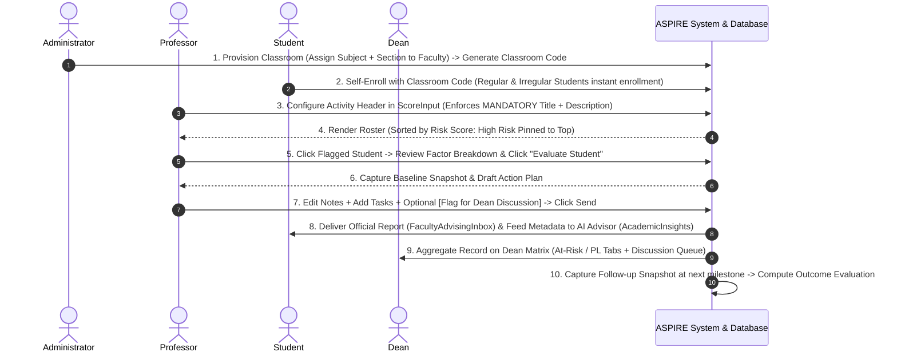

# Implementation Plan: ASPIRE Major System Update (v3.1)

> **System Core**: Building directly on the existing **SAGE** codebase (`sage/`).  
> **Project Title**: **ASPIRE** (*Academic Support and Performance Advising with Intervention, Risk, and Evaluation*)  
> **Document Version**: **v3.1 (September 14, 2026)** — Official Implementation Baseline  
> **Update Scope**: 
> 1. **Feature & Portal Removals**: Student-to-Faculty Evaluation, Form Builder, Eval Scheduler, Clearance Compliance Audit, **AND Complete Removal of College Office Portal** (`src/pages/office/*` wiped out).
> 2. **Transferred Responsibilities**: **Subject Assignment** transferred directly to **Professors** (self-assigning courses/class records via `[ + Create Class / Room ]`) and **Admin** (bulk roster import via `UserList.jsx`).
> 3. **Mandatory Activity Metadata**: Enforces **Activity Title + Activity Description/Scope** entry when adding activities in `ScoreInput.jsx` to feed the Student AI Academic Advisor.
> 4. **Core ASPIRE Innovations**: Explainable Multi-Factor Risk Assessment (0–100 score + trajectory detection), Student Priority Sorting (Students needing help pinned to top), Human-in-the-Loop Faculty Risk Evaluation modal, Baseline & Follow-up Outcome Snapshots (`student_risk_evaluations`), Direct 1-on-1 Consultations, Real-Time Running GWA & PL Target Engine, Dean Dual-Tier Risk Matrix (At-Risk + PL Risk) & Faculty-Dean Discussion Queue (`refer_to_dean`).

---

## 📌 Document Versioning Guide & Revision History

| Version | Date | Status | Key Scope Changes |
|---|---|---|---|
| **v1.0** | Aug 18, 2026 | Legacy | Original SAGE baseline (5 Portals, clearance locks, College Office). |
| **v2.0** | Sep 09, 2026 | Draft | Initial ASPIRE preliminary draft. |
| **v3.0** | Sep 14, 2026 | Refined | 6-stage closed loop, weighted risk model ($0\text{--}100$), baseline/follow-up snapshots. |
| **v3.1** | **Sep 14, 2026** | **ACTIVE** | **Current Official Specification**: Student-to-faculty evals 100% removed + **Mandatory Activity Title & Scope/Description Enforcement** for student AI advisor ingestion. |

---

## Workflow & Data Flow Architecture



---

## Detailed Step-by-Step Design

### Phase 1: Classroom Provisioning, Student Code Self-Enrollment & Activity Setup
* **Classroom Provisioning by Administrator (`ClassroomProvisioning.jsx`)**:
  * The Academic Administrator provisions teaching loads via `/admin/classrooms` by selecting **Department / College**, **Subject**, **Target Block Section**, and **Assigned Faculty**.
  * **Uniqueness Guard**: System checks for existing records for the same subject + section + academic term to prevent duplicate or conflicting classroom records.
  * **Classroom Code Generation**: System auto-generates a unique Classroom Code (e.g. `CS3A-8X92`).
  * **Universal Student Self-Enrollment**: Created with 0 initial students. Both regular block students and irregular students enter this Classroom Code in the Student Portal (`MyGradesList.jsx`) to be instantly enrolled in the official class record.

* **Mandatory Activity Metadata Setup (`ScoreInput.jsx`)**:
  * When a professor clicks to add or configure an activity column (`1 ⚙️`), the modal enforces **two mandatory fields**:
    * 📌 **Activity Title**: (e.g., `"Quiz 2"` or `"Major Project Milestone 1"`)
    * 📝 **Activity Scope / Description**: (e.g., `"Chapter 3: Linked Lists & Pointer Manipulation Concepts"`)
  * **Validation Rule**: The `[ Save Configuration ]` button remains disabled until BOTH fields are filled.
  * **Database Persistence**: Stores both fields in `class_activities` (`title`, `description`).
  * **AI Ingestion**: On the student side, `AcademicInsights.jsx` fetches `class_activities` metadata to generate topic-specific diagnostic cards (e.g., *"Weakest Topic: Linked Lists & Pointer Manipulation Concepts on Quiz 2"*).

* **Student Priority List & Sorting**:
  * Roster automatically sorts by **Risk Score in descending order**:
    * 🔴 **High / Critical Risk** (Score 50–100) — **Pinned to the top**.
    * 🟡 **Moderate / President's Lister (PL) Risk** (Score 25–49).
    * 🟢 **Low Risk / On Track** (Score 0–24).

---

### Phase 2: Explainable Risk Breakdown & Dual Context Trigger
* **Action**: Clicking a student's row opens their **Explainable Risk Factor Breakdown** (GWA Factor, Assessment Factor, Attendance Factor, Trajectory Factor).
* **Trigger Button**: Click `[ 📝 Evaluate Student ]` -> Select evaluation context (*Passing Recovery* vs. *PL Honor Retention*).

---

### Phase 3: HITL Evaluation & Baseline Capture (Human-in-the-Loop)
* Modal auto-captures `baseline_snapshot` (GWA, exam average, absence count at evaluation time).
* Professor customizes observation notes, catch-up tasks, and optional **`[ 💬 Flag for Dean Discussion ]`** checkbox.

---

### Phase 4: Report Dispatch & Dual-Engine Student Delivery
1. **Official Reports Center (`FacultyAdvisingInbox.jsx`)**: Displays binding professor evaluation reports and catch-up checklists.
2. **AI Personal Tutor (`AcademicInsights.jsx`)**: 
   * Ingests mandatory activity titles and scope descriptions from `class_activities`.
   * Displays **Subject Diagnostic Cards** with topic-level advice.
   * Real-Time Running GWA & PL Forecast Engine.

---

### Phase 5: Dean Dual-Tier Roster & Outcome Dashboard
* Dual-tier tabs: 🔴 *Academic At-Risk Roster* vs 🏆 *President's Lister (PL) Risk Roster*.
* Faculty-Dean Discussion Queue (`refer_to_dean = true`).
* Intervention Outcomes Dashboard displaying baseline vs. follow-up progress metrics.

---

## Database Schema Design

### `class_activities` (Activity Metadata Support)
```sql
ALTER TABLE IF EXISTS public.class_activities 
ADD COLUMN IF NOT EXISTS title VARCHAR(150) NOT NULL DEFAULT 'Untitled Activity',
ADD COLUMN IF NOT EXISTS description TEXT NOT NULL DEFAULT 'General Subject Assessment';
```

### `student_risk_evaluations` (Evaluation & Snapshots)
```sql
CREATE TABLE IF NOT EXISTS public.student_risk_evaluations (
    evaluation_id      UUID PRIMARY KEY DEFAULT gen_random_uuid(),
    class_record_id    UUID NOT NULL REFERENCES public.class_records(class_record_id) ON DELETE CASCADE,
    student_id         UUID NOT NULL REFERENCES public.users(user_id) ON DELETE CASCADE,
    faculty_id         UUID NOT NULL REFERENCES public.users(user_id) ON DELETE CASCADE,
    term               VARCHAR(20) NOT NULL CHECK (term IN ('prelim', 'midterm', 'semi_final', 'final')),
    
    evaluation_context VARCHAR(30) DEFAULT 'passing_recovery' CHECK (evaluation_context IN ('passing_recovery', 'pl_retention')),
    risk_level         VARCHAR(20) NOT NULL CHECK (risk_level IN ('low', 'moderate', 'high', 'critical')),
    risk_score         NUMERIC(5,2) NOT NULL DEFAULT 0.00,
    risk_breakdown     JSONB DEFAULT '{}'::jsonb,
    
    professor_notes    TEXT NOT NULL,
    advising_plan      JSONB NOT NULL,
    
    baseline_snapshot  JSONB DEFAULT '{}'::jsonb,
    followup_snapshot  JSONB DEFAULT '{}'::jsonb,
    
    refer_to_dean      BOOLEAN DEFAULT FALSE,
    status             VARCHAR(20) DEFAULT 'submitted' CHECK (status IN ('draft', 'submitted', 'acknowledged_by_student')),
    submitted_at       TIMESTAMP WITH TIME ZONE DEFAULT CURRENT_TIMESTAMP,
    updated_at         TIMESTAMP WITH TIME ZONE DEFAULT CURRENT_TIMESTAMP,
    
    UNIQUE(class_record_id, student_id, term)
);
```

---

## Proposed Changes by Component

### [Admin Portal]
#### [NEW] `src/pages/admin/ClassroomProvisioning.jsx`
- Master administrative console for assigning teaching loads (Subject + Section to Faculty).
- Generates official Classroom Code (e.g. `CS3A-8X92`), enforces unique subject-section-term constraints, monitors enrolled student counts, and safeguards against deleting classes with posted grades.

---

### [Faculty Portal]
#### [MODIFY] `src/pages/faculty/ScoreInput.jsx`
- Enforces **MANDATORY Activity Title** AND **Activity Scope/Description** input in the column header modal setup (`1 ⚙️`). Disables save until both fields are populated.

#### [MODIFY] `src/pages/faculty/ClassRecordsList.jsx`
- Centralized classroom management: displays official Classroom Join Code and live enrollment count for assigned loads.
- Student Priority List sorting (students needing help pinned to top).

#### [NEW] `src/pages/faculty/StudentRiskEvaluationModal.jsx`
- Split-pane modal editor with baseline snapshot capture and `refer_to_dean` checkbox.

---

### [Student Portal]
#### [MODIFY] `src/pages/student/MyGradesList.jsx`
- Self-enrollment modal accepting Classroom Codes for instant enrollment into official class records for both regular and irregular students.

#### [MODIFY] `src/pages/student/AcademicInsights.jsx`
- Consumes mandatory activity title & scope descriptions to render **Subject-Level Diagnostic Cards** and topic-level AI study advice.

#### [NEW] [`FacultyAdvisingInbox.jsx`](file:///c:/Users/JC%20Gabriel/Downloads/SAGE/sage/src/pages/student/FacultyAdvisingInbox.jsx)
- Displays binding professor evaluation reports and catch-up task checklists.

---

### [College Office Portal] (WIPED OUT & REMOVED)
#### [DELETE] `src/pages/office/*`
- Completely removed.

---

## Verification & Validation Plan

1. **Mandatory Activity Metadata Verification**:
   - Log in as Faculty -> Open `ScoreInput` -> Click column settings `1 ⚙️` -> Try to save with empty description -> Verify save button is disabled -> Enter Title (*Quiz 2*) and Scope Description (*Chapter 3 Pointers*) -> Save cleanly -> Log in as Student -> Open `AcademicInsights` -> Verify diagnostic card displays topic details.
2. **Outcome Evaluation Verification**:
   - Submit evaluation -> Verify `baseline_snapshot` is captured in `student_risk_evaluations` -> Update grades at next milestone -> Verify `followup_snapshot` calculates GWA change.
