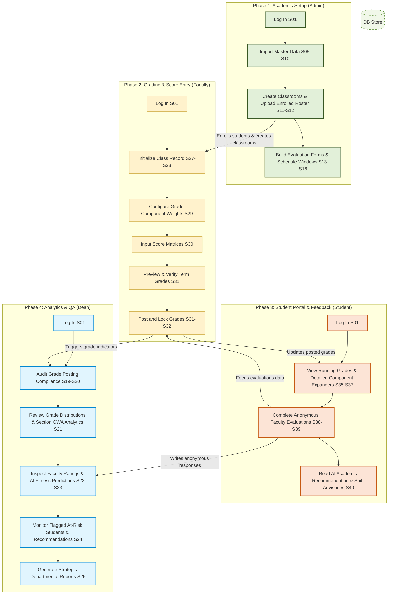
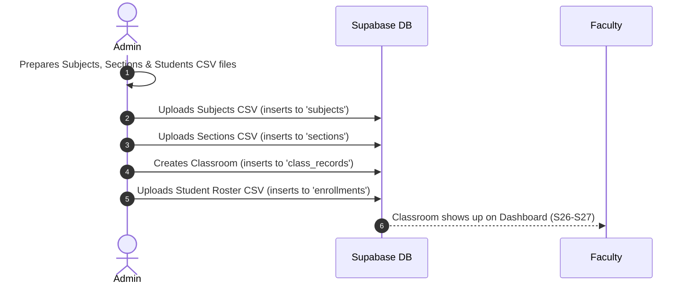
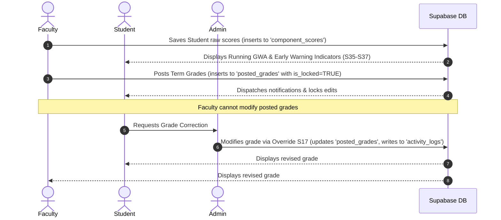
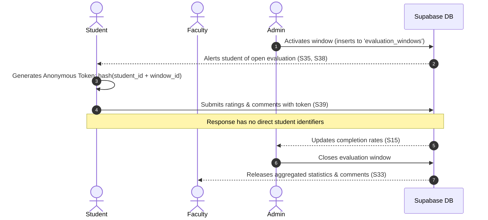
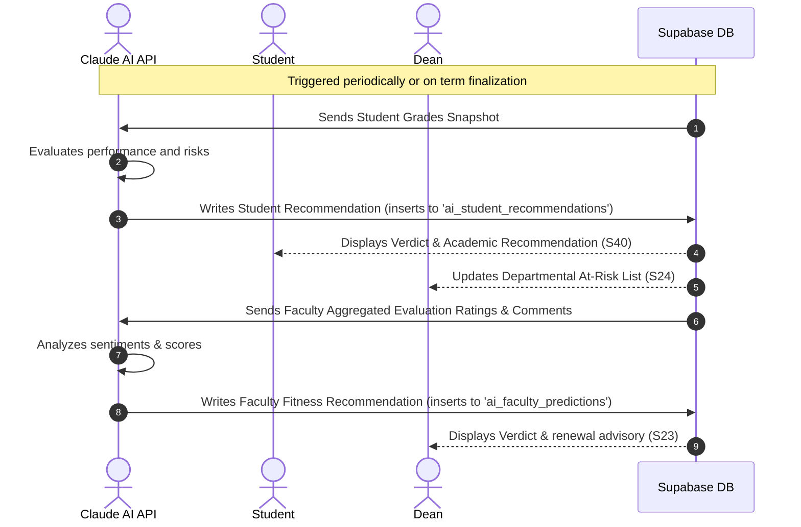

# SAGE: Smart Academic Grading and Evaluation System
## User Journey Flow Document
* **Institution**: Dr. Yanga's Colleges, Inc.
* **Program**: BS Information Technology — Capstone Project
* **Academic Year**: AY 2025–2026
* **Status**: Complete Reference Document

---

## 1. Executive Summary

This document describes the end-to-end user journeys for the **Smart Academic Grading and Evaluation System (SAGE)**. It traces how the four core user roles—**Admin**, **Faculty**, **Student**, and **Dean**—interact with the system interfaces (Screens **S01** to **S41**), and documents how these front-end actions translate to database transactions and record mutations in the **Supabase PostgreSQL** database.

---

## 2. Interactive User Role Matrix

| User Role | Primary Objective | Key Workflows | Key Database Touchpoints |
|---|---|---|---|
| **Admin** | System setup, imports, configuration & compliance | CSV imports (users, subjects, sections), class record generation, evaluation builder, evaluation window scheduling, grade override, and audit logging. | `users`, `subjects`, `sections`, `enrollments`, `class_records`, `evaluation_forms`, `evaluation_windows`, `activity_logs` |
| **Faculty** | Class record management, student score entry & evaluation | Class record initialization, grade component configuration, score entry, running grade monitoring, term grade locking/posting, evaluation & AI prediction review. | `class_records`, `grade_components`, `component_scores`, `posted_grades`, `ai_faculty_predictions` |
| **Student** | Grades review, faculty feedback & academic advising | Score tracking, component-level review, anonymous evaluation submission, viewing AI-generated course advising. | `posted_grades`, `component_scores`, `evaluation_responses`, `evaluation_ratings`, `evaluation_comments`, `ai_student_recommendations`, `notifications` |
| **Dean** | Oversight, quality assurance & academic analysis | Monitoring grade posting schedules, inspecting GWA distributions, reviewing faculty evaluations, viewing at-risk lists, examining AI predictions. | `class_records`, `posted_grades`, `evaluation_ratings`, `evaluation_comments`, `ai_student_recommendations`, `ai_faculty_predictions` |

---

## 3. Global User Journey Flow Diagram

This diagram maps out the chronological lifecycle of a single semester in SAGE, illustrating how actions of one user role unlock subsequent workflows for other roles.

---

## 4. Detailed User Journeys by Role

### 4.1 System Administrator

> [!NOTE]
> The Administrator serves as the system initiator. Their journey revolves around initializing the semester schema, managing accounts, and resolving grading discrepancies.

#### Step 1: Authentication & Role Verification
* **Action**: Admin enters credentials at the Login Page (**S01**).
* **UI Interaction**: Clicks "Login". The system verifies the role.
* **Database Action**: `SELECT` query on `users` where `email = input_email`. If role is confirmed as `'admin'`, redirects to Admin Dashboard (**S04**).

#### Step 2: Master Database Initialization
* **Action**: Pre-load structural assets—academic subjects and student sections.
* **UI Interaction**: Navigates to Subjects List (**S07**) and Sections List (**S09**). Clicks "Batch Import CSV/Excel" (**S08**, **S10**), selects sheets, previews the tabular validation grid, and clicks "Confirm Import".
* **Database Action**: 
  * `INSERT INTO subjects (code, name, units, department_id)`
  * `INSERT INTO sections (name, school_year, semester, department_id)`

#### Step 3: Classroom Creation & Student Enrollment
* **Action**: Group subject code, section name, and faculty members into a functional class, and enroll students.
* **UI Interaction**: Navigates to Classroom Directory (**S11**). Clicks "Create Classroom" (**S12**). Selects pre-loaded subject, section, and faculty member. Uploads student roster spreadsheet, checks validation errors in the preview panel, and clicks "Save Classroom".
* **Database Action**:
  * `INSERT INTO class_records (faculty_id, subject_id, section_id, school_year, semester)`
  * `INSERT INTO enrollments (student_id, section_id, subject_id, imported_by)`
  * `INSERT INTO class_faculty_log (class_record_id, faculty_id, assigned_by)`

#### Step 4: Faculty Evaluation Form Construction
* **Action**: Build and index the questionnaire items for student evaluation.
* **UI Interaction**: Navigates to Evaluation Form Builder (**S13**). Names the evaluation form, adds evaluation criteria categories (e.g. *Pedagogical Knowledge*, *Classroom Management*), defines description text, selects rating scales, and monitors the "Live Preview" layout. Saves the form.
* **Database Action**:
  * `INSERT INTO evaluation_forms (title, created_by)` returning `form_id`
  * Bulk `INSERT INTO evaluation_criteria (form_id, label, description, max_rating, order_index)`

#### Step 5: Scheduling Evaluation Windows
* **Action**: Define the active time period during which a specific student section can evaluate their assigned faculty member.
* **UI Interaction**: Navigates to Evaluation Window Scheduler (**S15-S16**). Selects the evaluation form template, section, and faculty. Inputs open and close dates and times. Clicks "Schedule window".
* **Database Action**:
  * `INSERT INTO evaluation_windows (form_id, faculty_id, section_id, open_at, close_at)` returning `window_id`
  * Bulk `INSERT INTO notifications (recipient_id, type, message)` querying all users registered under the chosen `section_id` to alert them of the opened evaluation window.

#### Step 6: Grade Override Auditing
* **Action**: Correct locked term grades on behalf of faculty due to computational errors, student consultations, or late submissions.
* **UI Interaction**: Navigates to Grade Override (**S17**). Searches by student name or section. Locates locked grade record, selects the target grading period, inputs the corrected numeric grade and status remarks, enters the justification reason in the text box, and hits "Confirm Override".
* **Database Action**:
  * `UPDATE posted_grades SET computed_grade = new_grade, remarks = new_remarks, override_by = admin_id, override_at = NOW()`
  * `INSERT INTO activity_logs (actor, action, message)` logging the full transaction details (e.g., `"Admin [Name] overrode grade for student X in subject Y from A to B. Reason: [Reason]"`).

---

### 4.2 Faculty Member

> [!NOTE]
> The Faculty journey revolves around defining grading rules, inputting student scores, monitoring student risk levels, and viewing student-provided evaluations.

#### Step 1: Accessing Dashboard & Initializing Classrooms
* **Action**: Access active classroom list for the current semester.
* **UI Interaction**: Logs in via **S01**. Reads metrics card summary (Total Classes, At-Risk Students) on Faculty Dashboard (**S26**). Clicks Class Records List (**S27**). Selects the classroom, which opens the classroom interface.
* **Database Action**: `SELECT * FROM class_records WHERE faculty_id = user_id AND status = 'active'`.

#### Step 2: Defining Grade Components & Weights
* **Action**: Configure grade components and weights per term (e.g., Prelim: Activities = 30%, Quizzes = 30%, Exam = 40%).
* **UI Interaction**: Navigates to Grade Components Setup (**S29**). Selects target grading period. Inputs types (Activities, Exams, Projects), descriptive names, max scores, and percentage weights. The front-end dynamically tallies weights and locks submission until total equals 100%. Clicks "Save Configuration".
* **Database Action**: Bulk `INSERT INTO grade_components (class_record_id, grade_period, type, name, weight, max_score)` for the classroom.

#### Step 3: Score Encoding & Real-Time Risk Tracking
* **Action**: Input student points for activities, quizzes, projects, or exams, and monitor calculated statuses.
* **UI Interaction**: Navigates to Score Input Table (**S30**). Uses the View Period dropdown to filter by term. Encodes numeric scores in the student spreadsheet grid. As numbers are entered, the interface automatically:
  * Computes the current running grade (GWA).
  * Displays color-coded risk flags: **Safe (Green)**, **At-Risk (Yellow)**, or **Failing Trajectory (Red)**.
  * Shows exact running percentages on hovering.
  * Faculty clicks "Save Student Row" or "Save All Scores".
* **Database Action**: 
  * Bulk `INSERT ... ON CONFLICT DO UPDATE` into `component_scores (component_id, student_id, score, encoded_by)`
  * `SELECT` queries to pull component scores and recalculate students' overall running standing dynamically.

#### Step 4: Term Grade Preview & Completeness Auditing
* **Action**: Verify term grades before locking them.
* **UI Interaction**: Clicks Grade Computation Preview (**S31**). Inspects the full calculation chain spreadsheet (Prelim Grade, Midterm Grade, Midterm Rating, Semestral Grade, and Remarks). Missing component marks are highlighted in red warnings. Uses the fullscreen toggle button to review larger sheets.
* **Database Action**: Reads all tables (`grade_components`, `component_scores`, `enrollments`) to output a projection of the final term grades.

#### Step 5: Final Grade Posting (Locking)
* **Action**: Lock the term grades to prevent further modifications and publish them to student portals.
* **UI Interaction**: Clicks "Post Grades" on **S31**. Confirms locking through the modal dialog. The screen shifts to read-only Posted Grades View (**S32**).
* **Database Action**:
  * Bulk `INSERT INTO posted_grades (class_record_id, student_id, grade_period, computed_grade, remarks, posted_by)`
  * Bulk `INSERT INTO notifications (recipient_id, type, message)` targeting all enrolled students in the section to notify them that their grades are published.

#### Step 6: Reviewing Evaluation Feedback & AI Predictions
* **Action**: Consult student evaluation reviews and review AI career recommendations.
* **UI Interaction**: Navigates to Evaluation Results (**S33**). Selects the evaluation window. Reviews ratings per category and reads anonymized comments. Inspects the AI-generated fitness prediction (e.g. verdict: *Recommended*).
* **Database Action**:
  * `SELECT * FROM ai_faculty_predictions WHERE faculty_id = user_id`
  * Aggregated query on `evaluation_ratings` and `evaluation_comments` linked to the faculty's evaluation windows (anonymity is preserved by not joining `users` table).

---

### 4.3 Student

> [!NOTE]
> The Student's journey is focused on performance assessment, complete grade transparency, and providing evaluation feedback.

#### Step 1: Dashboard and Grade Alerts
* **Action**: Monitor academic status and review system alerts.
* **UI Interaction**: Logs in via **S01**. Views Student Dashboard (**S35**), highlighting Enrolled Classes, Pending Evaluations, and AI Recommendations. Checks Notifications Drawer (**S41**) for grade postings or evaluation window open alerts.
* **Database Action**: `SELECT * FROM notifications WHERE recipient_id = user_id ORDER BY created_at DESC`.

#### Step 2: Detailed Grade Breakdown Consultations
* **Action**: Inspect component-level scoring and check for missing tasks or assignments.
* **UI Interaction**: Navigates to My Grades List (**S36**). Click on a subject card to load My Grades Detail (**S37**). Selects a term tab (e.g. *Midterm*).
  * Expands the **Class Standing Row** accordion to view individual scores (e.g., Activity 1 to 6).
  * Missing tasks are flagged as missing.
  * Scrolls to the bottom to view the **Complete Semestral Grade Record (Spreadsheet View)** showing the full grade computation chain.
* **Database Action**:
  * `SELECT * FROM posted_grades WHERE student_id = user_id`
  * `SELECT * FROM component_scores WHERE student_id = user_id` linked via `grade_components` and `class_records` to isolate individual activity, quiz, project, and exam metrics.

#### Step 3: Anonymous Faculty Evaluation Submission
* **Action**: Complete evaluations for faculty during active windows.
* **UI Interaction**: Navigates to Faculty Evaluation List (**S38**). Locates pending instructor evaluations, and clicks "Evaluate". On the Evaluation Form (**S39**), scores the criteria, writes qualitative feedback in the strengths and improvements text boxes, and clicks "Submit Evaluation".
* **Database Action**:
  * Checks if already evaluated: `SELECT 1 FROM evaluation_responses WHERE window_id = target_window AND anonymous_token = hashed_token` (where `hashed_token = SHA256(student_id + window_id)`).
  * `INSERT INTO evaluation_responses (window_id, anonymous_token)` returning `response_id`.
  * Bulk `INSERT INTO evaluation_ratings (response_id, criteria_id, rating)`
  * `INSERT INTO evaluation_comments (response_id, comment)`

> [!CAUTION]
> **Data Privacy Enforcement**: To comply with the Philippine Data Privacy Act (RA 10173), SAGE generates the `anonymous_token` deterministically on the client/middleware via a hash of the `student_id` and the `window_id`. This prevents duplicate submissions while ensuring that once written, the response record cannot be mapped back to the student's user ID.

#### Step 4: Reviewing AI Academic Advising
* **Action**: Access AI recommendations to determine academic status.
* **UI Interaction**: Navigates to AI Recommendation View (**S40**). Inspects AI Verdict badge (e.g. *Continue*, *At-Risk*, *Recommend Shift*) and reads the detailed text analysis based on their performance snapshot.
* **Database Action**: `SELECT * FROM ai_student_recommendations WHERE student_id = user_id ORDER BY generated_at DESC LIMIT 1`.

---

### 4.4 Academic Dean

> [!NOTE]
> The Academic Dean provides curriculum oversight. Their journey is designed for monitoring grade submissions, analyzing academic statistics, and reviewing faculty evaluations.

#### Step 1: Strategic Oversight Audits
* **Action**: Monitor grade posting compliance and check performance metrics.
* **UI Interaction**: Logs in via **S01**. Accesses Dean Dashboard (**S19**), checking total faculty counts, section statuses, and the number of at-risk students. Navigates to Grade Posting Status Overview (**S20**) to identify which faculty members have missed posting deadlines.
* **Database Action**: Query comparing active `class_records` for the term against the set of entries in `posted_grades` to highlight missing postings.

#### Step 2: Grade Distribution Analytics
* **Action**: Evaluate grade distributions for sections and subjects to identify outliers or unusual distributions.
* **UI Interaction**: Navigates to Grade Distribution View (**S21**). Selects a subject and section. Analyzes the distribution graph (visualizing passed vs failed ratios and letter grade distributions).
* **Database Action**: `SELECT computed_grade, remarks FROM posted_grades PG JOIN class_records CR ON PG.class_record_id = CR.class_record_id WHERE CR.subject_id = target_subject AND CR.section_id = target_section`.

#### Step 3: Faculty Evaluation & AI Fitness Auditing
* **Action**: Assess faculty performance and review AI recommendations for contract renewals or retraining programs.
* **UI Interaction**: Navigates to Faculty Evaluation Results Overview (**S22**). Clicks on a faculty profile (**S23**). Inspects:
  * Cumulative rating metrics per criteria.
  * Unsorted anonymized feedback comment cards.
  * AI Fitness Prediction details (verdict: *Recommended*, *Needs Improvement*, *Not Recommended*) and strong/weak point summaries.
* **Database Action**:
  * `SELECT * FROM ai_faculty_predictions WHERE faculty_id = target_faculty`
  * Aggregated scores from `evaluation_ratings` filtered by `evaluation_windows` for the target faculty.

#### Step 4: Tracking At-Risk Students
* **Action**: Review students flagged as at-risk to plan counseling or academic support.
* **UI Interaction**: Navigates to At-Risk Students List (**S24**). Filters list by department, severity levels, or sections. Reviews current GWAs, warning indicators, and AI recommendations.
* **Database Action**: `SELECT * FROM ai_student_recommendations R JOIN users U ON R.student_id = U.user_id WHERE R.recommendation = 'at_risk' OR R.recommendation = 'recommend_shift'`.

#### Step 5: Academic Report Generation & Exports
* **Action**: Generate physical archives or export academic performance reports.
* **UI Interaction**: Navigates to Summary Reports (**S25**). Configures data filters, selects report layouts (e.g. *Departmental GWA Standings*), reviews the print preview layout, and exports as PDF.
* **Database Action**: Complex read queries joining `posted_grades`, `users`, `sections`, `subjects`, and `departments` to generate the report view.

---

## 5. Cross-Functional Life Cycle Sequences

This section details how key business workflows operate across multiple roles and database tables.

### 5.1 Enrollment & Master Data Lifecycle

---

### 5.2 Grading, Calculations & Locking Sequence

The computation of student grades is automatically executed by SAGE based on the faculty's custom configurations. The calculation chain is structured as follows:

1. **Grade Components Setup**: Faculty defines weights ($W_i$) and maximum scores ($M_i$) for components within a term (Prelim, Midterm, Semi-Final, Final).
2. **Score Entry**: Faculty records raw scores ($S_{ij}$) for each student.
3. **Component Percentage Computation**:
   $$\text{Component Score} = \left( \frac{\sum \text{Raw Scores}}{\sum \text{Max Scores}} \right) \times W_i$$
4. **Term Grade Calculation**: The sum of all component scores for a term.
5. **Rating Aggregation**:
   * **Midterm Rating (MR)**: 
     $$\text{MR} = \left( \frac{\text{Prelim Grade}}{3} \right) + \left( \frac{2 \times \text{Midterm Grade}}{3} \right)$$
   * **Tentative Final Rating (TFR)**: 
     $$\text{TFR} = \left( \frac{\text{Semi-Final Grade}}{3} \right) + \left( \frac{2 \times \text{Final Grade}}{3} \right)$$
   * **Semestral Grade (SG)**: 
     $$\text{SG} = \left( \frac{\text{Midterm Rating}}{3} \right) + \left( \frac{2 \times \text{Tentative Final Rating}}{3} \right)$$

---

### 5.3 Faculty Evaluation & Anonymization Sequence

---

### 5.4 AI Advisor & Decision Cycle

---

## 6. Detailed Data Flows & Table Mutations

To assist developers during implementation, this section maps key UI actions directly to their corresponding SQL mutations.

### 6.1 Administrator Actions

| UI Action | Screen | SQL Operation / Mutation |
|---|---|---|
| **Add New User** | S06 | `INSERT INTO users (last_name, first_name, middle_name, email, password_hash, role, department_id) VALUES (...)` |
| **Reassign Instructor** | S11 | `UPDATE class_records SET faculty_id = [NewFacultyID] WHERE class_record_id = [ClassID]`   `UPDATE class_faculty_log SET replaced_at = NOW(), replaced_by = [AdminID] WHERE class_record_id = [ClassID] AND replaced_at IS NULL`   `INSERT INTO class_faculty_log (class_record_id, faculty_id, assigned_at) VALUES (...)` |
| **Archive Section** | S11 | `UPDATE class_records SET status = 'archived' WHERE class_record_id = [ClassID]` |
| **Correct Score** | S17 | `UPDATE posted_grades SET computed_grade = [Score], remarks = [Remarks], override_by = [AdminID], override_at = NOW() WHERE posted_grade_id = [GradeID]`   `INSERT INTO activity_logs (actor, action, message) VALUES ([AdminEmail], 'OVERRIDE', ...)` |

### 6.2 Faculty Actions

| UI Action | Screen | SQL Operation / Mutation |
|---|---|---|
| **Save Component Settings** | S29 | `INSERT INTO grade_components (class_record_id, grade_period, type, name, weight, max_score) VALUES (...)` |
| **Record Student Score** | S30 | `INSERT INTO component_scores (component_id, student_id, score, encoded_by) VALUES (...) ON CONFLICT (component_id, student_id) DO UPDATE SET score = EXCLUDED.score` |
| **Publish Grade Period** | S31 | `INSERT INTO posted_grades (class_record_id, student_id, grade_period, computed_grade, remarks, posted_by) SELECT ...`   `INSERT INTO notifications (recipient_id, type, message) VALUES (...)` |

### 6.3 Student Actions

| UI Action | Screen | SQL Operation / Mutation |
|---|---|---|
| **Submit Evaluation** | S39 | `INSERT INTO evaluation_responses (window_id, anonymous_token) VALUES ([WindowID], [HashToken]) RETURNING response_id`   `INSERT INTO evaluation_ratings (response_id, criteria_id, rating) VALUES ...`   `INSERT INTO evaluation_comments (response_id, comment) VALUES ...` |
| **Update Notification Read Status** | S41 | `UPDATE notifications SET is_read = TRUE WHERE notification_id = [NotificationID]` |

---

*End of User Journey Flow Document — SAGE, DYCI Capstone Project AY 2025-2026*
