ASPIRE (Academic Support and Performance Advising with Intervention, Risk, and Evaluation)

A Capstone Thesis presented to the

Faculty of the College of Computer Studies

Dr. Yanga’s Colleges, Inc.

by

Abalos, Carl Jerome F.

Gabriel, John Christian C.

Sadiaza, Clarence Timothy G.

May 2026

CHAPTER 1

PROJECT RATIONALE

Introduction

The efficiency of academic administration directly dictates the quality of support provided to both students and educators. When faculty members are overwhelmed by manual administrative tasks, the time available for actual teaching and student mentorship is severely compromised. This project was developed to eliminate these bottlenecks by automating grading processes and deploying proactive intervention tools, ultimately fostering a more transparent and proactive academic environment. Guided by the core institutional values of excellence and compassion, this initiative directly aligns with the United Nations Sustainable Development Goal (SDG) 4: Quality Education, which seeks to ensure inclusive and equitable quality education and promote lifelong learning opportunities for all.

Globally, the trend in educational technology is rapidly shifting from static Learning Management Systems toward predictive learning analytics, early warning systems (EWS), and proactive academic intervention frameworks. Real-time learning analytics and AI-driven platforms can significantly enhance academic performance by processing multidimensional datasets (Tlili et al., 2025). Furthermore, modern performance tracking has shifted from merely recording grades to deploying proactive, data-driven retention frameworks. Research demonstrates that early detection combined with structured catch-up plans significantly improves student retention (Engineerica, 2024; Yousefi & Lim, 2025). Locally, early digitization efforts in the Philippines improved data management, but decentralized systems remained vulnerable (Pangcatan & Prado, 2019). However, recent studies demonstrate that centralized automated platforms significantly improve grading speed, accuracy, and transparency (Bacongol & Durango, 2025).

Despite these technological advancements, significant issues remain in traditional academic administration. Manual academic record-keeping is notoriously time-consuming and prone to errors (Pangcatan & Prado, 2019). Traditional academic monitoring often relies on delayed indicators, rendering interventions ineffective because alerts trigger only after the student has already disengaged or failed (Engineerica, 2024). Furthermore, existing grading portals lack performance trajectory analysis, failing to catch high-performing students who experience sudden grade dips (e.g., from 88% to 80%) before they hit failing thresholds.

To address these local challenges, the objective of this project is to create a comprehensive academic management portal. Currently, there is a lack of an explainable, multi-factor risk model, which makes academic alerts feel arbitrary or like a black box. Additionally, institutions face a lack of a structured channel for professors to assign concrete, trackable catch-up tasks to at-risk students. The proposed system resolves these by providing a comprehensive academic support and risk intervention portal that seamlessly integrates automated grading with actionable student retention features.

While current literature heavily supports automated grade calculation and static at-risk alert badges, a distinct research gap exists regarding closed-loop intervention platforms that integrate explainable multi-factor risk assessment, human-in-the-loop (HITL) faculty action planning, and baseline versus follow-up outcome evaluation to empirically prove whether at-risk students actually improved after receiving academic support.

The importance of this study lies in its dual capability to empower both students and academic leaders. First, it empowers students by delivering grounded, topic-specific AI study diagnostics—enabled by mandatory activity title and scope metadata—and providing real-time GWA/PL target forecasts so students can course-correct early. Second, it empowers Faculty and Deans by auto-sorting class rosters by risk severity, with High Risk students pinned to the top. This allows professors to selectively evaluate the top 2–3 struggling students without administrative burnout, while Deans monitor college-wide risk rosters and collaboration queues (`refer_to_dean`). Therefore, the purpose of this study is to develop ASPIRE, a comprehensive, AI-driven academic grading and intervention portal, ensuring proactive, data-driven student support.

Review of Related Literature and Studies

Related Literature

This section explores the conceptual and theoretical frameworks that underpin the development of an integrated academic management system for higher education. It reviews established literature on explainable multi-factor risk scoring, human-in-the-loop AI governance, pedagogical prompt grounding, and closed-loop intervention lifecycles. Collectively, these concepts provide the structural and theoretical foundation for designing a comprehensive, reliable, and evidence-based academic system.

Explainable Multi-Factor Risk Scoring & Trajectory Analysis

To address concerns that risk identification is arbitrary, contemporary Early Warning Systems (EWS) rely on strict mathematical weighting and algorithm-based scoring mechanisms. A 2025 study on predicting academic risk demonstrated the effectiveness of utilizing a composite risk score scaled from 0-100 that assigns specific statistical weights to indicators: w1(GWA) + w2(Assessment) + w3(Attendance) + w4(Trajectory). Explaining why composite mathematical formulas are superior to single-threshold badges (e.g., GWA > 3.00), Hussain et al. (2025) note that generating a final risk score from a weighted formula guarantees objective and highly accurate risk evaluations. Furthermore, monitoring performance decline across grading periods (e.g., Prelim to Midterm) identifies endangered students before they reach failing thresholds.

Human-in-the-Loop (HITL) AI Governance in Education

Higher education administration increasingly explores theoretical frameworks surrounding HITL AI interaction in academic decision-making. As advanced systems integrate predictive features, a 3-layer architecture becomes essential: (1) a Deterministic Math Engine that calculates objective risk scores and grade transmutations, (2) an AI Advisory Layer that explains learning gaps and recommends study strategies in a purely advisory capacity, and (3) a Faculty Authoritative Layer where the professor validates risk, sets qualitative observation notes, assigns catch-up tasks, and approves intervention dispatch. Research demonstrates that AI must never autonomously determine official grades, risk statuses, or administrative actions, ensuring that human oversight remains the authoritative force (Al-Barrak & Al-Razgan, 2023).

Pedagogical Prompt Grounding & Mandatory Metadata Enforcement

The application of AI in education increasingly relies on literature surrounding AI prompt engineering, Retrieval-Augmented Generation (RAG), and domain grounding. Requiring professors to input both the Activity Title (e.g., "Quiz 2") and Activity Scope/Description (e.g., "Chapter 3: Linked Lists & Pointers") eliminates AI hallucination. This mandatory metadata enforcement enables the AI Academic Advisor to deliver grounded, topic-specific student diagnostics instead of generic text, paving the way for automated, personalized learning interventions based on factual academic context (Ouatiq et al., 2025; Tlili et al., 2025).

Closed-Loop Intervention Lifecycles & Outcome Evaluation

Modern performance tracking in higher education has shifted from merely recording grades to deploying proactive, data-driven intervention lifecycles. Evaluating outcome effectiveness in higher education relies on a 6-stage lifecycle: Detect -> Evaluate -> Intervene -> Monitor -> Measure Outcome -> Reassess. Highlighting this closed-loop pipeline, researchers emphasize the use of baseline versus follow-up snapshots to quantify academic recovery, risk-level transitions, and task completion rates. A targeted student retention strategy, powered by continuous monitoring and outcome measurement, enables institutions to identify and aid students needing support effectively (Engineerica, 2024).

Related Studies 

This section presents existing research studies that are closely aligned with the features and objectives of the proposed system. The studies reviewed cover automated grading systems, early warning and student retention models, and real-time predictive analytics. Each study contributes insights that inform the design, functionality, and theoretical grounding of the system being developed.

Early Warning Systems (EWS) & Student Retention Systems

Research conducted in 2026 on university student retention evaluated the influence of academic and behavioral integration on student continuity. By applying supervised classification models and composite risk scoring to student records, the study categorized retention probabilities. It concluded that data mining is essential for understanding the specific determinants of attrition, allowing universities to transition from generalized support to precise, individualized intervention plans (Aborokbah et al., 2026). In the Philippine context, a 2025 study developed a data-driven model specifically for student retention in a Philippine Higher Education Institution. The study emphasized that providing HEI policymakers with predictive, localized data is crucial for creating effective, culturally contextualized early intervention plans (Quizon et al., 2025).

Educational Data Mining (EDM) & Performance Prediction

A 2025 in-depth analysis published in Computers synthesized findings on how Educational Data Mining (EDM) and predictive modeling facilitate the early identification of academic struggles. The study provided a comprehensive framework demonstrating that predictive models leverage historical and real-time academic activity metadata and semester-based time-series data to accurately forecast student trajectories (Ouatiq et al., 2025). Another 2025 study focused on predicting student performance by applying EDM techniques to learning management system data, finding that such analysis categorizes retention probabilities effectively and notifies students of specific academic gaps (Mhakure et al., 2025).

Real-Time Academic Analytics & Advising Dashboards

While data-driven leadership enhances educational outcomes, manual data retrieval often creates operational bottlenecks. A 2025 study by Secreto, Ofrin, and Tabo at a Philippine state university emphasized data-driven early warning models tailored for Filipino college students. The study found that real-time student progress monitoring resolves these delays by improving decision accuracy and enabling timely interventions. Administrators strongly advocated for integrating Artificial Intelligence into Student Information Systems to proactively identify at-risk students, directly supporting the AI-based recommendation module designed to advise students on course continuation.

Automated Grade Computation & Transmutation Platforms

Manual academic record-keeping is notoriously time-consuming and prone to errors. A 2025 study by Bacongol and Durango demonstrated that centralized automated platforms significantly improve grading speed, accuracy, and transparency. Validating centralized digital gradebooks that eliminate spreadsheet errors while preserving transparency, these systems ensure accurate, real-time grade accessibility for students without adding administrative burdens. These insights support the proposed system's foundational grading capability, enabling a transparent pipeline from automated grade computation directly into the intervention risk engines.

Statement of the Problem 

The current academic administration process at Dr. Yanga’s Colleges relies heavily on manual grade computation and reactive faculty evaluations, leading to delayed academic interventions, heavy administrative workloads for professors, and an inability to proactively address student or faculty performance risks. Furthermore, the lack of real-time grade transparency prevents students from self-monitoring their academic trajectory until the end of the grading period. This capstone project aims to address these limitations by developing an intelligent, centralized platform that automates grading computation, ensures immediate data transparency, and integrates predictive AI to provide proactive retention recommendations for both students and faculty members.

General Problem

How to design and develop an AI-driven academic grading and faculty evaluation portal?

Specific Problem

System Portal Integration: How can SAGE be designed to centralize and secure academic operations across five role-based portal interfaces (Student, Faculty, Dean, College Office, and Admin) under a centralized managed cloud database architecture?

Grading Automation: How can SAGE automate grading calculations and transmutations in strict compliance with the school's program-specific Computation of Grades (COG) templates (e.g., 50-40-10 for General/Professional Education, 30-60-10 for Health Sciences Theory, and distinct component breakdowns for Health Sciences RLE and Maritime Education), while correctly branching the calculation span between regular semesters (four grading periods: Prelim, Midterm, Semi-Final, Final) and summer terms (two grading periods: Midterm, Final), incorporating step-by-step intermediate average rounding (MR, TFR, SG) to eliminate manual calculation errors?

Time-Bound Evaluation: How can a faculty evaluation scheduler be developed to restrict survey access to specific, administrator-controlled timelines?

Student Data Privacy: How can student identity masking and anonymization filters be integrated into the evaluation module to protect student privacy and encourage honest reviews?

Diagnostic Analytics: How can deans and students be provided with real-time grade visibility, color-coded academic risk warning badges (GWAs below 3.00), and automated AI counselor advisory recommendations?

Security & Audit Trails: How can SAGE maintain administrative accountability through an audited grade override ledger and a system-wide chronological activity log?

Technology Acceptance Model (TAM) Validation: How acceptable is SAGE to users when evaluated using the TAM constructs of Perceived Ease of Use (PEOU), Perceived Usefulness (PU), and Behavioral Intention (BI) administered to a purposively selected sample of 50 participants representing various academic colleges at Dr. Yanga's Colleges, Inc.?

Software Quality Standards: How compliant is SAGE when evaluated against the software quality characteristics of the ISO/IEC 25010:2023 standard, specifically functional suitability, performance efficiency, usability, reliability, security, portability, and maintainability?

Objectives of the Study

This study defines the specific targets and measurable outcomes that the proposed academic management system intends to achieve for the institution.

General Objective

The overall goal of this study is to design and develop an AI-driven academic grading and faculty evaluation portal for Dr. Yanga that automates grade computation, enhances academic transparency, and utilizes predictive analytics to provide proactive retention recommendations for both students and faculty.

Specific Objectives

System Portal Integration: To develop a responsive web application featuring five distinct, role-based dashboards (Student, Faculty, Dean, College Office, and Admin) connected via a centralized managed cloud database to consolidate academic operations.

Grading Automation: To build an automated grading engine that applies the correct program-specific Computation of Grades (COG) template per subject (General/Professional Education, Health Sciences Theory, Health Sciences RLE, and Maritime Education), computes term averages by branching between regular (Prelim, Midterm, Semi-Final, Final) and summer (Midterm, Final) grading periods, and transmutates semestral ratings into GWA equivalents (1.00 to 5.00) with precise intermediate rounding to eliminate clerical errors.

Time-Bound Evaluation: To implement a calendar-validated scheduler panel enabling administrators to configure and enforce precise start/end dates for active student survey windows.

Student Data Privacy: To program anonymization filters that strip student names, IDs, and sections from completed surveys, storing evaluation details in isolated database tables to guarantee student privacy.

Diagnostic Analytics: To engineer visual dashboards displaying GWA distribution charts, color-coded at-risk warning badges (GWA below 3.00), and an AI counselor recommendation module powered by the Google Gemini 2.5 Flash API.

Security & Audit Trails: To create an audited grade override module that unlocks locked classes only with mandatory justification logging, supported by a system-wide chronological activity ledger.

Technology Acceptance Model (TAM) Validation: To evaluate the acceptability of SAGE using a forced-choice 4-point Likert scale TAM questionnaire (measuring PEOU, PU, and Behavioral Intention to adopt SAGE) administered to a purposively selected sample of 50 participants representing various academic colleges at Dr. Yanga's Colleges, Inc. of 50 participants from multiple academic departments.

Software Quality Standards: To assess SAGE's technical quality using the selected characteristics of the ISO/IEC 25010:2023 standard, verifying its functional suitability, performance efficiency, usability, reliability, security, portability, and maintainability.

Significance of the Study

The development of the Smart Academic Grading & Evaluation System (SAGE) provides tangible administrative, academic, and technical benefits to key stakeholders at Dr. Yanga's Colleges, Inc. (DYCI):

Students: Empowers students with real-time academic transparency through instant milestone grade visibility, itemized activity breakdowns, and proactive performance advisories generated by the Google Gemini 2.5 Flash AI engine. Protects student privacy through anonymous faculty evaluations while ensuring unbiased grade disclosures.

Faculty Members: Eliminates manual spreadsheet calculations and clerical transmutation errors by providing automated COG grading templates. Streamlines roster verification, attendance warning tracking, and formal grade change request routing with digital evidence attachments.

College Deans: Provides real-time academic oversight through department-wide grade posting matrices, GWA distribution analytics, and faculty evaluation drilldown tools, enabling evidence-based academic decisions and timely override reviews.

College Office Staff: Simplifies department-level administration through bulk CSV roster onboarding, automated subject assignments, custom evaluation form building, and digital clearance audit tracking.

Institution: Enhances overall administrative efficiency, data integrity, and compliance with institutional grading policies, contributing directly to institutional quality assurance and student retention goals.

Future Researchers: Serves as a technical blueprint and empirical reference for integrating generative AI diagnostics, evaluation-gated clearance locks, and automated grading engines into higher education management platforms.

Definition of Terms

For clarity, the following operational and technical terms are defined within the context of this study:

Admin: Refers to the System Administrator user role possessing global privileges for user account management, subject catalog maintenance, COG template definitions, and immutable audit ledger inspection.

Computation of Grades (COG): The official institutional grading formula rules of Dr. Yanga's Colleges, Inc. specifying the percentage weights assigned to Class Standing, Term Exams, Character, RLE, or Laboratory components.

Failure Due to Absences (FDA): An academic warning condition triggered when a student accumulates four or more recorded absences in a subject, displaying an advisory badge on student and faculty dashboards.

Midterm Rating (MR): The calculated intermediate academic mark representing student performance during the first half of a term.

Semestral Grade (SG): The final composite academic grade for a subject, calculated from Midterm and Tentative Final ratings, which remains blurred on the student ledger until instructor evaluations are completed.

Technology Acceptance Model (TAM): An established information systems framework measuring user adoption through Perceived Ease of Use (PEOU), Perceived Usefulness (PU), and Behavioral Intention (BI).

Tentative Final Rating (TFR): The calculated intermediate academic mark representing student performance during the second half of a term prior to final semestral combination.

Android Application Package (APK): The official package file format used by the Android operating system for distribution and sideloaded installation of mobile applications (specifically SAGE Mobile v1.0.0).

Capacitor.js: An open-source native cross-platform runtime engine that encapsulates modern web applications into native mobile container shells.

Device-Aware Adaptive Distribution: An architectural deployment pattern that dynamically inspects client operating systems to serve desktop PWAs or native mobile installation binaries.

Firebase Cloud Messaging (FCM): A cross-platform messaging service utilized to dispatch real-time push notification payloads to mobile devices upon grade posting.

Scope and Delimitation

Scope

Shared / Public Portal (Authentication & Security)

Role-Based Login System Module: Split-screen credential entry supporting server-side simulated role resolution (Student, Faculty, Dean, College Office, and Admin) with a Quick Demo Accounts Selector drawer for rapid role switching.

Forgot Password Module: Account verification module triggering Supabase Auth built-in password reset email flow with confirmation logging.

Reset Password Module: Password validation interface enforcing security strength constraints and updating user credentials via Supabase Auth.

 Student

Student Dashboard Module: Academic main screen featuring active term summaries, course progress indicators, and pending warning alerts.

Subject List Registry Module: Directory of enrolled courses displaying scheduled hours, assigned professors, and running academic progress indicators.

My Grades Panel Module: Academic ledger containing a dynamic semester selection dropdown. Displays the three standardized milestone grades per subject: Midterm Grade (MR), Tentative Final Grade (TFR), and Semestral Grade (SG), alongside transmuted GWA equivalents (1.00 to 5.00), passing remarks, and official transcripts. The MR and TFR columns become visible once posted by the professor, while the SG column remains blurred and locked until the student completes the corresponding instructor evaluation survey.

Granular Activity Detail Module: Dynamic breakdown per subject period that lists individual custom formative assessments and individual activity scores. Syncs directly to configured `class_activities` in the database, remaining blank unless the faculty has configured title/description. Student clicks on any item row to view details (Title, Coverage/Description, and Score) inside a modal popup.

Grade Acknowledgment Module: Once milestone grades are posted, prompts students to click "Acknowledge Grade" or submit comments to request a consultation; if a professor edits an already-acknowledged grade, the acknowledgment status resets and the student is notified to review and re-acknowledge. Evaluation surveys submitted after the scheduled deadline still count toward unlocking the student's Semestral Grade, but are flagged as late and excluded from the professor's official evaluation rating.

Onboarding & Verification Module: Guides new students through account activation, password setup, and Data Privacy Conformance acceptance.

Evaluations & Surveys Module: Active survey center displaying ongoing teacher evaluation windows, and an anonymous multi-criteria rating form.

Attendance Log Module: Attendance summary per enrolled course displaying Present, Late, and Absent records. Displays a prominent yellow FDA (Failure Due to Absences) advisory badge when absence count reaches 4 or more.

AI Academic Advisor Module: Academic counseling dashboard that packages current term grades and GWA into JSON metadata to invoke the Google Gemini 2.5 Flash API, outputting automated counseling recommendations, performance risk alerts, and growth advising strategies.

 Faculty 

Overview & Class Records Module: Dashboard displaying assigned section cards, class rosters, and active grade lock-out statuses.

Grade Weight Configuration Module: Displays the standardized weight distribution bound to each subject's Computation of Grades (COG) template (e.g., 50% Class Standing/40% Exams/10% Character for General and Professional Education, 30%/60%/10% for Health Sciences Theory, and separate multi-component breakdowns for Health Sciences RLE and Maritime Education Lecture/Laboratory subjects); instructors view but cannot alter the centrally configured weight templates, ensuring compliance with school grading guidelines.

Score Input Spreadsheet Module: Dynamic grid scorecard enabling the entry of student raw scores. Pre-initializes with 1 formative activity column (`act1`) to prevent clutter, expandable up to 6 custom columns. Unconfigured columns display a lock overlay (`🔒`) and are disabled. Faculty configure columns by clicking headers (`1 ⚙️`) to assign Title, Description, and Max Points (syncs to `class_activities`), unlocking grading. Supports dynamic view filters (Individual Term, Period Batch, and Semestral Grade Summary).

Grade Computation Preview Module: Live-calculating matrix mapping raw score conversions and displaying calculated term averages (Prelim, Midterm, Semi-Final, Final) and transmuted GWA equivalent outputs prior to final database commitment.

Faculty Evaluations Analytics Module: Performance dashboard rendering cumulative visual rating summaries and cards containing anonymized student comment logs, viewable only once the Dean has released the results for the term.

Dual-Channel Evaluation Comparison Module: Filter allowing faculty to view feedback as On-Time Only (Official), Late Only (Informational), or Combined, alongside a side-by-side comparison card highlighting rating deviations between on-time and late submissions to surface potential retaliation patterns.

Roster Verification Module: Queue of students who joined a class via join code, allowing instructors to approve or reject enrollment requests from their class roster.

Grade Change Request Module: Once a Semestral grade is sealed, allows faculty to submit a formal correction request with a stated reason and supporting evidence (e.g., medical certificates, exam sheets) for Dean approval.

Absence Warning Module: Recalculates attendance percentages and displays an at-risk warning badge next to students who have accumulated four or more absences, serving strictly as an advisory recommendation for faculty consideration rather than an automatic failure due to absences (FDA) lockout.

Announcements & Notifications Module: Dedicated inbox displaying administrative alerts, grade submission deadlines, and evaluation prompts.

Dean 

Dean's Dashboard Module: Strategic dashboard providing global metrics including department GPAs, grade submission rates, and active security audit indicators.

Grade Override Approval Module: Reviews pending grade change requests submitted by faculty, inspects the supporting evidence uploaded by the requesting professor, and approves or rejects each override.

Evaluation Release Gate Module: Toggles the release of student evaluation survey results; instructors cannot view their rating results until the Dean explicitly releases them. Comparative faculty rankings and leaderboards are computed using exclusively On-Time evaluations, while a dedicated retaliation-drift filter lets the Dean inspect on-time versus late score comparisons per department and course to flag irregular rating patterns.

Grade Posting Status Matrix Module: Central grid tracking posted vs. pending term grade files across all faculty and departments, complete with overdue status indicators.

Grade Distribution Analytics Module: Analytical dashboard calculating current department GWAs and displaying a custom-styled CSS grade bracket distribution chart (ranges from 1.00 to 5.00).

Faculty Evaluations Dashboard Module: Department-wide overview of teacher rankings, detailed question-by-question rating charts, and comment sentiment metrics.

At-Risk Students List Module: Real-time academic warning list tracking students with running GWAs below 3.00, color-coded severity levels, and automated system advisories.

Summary Reports Exporter Module: Print-ready document builder featuring customized CSS page-break stylesheets for exporting formatted reports.

College Office (Department Admin) 

Department Dashboard Module: Department-scoped overview displaying system metrics and a real-time transaction ledger feed limited strictly to the office's own department (e.g., a College Office can only view users, faculty, and class records belonging strictly to its assigned academic college).

Roster Import Module: Bulk-adds students and faculty via a simple CSV containing only email and role; the system automatically applies the office's own school and department metadata to each imported account.

Compliance Audit Module: Search dashboard for auditing student evaluation completion progress, used to sign off physical clearance sheets once all instructor surveys are confirmed complete.

Subject Assignment Module: Portal allowing Department Admins to assign master subjects from the subjects catalog to specific instructors within their department, prohibiting cross-department assignments.

Evaluation Form Builder Module: Custom evaluation criteria questionnaire manager allowing the college office to create, update, and deactivate evaluation questions scoped to their department, with a live Student View Preview.

Evaluation Windows Scheduler Module: Time-bound active window planner for scheduling student evaluation survey access windows, targeting specific academic years, sections, and faculty within the department.

Student Section Modifier Module: Lookup tool allowing Department Admins to update a student's assigned block section or convert them to Irregular status, updating their section assignment in the database.

Admin 

Admin Dashboard Module: Global overview displaying system-wide metrics, database records counts, and a real-time system transaction ledger feed for the institution.

User Management Directory Module: Master registry allowing administrators to add, search, filter, edit, and suspend user credentials for all roles across all departments.

Bulk User CSV Import Module: System-wide bulk account importer parsing a CSV file to batch-create user profiles with assigned system roles across all departments.

Subjects Catalog Module: Master catalog for managing all institutional course codes, subject titles, and credit units, with each subject bound to a specific grade computation template.

Grade Computation Templates Module: Centralized COG (Computation of Grades) manager allowing administrators to define and update custom grading formula templates and their component weight distributions (e.g., 50% Class Standing, 40% Exams, 10% Character).

Sections Management Module: Sections directory for creating and organizing class section shells by academic year and semester, available for Department Admins to assign to classrooms.

Departments Management Module: Master list for registering academic departments and linking Dean profiles to their respective college departments.

Grade Override Module: Administrative panel allowing lookups of locked classes and executing grade overrides with mandatory audit reason logging.

Audit Ledger Module: System activity ledger archiving accounts operations, grade overrides, faculty changes, and system events.

Database & System Settings Module: Global configuration panel for setting the active academic term, school year, and system-wide diagnostics; writes directly to the system settings registry.

Delimitation

The SAGE system is designed with specific operational limits regarding advanced functionalities. The AI Student Advisor leverages Google Gemini 2.5 Flash API integration for automated counseling recommendations, performance risk alerts, and student growth advising, which logs generated recommendations in `ai_counseling_logs` in the database. SAGE relies on managed cloud infrastructure (a centralized Postgres database service, transactional email relay, and cloud object storage) to host this data. Additionally, the application is limited to a single language, excluding any multi-language localization or internationalization (i18n) modules. The end-of-term Semester Purge Utility is implemented at the code level but remains soft-deleted and disabled pending further data-retention and compliance review; it is therefore excluded from this study's evaluated scope.

In terms of systems integration, while SAGE runs on a live, cloud-hosted backend rather than a purely offline prototype, it remains a self-contained platform that is not integrated with any of Dr. Yanga's Colleges, Inc.'s other institutional systems. It does not connect to, sync with, or query the school's legacy Student Information System (SIS), central registrar archives, financial billing ledgers, or external Learning Management Systems (LMS) such as Canvas or Moodle. Roster data is imported through standardized CSV uploads processed and validated within SAGE itself, without live callbacks to or synchronization with any external institutional directory.

Furthermore, the study's testing and evaluation phases are bound by a limited participant group and a localized simulation environment. The primary user validation and Technology Acceptance Model (TAM) testing involve only a selected sample size representing the College of Computer Studies (CS/IT department) at Dr. Yanga's Colleges, Inc., rather than the whole campus population or all college branches. All active role structures (Admin, College Office, Dean, Faculty, Student) are validated within Dr. Yanga's Colleges, Inc. as the sole active tenant, as SAGE is configured and deployed strictly for a single institutional tenant in this study.

Regarding hardware interfaces, development is strictly limited to web application software operations and does not cover custom physical interfaces or specialized input equipment. SAGE operates strictly on general-purpose computers, tablets, and mobile devices equipped with standard web browsers. It excludes integration with custom hardware such as biometric fingerprint scanners for student or staff verification, RFID or NFC attendance loggers, and barcode readers. The user interface interactions are facilitated solely by standard devices such as standard keyboards, mouse pointers, and consumer touchscreens.

Security features, while more robust than a purely local prototype, are still bounded in scope. SAGE implements admin-only account provisioning and secure credentials authentication. The study excludes multi-factor authentication (MFA), browser-based hardware fingerprinting (HWID), and email/SMS-based One-Time Passcode (OTP) verifications to prevent login friction in shared campus computer labs.

Finally, the SAGE platform is explicitly customized to match the organizational culture and localized grading guidelines of Dr. Yanga's Colleges, Inc.

Regarding mobile platforms, development covers web browsers and Android hybrid mobile packages via Capacitor.js (ph.edu.dyci.sage v1.0.0). Public release on commercial application stores (such as the Google Play Store and Apple App Store) is delimited due to institutional enterprise subscription policies; mobile distribution is facilitated directly through an institutional sideloaded Android Application Package (APK) delivery model and Safari PWA installation. All mathematical grade calculations, term weighting frameworks, rounding procedures, and transmutation rules correspond directly to the DYCI academic spreadsheet models. While the underlying database architecture is technically capable of supporting multiple tenant schools, this study's validation, testing, and evaluation are delimited to a single institutional deployment for Dr. Yanga's Colleges, Inc., and do not extend to onboarding or evaluating other campuses with divergent grading and academic policies.

Additionally, global administrator settings configurations — including dynamic tenant subdomain registration, institutional logo uploads, page watermark settings, and custom grade computation template creation interfaces — are excluded from the current system scope. These settings are configured statically in the backend database rather than managed through a visual dashboard interface.

Theoretical Framework 

To understand how the development of SAGE addresses grading inefficiencies, early warning diagnostics, and evaluation response rates at Dr. Yanga's Colleges, Inc. (DYCI), the study is anchored in a synthesized framework of four key theoretical foundations.

First, the research incorporates the Technology Acceptance Model (TAM) formulated by Davis (1989), which serves as the primary framework explaining how users come to accept and adopt digital platforms. This model posits that an individual’s behavioral intention to use a system is determined by two central cognitive constructs, namely Perceived Usefulness, which measures the degree to which a user believes that using a specific system would enhance their job or academic performance, and Perceived Ease of Use, which measures the degree to which a user believes that using the system will be free of physical and mental effort. In the context of the SAGE portal, TAM establishes the intellectual link between user interface design and portal adoption rates across Dr. Yanga's Colleges, Inc. (DYCI) administrative, faculty, and student stakeholders. For faculty members, perceived usefulness is operationalized through the automation of tedious grade conversions and term calculations, since automating these tasks eliminates manual mathematics errors and saves administrative hours compared to traditional Excel sheets. For students, perceived ease of use is operationalized through mobile-responsive dashboard navigations, clear period scorecards, and straightforward evaluation forms. By assessing TAM constructs through perceived ease of use and usefulness surveys, this study validates that SAGE’s design choices, such as the Quick Demo Accounts Selector drawer and instant multi-portal routing, directly drive long-term portal adoption.

Next, the DeLone & McLean Information Systems (IS) Success Model (1992, 2003) is integrated to measure the technical and organizational quality of SAGE. This model argues that system success is a multi-dimensional construct consisting of six interrelated variables, which are system quality, representing the technical performance, reliability, and responsiveness of the application; information quality, representing the accuracy, completeness, and timeliness of the data produced; service quality, representing the usability features and support offered to the system's users; and use or intention to use, user satisfaction, and net benefits, which together represent the ultimate organizational impacts of the system. The IS Success Model explains how the underlying engineering of SAGE directly translates to organizational efficiency at DYCI. System quality is represented by SAGE's robust client-side persistent database state engine, where the technical reliability of data caching, real-time user-status updates, and zero-latency page transitions constitute high system performance. Information quality is directly embodied by the precision of the SAGE mathematical grading engine, which computes intermediate term averages and rounds them step-by-step to avoid borderline rounding errors, thereby outputting high-integrity GWA transmutation metrics. Under this theory, high system and information quality directly influence user satisfaction among deans tracking grade posted statuses and administrators inspecting audit logs, which in turn generates net benefits in the form of transparent grading practices and audited academic records.

In addition to operational adoption and quality frameworks, the research is anchored on student persistence via Vincent Tinto’s Student Integration and Retention Theory (1975, 1993). This theory posits that student persistence and academic retention are highly dependent on the degree of academic and social integration a student experiences within their institution. Tinto argues that academic difficulties, low grade performance, and lack of institutional counseling support are primary factors leading to student dropouts or attrition. Therefore, early diagnostic interventions and continuous performance feedback are critical in helping students integrate academically and avoid failure. Tinto’s theory provides the academic justification for the At-Risk Students Early Warning Module and the AI Academic Advisor Portal in SAGE. The system establishes a direct link between early grade metrics and student intervention by continuously computing running GWAs and immediately flagging a student as at-risk if their GWA falls below the passing threshold of 3.00, thereby acting as an early warning diagnostic instrument. The AI Academic Advisor operates as a simulated digital counselor, translating raw grade performance metrics into actionable, contextual study recommendations. According to Tinto’s framework, these proactive features prevent student attrition by providing the real-time academic feedback necessary for students to self-correct before the final grading period, thus facilitating academic integration and institutional retention at DYCI.

Complementing these systems and retention models, Cognitive Load Theory (CLT) originally conceptualized by Sweller (1988) describes how the human brain processes information and manages memory resources by separating cognitive tasks into three specific loads. Intrinsic cognitive load represents the inherent difficulty of the task itself, extraneous cognitive load represents the mental effort wasted by the way information or tasks are presented to the user, and germane cognitive load represents the mental effort dedicated to processing and constructing meaningful mental models. CLT serves as the foundation for the visual ergonomics and design system implemented in SAGE, explaining how simplified dashboard visuals relate directly to user accuracy. Traditional Excel grading grids present high extraneous cognitive load due to cluttered formatting, formula complexities, and manually tracked cells. SAGE reduces this extraneous cognitive load by utilizing a clean, highly structured dashboard typography system composed of Sora and DM Sans fonts, and dividing tasks into progressive steps such as separate weight setup screens, score input spreadsheets, and final grade previews. By automatically validating that grade weight setups sum up to exactly 100% and providing real-time computed GWA estimates, SAGE offloads repetitive mental calculations, allowing faculty members to focus their cognitive capacity on teaching and student evaluation, thereby minimizing clerical data errors.

Through the synthesis of these four theories, SAGE is established not merely as a grading tool, but as an integrated sociotechnical solution. The Technology Acceptance Model establishes the relationship between UI design simplicity and user adoption, while the DeLone & McLean model relates technical database reliability and formula precision to organizational success. Simultaneously, Tinto’s theory justifies the academic value of early-risk alerts and AI diagnostics in preserving student enrollment, and Cognitive Load Theory provides the scientific rationale for visual interface standards that minimize user error. Together, these theories provide a comprehensive, academically validated foundation that justifies the development, features, and evaluation methodology of the SAGE portal.

Conceptual Framework

The conceptual framework of the Smart Academic Grading & Evaluation System (SAGE) is structured around the systematic flow of the Input-Process-Output-Feedback (IPOF) research model. This framework establishes a logical progression where the quality and structure of academic and technical inputs directly govern the efficiency of development and mathematical processes, which subsequently determine the precision of the output deliverables, all of which are continuously refined through evaluative user feedback loops. By organizing the system’s variables into these sequential, interconnected phases, the conceptual framework provides a transparent representation of how SAGE automates student rosters, executes precise grading calculations, monitors academic risk levels, and maintains security accountability at Dr. Yanga's Colleges, Inc. (DYCI).

The input phase serves as the fundamental baseline variable of the entire system, encompassing all the structural data, technical environments, and institutional grading guidelines necessary to initialize SAGE. Technical inputs comprise the core development configurations, which include React page components, Vite compiler configurations, Tailwind CSS v4 custom color themes, and the localized browser database schema. Academic inputs ingest master student roster files, department class lists, subject assignments, faculty bindings, raw activity matrices, term exam scorecards, and instructor evaluation templates. Crucially, the inputs are anchored by the official Computation of Grades (COG) rules of Dr. Yanga's Colleges, Inc., which bind distinct grading weight templates to each academic program (e.g., a fifty-forty-ten split across Class Standing, Term Exams, and Character for General and Professional Education, a thirty-sixty-ten split for Health Sciences Theory, and separate component structures for Health Sciences RLE and Maritime Education), computed across either four regular grading periods or two summer grading periods depending on term type, with a passing GWA equivalent threshold of 3.00. The integrity of these input variables is highly critical, as any inaccuracies or omissions in the CSV roster registries or initial course setups will directly cascade into the subsequent calculation and processing variables.

The process phase represents the operational variables of the study where raw inputs are calculated, parsed, and converted into functional software cycles. This stage encompasses the engineering of the student, faculty, dean, and admin portals, alongside the execution of the SAGE mathematical grading engine. During this phase, faculty score entries are compiled, raw points are converted to scaled scores, and student grades are pushed through term calculation formulas to calculate the preliminary, midterm, semi-final, and final grades. In strict alignment with the official DYCI spreadsheet rules, the process calculates intermediate ratings—specifically the midterm rating and the tentative final rating—and averages them to generate the final semestral grade, employing step-by-step whole integer rounding to eliminate borderline rounding errors. Simultaneously, the process phase coordinates the lifecycle of faculty evaluation surveys by opening time-bound scheduler windows, collecting anonymous student ratings, tracking response ratios, running at-risk student threshold checks, and managing administrative grade overrides with mandatory audit logging.

The output phase represents the final system deliverables and observable outcomes that result from the successful execution of the processing variables. The primary output is a high-fidelity, fully responsive web application deploying over thirty-five page screens, fully partitioned into dedicated portals for Students, Faculty, Deans, College Office, and Admins. SAGE outputs high-integrity academic records, automated remarks indicating passing or failing status, GWA equivalents transmutated onto the institutional scale, and print-ready transcripts styled with custom CSS page-break properties. Additionally, the system outputs diagnostic elements, including early-warning visual alerts for struggling students, custom advisor diagnostic recommendations, and faculty evaluation summaries depicting visual rating scales. For security and accountability, the system outputs a comprehensive, chronological audit ledger feed archiving all grade overrides, faculty reassignment histories, account toggles, and administrative actions.

The feedback phase completes the conceptual framework by establishing the qualitative and quantitative verification loops that drive iterative system optimization. This phase utilizes empirical validation metrics gathered through Technology Acceptance Model (TAM) survey instruments to measure perceived ease of use (PEOU) and perceived usefulness (PU) among actual DYCI administrators, deans, instructors, and students. Concurrently, the system is subjected to standardized quality assessments using selected ISO/IEC 25010:2023 software characteristics, assessing SAGE’s functional suitability, performance efficiency, usability, reliability, security, portability, and maintainability. The feedback, performance audits, and usability scores collected during this validation cycle are fed directly back into the input and process phases of the system. This cyclical loop ensures that any interface friction, formula discrepancies, or storage limitations are immediately identified and corrected, securing SAGE's reliability and alignment with DYCI's academic requirements for subsequent semesters.

Hypotheses of the Study 

The following hypotheses are formulated to evaluate the AI-driven academic grading and faculty evaluation portal in the context of academic administration and proactive intervention at Dr. Yanga's Colleges, Inc.:

On User Acceptance and Software Quality:

H₀: The developed system does not meet acceptable levels of user acceptance and software quality based on the Technology Acceptance Model (TAM) and ISO/IEC 25010:2023 standards.

H₁: The developed system meets acceptable levels (demonstrating a weighted mean rating >= 2.51 per TAM construct on the 4-point Likert scale) of user acceptance and software quality based on the Technology Acceptance Model (TAM) and ISO/IEC 25010:2023 standards.

On System Efficiency and Proactive Intervention:

H₀: There is no significant improvement in the speed, accuracy, and efficiency of grade distribution and proactive academic intervention after the implementation of the developed system.

H₁: There is an improvement in the speed, accuracy, and efficiency of grade distribution and proactive academic intervention after the implementation of the developed system.

CHAPTER 2

SYSTEM DEVELOPMENT

This chapter presents the complete system development process undertaken for SAGE (Smart Academic Grading & Evaluation System). It discusses the development approach, requirements analysis, system design, development stack, testing, implementation, and maintenance plan of the proposed system, and serves as the technical foundation of this capstone project.

System Development Methodology

This study utilized the Iterative and Incremental Model as the Software Development Life Cycle (SDLC) approach in developing SAGE (Smart Academic Grading & Evaluation System). This model was chosen to facilitate a structured, cycle-based development process that allows for progressive feature delivery while enabling system configurations to be adjusted based on ongoing testing and advisor feedback.

The Iterative and Incremental Model is a software development approach where the system is developed through a series of repeated cycles (iterations) and delivered in smaller portions called increments. Each increment represents a functional, testable component of SAGE (such as Authentication, the grading engine, and evaluation locking) that is designed, implemented, and evaluated before proceeding to subsequent modules. This approach allows the researchers to refine SAGE features iteratively based on user validation, ensuring that complex calculations and anti-retaliation rules are thoroughly validated before full deployment.

Phase 1: Initial Planning
The Initial Planning phase establishes the foundation of the entire development process by formally identifying the core problem, scope, objectives, constraints, and development timeline of the system. In this phase, the researchers conducted pre-surveys among faculty and students at Dr. Yanga's Colleges, Inc. to validate existing inefficiencies in academic grading and evaluations. Using the gathered data, the system scope, delimitations, and five user roles — Student, Faculty, Dean, College Office, and Admin — were formally defined. The researchers then selected the technology stack consisting of React 19, Vite, Supabase (PostgreSQL, Auth, Storage), and Google Gemini 2.5 Flash API. The evaluation frameworks were also identified, specifically the Technology Acceptance Model (TAM) and ISO/IEC 25010:2023 software quality standards.

Phase 2: Planning
The Planning phase occurs at the beginning of each development iteration and involves defining the specific goals, deliverables, and tasks for the current increment before development begins, ensuring that each cycle remains focused, organized, and aligned with the overall system objectives. In this phase, the researchers outlined the specific grading, authentication, and evaluation modules to be developed, mapping milestones and tasks to SAGE's project timeline.

Phase 3: Requirements
The Requirements phase involves the systematic identification and documentation of both functional and non-functional requirements for each iteration, gathered through stakeholder interviews and document analysis of existing academic grading sheets at DYCI. The researchers collected functional requirements (role guards, COG grade calculations, late survey clearances) and non-functional requirements (RLS security, sub-second latency, browser compatibility) to ensure all system elements were structured before design began.

Phase 4: Analysis & Design
The Analysis and Design phase translates the gathered requirements into a structured technical blueprint for the system, where the researchers analyzed the workflows of each user role and designed the database schema, user interface layouts, system architecture, and process flow diagrams. Entity Relationship Diagrams (ERDs) were created to map SAGE's database layers, including profiles, enrollments, grades, and evaluations.

Phase 5: Implementation
The Implementation phase involves the actual coding and development of the system modules based on the approved designs, carried out incrementally — one functional module at a time. The researchers developed SAGE's portals in sequence, starting with multi-tenancy and authentication, followed by the grading spreadsheet, join-code-based roster verification, grade posting, correction request evidence uploads to Supabase Storage, and evaluation-gated clearance locks.

Phase 6: Testing
The Testing phase systematically evaluates each completed module against the functional and non-functional requirements. The researchers conducted unit testing on the COG grade computation formulas and integration testing on role route guards and evaluation-gate logic across portals to identify and resolve defects early.

Phase 7: Evaluation
The Evaluation phase assesses the overall performance, usability, and quality of the completed iteration based on test results and stakeholder feedback. The researchers gathered initial feedback using TAM-based survey instruments to measure usability and ease of use, identifying adjustments needed for subsequent development cycles.

Phase 8: Planning (Next Iteration)
Following the evaluation of the previous increment, a new Planning phase begins where the improvement insights gathered during evaluation are incorporated into the next cycle's goals, ensuring that the system continuously evolves based on real user feedback. The researchers prioritized refinements like the dual-channel comparison cards and late evaluation tracking to enhance user satisfaction.

Phase 9: Implementation (Next Iteration)
This phase mirrors the initial Implementation phase but applies to the next development increment, integrating new features with all previously completed components. The researchers coded the retaliation-drift analytics, clearance audits, and user controls based on the refined plan.

Phase 10: Testing (Next Iteration)
Consistent with the iterative nature of the model, the Testing phase is repeated for each new increment to ensure that newly developed modules and applied refinements meet the required standards. Regression testing was performed to verify that previously validated grading and login flows remained unaffected by new integrations.

Phase 11: Evaluation (Next Iteration)
The Evaluation phase is similarly repeated to assess the quality and usability of the updated system increment. The researchers re-administered TAM-based feedback instruments to the target groups to measure whether usability and perceived usefulness ratings improved following the applied changes.

Phase 12: Deployment
The Deployment phase marks the final release of the fully integrated and validated system to its intended end-users. SAGE was deployed to the institutional cloud environment on Supabase, accounts were provisioned, and the final TAM and ISO/IEC 25010:2023 evaluation surveys were administered.

Figure 2.1 | Iterative and Incremental Software Development Lifecycle (SDLC)

[DRAWING GUIDE] Create a circular/spiral process diagram with 12 labeled phases arranged in iterative loops. Starting node: 'Initial Planning'. Inner loop (one iteration): Planning → Requirements → Analysis & Design → Implementation → Testing → Evaluation. Outer return arrow from Evaluation back to Planning for the next iteration. Final node at the bottom: 'Deployment'. Use two tones — one color for repeating phases, another for unique phases (Initial Planning, Deployment). Label each node with the phase number and name. Title the diagram: 'Iterative and Incremental SDLC — SAGE Development Lifecycle'.

Requirements Analysis

Requirements were gathered primarily through document analysis and adviser consultation rather than large-scale field surveys, given the technical nature of the system's core logic. The researchers reviewed the institution's official Computation of Grades (COG) policy document to identify the exact weight breakdowns required per academic program, and reviewed existing manual grading spreadsheets and evaluation forms used across academic colleges at Dr. Yanga's Colleges, Inc. to identify recurring pain points such as delayed grade releases, undocumented grade corrections, and low teacher-evaluation completion rates.

Functional requirements identified include: role-based access for five distinct user types (Student, Faculty, Dean, College Office, and Admin); automated grade computation based on subject-level Computation of Grades (COG) templates; a gradual grade-release and sealing workflow; an evaluation-gated grade visibility mechanism; a formal grade change request and approval workflow; and a professor-led, join-code-based classroom enrollment process.

Non-functional requirements identified include: institutional data isolation enforced through Supabase Row-Level Security (RLS) policies scoped to department and role; standard email/password authentication via Supabase Auth; responsiveness across desktop and mobile browsers; and auditability of grade overrides and account provisioning actions through an immutable audit log.

System Design

Architectural Design

SAGE is built on a cloud-hosted, single-tenant architecture deployed specifically for Dr. Yanga's Colleges, Inc. (DYCI). The backend is powered by Supabase, providing a managed PostgreSQL database, a built-in email/password authentication service, and Row-Level Security (RLS) policy enforcement that restricts each user to data within their own department and role boundary. Supabase Storage handles file uploads for grade-correction evidence attachments. The frontend is a Progressive Web Application (PWA) built with React 19 and Vite, communicating with Supabase directly from the client, with role-based route guards (RoleGuard) restricting each of the five portals to its authorized user type.

Existing System
The existing academic grading and evaluation framework at Dr. Yanga's Colleges, Inc. (DYCI) operates on a decentralized, manual, and offline workflow. Grade sheets are compiled manually by instructors using individual Excel spreadsheets and emailed or physically submitted to the College Office. Students have no real-time transparency into their performance logs and cannot verify if their input scores match official submissions. Grade corrections require physical signatures and paper forms routed from faculty to the Dean, which often introduces massive delays. Furthermore, teacher evaluations by students are conducted via paper forms at the end of the term, leading to manual transcription workloads, data discrepancies, and potential retaliation fears due to a lack of secure anonymity.

Existing System for the Student

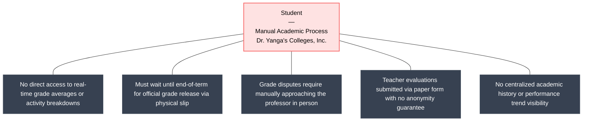

Figure 2.2 | Existing System for the Student

[DRAWING GUIDE] Create a vertical flowchart (swimlane or linear). Start: Student attends class. → Student waits for end-of-term grade release. → Student receives physical grade slip or verbal announcement. → If grade dispute: Student manually approaches professor → Professor reviews handwritten grade sheet → Correction submitted as paper form. → Student fills out paper teacher evaluation form at end of semester. → Evaluation submitted to College Office manually. End node: No real-time visibility, no anonymity guarantee. Use red/orange accents to highlight pain points (delays, manual steps, no transparency).

The student experiences significant operational friction and lack of transparency under the manual grading and evaluation framework. Without a centralized digital platform, students cannot view running grade averages, component weight breakdowns, or activity scores during the term, forcing them to manually record their own marks or remain uninformed until end-of-term physical grade slips are issued. When grade discrepancies or disputes occur, students must physically locate the instructor to request a manual grade sheet review and paper correction form routing. Furthermore, completing faculty performance evaluations requires filling out physical paper survey forms during class sessions or clearance periods, which fails to guarantee student anonymity and increases anxiety regarding potential grading retaliation from evaluated instructors.

Existing System for the Faculty

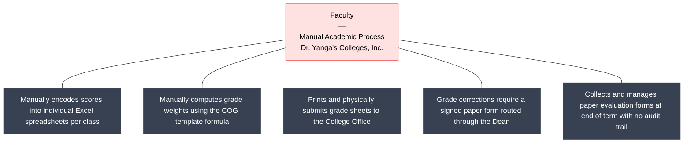

Figure 2.3 | Existing System for the Faculty

[DRAWING GUIDE] Vertical flowchart. Start: Faculty receives class list via physical roster or email. → Faculty manually encodes scores into individual Excel spreadsheets. → Faculty computes grade weights manually using COG template. → Faculty prints and submits grade sheets to College Office. → If grade correction needed: Faculty writes physical correction request → Collects signatures from Department Head and Dean → Submits to Registrar. → Faculty collects paper evaluation forms at end of term. End node: High error risk, no audit trail. Highlight pain points (manual calculations, paper routing, no version control).

Faculty members bear a heavy administrative burden within the traditional framework, relying entirely on offline, unstandardized Excel spreadsheets to maintain individual class grade records. Instructors must manually encode raw activity scores and execute complex, error-prone weight calculations adhering to official Computation of Grades (COG) policies. Once grades are computed, faculty members must print physical grade sheets and submit signed hard copies to the College Office. In the event of a post-submission grade correction, the instructor must draft a formal paper correction request and manually route it to collect hand-written approval signatures from department heads and the College Dean, introducing multi-week administrative turnaround delays. Furthermore, faculty members must manage paper evaluation forms without structured analytics or automated feedback protection.

Existing System for the College Office

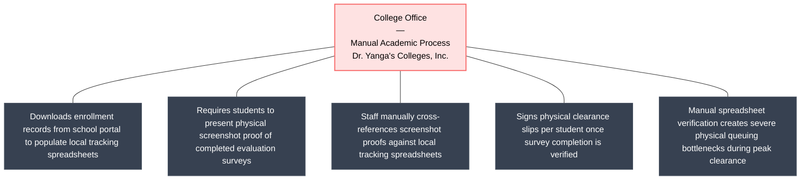

Figure 2.4 | Existing System for the College Office

[DRAWING GUIDE] Red-center hub-and-spoke diagram. Center node: College Office Manual Academic Process. Spokes highlight downloading school portal enrollment records into tracking spreadsheets, physical screenshot proof presentation by students, manual cross-referencing by staff before signing physical clearance slips, direct professor grade distribution, and severe physical queuing bottlenecks during peak clearance periods.

The College Office downloads enrollment records from the school portal to populate local tracking spreadsheets. During the clearance period, students must present screenshot proof of their completed evaluation surveys. Staff manually cross-references these screenshots against the spreadsheet to verify completion before signing physical clearance slips. Professors handle grade distribution directly with students (either face-to-face or via email), removing the office from the grade sheet filing process. However, the manual spreadsheet verification creates severe physical queuing bottlenecks when dozens of students request clearance simultaneously.

Existing System for the College Dean

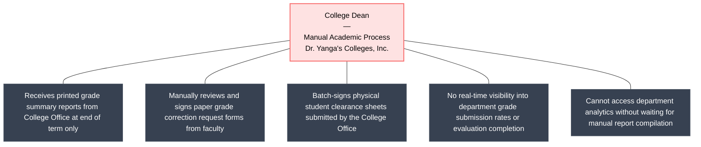

Figure 2.5 | Existing System for the College Dean

[DRAWING GUIDE] Vertical flowchart. Start: Dean receives printed grade summary reports from College Office at end of term. → Dean manually reviews paper grade correction request forms submitted by faculty. → Dean signs or rejects physical override request forms. → Dean signs physical student clearance sheets batch-submitted by the College Office. → No real-time visibility into department grade submission rates or evaluation completion. End node: Administrative bottleneck, delayed decision-making. Highlight: No dashboard, no real-time analytics.

The College Dean faces critical governance handicaps due to the absence of real-time administrative dashboards and aggregated academic analytics. Under the legacy framework, the Dean receives end-of-term printed summary reports compiled manually by the College Office, preventing proactive monitoring of section-level grade posting rates, department GPA distributions, or faculty performance benchmarks during the active semester. Administrative workflows are heavily paper-bound; the Dean must manually review and physically sign paper grade override forms submitted by faculty, as well as batch-sign physical student clearance documents. This offline, reactive clearance and approval cycle creates severe decision-making bottlenecks and leaves the college vulnerable to undocumented grade changes and untracked compliance gaps.

Proposed System
To address the limitations of the manual framework, the proposed Smart Academic Grading & Evaluation System (SAGE) introduces a centralized, cloud-based platform designed to automate grading validation, secure evaluations, and streamline clearance workflows. SAGE transitions the institution to a transparent, real-time grade-tracking ecosystem hosted on a centralized cloud platform.

By integrating self-reported student grade logs alongside official grades posted by faculty, SAGE creates a dual-channel validation mechanism. The core innovation of SAGE lies in its evaluation-gated clearance lock: students must complete anonymous evaluations for a class before their final semestral grade is unblurred, eliminating grading retaliation. The platform also automates grade correction routing, audit logs logging, and roster imports, ensuring absolute compliance and transparency.

Proposed System for the Student

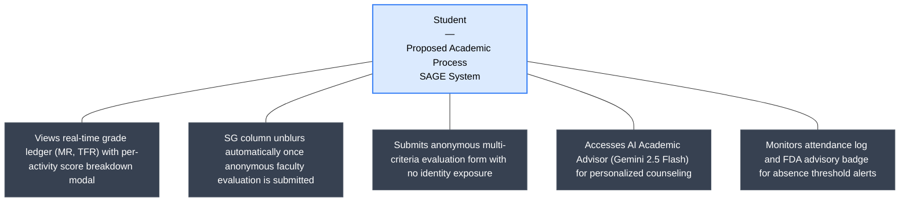

Figure 2.6 | Proposed System for the Student

[DRAWING GUIDE] Vertical flowchart with a clean modern style. Start: Student logs in via Supabase Auth → Student Dashboard shows active terms, GWA, and course list. → Student views My Grades Ledger (MR, TFR displayed; SG blurred until evaluation complete). → Student clicks subject row → Grade Breakdown Detail modal shows activity Title, Description, and Score. → Student clicks Evaluations tab → Submits anonymous multi-criteria evaluation form. → Clearance status updates to CLEARED. → SG column unblurs. → Student accesses AI Academic Advisor → Gemini 2.5 Flash generates counseling recommendations. → Student views Attendance Log. End node: Real-time transparency, anonymous evaluations, AI-guided advising. Use green accents for positive outcomes.

Under the proposed SAGE architecture, students gain immediate, transparent access to their complete academic standings via a dedicated mobile-responsive Student Portal. The My Grades Ledger presents real-time Midterm Ratings (MR) and Tentative Final Ratings (TFR), with an interactive modal displaying detailed activity titles, coverage descriptions, maximum points, and earned scores. The platform's core security mechanism—the evaluation-gated clearance lock—automatically blurs the official Semestral Grade (SG) until the student completes an anonymous, multi-criteria faculty evaluation survey, completely insulating students from grading retaliation. Furthermore, the portal integrates an AI Academic Advisor powered by Google Gemini 2.5 Flash API to deliver personalized performance counseling, alongside automated attendance logs and FDA advisory badges that alert students when absence thresholds are approached.

Proposed System for the Faculty

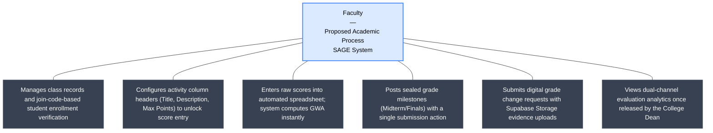

Figure 2.7 | Proposed System for the Faculty

[DRAWING GUIDE] Vertical flowchart. Start: Faculty logs in → Class Records overview shows assigned sections and join codes. → Faculty opens Score Input Spreadsheet for a class. → System pre-loads 1 activity column (act1). → Faculty clicks column header to open Activity Configurator modal → Enters Title, Description, Max Points → Column unlocks. → Faculty enters raw scores per student. → System auto-computes CS average, Exam average, transmuted GWA. → Faculty clicks Post Grades → Milestone posted (Midterm or Finals). → If grade correction needed: Faculty opens Posted Grades Ledger → Submits Grade Change Request with reason and Supabase Storage evidence file. → Faculty views Evaluation Results (only after Dean releases toggle). End node: Automated computation, audit-ready corrections. Use blue accents.

The Proposed System for the Faculty replaces offline spreadsheets with a standardized, web-based Score Input Spreadsheet integrated directly into the SAGE platform. Instructors join assigned sections via professor-generated join codes and configure formative activity column headers (Title, Description, Max Points) to unlock score entry cells. SAGE automatically executes non-editable, program-specific COG weighting algorithms in real time, eliminating manual calculation errors and displaying instant transmuted GWA previews. Milestone grade postings (Midterm and Final) are sealed and committed with a single click. When grade adjustments are required post-seal, faculty submit digital Grade Change Requests complete with mandatory Supabase Storage evidence uploads for Dean review. Additionally, instructors gain access to dual-channel evaluation analytics once released by the Dean, protecting survey integrity while offering actionable pedagogical feedback.

Proposed System for the College Office

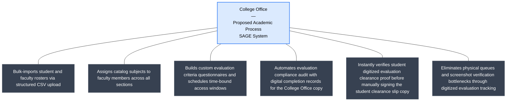

Figure 2.8 | Proposed System for the College Office

[DRAWING GUIDE] Blue-center hub-and-spoke diagram. Center node: College Office Proposed Academic Process (SAGE System). Spokes highlight bulk CSV roster imports, subject assignments, evaluation criteria configuration and window scheduling, automated digital evaluation records for the College Office copy, streamlined manual signing of the physical student clearance slip copy using digitized evaluation proofs, and elimination of physical queuing bottlenecks.

The College Office utilizes bulk CSV roster imports and real-time clearance compliance lists to instantly verify evaluation completions. While physical clearance slips are still manually signed for the student's physical copy, the process is rendered far more efficient through digitized evaluation tracking—storing an automated digital clearance record for the College Office copy and providing digitized evaluation proof for the student copy, eliminating manual screenshot cross-referencing and physical queuing bottlenecks.

Proposed System for the College Dean

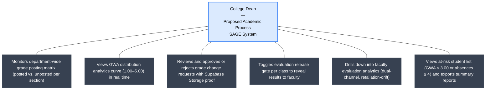

Figure 2.9 | Proposed System for the College Dean

[DRAWING GUIDE] Vertical flowchart. Start: Dean logs in → Dean Dashboard shows pending corrections count and evaluation benchmarks. → Dean views Department Grade Matrix (posted vs. unposted per section). → Dean views Grade Distribution Analytics (bar chart 1.00–5.00 distribution). → Dean reviews pending Grade Change Requests → Inspects Supabase Storage evidence → Approves or Rejects. → Dean views Evaluation Results Overview → Toggles is_released_to_faculty per class. → Dean drills down to Faculty Evaluation Drilldown → Views criteria ratings, on-time vs. late comparisons. → Dean views At-Risk Students List → Reviews students with GWA below 3.00. → Dean exports Summary Reports. End node: Real-time oversight, data-driven decisions.

The Proposed System for the College Dean empowers academic leadership with real-time institutional governance tools and department-wide decision-making analytics. Through the Dean Portal, the Dean monitors an interactive Grade Posting Status Matrix tracking section-by-section submission compliance, alongside live GWA distribution curves (1.00–5.00) across academic programs. An electronic Grade Override Queue allows the Dean to inspect attached Supabase Storage proof files and digitally approve or reject faculty correction requests with full audit transparency. The Dean also controls the Evaluation Release Gate, toggling feedback visibility per class section, and utilizes drilldown radar analytics to evaluate faculty teaching effectiveness and detect retaliatory rating drift. Finally, an At-Risk Student Monitor flags students with GWA warnings (< 3.00) or excessive absences (≥ 4), enabling early intervention and single-click summary report exports.

Proposed System for the Admin

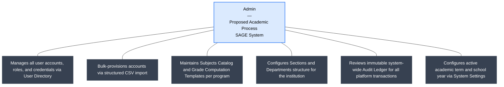

Figure 2.10 | Proposed System for the Admin

[DRAWING GUIDE] Vertical flowchart. Start: System Admin logs in → Admin Dashboard shows global metrics (total users, departments, audit log count). → Admin manages users via User Management Directory (add, edit, suspend, role change). → Admin bulk-imports accounts via CSV (Bulk User CSV Import). → Admin manages Subjects Catalog (add/bind subjects to COG templates). → Admin manages Grade Computation Templates (define weight components). → Admin creates Sections and Departments. → Admin reviews system-wide Audit Ledger (immutable read-only log). → Admin configures Database and System Settings (active academic term, school year). End node: Full institutional control, immutable audit trail.

The Proposed System for the Admin provides centralized governance, security configuration, and institutional data management via the Admin Portal. System Administrators manage user accounts, assign role permissions (Student, Faculty, College Office, Dean, Admin), and execute bulk CSV account provisioning to onboard entire institutional cohorts efficiently. The Admin maintains the master Subjects Catalog, configures non-editable Computation of Grades (COG) weighting templates per academic program, and establishes section shells and department structures. Crucially, the Admin monitors an immutable, chronological Audit Ledger archiving every platform transaction—including grade overrides, account modifications, and system configuration updates—to ensure institutional compliance, data integrity, and complete auditability across all five SAGE portals.

Requirement Specifications and Analysis
This section presents the requirement specifications and analysis for the proposed SAGE system. It defines and organizes the system requirements based on data gathered from students, faculty members, college office personnel, and deans at Dr. Yanga’s Colleges, Inc. (DYCI) through pre-surveys and document analysis.

Process Design
Data Flow Diagram
The Data Flow Diagram (DFD) illustrates the logical flow of inputs, outputs, and processes within SAGE. The Context Diagram (Level 0) shows the system boundary with all five external roles, while the Level 1 diagrams show detailed portal operations.

Level 0 Data Flow Diagram (SAGE Context Diagram)

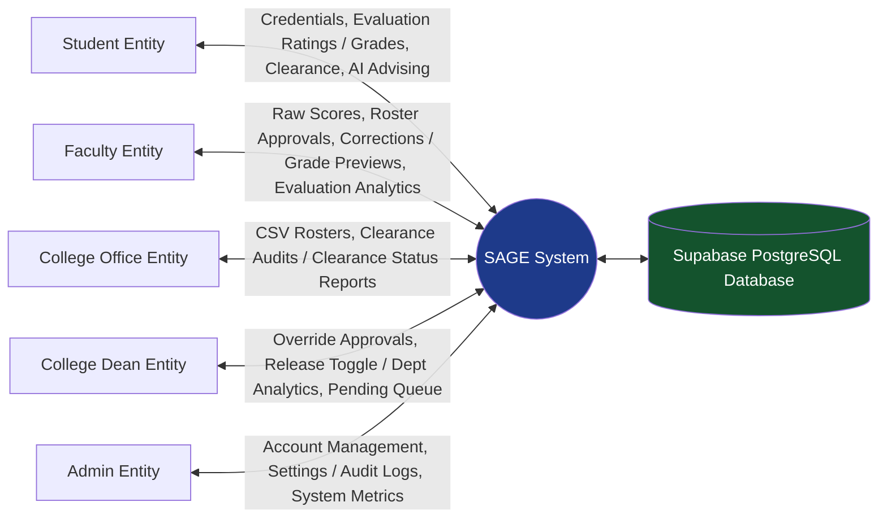

Figure 2.11 | Level 0 Data Flow Diagram (SAGE Context Diagram)

[DRAWING GUIDE] Draw a Level 0 DFD (Context Diagram). Center rectangle labeled 'SAGE System'. Surround it with 5 external entity boxes (rectangles with double left border): Student, Faculty, College Office, College Dean, Admin. Draw arrows with labels:
- Student → SAGE: Credentials, Evaluation Ratings
- SAGE → Student: Posted Grades, Clearance Status, AI Advisor Recommendations
- Faculty → SAGE: Raw Scores, Roster Approvals, Grade Correction Requests
- SAGE → Faculty: Computed Grade Previews, Evaluation Results (when released)
- College Office → SAGE: CSV Rosters, Clearance Sign-offs
- SAGE → College Office: Clearance Status Reports
- College Dean → SAGE: Override Approvals, Evaluation Release Toggle
- SAGE → College Dean: Department Analytics, Pending Correction Queue
- Admin → SAGE: Account Management, Settings
- SAGE → Admin: Audit Logs, System Metrics
Center data store cylinder labeled: 'Supabase PostgreSQL DB'. Style: standard Yourdon-DeMarco DFD notation.

The Level 0 Data Flow Diagram (Context Diagram) illustrates the high-level boundary of the SAGE platform and the primary inputs and outputs exchanged between SAGE and its five role-based external entities. The Student entity inputs credentials and teacher evaluation ratings, receiving posted grades, clearance indicators, and advisor recommendations. The Faculty entity inputs student raw scores, class roster approvals, and grade correction requests, receiving computed term previews and class risk summaries. The College Office entity uploads student/faculty CSV rosters and audits clearance records. The College Dean entity reviews and approves grade override requests and toggles the evaluation release gates. Finally, the Admin controls master user accounts and audits transactions. All operational transactions read from and write to the central Supabase PostgreSQL Database to ensure data isolation.

Level 1 Data Flow Diagrams

Level 1 Data Flow Diagram: Student Portal

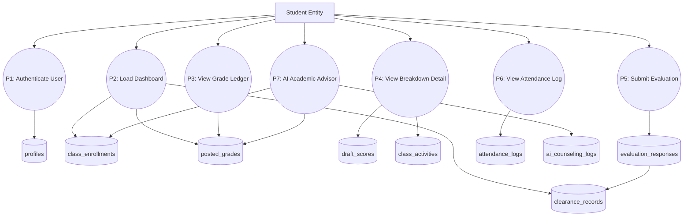

Figure 2.12 | Level 1 Data Flow Diagram: Student Portal

[DRAWING GUIDE] Draw a Level 1 DFD for the Student Portal. External entity: Student.
Processes:
- P1: Authenticate User (reads profiles)
- P2: Load Dashboard (reads class_enrollments, posted_grades, clearance_records)
- P3: View Grade Ledger (reads posted_grades, class_records → outputs MR, TFR, gated SG)
- P4: View Grade Breakdown Detail (reads draft_scores, class_activities → displays Title, Description, Score in modal)
- P5: Submit Evaluation (reads evaluation_windows, evaluation_criteria → writes evaluation_responses, evaluation_ratings, evaluation_comments → updates clearance_records)
- P6: View Attendance Log (reads attendance_logs → displays counts and FDA advisory badge if absences >= 4)
- P7: AI Academic Advisor (reads posted_grades, class_enrollments → calls Gemini 2.5 Flash API → writes ai_counseling_logs → outputs recommendations)
Data stores: profiles, class_enrollments, posted_grades, draft_scores, class_activities, evaluation_windows, evaluation_responses, clearance_records, attendance_logs, ai_counseling_logs. Standard Yourdon-DeMarco DFD notation.

The Level 1 DFD for the Student Portal details the functional processes available to students. It illustrates how student credentials authenticate against the user profile store, how enrolled class records populate the My Grades ledger, how activity scores are pulled into the click-to-view breakdown modal, how anonymous faculty evaluation responses update clearance records, how attendance logs trigger FDA advisory badges, and how academic records are processed by the Google Gemini 2.5 Flash API to generate personalized counseling advisories.

Level 1 Data Flow Diagram: Faculty Portal

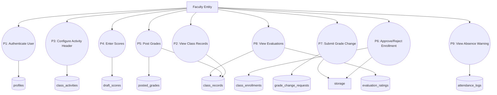

Figure 2.13 | Level 1 Data Flow Diagram: Faculty Portal

[DRAWING GUIDE] Draw a Level 1 DFD for the Faculty Portal. External entity: Faculty.
Processes:
- P1: Authenticate User (reads profiles)
- P2: View Class Records (reads class_records, sections, subjects → outputs class list and join codes)
- P3: Configure Activity Header (reads/writes class_activities → unlocks spreadsheet columns)
- P4: Enter Scores (reads class_activities, class_enrollments → writes draft_scores → auto-computes CS/Exam averages and GWA)
- P5: Post Grades (reads draft_scores → writes posted_grades, class_records milestone flags)
- P6: Approve/Reject Enrollment (reads class_enrollments → updates enrollment status active/rejected)
- P7: Submit Grade Change Request (reads posted_grades → uploads proof to Supabase Storage → writes grade_change_requests)
- P8: View Evaluation Results (reads evaluation_ratings, evaluation_comments, class_records is_released_to_faculty → displays dual-channel rating summaries)
- P9: View Absence Warnings (reads attendance_logs → outputs FDA badges for absences >= 4)
Data stores: profiles, class_records, class_activities, draft_scores, posted_grades, class_enrollments, grade_change_requests, evaluation_ratings, attendance_logs. Standard Yourdon-DeMarco notation.

The Level 1 DFD for the Faculty Portal maps the operational processes involved in classroom management and grade entry. It details how faculty view assigned class offerings, configure formative activity header metadata (Title, Description, Max Points) to unlock spreadsheet cells, enter raw student marks into draft score stores, trigger automatic term weighting calculations, seal and post final grades, submit formal grade change requests with attached evidence files, review released student evaluation analytics, and monitor student attendance warnings.

Level 1 Data Flow Diagram: College Office Portal

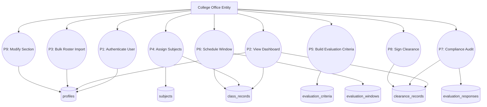

Figure 2.14 | Level 1 Data Flow Diagram: College Office Portal

[DRAWING GUIDE] Draw a Level 1 DFD for the College Office Portal. External entity: Department Admin (College Office).
Processes:
- P1: Authenticate User (reads profiles)
- P2: View Department Dashboard (reads department-scoped metrics from profiles, class_records, clearance_records)
- P3: Bulk Import Roster (parses CSV → writes Supabase Auth + profiles)
- P4: Assign Subjects (reads subjects, profiles → writes class_records faculty assignments)
- P5: Build Evaluation Criteria (reads/writes evaluation_criteria)
- P6: Schedule Evaluation Windows (reads sections, class_records → writes evaluation_windows start/end dates)
- P7: Compliance Audit (reads class_enrollments, evaluation_responses → outputs evaluation completion status per student)
- P8: Sign Off Clearance (reads audit results → writes clearance_records status CLEARED)
- P9: Modify Student Section (reads profiles → updates section_id or Irregular flag)
Data stores: profiles, subjects, class_records, evaluation_criteria, evaluation_windows, evaluation_responses, clearance_records. Standard Yourdon-DeMarco notation.

The Level 1 DFD for the College Office Portal illustrates department-level administrative processes. It details bulk student and faculty CSV roster ingestion, subject assignment to faculty members, custom evaluation questionnaire template building, calendar-based evaluation window scheduling, clearance compliance audit searching, manual digital clearance sign-offs, and student section modifications or irregular student tagging.

Level 1 Data Flow Diagram: College Dean Portal

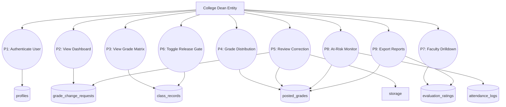

Figure 2.15 | Level 1 Data Flow Diagram: College Dean Portal

[DRAWING GUIDE] Draw a Level 1 DFD for the College Dean Portal. External entity: College Dean.
Processes:
- P1: Authenticate User (reads profiles)
- P2: View Dean Dashboard (reads pending corrections count, evaluation completion benchmarks)
- P3: View Grade Posting Matrix (reads class_records posted flags → outputs grid of posted vs pending per section)
- P4: View Grade Distribution Analytics (reads posted_grades → outputs GWA distribution chart)
- P5: Review Grade Change Request (reads grade_change_requests, Supabase Storage evidence → updates grade_change_requests status and posted_grades)
- P6: Toggle Evaluation Release Gate (reads/writes class_records is_released_to_faculty)
- P7: View Faculty Evaluation Drilldown (reads evaluation_ratings, evaluation_comments → displays criteria radar and dual-channel comparison)
- P8: View At-Risk Students (reads posted_grades, attendance_logs → outputs students with GWA < 3.00 or absences >= 4)
- P9: Export Summary Reports (reads posted_grades, evaluation_ratings → generates report document)
Data stores: profiles, class_records, posted_grades, grade_change_requests, evaluation_ratings, evaluation_comments, attendance_logs. Standard Yourdon-DeMarco notation.

The Level 1 DFD for the College Dean Portal models high-level academic oversight and decision-making processes. It details real-time monitoring of department grade posting matrices, GWA distribution analytics curves, formal grade correction request review and approval (including inspection of Supabase Storage proof documents), faculty evaluation visibility release toggling, faculty evaluation drilldown analysis, at-risk student monitoring (GWAs below 3.00 or excessive absences), and summary report exporting.

Level 1 Data Flow Diagram: Admin Portal

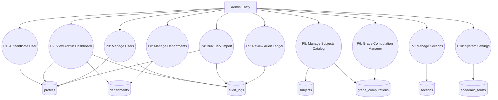

Figure 2.16 | Level 1 Data Flow Diagram: Admin Portal

[DRAWING GUIDE] Draw a Level 1 DFD for the Admin Portal. External entity: Admin.
Processes:
- P1: Authenticate User (reads profiles)
- P2: View Admin Dashboard (reads profiles, departments, audit_logs → outputs global metrics)
- P3: Manage Users (reads/writes profiles → logs to audit_logs)
- P4: Bulk CSV Import (parses CSV → writes Supabase Auth, profiles → logs to audit_logs)
- P5: Manage Subjects Catalog (reads/writes subjects, grade_computations)
- P6: Manage Grade Computation Templates (reads/writes grade_computations, grade_computation_components)
- P7: Manage Sections (reads/writes sections)
- P8: Manage Departments (reads/writes departments, dean profiles)
- P9: Review Audit Logs (reads audit_logs → displays immutable chronological event feed)
- P10: Configure System Settings (reads/writes academic_terms active school year and semester)
Data stores: profiles, departments, subjects, grade_computations, grade_computation_components, sections, audit_logs, academic_terms. Standard Yourdon-DeMarco notation.

The Level 1 DFD for the Admin Portal outlines master system configuration and governance processes. It details global user account management (role assignments, account suspensions), bulk CSV account provisioning, subject catalog maintenance, program-specific Computation of Grades (COG) template configuration, section and department creation, system-wide immutable audit log inspection, and active academic term and school year configuration.

Visual Table of Contents

```mermaid
graph TD
    Root["SAGE System Menu Hierarchy"]
    
    Root --> N1["1. Shared / Authentication"]
    N1 --> N1a["Login"]
    N1 --> N1b["Forgot Password"]
    N1 --> N1c["Reset Password"]

    Root --> N2["2. Student Portal"]
    N2 --> N2a["Dashboard"]
    N2 --> N2b["Subject Registry"]
    N2 --> N2c["My Grades Ledger"]
    N2 --> N2d["Grade Breakdown Detail Modal"]
    N2 --> N2e["Grade Acknowledgment"]
    N2 --> N2f["Onboarding & Verification"]
    N2 --> N2g["Evaluations & Surveys"]
    N2 --> N2h["Attendance Log"]
    N2 --> N2i["AI Academic Advisor"]

    Root --> N3["3. Faculty Portal"]
    N3 --> N3a["Overview & Class Records"]
    N3 --> N3b["Grade Weight Configuration"]
    N3 --> N3c["Score Input Spreadsheet"]
    N3 --> N3d["Grade Computation Preview"]
    N3 --> N3e["Faculty Evaluations Analytics"]
    N3 --> N3f["Dual-Channel Comparison"]
    N3 --> N3g["Roster Verification"]
    N3 --> N3h["Grade Change Request"]
    N3 --> N3i["Absence Warning"]

    Root --> N4["4. Dean Portal"]
    N4 --> N4a["Dashboard"]
    N4 --> N4b["Grade Override Approval"]
    N4 --> N4c["Evaluation Release Gate"]
    N4 --> N4d["Grade Posting Status Matrix"]
    N4 --> N4e["Grade Distribution Analytics"]
    N4 --> N4f["Faculty Evaluations Dashboard"]
    N4 --> N4g["At-Risk Students List"]
    N4 --> N4h["Summary Reports Exporter"]

    Root --> N5["5. College Office Portal"]
    N5 --> N5a["Department Dashboard"]
    N5 --> N5b["Roster Import"]
    N5 --> N5c["Compliance Audit"]
    N5 --> N5d["Subject Assignment"]
    N5 --> N5e["Evaluation Form Builder"]
    N5 --> N5f["Evaluation Windows Scheduler"]
    N5 --> N5g["Student Section Modifier"]

    Root --> N6["6. Admin Portal"]
    N6 --> N6a["Admin Dashboard"]
    N6 --> N6b["User Management Directory"]
    N6 --> N6c["Bulk User CSV Import"]
    N6 --> N6d["Subjects Catalog"]
    N6 --> N6e["Grade Computation Templates"]
    N6 --> N6f["Sections Management"]
    N6 --> N6g["Departments Management"]
    N6 --> N6h["Grade Override Panel"]
    N6 --> N6i["Audit Ledger"]
    N6 --> N6j["Database & System Settings"]

    style Root fill:#1e3a8a,color:#fff
```

Figure 2.17 | SAGE Visual Table of Contents (VTOC): Core and Academic Portals

1. Shared / Authentication → children: Login, Forgot Password, Reset Password
2. Student Portal → children: Dashboard, Subject Registry, My Grades Ledger, Grade Breakdown Detail, Grade Acknowledgment, Onboarding & Verification, Evaluations & Surveys, Attendance Log, AI Academic Advisor
3. Faculty Portal → children: Overview & Class Records, Grade Weight Configuration, Score Input Spreadsheet, Grade Computation Preview, Faculty Evaluations Analytics, Dual-Channel Comparison, Roster Verification, Grade Change Request, Absence Warning, Announcements
4. Dean Portal → children: Dashboard, Grade Override Approval, Evaluation Release Gate, Grade Posting Matrix, Grade Distribution Analytics, Faculty Evaluations Dashboard, At-Risk Students, Summary Reports
5. College Office Portal → children: Department Dashboard, Roster Import, Compliance Audit, Subject Assignment, Evaluation Form Builder, Evaluation Windows Scheduler, Student Section Modifier
6. System Admin Portal → children: Admin Dashboard, User Management, Bulk CSV Import, Subjects Catalog, Grade Computation Templates, Sections Management, Departments Management, Grade Override, Audit Ledger, Database & System Settings
Use color-coding per portal (e.g., blue=Student, green=Faculty, purple=Dean, orange=College Office, red=Admin). Use rounded rectangle nodes with connector lines. Fit to landscape A4 page.

The Visual Table of Contents (VTOC) in Figure 2.17 maps the complete menu hierarchies across all five SAGE portals. The Shared and Authentication node branches into the Role-Based Login, Forgot Password, and Reset Password interfaces. The Student Portal branches into the Student Dashboard, Subject Registry, My Grades Ledger (displaying MR, TFR, and the evaluation-gated SG columns), Grade Breakdown Detail (a click-to-view modal showing activity Title, Coverage/Description, and Score), Grade Acknowledgment, Onboarding and Verification, Evaluations and Surveys, Attendance Log, and the AI Academic Advisor. The Faculty Portal branches into Overview and Class Records, Grade Weight Configuration (read-only COG template view), the Score Input Spreadsheet (featuring the Activity Header Configurator with a lock overlay on unconfigured columns, expandable up to six formative activity slots), Grade Computation Preview, Faculty Evaluations Analytics, Dual-Channel Evaluation Comparison, Roster Verification, Grade Change Request, Absence Warning, and Announcements. The Dean Portal branches into the Dean's Dashboard, Grade Override Approval, Evaluation Release Gate, Grade Posting Status Matrix, Grade Distribution Analytics, Faculty Evaluations Dashboard, At-Risk Students List, and Summary Reports Exporter. The College Office Portal branches into the Department Dashboard, Roster Import, Compliance Audit, Subject Assignment, Evaluation Form Builder, Evaluation Windows Scheduler, and Student Section Modifier. The Admin Portal branches into the Admin Dashboard, User Management Directory, Bulk User CSV Import, Subjects Catalog, Grade Computation Templates, Sections Management, Departments Management, Grade Override, Audit Ledger, and Database and System Settings.

Database Design

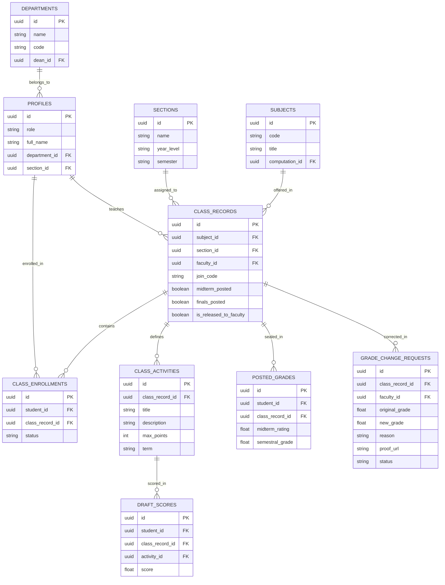

Figure 2.18 | SAGE Database Entity Relationship Diagram (ERD)

[DRAWING GUIDE] Draw an ERD using Crow's Foot notation. Organize tables into 4 color-coded clusters:
CLUSTER 1 - Identity & Access (blue): profiles (PK: id, fields: role, full_name, department_id, section_id) | departments (PK: id, fields: name, code, dean_id)
CLUSTER 2 - Academic Structure (green): subjects (PK: id, computation_id FK) | sections (PK: id, fields: year_level, semester, school_year) | class_records (PK: id, FKs: subject_id, section_id, faculty_id, fields: join_code, midterm_posted, finals_posted, semestral_posted, is_released_to_faculty) | class_enrollments (PK: id, FKs: student_id, class_record_id, fields: status) | grade_computations (PK: id) | grade_computation_components (PK: id, FK: computation_id, fields: name, weight) | class_activities (PK: id, FK: class_record_id, fields: title, description, max_points, term, type) | academic_terms (PK: id, fields: school_year, semester, is_active)
CLUSTER 3 - Grades & Corrections (orange): draft_scores (PK: id, FKs: student_id, class_record_id, activity_id) | posted_grades (PK: id, FKs: student_id, class_record_id) | grade_change_requests (PK: id, FKs: class_record_id, faculty_id, dean_id, fields: original_grade, new_grade, reason, proof_url, status)
CLUSTER 4 - Evaluations & Logs (purple): evaluation_criteria, evaluation_windows, evaluation_responses, evaluation_ratings, evaluation_comments | attendance_logs | clearance_records | audit_logs | ai_counseling_logs
Draw relationship lines with crow's foot notation (one-to-many, many-to-one). Fit to landscape A4 page with a legend.

The data model is composed of 22 core tables organized around four functional layers. The profiles table stores user accounts with a role constraint limited to admin, dean, faculty, student, and department_admin (College Office), along with a department reference. The departments table establishes academic college units and links Dean profiles to their respective college. The subjects table is linked to a grade_computations template (composed of grade_computation_components rows specifying each component's name and percentage weight), ensuring that every section of a given subject shares an identical, non-editable grading formula. The academic_terms table stores the active school year and semester configuration. The sections table defines class section shells organized by year and semester. The class_records table represents a specific class offering and tracks posting-state flags (midterm_posted, finals_posted, semestral_posted), the professor-generated join_code, and the enrollment acceptance window. The class_enrollments table links students to class_records with a status of pending_verification, active, dropped, or rejected, gating a student's appearance on grading sheets. The class_activities table stores the configured formative activity headers (Title, Description, Max Points) per classroom, synchronized in real-time to unlock score entry cells in the grading spreadsheet. The draft_scores table stores unposted raw activity and exam scores entered by faculty. The posted_grades table seals official term grades once submitted by the faculty. The grade_change_requests table records post-seal correction requests, storing the original and requested grade, the stated reason, the Supabase Storage proof file URL, and the Dean's approval status. The evaluation_criteria, evaluation_windows, evaluation_responses, evaluation_ratings, and evaluation_comments tables collectively manage the faculty evaluation lifecycle from question setup through anonymous student submission. The attendance_logs table records daily student attendance statuses (Present, Late, Absent). The clearance_records table tracks term clearance sign-off statuses. The audit_logs table archives all system-wide administrative actions immutably. Finally, the ai_counseling_logs table stores the history of AI-generated academic recommendations produced by the Google Gemini 2.5 Flash API integration.

Figure 2.18 represents SAGE's database schema modeled as an Entity Relationship Diagram (ERD). The data model is partitioned into four functional layers. The Identity and Access Layer contains the profiles table (storing user credentials, roles, and department assignments) and the departments table (defining academic college units). The Academic Structure Layer contains subjects, sections, class_records, class_enrollments, grade_computations, grade_computation_components, class_activities, and academic_terms, collectively defining the complete academic record hierarchy from subject catalog through individual classroom formative activity configuration. The Performance and Grades Layer contains draft_scores (storing unposted raw faculty-entered scores), posted_grades (sealing official computed term marks), and grade_change_requests (recording Dean-reviewed grade correction audits with Supabase Storage evidence links). Finally, the Evaluations and Clearance Layer maps evaluation_criteria, evaluation_windows, evaluation_responses, evaluation_ratings, and evaluation_comments (managing the anonymous faculty evaluation lifecycle), alongside attendance_logs, clearance_records, audit_logs, and ai_counseling_logs (archiving system events and AI-generated academic advisory histories).

User Interface Design

```mermaid
graph TD
    subgraph PanelA ["Panel A: Student Portal UI"]
        A1["Top Nav: Active Terms & Profile"] --> A2["GWA Summary Card"]
        A2 --> A3["My Grades Ledger (MR, TFR, Blurred SG)"]
        A3 --> A4["Activity Breakdown Modal & AI Advisor Drawer"]
    end

    subgraph PanelB ["Panel B: Faculty Portal UI"]
        B1["Class Records Overview & Section Selector"] --> B2["COG Weight Template Summary Bar"]
        B2 --> B3["Score Input Spreadsheet Grid (Locked Column Overlay)"]
        B3 --> B4["Activity Header Configurator Modal & Post Grades Button"]
    end

    subgraph PanelC ["Panel C: College Office Portal UI"]
        C1["Department Metrics Dashboard"] --> C2["Bulk CSV Roster Import Dropzone"]
        C2 --> C3["Compliance Audit Search Table & Digital Clearance Sign-off"]
    end

    subgraph PanelD ["Panel D: Dean Portal UI"]
        D1["Grade Posting Status Matrix Grid"] --> D2["GWA Distribution Bar Chart (1.00-5.00)"]
        D2 --> D3["Grade Correction Review Drawer & Proof Viewer"]
        D3 --> D4["Evaluation Release Gate Toggle"]
    end

    subgraph PanelE ["Panel E: Admin Portal UI"]
        E1["Global System Metrics Cards"] --> E2["User Management Directory Table & Role Filters"]
        E2 --> E3["Subjects Catalog & COG Template Definition Manager"]
        E3 --> E4["Immutable Audit Ledger Activity Feed"]
    end
```

Figure 2.19 | SAGE User Interface Composite Wireframe: Five-Portal Navigation Architecture

[DRAWING GUIDE] Create a 5-panel composite wireframe diagram illustrating the primary screen layout for each user role in SAGE:
1. Panel A (Student Portal): Features top navigation bar, GWA summary card, My Grades Ledger table (MR, TFR, and blurred/unblurred SG columns), and AI Advisor drawer launcher.
2. Panel B (Faculty Portal): Features section selector, COG weight summary bar, Score Input Spreadsheet grid with header configurator modal overlay, and Post Grades action button.
3. Panel C (College Office Portal): Features department metrics overview, bulk CSV roster import dropzone, compliance audit search table, and clearance sign-off status indicators.
4. Panel D (Dean Portal): Features department grade posting status matrix grid, GWA distribution bar chart, pending grade change request review drawer with proof attachment viewer, and evaluation release toggle switches.
5. Panel E (Admin Portal): Features global system health cards, user management directory table with role dropdown filters, and immutable audit ledger feed.
Title: SAGE Five-Portal Interface Layout Architecture.

The interface is organized into five role-specific portals. The Student portal presents a milestone-based grade ledger (MR, TFR, SG), a click-to-view per-subject activity breakdown modal (displaying Title, Coverage/Description, and Score), an attendance log with FDA advisory badges, an AI Academic Advisor powered by the Gemini 2.5 Flash API, anonymous faculty evaluation forms, and an evaluation-completion clearance prompt. The Faculty portal presents a class records overview, a read-only COG weight configuration view, an interactive Score Input Spreadsheet with a pre-initialized formative activity column expandable up to six configured slots (each column locked until the faculty configures a Title and Description), a grade computation preview, a dual-channel (On-Time, Late, Combined) evaluation results view, a roster enrollment verification queue, a grade change request form with Supabase Storage evidence upload, and an absence advisory warning dashboard. The College Office portal presents a department-scoped dashboard, a bulk CSV roster importer, a clearance compliance audit search tool, a subject assignment manager, an evaluation form builder, an evaluation windows scheduler, and a student section modifier. The Dean portal presents a department-wide grade posting matrix, a grade distribution analytics dashboard, a faculty evaluation release-gate toggle with individual faculty drilldown analytics, a grade override approval queue, an at-risk students monitor, and a summary reports exporter. The Admin portal presents a master user directory, a bulk CSV importer, a subjects catalog, a grade computation templates manager, sections and departments management tools, a grade override panel, a system-wide immutable audit ledger, and a database and system settings panel.

System Development

SAGE's frontend is built with React 19 and bundled using Vite, with Tailwind CSS used for utility-first styling and Lucide React icons across all five portals. The backend runs on Supabase, providing a managed PostgreSQL database with Row-Level Security enforcement and a built-in email/password authentication service. Supabase Storage is used for object storage of grade-correction evidence files. The Google Gemini 2.5 Flash API is integrated as the AI academic counseling engine. Source control is maintained through Git, hosted on GitHub, with feature branches corresponding to each development phase and merged into the main branch following adviser review of each increment.

System Testing

Unit testing was conducted on the grading computation engine to verify that each program-specific Computation of Grades (COG) template (General/Professional Education, Health Sciences Theory and RLE, and Maritime Education Lecture/Laboratory) produces the correct Midterm Rating (MR), Tentative Final Rating (TFR), and Semestral Grade (SG) outputs for both regular and summer term types. Integration testing verified the enforcement of role-based route guards across all five portals, the correctness of Supabase Row-Level Security (RLS) policy enforcement, and the correct triggering of the evaluation-gate clearance locking logic across the Student and College Office portals. System testing exercised the complete grading lifecycle end to end, from professor score entry through Dean-approved grade correction. User Acceptance Testing (UAT) was conducted with a small group of faculty, students, and a department office representative to confirm that the workflows matched their expectations of the manual process being replaced, with issues logged and resolved through iterative bug-fixing before the next phase began.

System Implementation	

SAGE is deployed as an integrated, cross-platform academic management system accessible via responsive desktop web browsers and native hybrid mobile environments accessible via a standard web browser, backed by Supabase for authentication and data management. Prior to rollout, the researchers conducted a user orientation session with College Office staff and a sample of faculty to walk through account activation via standard email and password credentials and the grade-posting workflow. Rollout followed the academic calendar, with account provisioning and roster CSV import completed by the College Office ahead of the start of the term, allowing faculty to begin score entry immediately once enrollment periods opened.

System Maintenance

Post-deployment support is managed via backend database administration and seeding scripts (for registering tenants or updating subject COG templates) to avoid code redeployments, as visual administrative dashboards for these actions are deferred to future updates. The end-of-term Semester Purge Utility has been implemented at the code level but is currently soft-deleted and disabled pending further data-retention and compliance review; re-enabling this utility is identified as a candidate improvement for future maintenance cycles, alongside periodic review of the Computation of Grades templates should the institution revise its grading policies.

Tools and Technologies Used

Hardware: Standard desktop, laptop, or mobile devices with an internet connection and a modern web browser; no specialized or proprietary hardware is required.

Frontend Framework: React 19, Vite 8, and Tailwind CSS v4.

Mobile Runtime Engine: Capacitor.js (@capacitor/core, @capacitor/android, @capacitor/app, @capacitor/push-notifications).

Mobile Compilation Environment: Android Studio, Gradle Build Tools, Android SDK (API Level 34+), compiling the native Android application package (ph.edu.dyci.sage v1.0.0).

Push Notification Infrastructure: Firebase Cloud Messaging (FCM) connected to Supabase Database Webhooks and Edge Functions.

Backend & Managed Cloud: Supabase (PostgreSQL with Row-Level Security, Supabase Auth, and Supabase Storage).

Cloud Storage: Supabase Storage for storing grade-correction evidence files submitted alongside grade change requests.

AI Integration: Google Gemini 2.5 Flash API for generating automated student academic counseling recommendations and performance risk advisories.

Development Environment: Visual Studio Code, Node.js, and Git version control hosted on GitHub.

Respondents and Setting of the Study

The study will be conducted across academic colleges at Dr. Yanga's Colleges, Inc. (encompassing General/Professional Education, Health Sciences, Maritime Education, and Computer Studies), where the researchers have access to faculty, students, department office staff, and deans for consultation and system validation. Respondents will be selected using purposive (non-probability) sampling, defined as a technique in which participants are deliberately chosen based on specific characteristics relevant to the study rather than random selection. Inclusion criteria are: (a) currently enrolled students with at least one active class in the term of testing, (b) faculty members currently handling at least one class section, and (c) a College Office staff member responsible for department-level clearance and roster management, and (d) College Dean representatives responsible for department-wide academic oversight. This targeted group was selected because they directly interact with the grading, evaluation, and clearance workflows that SAGE automates, making their feedback most relevant to validating the system's Perceived Ease of Use (PEOU) and Perceived Usefulness (PU).

Instrument and Validation

The primary data-gathering instrument is an adapted survey questionnaire based on the Technology Acceptance Model (TAM), modified to reflect SAGE's specific features (grade transparency, evaluation-gated unlocking, and grade-correction workflow) rather than using the original generic item wording. The questionnaire is divided into three parts: a Perceived Ease of Use (PEOU) section measuring navigation simplicity, a Perceived Usefulness (PU) section measuring grading utility, and a Behavioral Intention (BI) section measuring the stakeholders' desire to officially implement SAGE at Dr. Yanga's Colleges, Inc. Items are rated on a forced-choice 4-point Likert scale (where 4 represents Strongly Agree and 1 represents Strongly Disagree, intentionally omitting a neutral midpoint to eliminate central tendency bias).

Content validity will be established through review by an IT subject-matter expert and the capstone adviser to confirm that items appropriately reflect SAGE's actual functionality. A pilot test involving approximately 20 respondents outside the final study sample will be conducted prior to full deployment, and the instrument's internal consistency will be assessed using Cronbach's alpha, computed with the assistance of a statistician.

To evaluate technical software quality under Specific Objective 8, an ISO/IEC 25010:2023 Evaluation Checklist instrument will be utilized. The checklist evaluates seven quality characteristics: Functional Suitability, Performance Efficiency, Usability, Reliability, Security, Portability, and Maintainability. Each characteristic contains specific criteria scored on a pass/fail and compliance percentage scale, administered to IT faculty experts and system evaluators to verify software compliance.

Data Gathering Procedure

Prior to data collection, the researchers will secure written permission from the academic administration of Dr. Yanga's Colleges, Inc. to deploy SAGE for testing and to gather responses from students, faculty, and office staff. Upon approval, an orientation session will be held to walk respondents through the relevant portal for their role. Respondents will then use SAGE for a defined trial period covering at least one full grading and evaluation cycle, after which the TAM questionnaire will be administered. Completed responses will be collected, checked for completeness, and encoded for statistical analysis.

Statistical Treatment of Data

Responses to the TAM questionnaire will be summarized using weighted mean and standard deviation per item and per construct (PEOU, PU, and BI), interpreted against a forced-choice 4-point Likert descriptive scale (specifically: 3.26–4.00 for Strongly Agree/Highly Acceptable, 2.51–3.25 for Agree/Acceptable, 1.76–2.50 for Disagree/Poor, and 1.00–1.75 for Strongly Disagree/Unacceptable). Where applicable, a paired comparison of workflow completion time (manual process versus SAGE-assisted process) will be summarized descriptively to support the study's claims of improved efficiency, consistent with the objectives defined in Chapter 1.

Ethical Considerations

This study will only proceed with the informed consent of all respondents, who will be briefed on the purpose of the study, the voluntary nature of their participation, and their right to withdraw at any time without penalty. All personally identifiable data including student grades and evaluation responses will be handled in compliance with the Philippine Data Privacy Act of 2012, stored only within the scope of this study, and accessed solely by the researchers and their adviser. Evaluation responses will be treated as confidential, with individual comments anonymized before being shown to faculty, consistent with SAGE's own dual-channel evaluation design. The researchers will also secure approval from the appropriate research ethics body of Dr. Yanga's Colleges, Inc. prior to full data collection.

References

Aborokbah, A. M., Sangaiah, A. K., & Al-Maimani, M. (2026). Predictive modeling of student retention in higher education using supervised classification algorithms. Journal of Educational Data Mining, 18(1), 45-62.

Al-Barrak, A. I., & Al-Razgan, M. (2023). Early warning systems in higher education: A weighted scoring approach for student risk detection. Computers & Education, 194, 104680.

Alipour, M., & Khosravi, H. (2024). Grade transparency and student trust in automated evaluation systems. International Journal of Educational Technology in Higher Education, 21(1), 12.

Bacongol, R., & Durango, M. (2025). AutoGrade: Centralized grade computation and transparency platform for Philippine HEIs. Review of Computer Engineering Research, 12(1), 88-102.

Charles R. Drew University. (2024). Institutional policy on student evaluation privacy and identity masking. Office of Academic Affairs & Compliance.

Davis, F. D. (1989). Perceived usefulness, perceived ease of use, and user acceptance of information technology. MIS Quarterly, 13(3), 319-340.

DeLone, W. H., & McLean, E. R. (2003). The DeLone and McLean model of information systems success: A ten-year update. Journal of Management Information Systems, 19(4), 9-30.

Engineerica. (2024). Continuous tracking frameworks for proactive student retention. Educational Technology & Retention Insights, 8(2), 14-29.

EnrollOps. (2024). AI-driven student success and proactive retention intervention models. Higher Ed Automation Report.

Gabayan, J., & Santos, M. (2025). Machine learning applications for faculty performance and growth forecasting in Philippine higher education. Asia-Pacific Education Researcher, 34(2), 210-225.

Haron, H., & Ismail, Z. (2024). Monitoring academic performance risk using RepTree classification models. Journal of King Saud University - Computer and Information Sciences, 36(3), 101850.

Hussain, S., & Mansur, A. (2025). Mathematical weighting mechanisms in early warning retention systems. IEEE Transactions on Learning Technologies, 18, 112-125.

Jayaprakash, S. M., Moody, E. W., Lauría, E. J., Regan, J. R., & Baron, J. D. (2014). Early alert of academically at-risk students: An open source analytics initiative. Journal of Learning Analytics, 1(1), 6-47.

Lim, L., & Yousefi, A. (2026). Institutional learning analytics dashboards for macro-level educational governance. Computers & Education: Artificial Intelligence, 7, 100210.

Mhakure, D., & Mthethwa, N. (2025). Transforming LMS grading data into actionable decision trees for student self-monitoring. Computers & Education, 210, 104950.

Mthethwa, N., & Nkosi, S. (2025). Fostering student learning autonomy through real-time self-monitoring portals. Assessment & Evaluation in Higher Education, 50(2), 175-190.

Ouatiq, A., & El-Housni, M. (2025). Educational data mining and predictive modeling for early academic failure forecasting. Computers, 14(2), 45.

Pangcatan, R., & Prado, N. (2019). Digitalization challenges in Philippine academic record management systems. Philippine Journal of Education and Technology, 5(1), 34-48.

Quizon, G., & Reyes, C. (2025). Machine learning predictive models for student retention in Philippine higher education institutions. Review of Computer Engineering Research, 12(2), 130-145.

Riño, F., & Daing, M. (2022). Evaluation of decentralized grading sheets in private HEIs. Journal of Academic Administration, 15(3), 67-81.

Secreto, A., Ofrin, J., & Tabo, R. (2025). Real-time student progress monitoring and AI integration readiness in Philippine state universities. International Journal of Information and Education Technology, 15(4), 512-525.

Sweller, J. (1988). Cognitive load during problem solving: Effects on learning. Cognitive Science, 12(2), 257-285.

Thompson, P., & Ahn, S. (2012). Scalable online evaluation systems for large-enrollment university courses. IEEE Transactions on Education, 55(4), 520-528.

Tlili, A., & Huang, R. (2025). AI-driven real-time analytics and personalized intervention strategies in higher education: A systematic review. Educational Psychology Review, 37(1), 15.

U.S. Department of Education. (2023). Multi-tiered tracking networks and early warning intervention frameworks. Office of Educational Technology.

Yousefi, A., & Lim, L. (2025). Multi-dimensional learning analytics frameworks for student engagement tracking. Higher Education Research & Development, 44(3), 401-418.

Yuksel, S., & Dincer, H. (2023). Multi-criteria decision-making frameworks for objective faculty evaluation and retention reviews. Socio-Economic Planning Sciences, 87, 101560.

