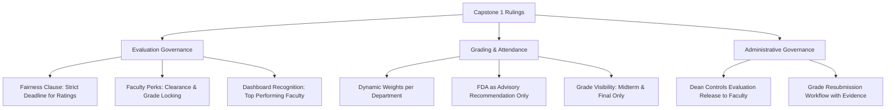

# SAGE — Capstone 1 Defense Rulings & System Alignment Analysis

**Document Source:** `Capstone1_Transcript-06-11-26 (1).docx`  
**System:** Smart Academic Grading and Evaluation System (SAGE) — Dr. Yanga's Colleges, Inc. (DYCI)  
**Date:** July 27, 2026  

---

## 1. Executive Summary

This report synthesizes the panel recommendations, institutional policies, and technical requirements captured during the Capstone 1 Defense presentation. The rulings focus on establishing **academic integrity, evaluation fairness, department flexibility, and strong administrative governance**. 

Integrating these requirements ensures SAGE protects faculty from retaliatory scoring, respects individual department grading methodologies, provides clear student transparency, and empowers Deans with final oversight.



---

## 2. Policy & Operational Requirements Analysis

### 2.1 Faculty Evaluation & Student Clearance Governance
1. **The Fairness Clause (Retaliation Prevention):**
   * **Rule:** Evaluations submitted *after* the official evaluation window will **not** be factored into the instructor's performance rating or teaching effectiveness score.
   * **Purpose:** Prevents students who receive poor grades from using late evaluations to retaliate against instructors.
   * **Student Impact:** Late submissions are still permitted solely to satisfy clearance requirements and unlock grade visibility, but their ratings are flagged as `is_on_time = false` and excluded from faculty analytics.
2. **Multi-Subject Evaluation Tracking:**
   * **Rule:** If a student is enrolled in multiple subjects taught by the same professor, separate evaluation submissions are tracked for each subject section.
3. **Top Performing Faculty Dashboard Recognition:**
   * **Rule:** The system will dynamically calculate and showcase top-rated faculty on the Admin and Dean dashboards.
   * **Filter:** Ratings are calculated *exclusively* from on-time evaluation responses.

---

### 2.2 Student Grade & Activity Visibility Policy
1. **Midterm & Final Summary Display:**
   * **Rule:** Continuous real-time daily term grade recalculations will be removed from the student portal.
   * **Visibility:** Students will only see their finalized **Midterm Grade** and **Final Grade** summaries.
2. **Activity Breakdown Transparency:**
   * **Rule:** Students retain access to view individual quizzes, assignments, and activities (similar to MS Teams).
   * **Naming Standard:** Activity titles **must be written in full** (e.g., `Quiz 1: Fundamentals of OOP` instead of `Q1_OOP`). Shortened code abbreviations are prohibited for clarity.

---

### 2.3 Absence & FDA Policy (Failure Due to Absences)
1. **Advisory Recommendation Flag:**
   * **Rule:** When a student reaches **4 absences**, the system generates an **FDA Remark** serving *only* as a recommendation for faculty review.
   * **Governance:** Reaching 4 absences does **NOT** automatically fail or lock out the student. Final discretion lies with the faculty member considering holistic context.

---

### 2.4 Departmental Grading Flexibility
1. **Dynamic Weight Percentages:**
   * **Rule:** The grading formula must support custom percentage distributions per department (e.g., Nursing clinicals vs IT laboratory courses vs General Education lecture courses).
   * **Configurability:** Rather than forcing a static `50% Class Standing / 10% Character / 40% Exam` across the entire institution, department heads/deans can set customized weight parameters.

---

### 2.5 Access Control & Grade Resubmission Workflow
1. **Dean-Controlled Evaluation Visibility:**
   * **Rule:** Faculty members do not automatically gain access to view evaluation ratings/comments.
   * **Gatekeeper:** The Dean controls release toggles (releasing results either per individual instructor or bulk for an entire department).
2. **Formal Grade Resubmission Approval:**
   * **Rule:** Once a grade record is submitted and locked, modifications require a formal resubmission request.
   * **Workflow:**
     $$\text{Faculty Request} \longrightarrow \text{Student Evidence Attached} \longrightarrow \text{Dean Review \& Approval} \longrightarrow \text{Grade Unlocked}$$

---

## 3. Gap Analysis: SAGE Current State vs Target Requirements

| Feature Domain | Current Implementation in SAGE | Required Action / Target State | Impact Level |
| :--- | :--- | :--- | :--- |
| **Evaluation Rating Calculation** | Includes all submitted survey records | Filter out submissions where `is_on_time = false` from faculty average ratings | 🔴 High |
| **Student Grade View** | Displays Prelim, Midterm, Semi-Final, Final ratings | Limit student grade summary display to **Midterm** and **Final** ratings only | 🟡 Medium |
| **Activity Column Titles** | Accepts short input strings | Enforce minimum length and full-title validation in class record inputs | 🟢 Low |
| **FDA Absence Status** | Hardcoded or direct status badge | Display FDA as a yellow **Advisory Alert** badge on faculty view | 🟡 Medium |
| **Grading Formula Weights** | Static 50% CS / 10% Char / 40% Exam formula | Make weight coefficients dynamic per department/subject configuration | 🔴 High |
| **Faculty Result Release** | Direct view available in portal | Add Dean release toggle state (`is_released_to_faculty`) | 🟡 Medium |
| **Grade Resubmissions** | Basic override form | Add proof attachment modal and Dean approval workflow state | 🔴 High |

---

## 4. Architectural & Database Schema Recommendations

To support these requirements in Supabase and `mockDb`, the following schema additions are recommended:

```sql
-- 1. Evaluation Submissions: Track timeliness to enforce Fairness Clause
ALTER TABLE public.evaluation_responses 
ADD COLUMN IF NOT EXISTS is_on_time BOOLEAN DEFAULT true,
ADD COLUMN IF NOT EXISTS submitted_at TIMESTAMPTZ DEFAULT NOW();

-- 2. Faculty Evaluation Release Control (Dean Governance)
ALTER TABLE public.evaluation_windows 
ADD COLUMN IF NOT EXISTS is_released_to_faculty BOOLEAN DEFAULT false;

-- 3. Dynamic Department Grading Weights
ALTER TABLE public.departments 
ADD COLUMN IF NOT EXISTS cs_weight NUMERIC(5,2) DEFAULT 50.00,
ADD COLUMN IF NOT EXISTS char_weight NUMERIC(5,2) DEFAULT 10.00,
ADD COLUMN IF NOT EXISTS exam_weight NUMERIC(5,2) DEFAULT 40.00;

-- 4. Grade Resubmission Request Workflow
CREATE TABLE IF NOT EXISTS public.grade_resubmission_requests (
    id UUID PRIMARY KEY DEFAULT gen_random_uuid(),
    class_record_id UUID REFERENCES public.class_records(id),
    student_id UUID REFERENCES public.users(id),
    faculty_id UUID REFERENCES public.users(id),
    reason TEXT NOT NULL,
    evidence_url TEXT,
    status VARCHAR(20) DEFAULT 'pending_dean', -- 'pending_dean', 'approved', 'rejected'
    created_at TIMESTAMPTZ DEFAULT NOW()
);
```

---

## 5. Summary & Next Steps

1. **Database Update:** Apply schema extensions for `is_on_time`, `is_released_to_faculty`, and dynamic department weights.
2. **Student Portal Refinement:** Update `src/pages/student/Grades.jsx` to simplify grade views to Midterm & Final summaries only.
3. **Faculty Portal Refinement:** Modify `src/pages/faculty/ClassRecord.jsx` to treat 4 absences as an **FDA Advisory Recommendation** rather than an automatic hard status.
4. **Dean Portal Expansion:** Add an **Evaluation Release Toggle** and a **Grade Resubmission Approval Roster** in the Dean interface.
